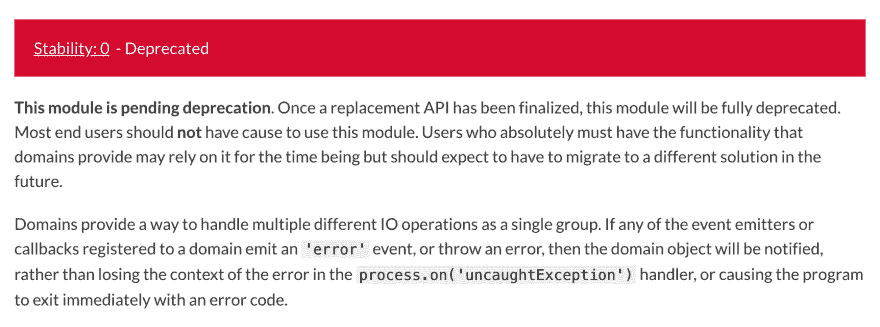

# 使用域模块捕获 Node.js 中的 stdout/ stderr

> 原文：<https://dev.to/gajus/capturing-stdout-stderr-in-node-js-using-domain-module-146a>

这个周末我在做一个项目，这个项目可以让开发人员并行测试多个数据聚合脚本。实现这一功能需要单个 API 端点评估多个用户提交的脚本。然而，如果任何一个脚本失败，我们也需要检索执行的日志，也就是说，我们需要捕获写入 stdout 的内容。

我以前有过这种需求，我已经开发了[输出拦截器](https://github.com/gajus/output-interceptor/tree/v2.0.3)来解决它。它通过覆盖 process.stdout 来工作，例如

```
let output = '';

const originalStdoutWrite = process.stdout.write.bind(process.stdout);

process.stdout.write = (chunk, encoding, callback) => {
  if (typeof chunk === 'string') {
    output += chunk;
  }

  return originalStdoutWrite(chunk, encoding, callback);
};

console.log('foo');
console.log('bar');
console.log('baz');

process.stdout.write = originalStdoutWrite;
console.log('qux');
output; 
```

<svg width="20px" height="20px" viewBox="0 0 24 24" class="highlight-action crayons-icon highlight-action--fullscreen-on"><title>Enter fullscreen mode</title></svg> <svg width="20px" height="20px" viewBox="0 0 24 24" class="highlight-action crayons-icon highlight-action--fullscreen-off"><title>Exit fullscreen mode</title></svg>

在上面的例子中，`output`的计算结果为`foo\nbar\nbaz\n`。
如果你的应用程序按顺序处理所有的任务，那么以上就是你所需要的捕获程序的输出。然而，如果有并发操作，它就不起作用了——多个操作的日志将被划分到一个 blob 中。

原来我们可以使用 [`domain`](https://nodejs.org/api/domain.html) 创建一个执行上下文。我承认我知道域模块，但从未有过它的实际用例:我认为它主要用于处理异步错误的传播。因此，能够实现上述目标是一个惊喜。

诀窍是覆盖`process.stdout.write`并检查`process.domain`。`process.domain`是对当前执行域的引用。如果`process.domain`可以被认为是我们为了捕获标准输出而创建的一个域，那么我们将把截获的标准输出块附加到该域，例如

```
const createDomain = require('domain').create;
const originalStdoutWrite = process.stdout.write.bind(process.stdout);
process.stdout.write = (chunk, encoding, callback) => {
  if (
    process.domain &&
    process.domain.outputInterceptor !== undefined &&
    typeof chunk === 'string'
  ) {
    process.domain.outputInterceptor += chunk;
  }
  return originalStdoutWrite(chunk, encoding, callback);
};
const captureStdout = async (routine) => {
  const domain = createDomain();
  domain.outputInterceptor = '';
  await domain.run(() => {
    return routine();
  });
  const output = domain.outputInterceptor;
  domain.outputInterceptor = undefined;
  domain.exit();
  return output;
}; 
```

<svg width="20px" height="20px" viewBox="0 0 24 24" class="highlight-action crayons-icon highlight-action--fullscreen-on"><title>Enter fullscreen mode</title></svg> <svg width="20px" height="20px" viewBox="0 0 24 24" class="highlight-action crayons-icon highlight-action--fullscreen-off"><title>Exit fullscreen mode</title></svg>

在上面的例子中，`captureStdout`捕获了在执行例程时写入`process.stdout`的所有内容。如果有多个例程同时运行，那么它们的执行域用来区分它们的输出。

这里有一个你可以玩的工作演示。

如果您的程序需要这个功能，那么可以考虑使用[输出拦截器](https://github.com/gajus/output-interceptor/tree/v3.0.0):我已经更新了输出拦截器，使用本文中描述的相同原理来处理异步函数。

我认为这是值得分享的，因为它提供了一个创建和维护对处理异步错误之外的执行上下文的引用的例子。

## 关于“弃用”的通知

早些时候，当我发表这篇文章的一个变体时，一些人评论说域模块已经过时了，不应该使用它。

[](https://res.cloudinary.com/practicaldev/image/fetch/s--Yi75WqNT--/c_limit%2Cf_auto%2Cfl_progressive%2Cq_auto%2Cw_880/https://thepracticaldev.s3.amazonaws.com/i/t6gap6mnc9z6laymrfav.png)

尽管红色大横幅声明该模块已被弃用——[domain 在 Node.js 内部使用了很多(](https://github.com/nodejs/node/search?q=domain&unscoped_q=domain),而且它不会很快出现在任何地方。

如果你读了标题后面的段落，它指出一旦替换 API 完成，该模块将被弃用。很可能 [`async_hooks`](https://nodejs.org/api/async_hooks.html) 最终会提供域模块提供的所有功能，并会取代它。事实上，`domain`已经在幕后使用 [`async_hooks`](https://github.com/nodejs/node/blob/747ddd5fac191d018c6e9720f21d3ea66872d667/lib/domain.js#L38-L93) 实现了，这不太可能改变——把`domain`看作是`async_hooks`的更高层次的抽象。