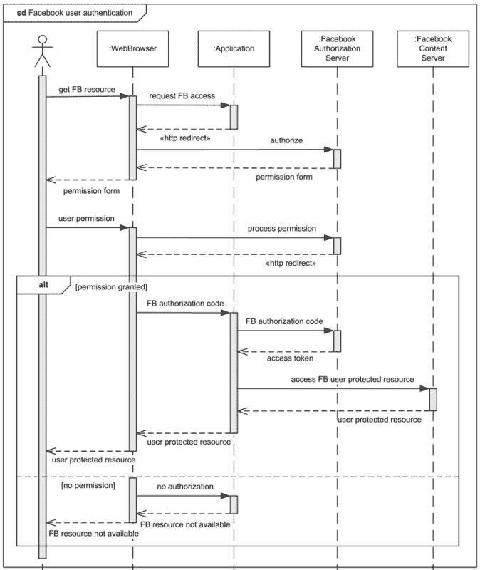
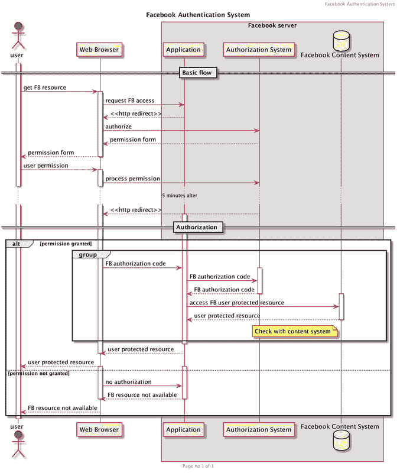

# PlantUML 太棒了

> 原文：<https://dev.to/imshakthi/plantuml-is-awesome-14aj>

这篇文章是关于为什么我觉得 PlantUML 很棒。

PlantUML 是一个开源工具，允许用户用纯文本语言创建 UML 图。

您可以只写几行代码来绘制您的 UML 图。UML 图在交流设计实现中非常重要，在 draw.io 或其他绘图工具中绘制这些图是一项耗时的任务。长时间玩触摸板/鼠标效果更差。

我过去也用过类似的工具，比如[美人鱼](https://github.com/knsv/mermaid)和 [graphviz](https://graphviz.org/) 。

以下是 PlantUML 与众不同的地方

*   可读性
*   可维持的
*   灵活的
*   强大的
*   可课税的

一旦用 plantUML 设计了 UML，最终结果可以提取到 PNG 或 SVG 中。有一些插件可以很容易地集成到 IDE 中，比如用于 VS 代码的 [PlantUML 和用于 IntelliJ 的](https://marketplace.visualstudio.com/items?itemName=jebbs.plantuml) [PlantUML。](https://plugins.jetbrains.com/plugin/7017-plantuml-integration)

也可用于[Confluence](https://www.atlassian.com/software/confluence)(Atlassian suite 的文档管理器)，在这里可以很容易地跟踪设计实现中的变更历史 [PlantUML for Confluence](https://marketplace.atlassian.com/apps/41025/plantuml-for-confluence?hosting=server&tab=overview)

*PS: PlantUML 用 graphviz underhood 写的是 Java:)*

PlantUML 是一个允许快速编写以下内容的组件:

1.  程序表
2.  用例图
3.  类图
4.  活动图(这里是遗留语法)
5.  组件图
6.  状态图
7.  对象图
8.  部署图`beta`
9.  时序图`beta`

你可以找到关于 plantUML 的详细文档。

在这里，我从网上取了一个随机的序列图，并试图用 PlantUML 用几个 tweeks 复制相同的图，最终结果是哇！

## 样本序列图

[](https://res.cloudinary.com/practicaldev/image/fetch/s--S-MGFKs9--/c_limit%2Cf_auto%2Cfl_progressive%2Cq_auto%2Cw_880/https://i.postimg.cc/PqvRnKNP/sequence-example-facebook-authentication.png)

## 带 PlantUML 的序列图

[](https://res.cloudinary.com/practicaldev/image/fetch/s--vhtt4v5C--/c_limit%2Cf_auto%2Cfl_progressive%2Cq_auto%2Cw_880/https://i.postimg.cc/4NtvGM1C/facebook.png)

这不仅仅是一个复制品，而是一个更好的。

这是为我们做了`magic`的代码。

```
@startuml
header Facebook Authentication System
title Facebook Authentication System
footer Page no %page% of %lastpage%

actor user #3c5a99
participant WebBrowser as "Web Browser"
box "Facebook server"
    participant App as "Application"
    participant AuthZ as "Authorization System"
    database FCS as "Facebook Content System"
end box

== Basic flow ==

activate user
user -> WebBrowser : get FB resource
    activate WebBrowser
        WebBrowser -> App : request FB access
        WebBrowser <-- App : <<http redirect>>
        WebBrowser -[#red]> AuthZ : authorize
        WebBrowser <-- AuthZ : permission form
        user <-- WebBrowser : permission form
    deactivate WebBrowser

    user -> WebBrowser : user permission
    activate WebBrowser
        WebBrowser -> AuthZ : process permission
        ... 5 minutes alter ...
        WebBrowser <-- AuthZ : <<http redirect>>

        == Authorization ==
        alt permission granted
            activate App
                group
                WebBrowser -> App : FB authorization code
                        activate AuthZ
                            App ->  AuthZ : FB authorization code
                            App <--  AuthZ : FB authorization code
                        deactivate AuthZ

                        activate FCS
                            App -> FCS : access FB user protected resource
                            App <-- FCS : user protected resource
                            note left FCS: Check with content system
                        deactivate FCS
                 end
            deactivate App

            WebBrowser <-- App : user protected resource
            deactivate WebBrowser

            user <-- WebBrowser  : user protected resource
        else permission not granted
            activate WebBrowser
                activate App
                    WebBrowser -> App : no authorization
                    WebBrowser <-- App : FB resource not available
                deactivate App
            deactivate WebBrowser

            user <-- WebBrowser  : FB resource not available
        end
    deactivate WebBrowser

deactivate user
@enduml 
```

<svg width="20px" height="20px" viewBox="0 0 24 24" class="highlight-action crayons-icon highlight-action--fullscreen-on"><title>Enter fullscreen mode</title></svg> <svg width="20px" height="20px" viewBox="0 0 24 24" class="highlight-action crayons-icon highlight-action--fullscreen-off"><title>Exit fullscreen mode</title></svg>

感谢阅读！！！
:)