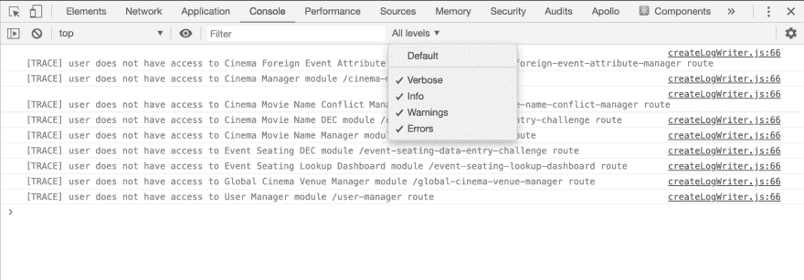

# 登录浏览器

> 原文:[https://dev.to/gajus/logging-in-browser-4150](https://dev.to/gajus/logging-in-browser-4150)

所有 Node.js 应用程序都使用某种级别的日志来交流程序进度。然而，我们很少在前端代码中看到任何日志记录。这主要是因为:

*   前端开发人员已经通过 UI 获得了很多反馈。
*   `console`对象具有跨浏览器兼容性的不良历史(例如，在 IE8 控制台中，对象仅在 DevTools 面板打开时可用。不用说，这造成了很多混乱。)

因此，当一名前端开发人员问我如何在 React 项目中记录错误时，我并不感到惊讶:

> 原木是否应该在任何地方自由使用，并由捆包工来处理移除？也许是为了减小体积？我了解到一些老的浏览器没有定义控制台。因此，建议移除它们或处理它的存在。

## [](#writing-a-logger)编写日志程序

首先要知道的是，千万不能直接用`console.log`。除了缺乏控制台标准(有一个[活草案](https://console.spec.whatwg.org/)，使用`console.log`限制了你预处理和聚集日志，也就是说，你记录的所有东西都直接进入`console.log`。

您希望控制记录什么以及何时记录，因为一旦日志在浏览器的 devtools 中，您过滤和格式化日志的能力就仅限于浏览器提供的工具集。此外，日志记录确实会带来性能损失。简而言之，您需要一个抽象，使您能够建立约定和控制日志。这种抽象可以简单到:

```
const MyLogger = (...args) => {
  console.log(...args);
}; 
```

<svg width="20px" height="20px" viewBox="0 0 24 24" class="highlight-action crayons-icon highlight-action--fullscreen-on"><title>Enter fullscreen mode</title></svg> <svg width="20px" height="20px" viewBox="0 0 24 24" class="highlight-action crayons-icon highlight-action--fullscreen-off"><title>Exit fullscreen mode</title></svg>

您可以在应用程序中到处传递和使用`MyLogger`函数。

### [](#enforcing-what-gets-logged)实施记录的内容

有了这种抽象，您就可以准确地控制记录什么/什么时候记录，例如，您可能希望强制所有日志消息必须描述名称空间和日志严重性:

```
type LogLevelType =
  'debug' |
  'error' |
  'info' |
  'log' |
  'trace' |
  'warn';

const MyLogger = (namespace: string, logLevel: LogLevelType, ...args) => {
  console[logLevel](namespace + ':', ...args);
}; 
```

<svg width="20px" height="20px" viewBox="0 0 24 24" class="highlight-action crayons-icon highlight-action--fullscreen-on"><title>Enter fullscreen mode</title></svg> <svg width="20px" height="20px" viewBox="0 0 24 24" class="highlight-action crayons-icon highlight-action--fullscreen-off"><title>Exit fullscreen mode</title></svg>

我们的应用程序是使用许多模块构建的。我使用名称空间来标识哪个模块正在生成日志，以及分隔不同的域日志(例如，“身份验证”、“graphql”、“路由”)。同时，日志级别允许在 devtools 中切换日志可见性。

[T2】](https://res.cloudinary.com/practicaldev/image/fetch/s--bLpaWvFP--/c_limit%2Cf_auto%2Cfl_progressive%2Cq_auto%2Cw_880/https://thepracticaldev.s3.amazonaws.com/i/af3x7lsqhktjsn751eon.png)

### [](#filtering-logs-using-javascript-function)使用 JavaScript 函数过滤日志

您甚至可以选择默认禁用所有日志，并仅在存在特定全局功能时打印它们，例如

```
type LogLevelType =
  'debug' |
  'error' |
  'info' |
  'log' |
  'trace' |
  'warn';

const Logger = (logLevel: LogLevelType, ...args) => {
  if (globalThis.myLoggerWriteLog) {
    globalThis.myLoggerWriteLog(logLevel, ...args);
  }
}; 
```

<svg width="20px" height="20px" viewBox="0 0 24 24" class="highlight-action crayons-icon highlight-action--fullscreen-on"><title>Enter fullscreen mode</title></svg> <svg width="20px" height="20px" viewBox="0 0 24 24" class="highlight-action crayons-icon highlight-action--fullscreen-off"><title>Exit fullscreen mode</title></svg>

这种模式的优点是，默认情况下不会向控制台写入任何内容(没有性能成本；没有不必要的噪音)，但您可以在运行时注入自定义逻辑来过滤/打印日志，即，您可以访问最小化的生产站点，打开 devtools 并将自定义注入日志编写器来访问日志。

```
globalThis.myLoggerWriteLog = (logLevel, ...args) => {
  console[logLevel](...args);
}; 
```

<svg width="20px" height="20px" viewBox="0 0 24 24" class="highlight-action crayons-icon highlight-action--fullscreen-on"><title>Enter fullscreen mode</title></svg> <svg width="20px" height="20px" viewBox="0 0 24 24" class="highlight-action crayons-icon highlight-action--fullscreen-off"><title>Exit fullscreen mode</title></svg>

## [](#sum-up)总结

如果实现了这 3 个特性(强制日志命名空间、日志级别和日志功能过滤),那么您已经有了一个良好的开端。

*   Log 语句不会显著影响包的大小。
*   确实，控制台对象至今还没有被标准化。但是，目前所有的 JavaScript 环境都实现了 console.log，console.log 对于所有的浏览器内日志记录来说已经足够了。
*   我们必须记录描述重要应用程序状态变化的所有事件，例如 API 错误。
*   日志量无关*。
*   日志必须有命名空间，并有指定的严重级别(例如，跟踪、调试、信息、警告、错误、致命)。
*   日志必须是可序列化的。
*   日志必须在生产中可用。

我提到过日志量是不相关的(带星号)。*你记录多少*确实无关紧要(调用一个模拟函数没有可测量的成本)。然而，*打印和存储多少*有一个非常真实的性能成本和处理/存储成本。对于前端和后端程序来说都是如此。有了这样的抽象，您就可以有选择地过滤、缓冲和记录相关的日志子集。

最终，无论您如何实现您的日志程序，进行一些抽象都比直接使用`console.log`要好。我的建议是尽可能少地限制记录器接口:更小的接口意味着 API 的一致使用，并支持更智能的转换，例如，我的所有记录器(使用 [Roarr](https://github.com/gajus/roarr) 实现)需要日志级别、单个文本消息和描述所有支持变量的单个可序列化对象。