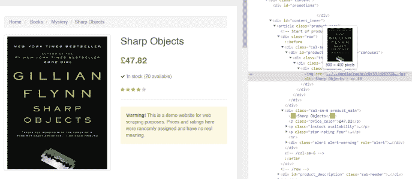
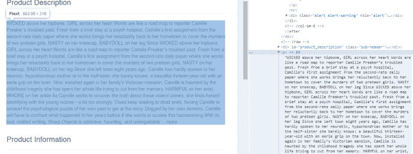
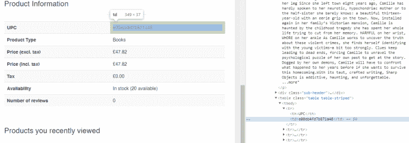

# 提取所有数据！–02–面向初学者的 Python scrapy 教程

> 原文：<https://dev.to/davidmm1707/private-python-scrapy-tutorial-for-beginners-02-extract-all-the-data-49i5>

原帖: [Python scrapy 初学者教程–02–提取所有数据！](https://letslearnabout.net/tutorial/scrapy-tutorial/python-scrapy-tutorial-for-beginners-02-extract-all-the-data/)

[](https://res.cloudinary.com/practicaldev/image/fetch/s--cqTJQEU5--/c_limit%2Cf_auto%2Cfl_progressive%2Cq_auto%2Cw_880/https://i0.wp.com/letslearnabout.net/wp-content/uploads/2019/09/Scrapy-02-1.jpg%3Fw%3D688%26ssl%3D1)

在我们的上一课中，我们已经创建了第一个 Scrapy spider 并且从书中刮出了一些区域。但我们也了解到，每个项目都有一个包含更详细数据的 URL。让我们看看如何以不同的方式提取所有的数据。

在这篇文章中，你将学习如何:

*   在自己的页面上删除项目
*   提取具有相对 URL 的路线
*   按标签、类、分部类和同级元素选择元素
*   从表格中提取信息
*   使用对其他 Scrapy 类方法的回调

[https://www.youtube.com/embed/zOBf2RKYJUs](https://www.youtube.com/embed/zOBf2RKYJUs)

* * *

### 我们实际的蜘蛛

在上一课中，我们的蜘蛛能够提取标题、价格、图片 URL 和书籍 URL。让我记住代码:

```
import scrapy

class SpiderSpider(scrapy.Spider):
    name = 'spider'
    allowed_domains = ['books.toscrape.com']
    start_urls = ['http://books.toscrape.com/']

    def parse(self, response):

        all_books = response.xpath('//article[@class="product_pod"]')

        for book in all_books:
            title = book.xpath('.//h3/a/@title').extract_first()
            price = book.xpath('.//div/p[@class="price_color"]/text()').extract_first()
            image_url = self.start_urls[0] + book.xpath('.//img[@class="thumbnail"]/@src').extract_first()
            book_url = self.start_urls[0] + book.xpath('.//h3/a/@href').extract_first()

            yield {
                'title': title,
                'price': price,
                'Image URL': image_url,
                'Book URL': book_url,
            } 
```

如果你不知道如何创建一个 Scrapy 项目和蜘蛛，请到第一课:[创建你的第一个蜘蛛](https://letslearnabout.net/python/python-scrapy-tutorial-for-beginners-01-creating-your-first-spider/)

这个蜘蛛将是我们的起点，但我们不是提取标题、价格、图片和图书 URL，而是提取图书 URL，然后从该 URL 解析，而不是从 start_urls 上的那个解析。

* * *

### 使用 Scrapy 获取详细的图书网址

拿整个蜘蛛来说，去掉一切和标题、形象、价格有关的东西。去掉屈服。这应该是你的蜘蛛了:

```
# -*- coding: utf-8 -*-
import scrapy

class SpiderSpider(scrapy.Spider):
    name = 'spider'
    allowed_domains = ['books.toscrape.com']
    start_urls = ['http://books.toscrape.com/']

    def parse(self, response):

        all_books = response.xpath('//article[@class="product_pod"]')

        for book in all_books:
            book_url = self.start_urls[0] + book.xpath('.//h3/a/@href').extract_first() 
```

现在，我们正在获取所有的书籍，并提取其网址。现在，对于每本书，我们将使用一种新的方法。当蜘蛛启动时，自动调用 Parse 方法，但是我们可以创建自己的方法。

因为我们有了图书的 URL，所以我们可以创建另一个请求，就这样，向服务器请求。但是我们将使用这本书的网址，而不是 books.toscrape.com 的基本网址。将此添加到您的脚本中:

```
# Old code
        for book in all_books:
            book_url = self.start_urls[0] + 
                book.xpath('.//h3/a/@href').extract_first()
# New code 
            yield scrapy.Request(book_url, callback=self.parse_book)

    def parse_book(self, response):
        print(response.status) 
```

我们使用 Scrapy 方法*Request _ 向服务器请求一个新的 HTML。那个 HTML 就是存储在 _book_url* 的那个。回调，我们得到响应后要运行的方法，是一个新方法: *parse_book* 。

运行代码，每次你会得到一串 200，成功的状态码:

[](https://res.cloudinary.com/practicaldev/image/fetch/s--h1Nq4sLw--/c_limit%2Cf_auto%2Cfl_progressive%2Cq_auto%2Cw_880/https://i0.wp.com/letslearnabout.net/wp-content/uploads/2019/09/image.png%3Ffit%3D688%252C211%26ssl%3D1)

* * *

正如我们对 *parse* 方法所做的那样，我们将从每个图书 URL 中提取数据。例如，随便翻开一本[尖锐物体](http://books.toscrape.com/catalogue/sharp-objects_997/index.html)

我们将把这本书作为一个模型，每本书都将以同样的方式刮出。

我们有很多选择！为什么不从题目开始呢？

#### 提取数据——简单的

右键单击标题，选择 inspect 并查看它的位置。它只是 a _div 之后唯一的 *h1 _tag。很简单。我们找一个 *h1 _after a _div* ，提取文字。然后，我们将它存储在一个变量中:*

```
 def parse_book(self, response):
        title = response.xpath('//div/h1/text()').extract_first()
        print(title) 
```

让我们运行代码并打印标题:

[](https://res.cloudinary.com/practicaldev/image/fetch/s--zvLYhU7n--/c_limit%2Cf_auto%2Cfl_progressive%2Cq_auto%2Cw_880/https://i1.wp.com/letslearnabout.net/wp-content/uploads/2019/09/image-1.png%3Ffit%3D688%252C227%26ssl%3D1)

很简单，对吧？

以前，我们只有主 URL，并循环遍历文章来提取数据。

现在我们有了主 URL，循环遍历文章提取 URL，然后请求新的 URL，我们提取数据。另一种方法中的一个附加步骤。这就是一切。

我们继续吧。找到图像，右键单击它，然后检查它。似乎我们又有了一个不完整的 URL！

[](https://res.cloudinary.com/practicaldev/image/fetch/s--KrzfYHxb--/c_limit%2Cf_auto%2Cfl_progressive%2Cq_auto%2Cw_880/https://i0.wp.com/letslearnabout.net/wp-content/uploads/2019/09/image-2.png%3Ffit%3D688%252C299%26ssl%3D1)

幸运的是，你在我们的第一课中学到了很多，你知道如何通过获得部分 URL 和添加基本 URL 来创建最终 URL。你为什么不试一试？

第一次不成功也没关系。获取 URL，添加基本 URL 并打印结果，直到找到为止。

我是这样做的:

```
class SpiderSpider(scrapy.Spider):
    name = 'spider'
    allowed_domains = ['books.toscrape.com']
    start_urls = ['http://books.toscrape.com/']
# New 'base_url' variable
    base_url = 'http://books.toscrape.com'

    .....
    def parse_book(self, response):
        title = response.xpath('//div/h1/text()').extract_first()

        relative_image = response.xpath('//div[@class="item active"]/img/@src').extract_first()
        final_image = self.base_url + relative_image.replace('../..', '') 
```

像往常一样，打印 *final_image* 以查看您是否有正确的 URL。你知道该怎么做。

让我们看看价格。

#### 【包含】选择器

右键单击价格，检查它，您可以看到它在一个带有 *price_color* 类的 *p* 标签中。

问题是“您最近查看的产品”底部的每一个项目都有！

我们不仅需要在一个 div 中搜索带有 *price_color* 类的 *p* 标签，该 div 还需要有一个 *product_main* 类！

但这只是课程的一部分:

[](https://res.cloudinary.com/practicaldev/image/fetch/s--fap8oLhX--/c_limit%2Cf_auto%2Cfl_progressive%2Cq_auto%2Cw_880/https://i1.wp.com/letslearnabout.net/wp-content/uploads/2019/09/image-3.png%3Ffit%3D688%252C115%26ssl%3D1)

我们可以使用选择器来搜索一个项目，它的类*包含*一个字符串。我们不使用整个类“col-sm-6 product_main”，而是只搜索 *product_main* 。

代码如下:

```
 price = response.xpath(
            '//div[contains(@class, "product_main")]/p[@class="price_color"]/text()').extract_first() 
```

我们寻找一个 *div* ，它的类包含 *product_main* ，然后我们用 *price_color* 类得到 *p* 中的文本。

打印*价格*并再次运行代码以检查它是否工作。

现在，轮到你了:刮掉库存(写着‘有货(X 可用)’的文字)。用你刚刚看到的技巧，自己做。

这是我的解决方案:

```
 stock = response.xpath(
            '//div[contains(@class, "product_main")]/p[contains(@class, "instock")]/text()').extract()[1].strip() 
```

这次我们有 2 个元素，所以我提取了想要的元素，并用 python *删除了空白。strip()* 。

让我们提取收视率。右键单击星星，我们看到了这个:

[](https://res.cloudinary.com/practicaldev/image/fetch/s--RFLtII41--/c_limit%2Cf_auto%2Cfl_progressive%2Cq_auto%2Cw_880/https://i2.wp.com/letslearnabout.net/wp-content/uploads/2019/09/image-4.png%3Ffit%3D688%252C212%26ssl%3D1)

每个明星都有一个*图标-明星*等级，但如果你看前面的 div，你可以看到所有的明星都被包裹在 div 中，带有*星级四个*等级。四是评级。

尝试提取它。只需得到一个包含 _star-rating _class 的 *p* 并得到那个类。删除我们不需要的多余文本。

这是我的代码:

```
stars = response.xpath(
            '//div/p[contains(@class, "star-rating")]/@class').extract_first().replace('star-rating ', '') 
```

#### 家事——兄弟姐妹

这个描述很微妙:

[](https://res.cloudinary.com/practicaldev/image/fetch/s--oX57UBB1--/c_limit%2Cf_auto%2Cfl_progressive%2Cq_auto%2Cw_880/https://i0.wp.com/letslearnabout.net/wp-content/uploads/2019/09/image-5.png%3Ffit%3D688%252C257%26ssl%3D1)

p 标签没有类！我们如何选择它？

嗯，我们不能…但是我们可以选择前一个元素，*div id = " product _ description "*，然后选择下一个 HTML 节点，或者它的兄弟节点。像这样:

```
description = response.xpath('//div[@id="product_description"]/following-sibling::p/text()').extract_first() 
```

我们选择 id 为 *product_description* 的 *div* ，然后我们转到下一个 *p* 兄弟，我们选择并提取文本。唷！

#### 表格

如果你还没看够*包含*和 _ 兄弟姐妹，现在我们有表了！

[](https://res.cloudinary.com/practicaldev/image/fetch/s--8CNI4YVv--/c_limit%2Cf_auto%2Cfl_progressive%2Cq_auto%2Cw_880/https://i1.wp.com/letslearnabout.net/wp-content/uploads/2019/09/image-6.png%3Ffit%3D688%252C241%26ssl%3D1)

别担心，我会掩护你的。

我们需要选择表格、行或 *tr，_ 然后是所述行的位置，然后是值，在本例中是 _td。*选择之后，我们照常得到文本。让我做第一个，UPC:

```
upc = response.xpath(
            '//table[@class="table table-striped"]/tr[1]/td/text()').extract_first() 
```

打印出来运行蜘蛛。这就是我们从表格中提取数据的方式。现在轮到你了:

提取无税价格、含税价格和税金。就像我们对第一个蜘蛛所做的那样，产生我们对第一个蜘蛛所做的结果。

自己做，除非需要，不要看这里。

```
price_excl_tax = response.xpath(
            '//table[@class="table table-striped"]/tr[3]/td/text()').extract_first()
        price_inc_tax = response.xpath(
            '//table[@class="table table-striped"]/tr[4]/td/text()').extract_first()
        tax = response.xpath(
            '//table[@class="table table-striped"]/tr[5]/td/text()').extract_first()

        yield {
            'Title': title,
            'Image': final_image,
            'Price': price,
            'Stock': stock,
            'Stars': stars,
            'Description': description,
            'Upc': upc,
            'Price excl tax': price_excl_tax,
            'Price incl tax': price_inc_tax,
            'Tax': tax,
        } 
```

就是这样！运行蜘蛛，但这一次，将文件存储到一个文件。

```
scrapy crawl spider -o books_detailed.json 
```

打开新文件，确保一切正常。

* * *

### 结论

恭喜你！你设法改进你的蜘蛛！

现在你知道如何以正常的方式获取元素，通过类或 id 等属性，通过部分属性，兄弟元素，表等，你可以从所有的书中提取所有的细节！

嗯，至少，从主页上所有的书来看。把所有的书一页一页地抽出来，直到每一本书都被刮掉，这不是很好吗？

别急，本教程第三课就能知道怎么做:[如何进入下一页](https://letslearnabout.net/tutorial/python-scrapy-tutorial-for-beginners-03-how-to-go-to-the-next-page/)

* * *

[Github 上的最终代码](https://github.com/david1707/scrapy_tutorial/tree/02_lesson)

[在 Twitter 上联系我](https://twitter.com/DavidMM1707)

[我的 Youtube 教程视频](https://www.youtube.com/channel/UC9OLm6YFRzr4yjlw4xNWYvg/videos)

[上一个视频:01–创建您的第一个蜘蛛](https://letslearnabout.net/tutorial/scrapy-tutorial/python-scrapy-tutorial-for-beginners-01-creating-your-first-spider/)