# 在 React 中创建签名板

> 原文：<https://dev.to/ma7eer/create-a-signature-pad-in-react-3mmi>

最近，一个客户要求我构建一个允许用户使用无线笔鼠标签名的表单。客户的目标是获得用户对报告的签名，以用于将来的审计。

起初，我考虑从头开始制作自己的签名本。然而，我没有时间做那件事。这个功能需要在一周内上线。不幸的是，这是现实生活中的现实。这就是为什么我想写这个具体的案例。你不会总是有时间从头开始构建应用程序的每一个功能。有时你不得不依赖其他开发者创建的库。这篇文章将帮助初学者了解如何组合不同的库来创建一个工作产品。

好吧，让我们开始建立签名垫。首先我写了一个用户故事。下面是我们将要构建的用户故事:

*   用户看到一个按钮，单击该按钮可以打开一个弹出窗口
*   当弹出窗口打开时，用户可以在画布上看到和绘制
*   用户可以选择通过“关闭”按钮退出弹出窗口，通过“清除”按钮清除画布，或者通过“保存”按钮将签名保存为图像。

现在我们知道我们在构建什么了，让我们开始编码吧。我们可以使用用户故事列表项作为我们的里程碑。

## 用户看到一个按钮，点击它可以打开一个弹出窗口

我将使用 React 来完成这个任务，所以让我们使用 create-react-app 来引导这个项目。

要做到这一点，我们需要做的就是在我们的终端上键入以下命令:

```
npx create-react-app signature-pad 
```

Enter fullscreen mode Exit fullscreen mode

关于 create-react-app 的更多信息，请查看这个 [Github Repo](https://github.com/facebook/create-react-app)

一旦我们的项目准备就绪，我们导航到我们的文件夹，并启动我们的代码编辑器。在我的例子中，我使用的是 [VS 代码](https://code.visualstudio.com/)。

```
# navigate to the project folder in your terminal
cd signature-pad

# command to start VS Code once you are in root folder of the project
code . 
```

Enter fullscreen mode Exit fullscreen mode

现在我们已经设置好了一切，让我们通过输入下面的命令来启动我们的项目:

```
# start project
npm start 
```

Enter fullscreen mode Exit fullscreen mode

这是项目开始后我们应该看到的情况:

[](https://res.cloudinary.com/practicaldev/image/fetch/s--Dyj9sMBr--/c_limit%2Cf_auto%2Cfl_progressive%2Cq_auto%2Cw_880/https://thepracticaldev.s3.amazonaws.com/i/9qgyxthglqithu46vk07.PNG)

如果你打开你的`App.js`文件，我们会看到:

[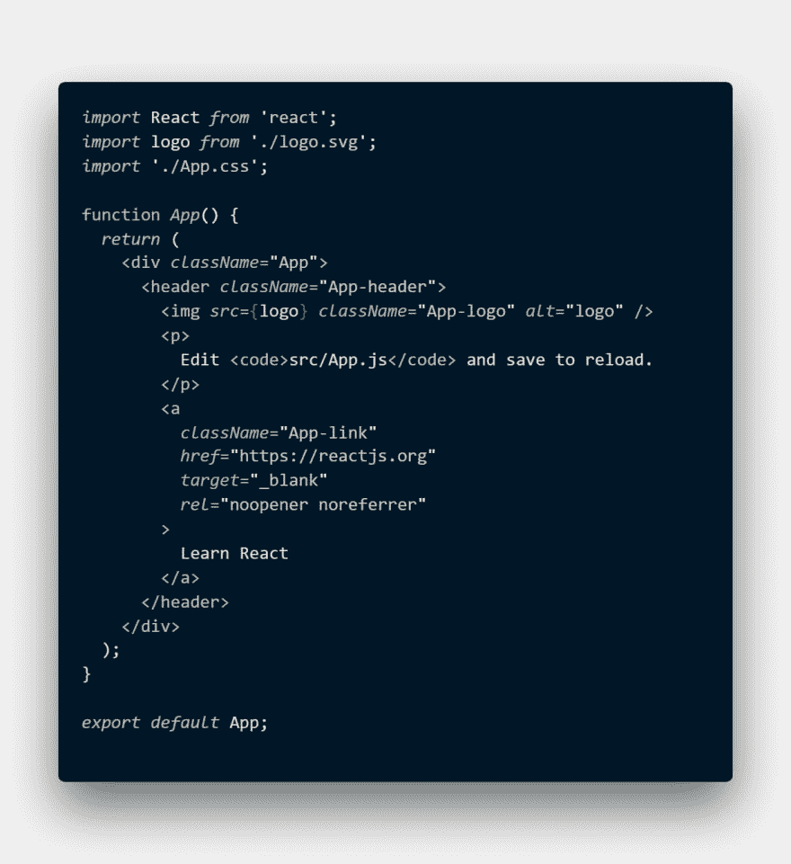](https://res.cloudinary.com/practicaldev/image/fetch/s--LolB3QgN--/c_limit%2Cf_auto%2Cfl_progressive%2Cq_auto%2Cw_880/https://thepracticaldev.s3.amazonaws.com/i/125kinoret8n7cm5qprq.png)

让我们去掉所有这些代码，添加我们需要的东西。一个按钮，当点击时，应该打开一个带有签名板的弹出窗口，根据我们的用户故事。

[](https://res.cloudinary.com/practicaldev/image/fetch/s--wXI5KfCj--/c_limit%2Cf_auto%2Cfl_progressive%2Cq_auto%2Cw_880/https://thepracticaldev.s3.amazonaws.com/i/bkhrlzhv2uqxbztz5ecq.png)

这是我们的应用程序现在应该的样子:

[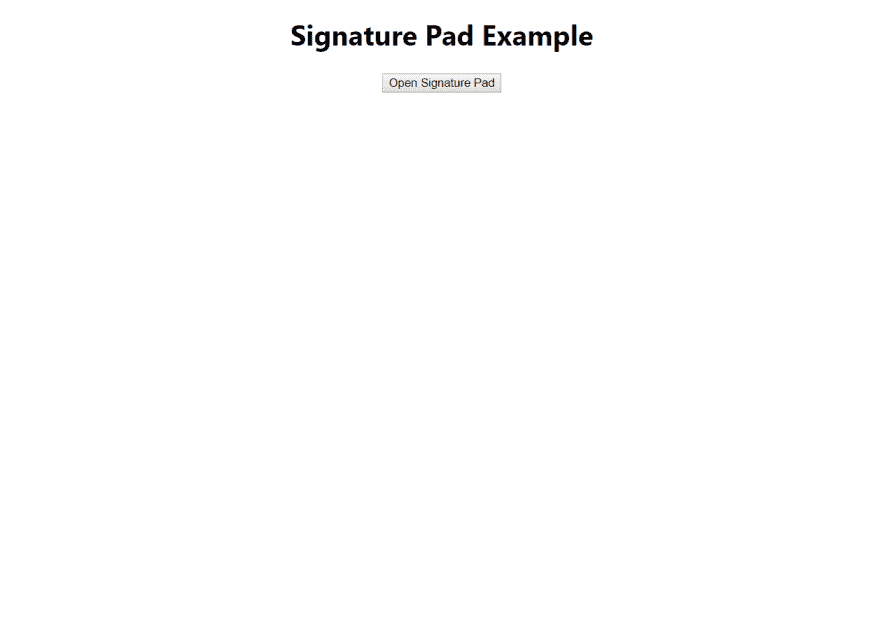](https://res.cloudinary.com/practicaldev/image/fetch/s--mcn97DLs--/c_limit%2Cf_auto%2Cfl_progressive%2Cq_auto%2Cw_880/https://thepracticaldev.s3.amazonaws.com/i/kghmxxybim76464v6u5v.PNG)

项目这一部分的最后一步是在点击按钮时显示一个弹出窗口。reactjs-popup 是一个很好的库，可以帮助解决这个问题。要安装它，我们键入

```
npm install --save reactjs-popup 
```

Enter fullscreen mode Exit fullscreen mode

这个库可以用来创建弹出模型、工具提示和嵌套菜单。在我们的例子中，我们将集中使用它来创建弹出模型。更多信息请查看他们非常有用的[文档页面](https://react-popup.elazizi.com/introduction/)

一旦我们安装了这个库，我们就把它导入到我们的`App.js`文件中。接下来，我们将`Popup`组件添加到我们的渲染方法中。这个组件接受许多道具。在我们的例子中，我们关注两个:模态属性(默认情况下，这是假的，会得到一个工具提示)和触发器属性，它接受一个将触发弹出窗口的组件。在我们的例子中，这是我们已经创建的按钮。

现在，当我们点击按钮，我们应该得到一个弹出窗口。弹出窗口的内容将进入我们的`Popup`组件。

[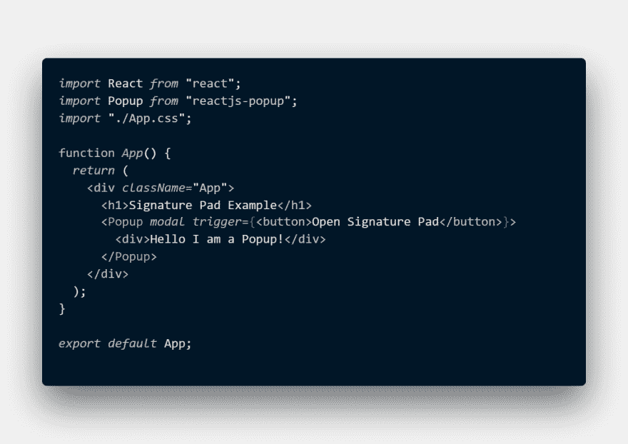](https://res.cloudinary.com/practicaldev/image/fetch/s--sA1I6LPj--/c_limit%2Cf_auto%2Cfl_progressive%2Cq_auto%2Cw_880/https://thepracticaldev.s3.amazonaws.com/i/ial8f4lv376vijo124mi.png)

这是我们现在应该有的:

[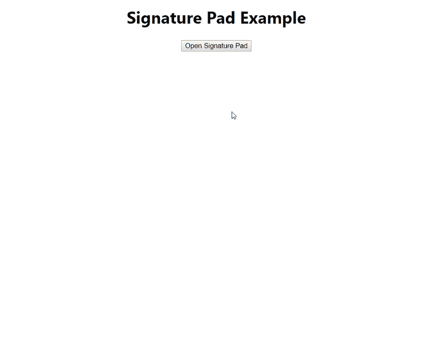](https://res.cloudinary.com/practicaldev/image/fetch/s--VJsYB7Qx--/c_limit%2Cf_auto%2Cfl_progressive%2Cq_66%2Cw_880/https://thepracticaldev.s3.amazonaws.com/i/7sx7ga2jbl0eaitt37os.gif)

我们已经成功完成了用户故事的第一部分。现在让我们为下一个开始吧！

## 弹出窗口打开时，用户可以看到并在画布上画画

为了在弹出窗口中构建画布，我们将使用 react-signature-canvas。这是一个强大的库，将使签名板的工作变得非常容易。特别是当我们开始考虑在 pad 中添加清除和保存等功能时。

要安装它，我们键入:

```
npm install --save react-signature-canvas 
```

Enter fullscreen mode Exit fullscreen mode

一旦安装完毕，我们导入`SignatureCanvas`组件并将其放入`Popup`组件中。仅此而已！

我们现在在弹出窗口中有一个画布。代码如下所示:

[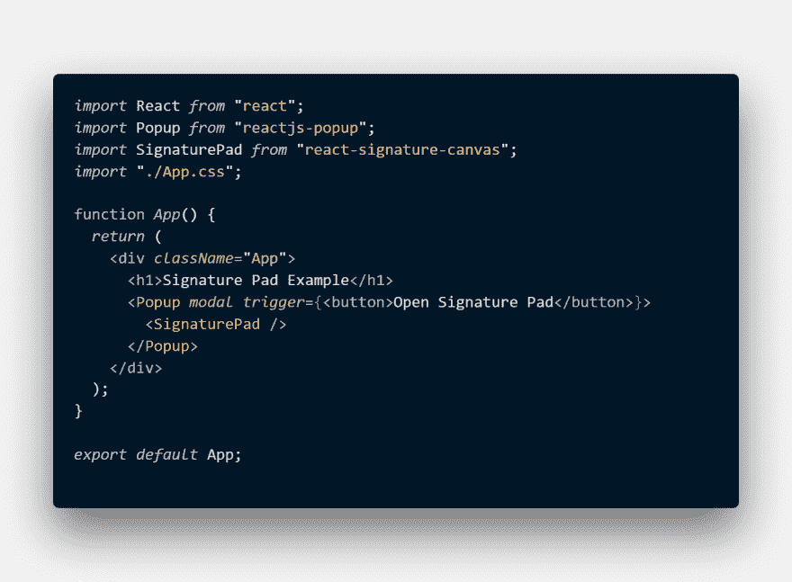](https://res.cloudinary.com/practicaldev/image/fetch/s--Rj8oRoej--/c_limit%2Cf_auto%2Cfl_progressive%2Cq_auto%2Cw_880/https://thepracticaldev.s3.amazonaws.com/i/65frxbbm7raxop89z6ot.png)

这是我们的应用程序应该显示的内容:

[](https://res.cloudinary.com/practicaldev/image/fetch/s--qhifoi7X--/c_limit%2Cf_auto%2Cfl_progressive%2Cq_66%2Cw_880/https://thepracticaldev.s3.amazonaws.com/i/cpbqvuw29g34ty2u1ycu.gif)

在我们进入用户故事的下一个项目之前，让我们给画布添加一些样式。我所要做的就是给我们的画布加一个边框，这样我们就可以很容易地识别它，并给它一个宽度和高度。

组件`SignaturePad`有一个名为`canvasProps`的属性，它允许我们将属性传递给画布。在这种情况下，我将给画布一个名为“signatureCanvas”的类。

[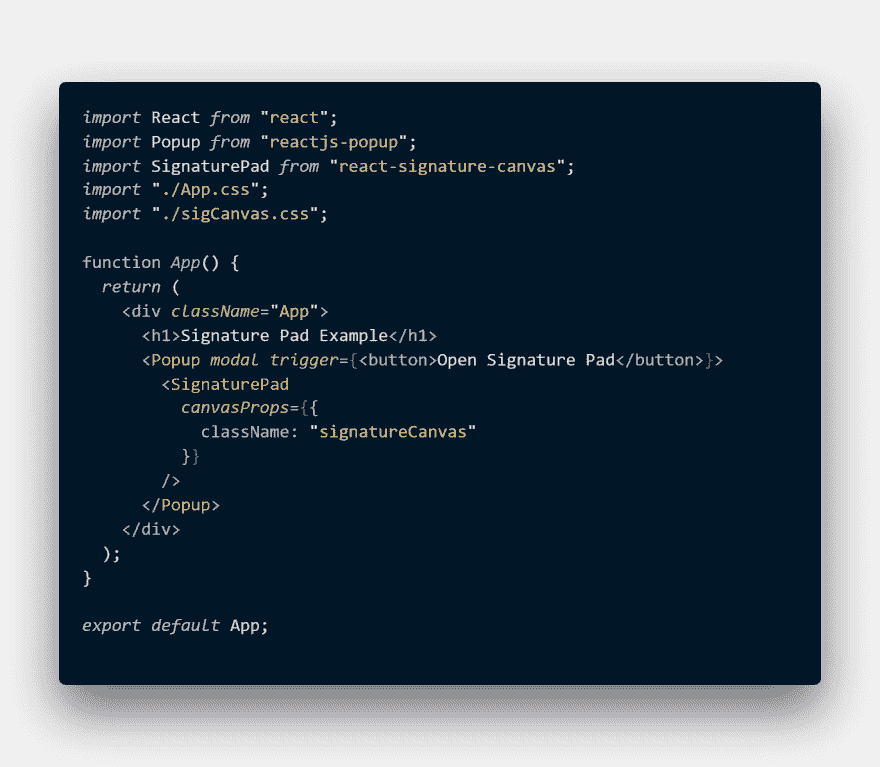](https://res.cloudinary.com/practicaldev/image/fetch/s--IpX5zsCb--/c_limit%2Cf_auto%2Cfl_progressive%2Cq_auto%2Cw_880/https://thepracticaldev.s3.amazonaws.com/i/nzvenjmpm0a84mat838n.png)

你可能注意到我也在导入一个名为`sigCanvas.css`的 css 文件。这是我放所有画布相关风格的地方。

[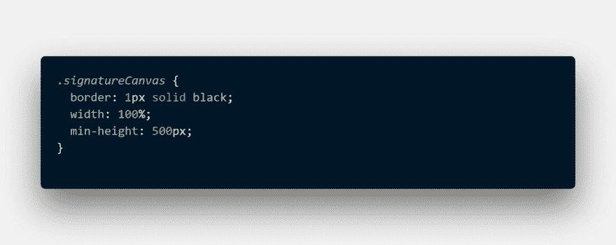](https://res.cloudinary.com/practicaldev/image/fetch/s--7jpDo-VD--/c_limit%2Cf_auto%2Cfl_progressive%2Cq_auto%2Cw_880/https://thepracticaldev.s3.amazonaws.com/i/5a4poqag5qzd34fnvzqb.png)

结果应该是这样的:

[](https://res.cloudinary.com/practicaldev/image/fetch/s--aCEgERoj--/c_limit%2Cf_auto%2Cfl_progressive%2Cq_66%2Cw_880/https://thepracticaldev.s3.amazonaws.com/i/j8dioinywl970demx660.gif)

好了，准备好我们的最后一步了。

## 用户可以选择通过“关闭”按钮退出弹出窗口，通过“清除”按钮清除画布，或通过“保存”按钮将签名保存为图像。

让我们从关闭按钮开始。让我们添加一个带有 onClick 的按钮，在这个 onClick 里面有一个关闭弹出窗口的方法。`reactjs-popup`文档建议提供一个函数作为`Popup`组件的子组件。这个函数有一个参数`close`，它将处理我们的关闭事件，并返回我们想要的弹出窗口中的组件。

此外，我们不应该允许用户关闭弹出窗口，除非通过这个按钮。为此，我们需要传递`closeOnDocumentClick`属性，并为其传递一个真值。

[](https://res.cloudinary.com/practicaldev/image/fetch/s--0M1-6EeE--/c_limit%2Cf_auto%2Cfl_progressive%2Cq_auto%2Cw_880/https://thepracticaldev.s3.amazonaws.com/i/tlar1rs5gmy3xps7txte.png)

这是我们的应用程序现在的样子:

[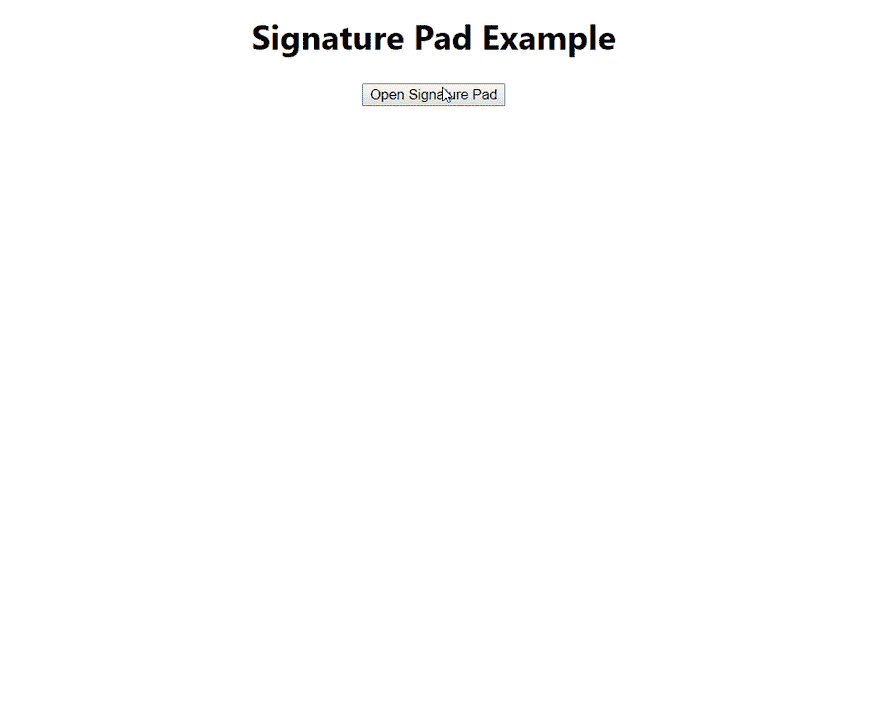](https://res.cloudinary.com/practicaldev/image/fetch/s--M7QpVe4G--/c_limit%2Cf_auto%2Cfl_progressive%2Cq_66%2Cw_880/https://thepracticaldev.s3.amazonaws.com/i/i1itxvv3vx2kdjal67ay.gif)

接下来，我们需要一个按钮来清除画布。提供了几种方法来帮助操作我们的画布。为了使用这个方法，我们需要得到画布的一个瞬间。这可以通过 React refs 来完成。

让我们为此使用 React 钩子。首先我们使用`useRef`钩子创建一个名为`sigCanvas`的 ref，初始值是一个空对象。接下来，我们使用一个名为 ref 的属性将它传递给一个`SignaturePad`组件。最后，我们创建了一个名为`clear`的函数，只要点击 clear 按钮就会调用这个函数。

在 clear 函数中，我们简单地通过画布 ref `sigCanvas`调用方法`clear()`。我意识到这需要很多步骤，所以我在如下所示的代码中写了注释:

[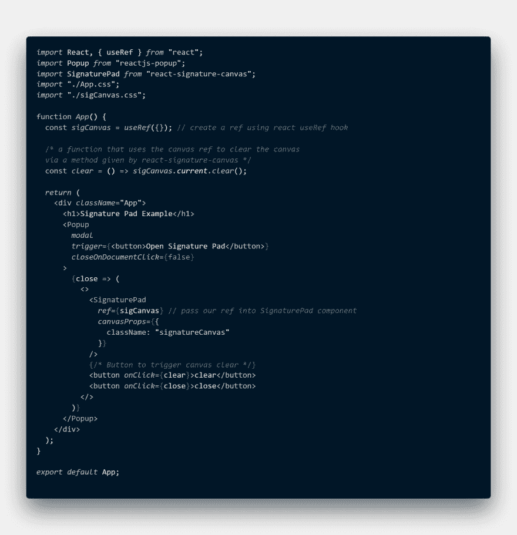](https://res.cloudinary.com/practicaldev/image/fetch/s--T0XARo20--/c_limit%2Cf_auto%2Cfl_progressive%2Cq_auto%2Cw_880/https://thepracticaldev.s3.amazonaws.com/i/oev6dgxn8va6p116yje2.png)

这是我们的应用程序现在应该的样子:

[](https://res.cloudinary.com/practicaldev/image/fetch/s--O6lGlCi---/c_limit%2Cf_auto%2Cfl_progressive%2Cq_66%2Cw_880/https://thepracticaldev.s3.amazonaws.com/i/k16uhqdcwbo8buw3mz1j.gif)

现在是最后一个按钮，保存按钮。这个按钮应该简单地输出一个代表图像的 base64 字符串。你可以用它来存储在一个数据库中，或者你可以把图像上传到你的服务器上。在我们的例子中，我们不会连接到任何服务器，所以我们只是将 base64 代码记录到控制台。

`react-signature-canvas`有一个名为`getTrimmedCanvas()`的方法，可以修剪画布上的空白(以优化图像)并返回一个代表图像的 base64 字符串。所有这些都是通过我们的`sigCanvas`参考。

[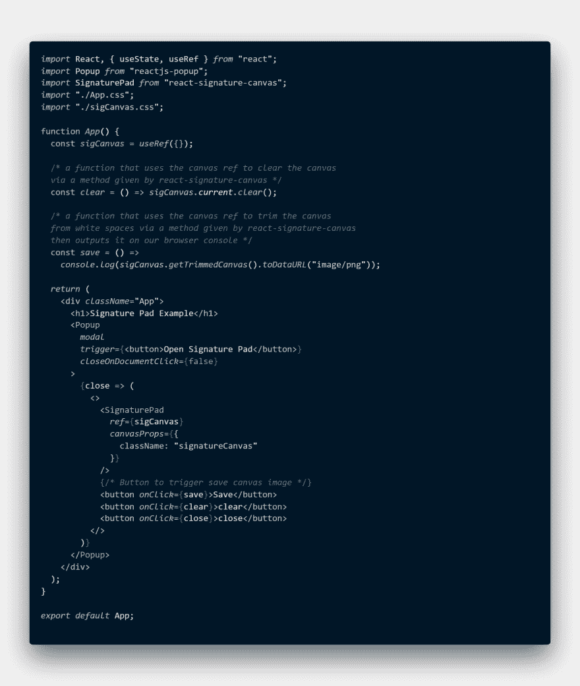](https://res.cloudinary.com/practicaldev/image/fetch/s--wQ7mdXiy--/c_limit%2Cf_auto%2Cfl_progressive%2Cq_auto%2Cw_880/https://thepracticaldev.s3.amazonaws.com/i/r13v0e309kyu2gudvz4n.png)

这是我们的应用程序现在应该的样子:

[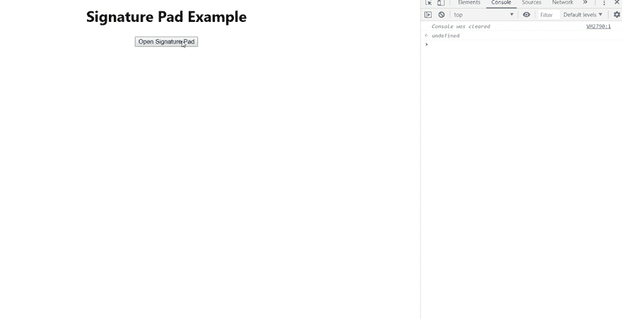](https://res.cloudinary.com/practicaldev/image/fetch/s--OPTtLDVS--/c_limit%2Cf_auto%2Cfl_progressive%2Cq_66%2Cw_880/https://thepracticaldev.s3.amazonaws.com/i/kipqi1bf7xpo1jjzsdle.gif)

好吧！所有基本功能都已完成！

我确实想给这个项目增加一个部分。让我们在屏幕上输出保存的签名，而不只是记录它。

我们可以简单地在弹出按钮下面添加一个图像标签，并传递给它我们的图像 URL。当然，这个图像 URL 将是我们登录到控制台的内容，因此我们可以将它存储在 state 中，而不是这样做。

[](https://res.cloudinary.com/practicaldev/image/fetch/s--dhNqXZG3--/c_limit%2Cf_auto%2Cfl_progressive%2Cq_auto%2Cw_880/https://thepracticaldev.s3.amazonaws.com/i/khhpy6z4oi946k92ak2z.png)

结果应该是这样的:

[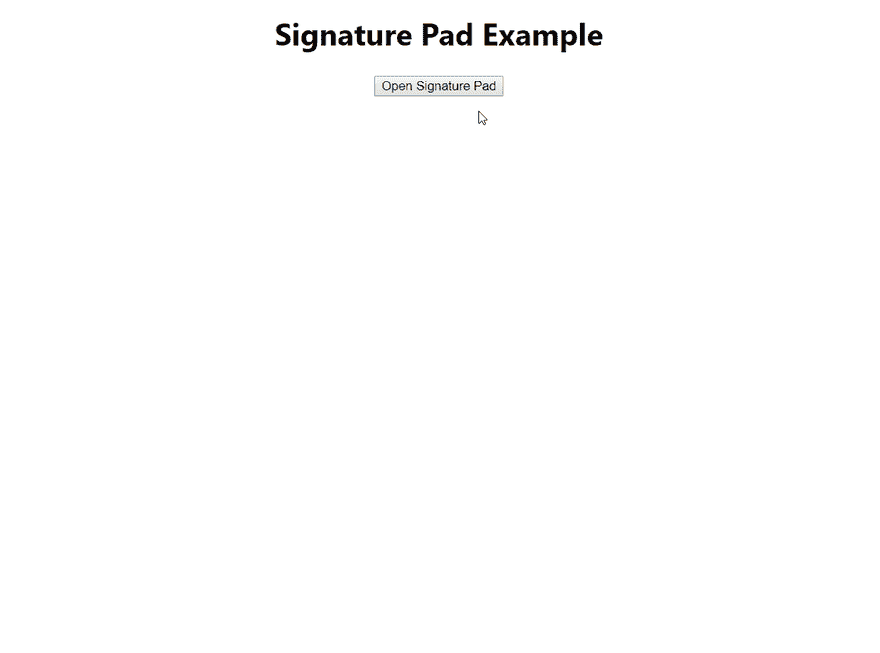](https://res.cloudinary.com/practicaldev/image/fetch/s--tZrPGmW7--/c_limit%2Cf_auto%2Cfl_progressive%2Cq_66%2Cw_880/https://thepracticaldev.s3.amazonaws.com/i/6kacvb3k8u2v164inrop.gif)

那都是乡亲们！我们成功完成了我们的用户故事。当然还有改进的空间，但是所有的基本功能都在。

您可以通过点击[链接](https://codesandbox.io/s/react-signature-canvas-example-xevhz)来修改代码并添加更多特性

有问题吗？欢迎通过评论或[我的推特](https://twitter.com/maheralkendi)联系我们

好吧！现在回到学习👨🏿‍💻