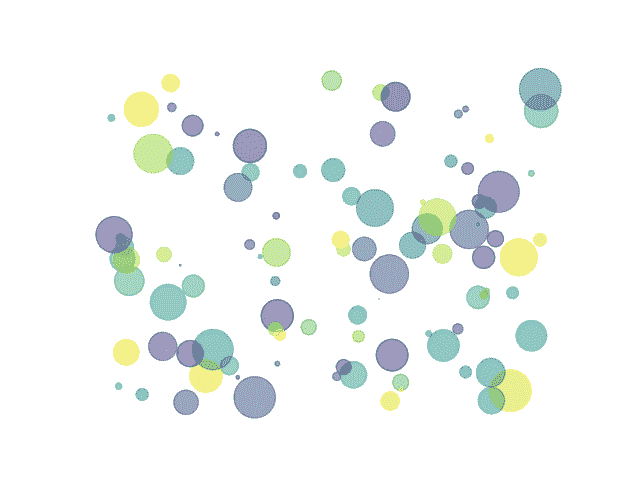

# 使用 Python 的计算机生成艺术

> 原文：<https://dev.to/codesharedot/computer-generated-art-with-python-3ala>

电脑可以用来制作艺术品。最早的尝试可以在旧的屏保或演示中看到。艺术生成最现代的形式是使用 AI/机器学习/深度学习。

## 用 Python 创作艺术

即使有了基本的 Python 知识，你也可以用计算机生成艺术作品。例如，我们可以让计算机生成随机数，并用这些随机数据生成一幅泡泡图。

[](https://res.cloudinary.com/practicaldev/image/fetch/s--QyCRLZdh--/c_limit%2Cf_auto%2Cfl_progressive%2Cq_auto%2Cw_880/https://thepracticaldev.s3.amazonaws.com/i/u11glbdspcddbigwhyn5.png)

### 代码

将使用模块 numpy 和 [matplotlib](https://pythonbasics.org/matplotlib-bar-chart/)

```
#!/usr/bin/python3
import numpy as np
import matplotlib.pyplot as plt 
```

然后是一个主函数

```
if __name__ =="__main__": 
```

其中随机数据被创建(x，y)。随机的颜色也被创造出来。

```
 N = 100
    x = np.zeros(N)
    y = np.zeros(N)
    for i in range(N):
        x[i] = np.random.rand()
        y[i] = np.random.rand()
    colors = np.random.rand(N) 
```

然后我们画出这幅图

```
 area = (30 * np.random.rand(N))**2  
    ax = plt.subplot(111)
    ax.scatter(x, y, s=area, c=colors, alpha=0.6)
    ax.spines['top'].set_visible(False)
    ax.spines['right'].set_visible(False)
    ax.spines['bottom'].set_visible(False)
    ax.spines['left'].set_visible(False)
    plt.axis('off')
    plt.show() 
```

相关链接:

*   [人类 vs 电脑艺术](https://www.artsy.net/article/artsy-editorial-hard-painting-made-computer-human)
*   [人工智能艺术的例子](https://deepart.io/latest/)
*   [学习 Python](https://pythonbasics.org/)