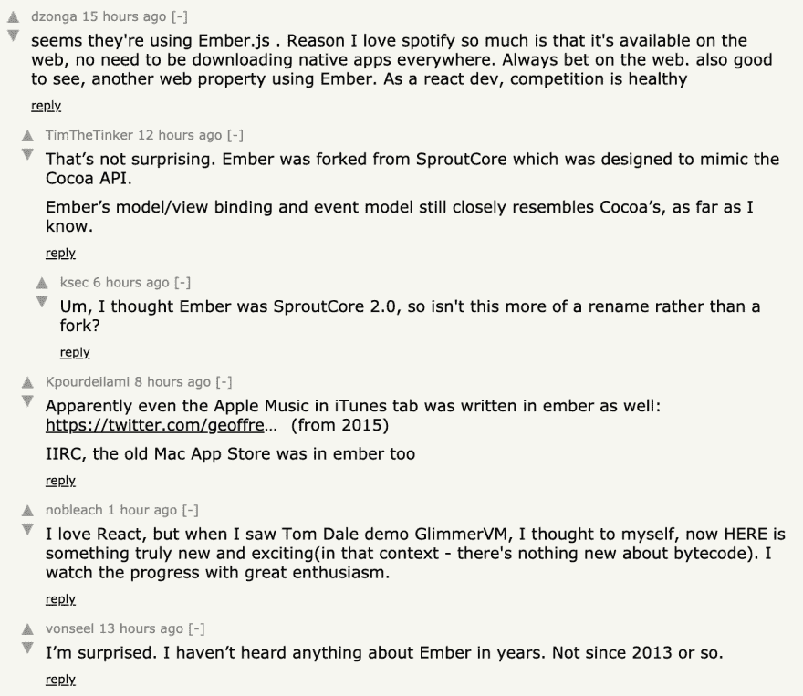

# 苹果刚刚将 Web 组件投入生产，你可能错过了

> 原文:[https://dev . to/ionic/apple-just-shipped-web-components-to-production-and-you-possible-miss-it-57pf](https://dev.to/ionic/apple-just-shipped-web-components-to-production-and-you-probably-missed-it-57pf)

昨天，苹果公司宣布发布新的测试版苹果音乐网络客户端，让苹果音乐用户能够从网络上听他们喜欢的音乐，而不仅仅是通过安装的原生应用程序。

我一直在关注黑客新闻(Hacker News)上的对话，许多人很高兴看到苹果拥抱网络，并与 Spotify 等其他音乐应用平起平坐，这些应用自早期以来就拥有丰富的网络体验。对许多人来说，苹果仍然深切关注网络是令人鼓舞和兴奋的。

可以预见的是，HN 的读者对这样一个有影响力的大公司如此大规模的发布背后的技术栈感到好奇。好奇的读者很快发现该应用程序的很大一部分是建立在 Ember 上的，大多数技术对话都集中在这一点上:

[T2】](https://res.cloudinary.com/practicaldev/image/fetch/s--8k85x53f--/c_limit%2Cf_auto%2Cfl_progressive%2Cq_auto%2Cw_880/https://thepracticaldev.s3.amazonaws.com/i/0ubqowc4qrfowbrw5qi8.png)

然而，一些细心的读者注意到了一些有趣的事情:苹果还运送了超过 45 个 Web 组件来支持 Apple Music web 体验的许多方面(他们使用 [StencilJS](http://stenciljs.com) 构建了这些组件，这是一个其他人没有注意到的细节，但可以通过检查正在加载的组件包来看到)。这些组件围绕着新的音乐视频播放器、播客播放控制、通知等等。我对这种情况的解读是，随着时间的推移，苹果将部署更多带有 Web 组件的功能，我们今天看到的是正在测试的新兴功能。

我发现 Web 组件的使用在 HN 几乎超出了每个人的想象这一事实很可笑，因为在 HN，围绕 Web 组件的对话经常演变成愤怒，Web 组件不能解决团队实际存在的独特问题，真实世界中的大规模使用很少。在这一点上，你可以期待看到一个评论，web 组件只是 React 等流行的第三方组件模型的一个可怜的替代品，Web 标准的人应该放弃，几乎每个 HN 邮报都有这个主题。

鉴于苹果公司对现代网络标准如定制元素和影子 DOM 能否实现(以及是否正确)有着巨大的影响力。)，事实上，他们已经接受了这些新的 API，并将其主要实现部署到一个大规模的消费者应用程序中，这应该是当天最大的新闻。

记住这一点:苹果刚刚将近 50 个 web 组件投入生产，为一个主要应用程序提供支持，这个应用程序有着巨大的收入和战略价值。你不能再板着脸说“没有人使用 Web 组件”或者他们在“解决不存在的问题或者在用户领域已经解决得更好的问题”。

事实上，他们将 Web 组件与 Ember 这样的框架混合在一起，这是对 Web 组件的巨大认可。它们与流行的框架共存，并经常解决不同的技术和团队文化问题(例如跨团队积极使用的前端堆栈的多样性)，但可以带来一些真正独特的好处，尤其是在性能方面。这不是一个非此即彼的问题，它们可以很容易地被逐步采用！

哦，如果你想知道苹果团队是如何构建这些 Web 组件的，结果是他们使用了我们的开源项目[模板 JS](http://stenciljs.com/) 。Stencil 旨在为流行的跨平台 UI 框架 [Ionic Framework](http://ionicframework.com/) 提供支持，并提供类似于 React 和 Angular 的视图层，但专注于生成 Web 组件，具有自动聚合填充交付、高度优化的延迟加载、流行框架的原生绑定生成以及围绕 TypeScript 构建的工具链等功能。如果你好奇，我们会在 [v1 公告博客](https://ionicframework.com/blog/introducing-stencil-one-1-0-0/)上详细介绍 Stencil，以及它如何在现代 web 应用的性能方面引领前端视图/框架市场。

我们非常高兴苹果公司将 Web 组件投入生产，甚至更高兴他们使用我们的项目模板来做这件事。我们迫不及待地想看看他们将来还会建造什么！