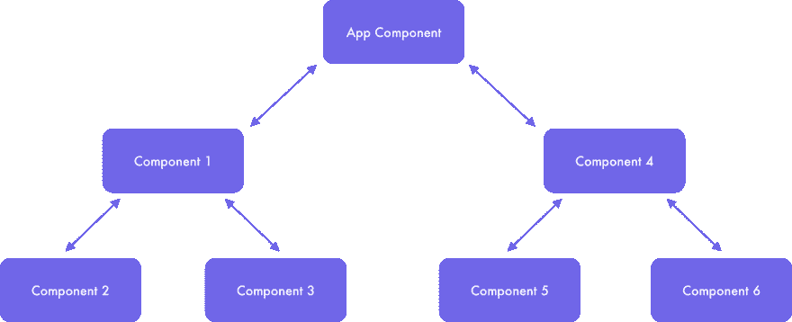
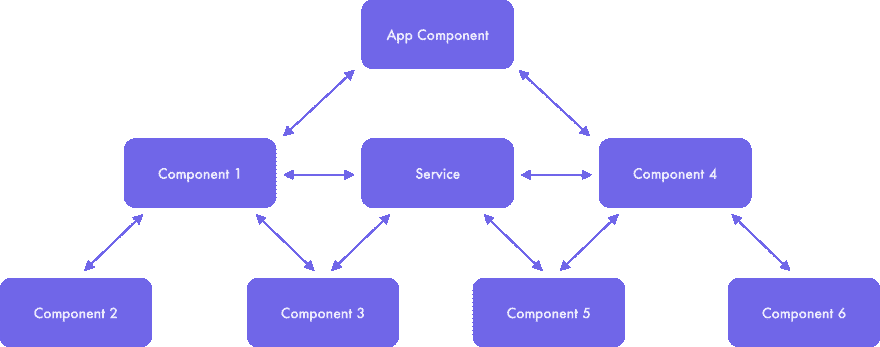
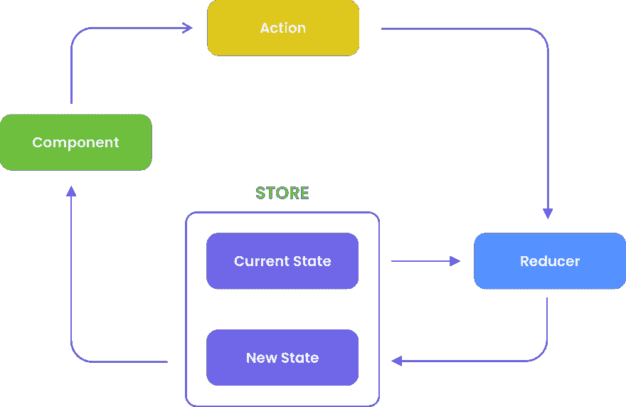

# 用于大规模角度应用的状态管理工具

> 原文：<https://dev.to/2muchcoffeecom/state-management-tools-for-large-scale-angular-applications-1gme>

## [T1】简介](#intro)

初级开发人员大多从事小型应用程序，但当他们开始构建大型应用程序时，他们会遇到许多只有国家管理层才能解决的挑战。

如果您做许多需要大量数据操作的简单事情，那么您可能会面临数据突变和副作用的出现。万一你没有太多的时间来解决诸如疲劳错误和糟糕的应用程序性能之类的问题，你最好了解状态管理以及你将如何从中受益。

随着我们的团队与 Angular 合作，我们已经经历了大型应用程序开发的相同方式，并将考虑 Angular 范围内处理状态管理的所有选项。

本文为您提供了关于在构建大型 web 应用程序时如何选择最佳状态管理选项的基本意见。

## 角度状态管理的选项

[](https://res.cloudinary.com/practicaldev/image/fetch/s--f2HpAkQo--/c_limit%2Cf_auto%2Cfl_progressive%2Cq_auto%2Cw_880/https://thepracticaldev.s3.amazonaws.com/i/16ycub5qgy2mswpgl6oq.png)

Angular 为我们提供了 2 个内置状态功能选项，以及 2 个更强大、更高效的选项。让我们逐一考虑一下:

```
<ol type="1">
    <li><p align="justify">Through hierarchical component’s interaction, typically use of “smart” and “dumb” components via input bindings and custom events.</p></li>
<li><p align="justify">Through Angular services by using simple variables and Promises.</p></li>
<li><p align="justify">Through Observable data services.</p></li> 
```

*   通过 Redux 模式。

### 分层组件的交互

> Angular 有一个简单明了的交互结构:“有状态”的父组件将数据委托给“无状态”的子组件。它的 pro 正在测试简单性和透明性:如果一个父组件发生了一些变化，您可以很容易地跟踪到哪个子组件受到了影响(见图 1)。

[](https://res.cloudinary.com/practicaldev/image/fetch/s--EsRLuoo9--/c_limit%2Cf_auto%2Cfl_progressive%2Cq_auto%2Cw_880/https://thepracticaldev.s3.amazonaws.com/i/ft3yf1smihyl93wqs0oi.png)

图片 1

如果你的应用很简单，这是一个很好的解决方案。一旦这个应用程序的架构变得更加复杂，或者如果您想要通过 Angular services 在单独的模块/组件之间共享数据，这个过程就会变得令人困惑(见图 2)。

[](https://res.cloudinary.com/practicaldev/image/fetch/s--GoKPK8mS--/c_limit%2Cf_auto%2Cfl_progressive%2Cq_auto%2Cw_880/https://thepracticaldev.s3.amazonaws.com/i/ryqxiuu93yxwt8aeiu90.png)

图片 2

### 角服务，变数&承诺

> 目前的方法既有优点也有缺点。可以使用这种方法，但是只能在非常简单的应用程序中使用。我们来解释一下这种说法的理由。

当谈到大型应用程序时，使用这种方法会有一些问题。首先，它出现在使用简单变量进行临时数据保存时。不可能通过 Angular services 同时并超时地监控多个独立组件中的数据变化。此外，在一个组件中引用同一个数据实例的可能性很大，这会导致整个应用程序出现不可预测的问题和后果。

第二个缺点是承诺。众所周知，Angular 提供了对 Observables 的支持，这有助于处理多个值，使用单个值的承诺看起来像是一种倒退！

*承诺的坏处:*

*   不可能在每次需要的时候都运行 Promise，因为它会立即执行，而且只执行一次——在开始的时候；

*   您只能从 Promise 获得一个值或一条错误消息；

*   您不能取消从承诺发起的请求，例如，当我们按下按键时，对按键事件进行搜索的 HTTP 请求将被执行多次；

*   当你试图重新获得一个失败呼叫的重试能力时——这可能导致回调地狱。

从上面可以看出，承诺在大规模应用中存在问题，此外，与可观察到的模式相比，我们失去了大量的功能。

上述内置方法可能适用于小型应用程序。让我们想象一下，我们的应用程序正在增长，并且有很多组件。这就是为什么我们要考虑另一个内置的角度工具箱——RxJS。

### 可观测数据服务-带 RxJS 的角度服务

> RxJS 可能是解决承诺和数据随时间变化问题的好办法。让我们讨论一下什么是可观察的数据服务。这些数据流在创建应用程序和借助多角度服务(singletons)管理应用程序状态时提供了更高的灵活性。

与庞大的第三方库商店相比，可观察商店模式是一个更好的解决方案，对简单的应用程序更有用。但是这种方法也有缺点。如果您正在开发一个应用程序，并试图执行自定义状态管理，您将错过这种方法中的统一和集中的系统。

这里有一个简单的应用程序，它是在 Angular 5 和 RxJS 5.5.11 版本上编写的。这款应用有三条主要路线:

*   客户——有一个详细的客户列表。

*   产品-有一个详细的产品列表。

*   发票-有一份发票及其详细信息的清单。

    此外，用户可以添加新发票，以及查看、编辑和删除特定发票。

```
@Injectable()
export class InvoicesService {
  passInvoicesRequest: Subject<any> = new Subject();
  invoicesList$: ConnectableObservable<Invoice[]>;
  invoicesListCombined$: Observable<Invoice[]>;
  invoicesCollection$: ConnectableObservable<Invoice[]>;

  addInvoice$: Subject<Invoice> = new Subject();
  addInvoiceToCollection$: Observable<any>

  deleteInvoice$: Subject<string> = new Subject();
  deleteInvoiceOpenModal$: Subject<string> = new Subject();
  deleteInvoiceFromCollection$: Observable<Invoice[]>;
  deleteInvoiceModal$: ConnectableObservable<Invoice>;

  constructor(
    private httpClient: HttpClient,
    private customersService: CustomersService,
    private productsService: ProductsService,
    private modalBoxService: ModalBoxService,
  ) {
    // get initial invoices collection
    this.invoicesList$ = this.passInvoicesRequest.pipe(
      mergeScan(acc => acc ? Observable.of(acc) : this.getInvoicesRequest(), null),
    ).publishReplay(1);
    this.invoicesList$.connect();

    // add customer info to initial invoices collection
    this.invoicesListCombined$ = combineLatest(
      this.invoicesList$,
      this.customersService.customersList$.pipe(take(1))
    ).pipe(
      map(([invoices, customers]) => invoices.map(invoice =>
        ({
          ...invoice,
          customer: customers.find(customer => invoice.customer_id === customer._id),
        }))
      ),
    );

    // add a new invoice to a collection
    this.addInvoiceToCollection$ = this.addInvoice$.pipe(
      switchMap(newInvoice => this.invoicesCollection$.pipe(
        withLatestFrom(this.customersService.customersList$),
        map(([invoices, customers]) =>
          [
            ...invoices,
            {
              ...newInvoice,
              customer: customers.find(customer => newInvoice['customer_id'] === customer._id)
            },
          ]
        ),
        take(1),
      ))
    );

    // delete an invoice from collection
    this.deleteInvoiceFromCollection$ = this.deleteInvoice$.pipe(
      switchMap(id => this.invoicesCollection$.pipe(
        map(invoices => invoices.filter(invoice => invoice._id !== id)),
        take(1),
      ))
    );

    // open delete-invoice modal window and send delete request to DB by confirm from user
    this.deleteInvoiceModal$ = this.deleteInvoiceOpenModal$.pipe(
      mergeMap(id => this.modalBoxService.confirmModal('Are you sure you want to delete an invoice?').pipe(
        filter(choice => !!choice),
        mapTo(id),
      )),
      switchMap(id => this.deleteInvoiceRequest(id)),
      tap(invoices => this.modalBoxService.confirmModal(`Invoice number ${invoices._id} has been deleted`, false)),
    ).publishReplay(1);
    this.deleteInvoiceModal$.connect();

    // main invoices collection to display
    this.invoicesCollection$ = Observable.merge(
      this.invoicesListCombined$.pipe(take(1)),
      this.addInvoiceToCollection$,
      this.deleteInvoiceFromCollection$,
    ).publishReplay(1);
    this.invoicesCollection$.connect();
  }
  getInvoicesRequest() {
    return this.httpClient.get<Invoice[]>('invoices');
  }
  getInvoices() {
    this.passInvoicesRequest.next();
    return this.invoicesList$;
  }
  deleteInvoiceRequest(id) {
    return this.httpClient.delete<Invoice>(`invoices/${id}`).pipe(
      tap(deletedInvoice => this.deleteInvoice$.next(deletedInvoice._id))
    );
  }
} 
```

我们应该提到，这种方法依赖于纯 RxJS 流。

第一步是从 invoicesList$ stream 中的 API 获取数据，然后将其值(发票的集合)传递给 invoicesListCombined$ stream(它包含在 customers 服务中声明的 customersList$ stream(客户的集合))。这个流只是通过将客户信息附加到发票上来转换每张发票。

然后，我们将根据规范在发票中执行功能，并能够在未来扩展它。

因此，第二步是创建 invoicesCollection$ base 流，它在一个模板中有一个异步订阅，用于向用户显示整个发票列表。

正如您所看到的，这个流是用另外两个流扩展的:addInvoiceToCollection$和 deleteInvoiceFromCollection$，它们相应地转换主 invoicesCollection$流的数据。

这种方法不会像你想象的那样简单，我们会告诉你为什么。

*   要使用它，你应该非常了解 RxJS 运算符；

*   您必须定义哪些流应该是“热的”、“冷的”或“热的”，以及它们是否在其他服务/组件中重用；

*   这很容易混淆，之后，你将不得不在调试上做很多工作；

*   这种方法的主要缺点是它只能在当前的服务中扩展，并且不能重用。原因是，如果处理其他数据，您将不得不重复和修改其他服务中的就绪代码。

虽然上面提到的方法工作得非常快，但我们试图找到一种更有效的解决方案，可以对整个应用程序进行扩展和重用。我们花了一些时间找到了这样一个解决方案，不幸的是不值得。该解决方案应遵循 DRY 原则，并通过 Angular 应用程序使状态实现完全可重用，这就是为什么我们首先创建了一个通用类型类(例如，类 StateManagement)。

其次，我们在这个类中添加了一个简单的集合$ stream 它将代表未来的数据集合。每次通过“new”操作符调用 StateManagement 类时，都会用集合$ stream 中的新数据创建该类的一个新实例。

```
export class InvoiceService {
    state: StateManagement<Invoice>;
constructor() {
this.state = new StateManagement<Invoice>();
// this.state.collection$ would contain collection of invoices
}
}
... 
```

> 然后，我们在类中添加了持久存储的基本 CRUD 函数，因为我们希望将来能够转换数据。因此，与前面的例子相比，所有负责管理应用程序状态的代码都只在一个地方声明。这可以被称为一个显著的增强，但是在这里也应该提到这种方法中出现的两个主要问题:
> 
> 1.  **组合不同的独立状态**——不幸的是，很容易与整个应用程序中的许多“组合测试”混淆。由于这个问题，代码变得更加复杂，可读性更差。
>     
>     
> 2.  **顺序请求和捕获/处理错误**例如，我们希望获得用户的状态，然后根据当前用户 Id 获得特定发票的状态。随着“StateManagement”类的统一，为这个特定的请求找到一个合适的位置并捕捉/处理它的错误就成了一个问题。让我们想象一下，我们的应用程序正在成长并获得新的功能。我们应该在哪里添加更多独立的顺序请求？根本不存在我们代码的一致性问题。

然而，可观察数据服务是一种很好的方法和强大的解决方案，有助于使用 Angular 的内置特性。你只需要考虑以下几点:

1.  你应该很擅长使用 RxJS 库和可观察模式。你应该知道并区分“冷”、“暖”和“热”的可观察值。你要知道如何把一个转化成另一个，什么时候用，用哪一个。

2.  捕捉/处理错误和测试应用程序的过程并不容易——要弄清楚它是否按照规范运行是相当复杂的。

3.  请记住，每个解决方案都是非常定制的，这就是为什么其他开发人员应该需要时间来理解和维护它，特别是如果我们谈论大型应用程序。

如上所述，这种方法存在一些问题。为了不做不必要的工作，我们正在寻找另一个状态管理解决方案，最引人注目的是 REDUX。

### 用 RxJS 还原模式

> [](https://res.cloudinary.com/practicaldev/image/fetch/s--_PnjLHpx--/c_limit%2Cf_auto%2Cfl_progressive%2Cq_auto%2Cw_880/https://thepracticaldev.s3.amazonaws.com/i/toqdpl5tu53fw0g2qawv.png)

正如文档中所描述的，Redux 是“JavaScript 应用程序的可预测状态容器”。当数据仅在一个方向上移动时，它提供了一个容易且非常简单的解决方案，这意味着数据流是非常可预测且明确的。

*以下是必要的定义:*

*   用户可以与之交互的组件视图模板；

*   动作-定义(分派)要进行的状态改变；

*   减压器——一个纯粹的功能，意思是，它不产生副作用，它具有访问当前状态的能力；

*   选择器-定义从存储中获取哪些特定数据；

*   effect——处理所有异步的或应用程序之外的事情。

[](https://res.cloudinary.com/practicaldev/image/fetch/s--JYohbic9--/c_limit%2Cf_auto%2Cfl_progressive%2Cq_auto%2Cw_880/https://thepracticaldev.s3.amazonaws.com/i/wnr440g7avlr74tyhwh6.png)

图片 3

也许，这看起来很困难，也很费时间，因为你要建立应用程序的必要结构，还要写很多样板代码。但是让我们用这个小例子来弄清楚它是如何工作的，这个小例子有助于阐明一切，并展示了这种方法的好处。

当用户单击组件视图模板中的按钮时，相应的操作将被分派到存储区。当动作启动时，Reducer 从动作中获取当前状态和数据，然后从动作中带回新的状态。Reducers 不存储或改变状态——它们只是获取以前的状态和动作，然后返回新的状态。

*我们来考虑一下 Redux 的优势:*

当您维护存储中的所有状态并使用异步管道连接到视图时，您就能够控制更改检测，从而大大提高企业应用程序的性能。

此外，Redux 为我们提供了用商店的 select 方法调用的选择器(图 4)

[](https://res.cloudinary.com/practicaldev/image/fetch/s--KOK7V8QS--/c_limit%2Cf_auto%2Cfl_progressive%2Cq_auto%2Cw_880/https://thepracticaldev.s3.amazonaws.com/i/0i5o2ec9zgbimj9h3e7h.png)

图片 4

这个存储的 select 方法有助于在返回流的选择器的帮助下获得当前状态。最后一个函数会在状态改变时返回值。这有助于组件得到通知并从存储中接收最新的数据版本。

从上述方案中可以看出，数据流一点也不复杂，而且非常透明。原因是数据总是来自一个来源。

*   再说一个优点。我们已经在上面提到过，在可观测数据服务方法中有这样一个问题，即不同独立状态的组合。但是选择器很容易解决这个问题。它们可以传递和聚集状态的各个片段，以创建特定组件需要的数据。

*   第三个优点是解决了顺序请求的问题。看链接及其描述:效果监听一个动作，执行一个或一些动作。这些被其他一些运行新动作的效果监听，被 reducers 一遍又一遍的处理。

这个循环可以有任何长度，如图 5 所示。

[](https://res.cloudinary.com/practicaldev/image/fetch/s--JbFtO_65--/c_limit%2Cf_auto%2Cfl_progressive%2Cq_auto%2Cw_880/https://thepracticaldev.s3.amazonaws.com/i/v14hrpumpwhvtotd82vu.png)

图片 5

*   除了系统定义良好的事实之外，我们还应该提到 Redux 方法的第四个优点:**业务逻辑和呈现是不同的**。开发人员可以相互独立地测试这些部分。

测试我们的逻辑转化为测试动作、选择器，当然还有 Reducers，它们本身是纯函数，允许我们通过断言函数返回特定数据来测试复杂的 ui。

除此之外，你还可以得到一个很棒的调试进程的 npm 或者浏览器扩展——Redux dev tools，它可以为你节省很多时间。检查整个工作流是可能的，因为可以观察到每个状态和动作负载。如果从减速器发回错误信息，您可以很容易地找到该错误出现在哪个动作上。

总的来说，与定制状态管理方法相比，Redux 方法有很多优点。当然，你需要一些时间来学习这种方法，但结果是，这绝对是值得的。

## 结论

> 在本文中，我们分享了在几种方法中管理应用程序状态的经验。从字面上看，各有利弊。您应该决定哪一个满足您的需求，考虑用例、您的组织的需求和限制。

对于我们来说，Redux 方法可能是最好的选择之一，因为它的功能和单向数据流。应用程序流程变得更加可预测。其他优点是可伸缩性、可重用性，此外，很容易理解数据如何在所有组件之间共享以及通常存储在哪里。

那么，只有当您确定您的项目需要状态管理工具时，您才应该选择 Redux。否则，您可以选择本文中考虑了主要利弊的其他选择。

喜欢吗？我们已经尽力了！去我们的 <u>[博客](https://2muchcoffee.com/blog/)</u> 找更多有用的文章。