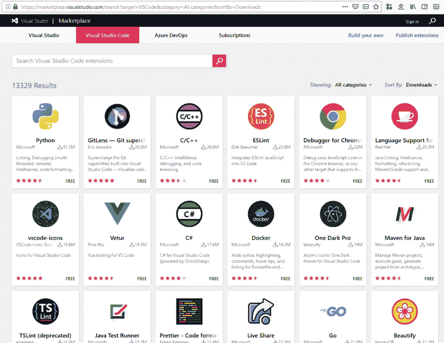
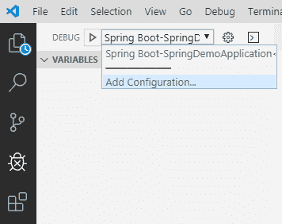
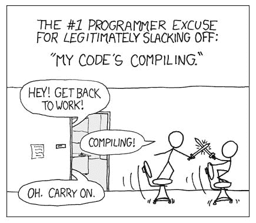

# 做一个调试侦探！

> 原文:[https://dev.to/mattcobley/be-a-debugging-detective-2nif](https://dev.to/mattcobley/be-a-debugging-detective-2nif)

> "调试就像是犯罪电影中的侦探，而你同时也是凶手."菲利普·福特

不管你现在处于职业生涯的哪个阶段，这是一个众所周知的事实，编程中没有什么是第一次就成功的。因此，当你写了一些绝对应该工作的很棒的代码时，当你看到屏幕上闪现的错误消息时，你可能会绝望。你从哪里开始？！

但是不要放弃希望，大胆的基于文本的冒险者，通过一些简单的指导，你也可以成为一名调试侦探！！

###### *免责声明:可能是为了戏剧效果而夸张

* * *

## TL；速度三角形定位法(dead reckoning)

通过以下方式可以简化调试:

1.  了解哪些工具适用于您的语言/平台，并学习如何使用它们
2.  尽可能使用专用调试器
3.  找到问题的切入点，并从那里开始。总是从你对问题的了解开始
4.  从您的调查中快速排除代码段，并将您的搜索范围缩小到可能有责任的代码。跟随你的代码“掉进兔子洞”到其他文件/模块/组件。不要做假设
5.  编写单元测试并重构你的代码，使之更“干净”，更易测试和维护。有一项工作和明确名称的小方法是最好的
6.  通过减少构建时间来最小化您的编辑/构建/调试周期，并在每个周期中调查您的 bug 可能出现的多个位置
7.  慢慢来，不要轻视代码块，直到你确信它们能按预期工作

* * *

*成为一名优秀的调试侦探...*

## 1。了解您的工具，简化您的方法

第一个建议是使用合适的工具，并且熟悉如何使用这些工具。如果你正在编写一个 web 应用程序，你知道如何使用浏览器的开发工具吗？对于后端服务器工作或控制台应用程序，您的 IDE 有内置调试器吗？

有些情况下可能仍然需要使用`print()`或`console.log()`，但是现在有无数的工具和开发环境可用，如果可能的话，内置调试器总是更好的。使用调试器允许您在“断点”处暂停代码的执行，并检查变量在该时间点的值；然后，您可以一次前进一行代码，单步执行或单步执行方法调用，或者直接继续执行到下一个断点。

简而言之，如果有一个内置的调试器可用于您选择的语言/框架，您可能应该使用它，从长远来看，它将为您节省大量的时间和精力——我们都知道，最终我们希望将时间花在为客户增加应用程序的价值上，而不是解决错误。每个人都有自己选择的编辑器或 IDE，但我会花时间推荐 [Visual Studio Code](https://code.visualstudio.com/) ，它是来自微软的[开源](https://github.com/Microsoft/vscode)跨平台编辑器(是的，真的！).尽管名为“Visual Studio ”,但它实际上与“Visual Studio ”(过去缓慢、笨拙、只支持 Windows 的 IDE)没有任何关系。相反，VSCode(众所周知)是一个轻量级编辑器，具有蓬勃发展的扩展生态系统，因此您可以准确地控制您在开发环境中运行的功能。它带有一个内置的 Node.js 调试器，并且具有适用于所有语言和框架的调试器。它甚至有“扩展包”的概念，将相关的扩展捆绑在一起，这样你就可以从一个地方获得你需要的所有工具。

[T2】](https://res.cloudinary.com/practicaldev/image/fetch/s--AnA92arC--/c_limit%2Cf_auto%2Cfl_progressive%2Cq_auto%2Cw_880/https://thepracticaldev.s3.amazonaws.com/i/3z0zxyfv3d7vtcyeqr9y.png)

一些用于调试的有用扩展和扩展包包括:

Node.js(内置)

[Chrome 的调试器](https://marketplace.visualstudio.com/items?itemName=msjsdiag.debugger-for-chrome)(在 VSCode 中而不是在你的浏览器 dev 工具中调试前端 JS)

[Python](https://marketplace.visualstudio.com/items?itemName=donjayamanne.python-extension-pack)

[Java](https://marketplace.visualstudio.com/items?itemName=vscjava.vscode-java-pack)

[Spring Boot](https://marketplace.visualstudio.com/items?itemName=Pivotal.vscode-boot-dev-pack)

[PHP](https://marketplace.visualstudio.com/items?itemName=felixfbecker.php-pack)

[vue . JS](https://marketplace.visualstudio.com/items?itemName=mubaidr.vuejs-extension-pack)
[c#/。网芯](https://marketplace.visualstudio.com/items?itemName=ms-vscode.csharp)

大多数调试器都很容易使用——通过在编辑器中单击要添加断点的代码行旁边的空白处，可以向代码添加断点，然后当您在编辑器中以“调试”模式运行应用程序时，执行将在到达该代码行时停止。知道如何最大限度地利用调试器对于有效地找出那些讨厌的 bug 是至关重要的。

[T2】](https://res.cloudinary.com/practicaldev/image/fetch/s--GpicBqEy--/c_limit%2Cf_auto%2Cfl_progressive%2Cq_auto%2Cw_880/https://thepracticaldev.s3.amazonaws.com/i/pg0lzp3o2jlzitiiskfh.png)

在 VSCode 中，如果您为希望调试的环境安装了适当的扩展，通常只需导航到 debug 视图，从下拉列表中选择 config(如果不存在，则添加一个新的),然后点击 play 按钮即可。然后你会看到一组控件出现在编辑器窗格的顶部，允许你控制应用程序的进度。

[T2】](https://res.cloudinary.com/practicaldev/image/fetch/s--H_P9uezC--/c_limit%2Cf_auto%2Cfl_progressive%2Cq_auto%2Cw_880/https://thepracticaldev.s3.amazonaws.com/i/xe7i9vajb2emuijz6zgr.png)

如果您选择的语言或框架似乎没有可用的调试器，或者如果您需要测试可能只在您正在部署的环境中可用的功能(例如，连接到 AWS S3，您可能无法正常访问)，您可能必须求助于在您的应用程序中打印出语句并多次运行它，以缩小 bug 可能出现的位置。在这种情况下，这里的关键是尽可能快地缩小对 bug 的搜索范围——在您认为可能有问题的代码行之前和之后放置语句，并打印出这些点的变量值以供检查，并通过快速排除代码区域来尝试将到 bug 的距离“减半”。希望你的单元测试已经覆盖了变量值的许多可能的排列。，但是如果您遇到困难，您可以在运行您的应用程序时检查您的方法参数有哪些值，然后编写测试来覆盖这些值，看看您是否可以以这种方式重现该问题——然后您可以专注于更改您的代码以使您的测试通过，以真正的测试驱动开发风格！

*成为一名优秀的调试侦探...*

## 2。找到你的入口，沿着兔子洞走下去

有时候，调试(或其他任何事情)最困难的部分是知道从哪里开始。这将取决于你的语言和框架/库的组合，但是想法是从你**知道**的东西开始。这可能是用户点击的导致错误发生的特定按钮，甚至可能是用户正在查看的页面(或者是遇到问题或正在与之交互的页面区域)。这是您的调试入口点，也是您应该开始调查的地方。

一旦你知道了你的入口点，在你的代码中找到那个页面/部分/按钮/任何东西，并开始在那里插入一些断点——使用错误消息作为线索，但是不要太快忽略任何东西，因为有时错误可能会误导人。使用第 1 节中提到的工具调试您的应用程序，并检查在您单步调试应用程序时发生了什么。当你这样做的时候，试着删除你的代码中那些看起来行为正常的部分，并缩小搜索范围。在这一点上，很有可能你会有第一段代码调用的其他模块/文件/组件，所以你将不得不“钻入兔子洞”，并深入其中。试着坚持同样的原则，消除按预期工作的代码，并隔离出可能出现问题的候选代码。继续这样做，你将有希望把你的问题缩小到你能很好地处理问题的程度。

如果你被困住了，仍然不知道去哪里和看什么，一个好的方法是尝试在你的代码上写一些单元测试(如果你还没有——我希望你已经写了！)以确保它按预期工作。这甚至可能是一个很好的机会来重构你的代码，使其更具可测试性，并且更容易隔离那些可能难以测试或调试的代码区域。请记住，可读性和可维护性通常比用尽可能少的代码行编写代码更重要。完成一项工作并且易于测试和命名良好的小方法是最好的——关于这个主题的更多信息，我**高度推荐“Bob 叔叔”Martin 的“干净的代码”(由 Prentice Hall 出版，ISBN 9780132350884)。**

*成为一名优秀的调试侦探...*

## 3。最大限度减少反馈时间

最后，在我们追求成为一名出色的调试侦探的过程中，我建议尽量减少反馈时间。我这么说是什么意思？调试时尽量减少“停滞时间”是很重要的。这包括构建您的应用程序，在调试模式下运行它(或者不运行，如果您不能使用调试器的话)，获得关于问题所在或问题是什么的任何预感的反馈，然后进行任何代码更改并再次重复该过程。

[T2】](https://res.cloudinary.com/practicaldev/image/fetch/s--qirHOYKl--/c_limit%2Cf_auto%2Cfl_progressive%2Cq_auto%2Cw_880/https://thepracticaldev.s3.amazonaws.com/i/2f1rdo61hoo0kf4bt5ee.jpg)

如果每次都必须从头开始构建应用程序，这会给调试过程增加大量的停滞时间，代码的每个微小变化都会收集越来越多的线索，导致等待、等待、再等待。在这一点上，如果你能做一些事情来减少完成这个周期所花费的时间，这确实是值得一看的:

1)减少构建时间

如果你正在构建一个胖 JAR，你能改变你的过程，只从你的应用程序构建一个普通的 JAR，并在调试时提供 JAR 之外的依赖吗？您能否执行增量构建，而不是每次都构建全部内容，例如。NET Core 作为[这篇](https://developers.redhat.com/blog/2019/04/08/reduce-application-image-build-times-with-net-core-incremental-builds/)文章中的？

2)在每个周期中，尽可能多地尝试解决各种可能性

如果你的编辑/构建/调试周期很长(也许你就是无法缩短构建时间)，试着在每个周期中尽可能多地调查可能性。例如，你可能认为问题是由特定的方法或特定变量的值引起的，但是你知道吗？如果没有，试着保持开放的心态，同时调查代码的其他区域，直到你能够缩小范围。这意味着不必为代码的每一个小改动都运行长时间的构建，从而减少了总的调试时间。

3)慢慢来

这可能看起来不太直观，但是不要太快地从一个断点跳到另一个断点，并假设代码的某些部分是好的——花时间理解每一步发生了什么，并确保它完全是您所期望的。围绕您的代码编写测试来确认这一点，然后您就可以放心地从您的调查中排除这些代码。很容易假设一段代码是好的，跳过它太快，花几个小时看代码的其他部分，却发现你没有足够彻底地研究第一段代码。再次重复，**编写测试来确认你的代码正在做它应该做的事情**

## 总结

希望这篇文章对你有所帮助，你会觉得自己正在成为一名出色的调试侦探。调试有时感觉像是一门黑暗的艺术，但是有了这些提示，你应该能够把精力集中在每次更快更有效地隔离问题所需要的东西上。