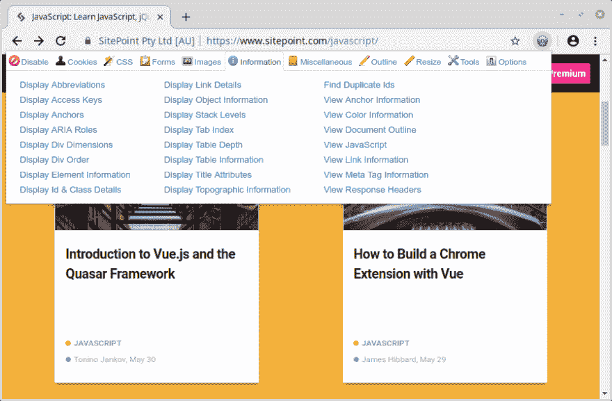
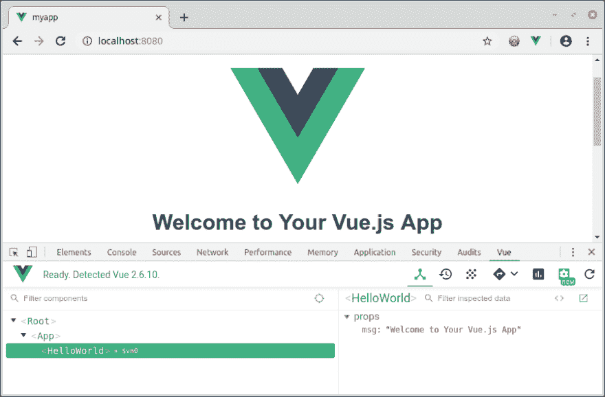
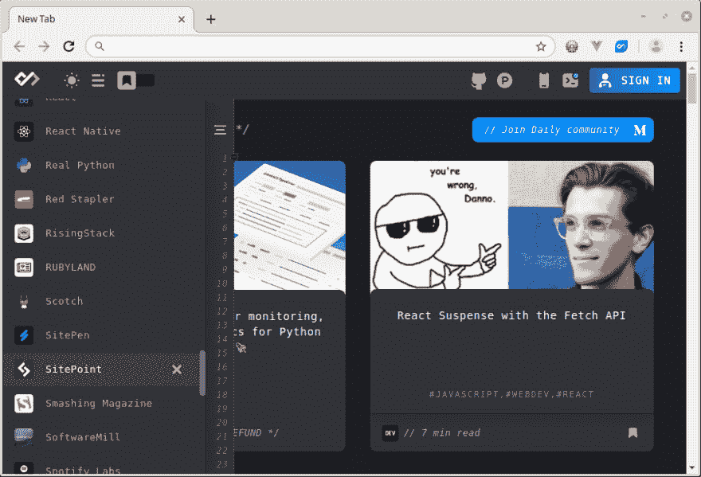
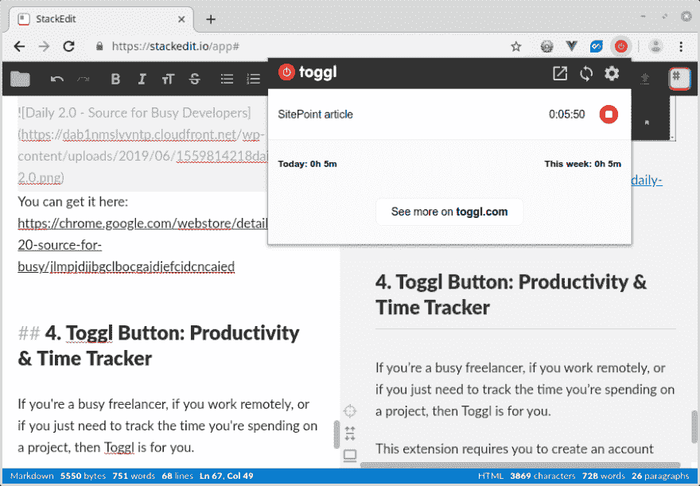
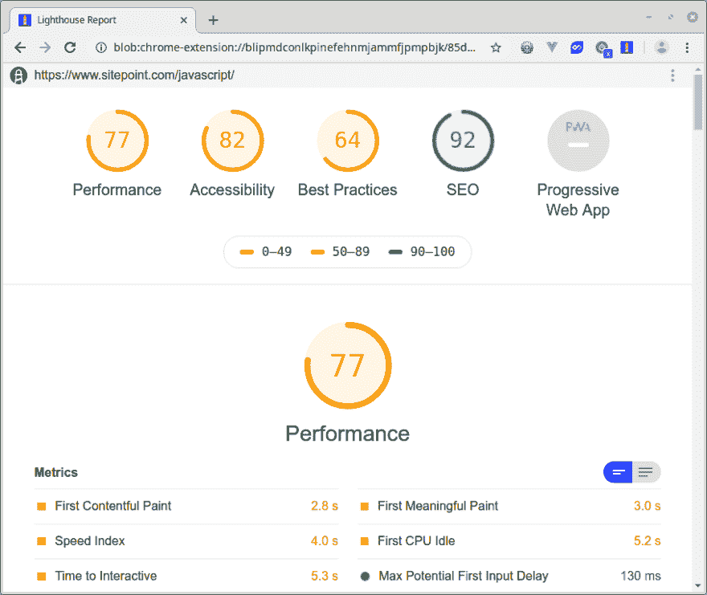
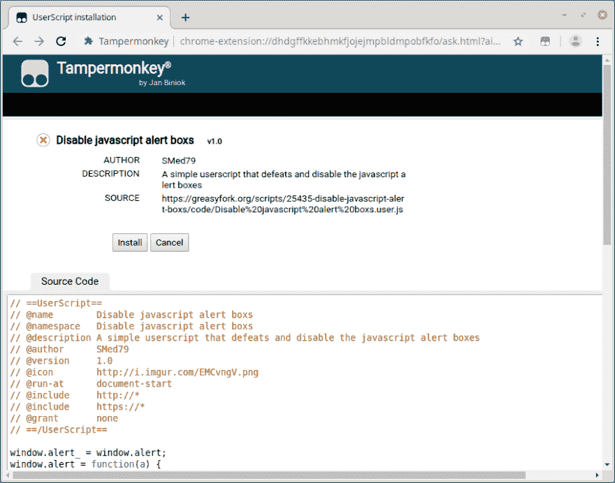

# Web 开发工作流程的 10 大 Chrome 扩展

> 原文:[https://dev . to/sitepointdotcom/10-top-chrome-extensions-for-your-web-development-workflow-2pa 8](https://dev.to/sitepointdotcom/10-top-chrome-extensions-for-your-web-development-workflow-2pa8)

詹姆斯·希巴德。[最初发布于 SitePoint](https://www.sitepoint.com/10-top-chrome-extensions-for-your-web-development-workflow/) 。

作为 web 开发人员，我们工作在一个快节奏的行业中，保持领先有时是一个挑战。这就是为什么我认为我们应该充分利用我们所拥有的任何工具来帮助我们摆脱困境。今天我将向大家展示十个 Chrome 扩展，它们可以优化你的 web 开发工作流程，希望能让你更有效率。

## 什么是 Chrome 扩展？

从 Chrome 的开发者门户网站上可以看到，扩展是可以定制你的浏览体验的小软件程序。这可以是任何东西，从拼写和语法检查，检查你的写作，因为你输入，到密码管理，保存你最喜爱的网站的登录信息。

Chrome 有上千种扩展，所有这些都可以从 Chrome 网上商店免费下载。您可以通过访问浏览器中的以下链接来检查您当前安装了哪些扩展: [chrome://extensions/](https://dev.tochrome://extensions/) 。

## 为什么是 Chrome？

鉴于谷歌 Chrome 浏览器巨大的市场份额(目前为 65%，并且还在上升)，本文主要关注它。也有许多基于 Chrome 的浏览器支持扩展。其中包括 Brave、Vivaldi 和即将推出的 Microsoft Edge。然而，我们应该记住，Chrome 并不是唯一的亮点，这里提到的许多扩展都有与 Firefox 和/或 T2 Opera 等同的版本。

最后，在我们深入研究扩展之前，花点时间记住 Chrome 是 Google 发布的专有软件。众所周知，使用谷歌产品会有一些隐私问题，所以或许可以去 GitHub 看看[未被谷歌搜索的 chromium 项目](https://github.com/Eloston/ungoogled-chromium)。顾名思义，这就是谷歌 Chromium，不与谷歌集成。

## 1。Web 开发人员

我们将从扩展的瑞士军刀开始。Chrome 网上商店拥有超过 100 万用户和 4.5 星评级，Web Developer 是必备的。它在 Chrome 上添加了一个工具栏按钮，点击后会显示出大量可以在任何网页上使用的工具。这些按类别(CSS、表单、图像等)分组，允许你做诸如禁用 JavaScript、用缺失的`alt`属性勾画图像轮廓、调整浏览器窗口大小、验证页面的 HTML、查看页面的 meta 标签信息等等。

[T2】](https://res.cloudinary.com/practicaldev/image/fetch/s--qinkrbb---/c_limit%2Cf_auto%2Cfl_progressive%2Cq_auto%2Cw_880/https://dab1nmslvvntp.cloudfront.net/wp-content/uploads/2019/06/1559637493web-developer.png)

你可以[在这里](https://chrome.google.com/webstore/detail/web-developer/bfbameneiokkgbdmiekhjnmfkcnldhhm)下载。

## 2。您的框架的开发人员工具

如果你正在用 JavaScript 框架开发一个应用，而你没有使用该框架的开发者工具，那么你可能做错了。我用 Vue 举例说明一下。

如果你有一个需要调试的 Vue 应用程序，或者你只是想看看到底发生了什么，你会怎么做？检查页面的源代码会让你看到 Vue 正在渲染的 HTML，但是 Vue 应用程序远不止这些。组件的属性、数据或计算属性呢？或者你的应用程序的状态或路由？你如何检查这些？

好消息是 Vue.js 开发工具已经覆盖了您。只需安装扩展，并在运行 Vue 开发版的页面上打开它，就能看到你的应用程序中到底发生了什么。

[T2】](https://res.cloudinary.com/practicaldev/image/fetch/s--Xoq2XnTb--/c_limit%2Cf_auto%2Cfl_progressive%2Cq_auto%2Cw_880/https://dab1nmslvvntp.cloudfront.net/wp-content/uploads/2019/06/1559638848vue-dev-tools.png)

这里有下载三大框架开发工具的链接。

*   视图
*   [反应](https://chrome.google.com/webstore/detail/react-developer-tools/fmkadmapgofadopljbjfkapdkoienihi)
*   [余烬](https://chrome.google.com/webstore/detail/ember-inspector/bmdblncegkenkacieihfhpjfppoconhi)

## 3。每日 2.0 -繁忙开发人员的资源

由于我们在一个快节奏的行业工作，跟上新闻和动态有时会是一个挑战。进入 Daily 2.0，这是一个扩展，它从互联网上收集最新的 web 开发和技术帖子，并在您的新标签页上以一种有吸引力的砖石风格呈现它们。

该扩展易于使用。当你安装它的时候，你会被要求从一堆你感兴趣的类别中挑选一个，剩下的由 Daily 2.0 完成。将鼠标悬停在新标签页的侧边栏上，您可以根据标签和来源过滤您的提要。

[T2】](https://res.cloudinary.com/practicaldev/image/fetch/s--epLU2qSz--/c_limit%2Cf_auto%2Cfl_progressive%2Cq_auto%2Cw_880/https://dab1nmslvvntp.cloudfront.net/wp-content/uploads/2019/06/1559814218daily-2.0.png)

你可以在这里得到它。

## 4。Toggl 按钮:生产力&时间跟踪器

如果你是一个忙碌的自由职业者，如果你远程工作，或者如果你只是需要跟踪你在一个项目上花费的时间，那么 Toggl 就是你的选择。

此扩展要求您在使用之前创建一个帐户。登录后，您可以使用存储在 Toggl 帐户中的所有数据快速轻松地实时跟踪生产率。它带有一个内置的 Pomodoro 计时器，以及一整套互联网服务的集成(如 GitHub、Trello 和 Slack)。我最喜欢的功能之一是，当你空闲时，它会弹出一个通知，让你放弃时间。

[T2】](https://res.cloudinary.com/practicaldev/image/fetch/s--FpkRRyhL--/c_limit%2Cf_auto%2Cfl_progressive%2Cq_auto%2Cw_880/https://dab1nmslvvntp.cloudfront.net/wp-content/uploads/2019/06/1559815145toggl.png)

Toggl 可以在这里下载[。](https://chrome.google.com/webstore/detail/toggl-button-productivity/oejgccbfbmkkpaidnkphaiaecficdnfn)

## 5。灯塔

Lighthouse 是一个开源的自动化工具，用于提高网页的性能和质量。你可以通过 Chrome 网络商店安装它，或者从 Chrome 版本 60 开始，你可以直接从浏览器的 DevTools 的*审计*标签运行它(按 F12 并选择*审计*)。

打开 Lighthouse 后，点击*生成报告*，并选择要包含的审计类别。Lighthouse 将对页面运行所选的审计，并生成一份关于页面表现如何的报告。从那里，您可以使用失败的审计作为如何改进页面的指标。每个审计还包括链接到进一步阅读和潜在的修复。

Lighthouse 是谷歌出品的，想必和他们的搜索引擎用的是同样的排名因素。这意味着它可以为你提供一些关于如何优化你的网站的最佳建议。

[T2】](https://res.cloudinary.com/practicaldev/image/fetch/s--WzSldqE5--/c_limit%2Cf_auto%2Cfl_progressive%2Cq_auto%2Cw_880/https://dab1nmslvvntp.cloudfront.net/wp-content/uploads/2019/06/1560006297lighthouse.png)

这里可以[抢。](https://chrome.google.com/webstore/detail/lighthouse/blipmdconlkpinefehnmjammfjpmpbjk)

## 6。OneTab

所以情况是这样的。你正在开发你的网络应用程序，突然你遇到了一个意想不到的错误。你花了几个小时追踪一个补丁，当你完成的时候，你已经在浏览器中打开了一大堆标签。将这些添加到你昨天正在做的项目的标签中，以及所有你还没有抽出时间阅读的文章中，很快你就会发现自己处于标签混乱中。

这就是 OneTab 扩展可以帮助您重新获得一定程度的理智的地方。每当您发现自己有太多的选项卡时，单击 OneTab 图标将所有选项卡转换为一个列表。当您需要再次访问这些选项卡时，可以单独恢复它们，也可以一次全部恢复。如果使用得当，这个扩展可以大大提高您的工作效率。

[T2】](https://res.cloudinary.com/practicaldev/image/fetch/s--IHRzyqs_--/c_limit%2Cf_auto%2Cfl_progressive%2Cq_auto%2Cw_880/https://dab1nmslvvntp.cloudfront.net/wp-content/uploads/2019/06/1560007421one-tab.png)

OneTab 可以从这里下载[。](https://chrome.google.com/webstore/detail/onetab/chphlpgkkbolifaimnlloiipkdnihall)

## 7。CSS 窥视者

CSS Peeper 自称是为设计师量身定制的 CSS 查看器，允许您提取 CSS 并构建漂亮的样式指南。它允许您检查页面上任何元素的 CSS 规则，并以简单但组织良好的方式呈现所有样式信息。它还列出了一个页面的所有颜色和图像，可以复制到您的剪贴板，或按一下按钮导出。

这个扩展比浏览器内置的 *Inspect Element* 功能更容易使用，唯一的缺点是不能动态改变元素的样式。

[T2】](https://res.cloudinary.com/practicaldev/image/fetch/s--VRmV-TDE--/c_limit%2Cf_auto%2Cfl_progressive%2Cq_auto%2Cw_880/https://dab1nmslvvntp.cloudfront.net/wp-content/uploads/2019/06/1560092741css-peeper.png)

你可以在这里找到 CSS 窥视者。

## 8。用户 CSS

这个扩展与 CSS Peeper 密切相关，提供了一个快速简单的方法来添加自定义 CSS 网页。安装后，用户 CSS 很容易使用——您可以单击扩展图标，在滑出的侧面板中输入您的样式。

这个扩展的一个很好的特性是你的自定义 CSS 样式是持久的。这意味着你还可以使用它来永久隐藏你经常访问的网站上的分散注意力的功能，例如 Twitter 上的趋势小工具。

[T2】](https://res.cloudinary.com/practicaldev/image/fetch/s--eT_1e5v0--/c_limit%2Cf_auto%2Cfl_progressive%2Cq_auto%2Cw_880/https://dab1nmslvvntp.cloudfront.net/wp-content/uploads/2019/06/1560093680user-css.png)

你可以[在这里](https://chrome.google.com/webstore/detail/user-css/okpjlejfhacmgjkmknjhadmkdbcldfcb)下载用户 CSS。

## 9。Web 开发人员清单

即使在最好的情况下，开始一个新项目也会有压力——有一大堆事情需要记住和协调。例如，你记得验证网站的 HTML 吗？你检查搜索引擎优化了吗？可访问性检查呢？你用谷歌页面速度查过了吗？这样的例子不胜枚举。

这就是 Web Developer Checklist 扩展可以提供帮助的地方。它分析违反最佳实践的网页，并允许您在将网站交给客户之前发现网站中的问题区域。该扩展是优秀的[WebDevChecklist.com](http://webdevchecklist.com/)的伴侣。

[T2】](https://res.cloudinary.com/practicaldev/image/fetch/s--QCPHPlnn--/c_limit%2Cf_auto%2Cfl_progressive%2Cq_auto%2Cw_880/https://dab1nmslvvntp.cloudfront.net/wp-content/uploads/2019/06/1560096059web-developer-checklist.png)

Web 开发者清单[可以在这里](https://chrome.google.com/webstore/detail/web-developer-checklist/iahamcpedabephpcgkeikbclmaljebjp)下载。

## 10 个。卫生棉条

用户脚本是允许你改变网页行为的小计算机程序。这些可以用于各种任务，例如根据您的偏好调整站点布局，为页面添加额外的功能，或者自动化重复的任务。

Tampermonkey 是一个用户脚本管理器——一个允许你管理和运行用户脚本，以及创建你自己的用户脚本的扩展。正是这最后一项功能使它在列表中赢得了一席之地，因为您可以使用 Tampermonkey 来有效地简化您的 web 开发工作流。例如，我最近在做一个需要测试的大型表单。我编写了一个 Tampermonkey 脚本来代替每次手动输入值，省去了无数次击键。

[T2】](https://res.cloudinary.com/practicaldev/image/fetch/s--mwQuXxrR--/c_limit%2Cf_auto%2Cfl_progressive%2Cq_auto%2Cw_880/https://dab1nmslvvntp.cloudfront.net/wp-content/uploads/2019/06/1560097180tampermonkey.png)

Tampermonkey 可以在这里找到[。](https://chrome.google.com/webstore/detail/tampermonkey/dhdgffkkebhmkfjojejmpbldmpobfkfo)

## 结论

在这篇文章中，我们看了十个我最喜欢的 Chrome 扩展，它们可以促进你的 web 开发工作流程。我希望这已经给了你一些启发，但是请记住这个列表决不是详尽的。

如果我错过了你最喜欢的扩展，或者你有宝贵的东西与其他读者分享，我会很高兴在下面的评论中听到你的意见。

感谢阅读。