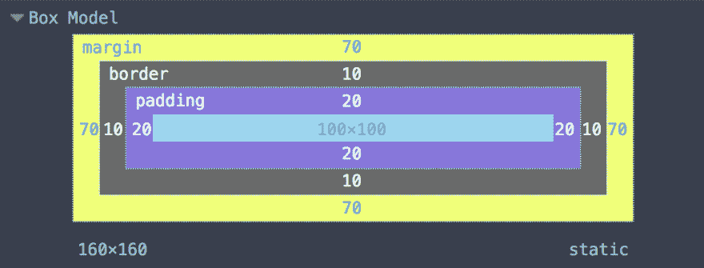

# 让我们来了解一下 ResizeObserver👋🏼

> 原文:[https://dev . to/ya shints/let-s-get-to-know-the-resize observer-lae](https://dev.to/yashints/let-s-get-to-know-the-resizeobserver-lae)

[Resize Observer](https://developer.mozilla.org/en-US/docs/Web/API/ResizeObserver) API 是另一个很棒的 JavaScript API，它可以让你在元素大小改变时得到通知。但是在元素层面上。

## [](#the-what)那个啥

元素大小可能改变的最常见情况是调整视口大小时。或者就移动设备而言，方向改变。

在`ResizeObserver`之前，你必须连接到`window.onresize`或者使用`window.resize`来判断一个元素的大小是否改变了。这是非常低效的，因为它会触发如此多的事件。

这个 API 可以派上用场的另一个场景是当您动态地添加/删除一个元素时，在这种情况下，父元素的大小发生变化，而不是视口。

> `ResizeObserver`接口报告对`Element`的内容或边界框，或者`SVGElement`的边界框的尺寸的改变。

内容框是可以放置内容的框，即边框减去填充和边框宽度。边框框包含内容、填充和边框。

[T2】](https://res.cloudinary.com/practicaldev/image/fetch/s--8G-QY1_Z--/c_limit%2Cf_auto%2Cfl_progressive%2Cq_auto%2Cw_880/https://thepracticaldev.s3.amazonaws.com/i/zssfifqzp764x66mzmjj.png)

## [](#enough-talking-shoe-me-the-code)说够了，给我鞋码😉

最简单的形式是，您可以通过实例化一个新的 API 实例并向其传递回调来使用`ResizeObserver`。

```
const myObserver = new ResizeObserver(entries => {
  // iterate over the entries, do something.
}); 
```

<svg width="20px" height="20px" viewBox="0 0 24 24" class="highlight-action crayons-icon highlight-action--fullscreen-on"><title>Enter fullscreen mode</title></svg> <svg width="20px" height="20px" viewBox="0 0 24 24" class="highlight-action crayons-icon highlight-action--fullscreen-off"><title>Exit fullscreen mode</title></svg>

这本身不会有太大帮助，但是如果你在实例上调用`observe`方法并给它一个元素，它将开始捕捉它的大小变化并调用你的回调函数。

```
const myEl = document.querySelector('.my-element');

myObserver.observe(myEl); 
```

<svg width="20px" height="20px" viewBox="0 0 24 24" class="highlight-action crayons-icon highlight-action--fullscreen-on"><title>Enter fullscreen mode</title></svg> <svg width="20px" height="20px" viewBox="0 0 24 24" class="highlight-action crayons-icon highlight-action--fullscreen-off"><title>Exit fullscreen mode</title></svg>

现在，每当我的元素的大小改变时，它将触发回调，瞧。

## [](#callback-input-object)回调输入对象

当您将回调传递给 API 的构造函数时，您得到的是如下所示的对象数组:

[T2】](https://res.cloudinary.com/practicaldev/image/fetch/s--wUuUMbzI--/c_limit%2Cf_auto%2Cfl_progressive%2Cq_auto%2Cw_880/https://thepracticaldev.s3.amazonaws.com/i/1hm7uy1rmo7i85gg12im.JPG)

可以看到，你得到的对象有两个属性， **`contentRect`** 和`target`。目标很明显，就是 DOM 元素本身。与元素的`getBoundingClientRect`不同， **`contentRect`** 上的`width`和`height`值不包括填充。

## [](#demo)演示

使用这个 API 可以做很多事情，从根据元素的大小改变字体大小，到在大小改变时改变样式。下面是一个我根据元素大小改变边界无线电的例子。调整窗口大小，看看会发生什么😎。

[https://codepen.io/yashints/embed/QWLaMej?height=600&default-tab=result&embed-version=2](https://codepen.io/yashints/embed/QWLaMej?height=600&default-tab=result&embed-version=2)

## [](#demo-explained)演示解释

演示并不复杂，我们有一个`div`，它有两个孩子:

```
<div class="boxes">
  <div class="box"></div>
  <div class="box"></div>
</div> 
```

<svg width="20px" height="20px" viewBox="0 0 24 24" class="highlight-action crayons-icon highlight-action--fullscreen-on"><title>Enter fullscreen mode</title></svg> <svg width="20px" height="20px" viewBox="0 0 24 24" class="highlight-action crayons-icon highlight-action--fullscreen-off"><title>Exit fullscreen mode</title></svg>

我们添加了一些样式，这样我们就可以看到变化:

```
.boxes {
  display: flex;
  flex-wrap: wrap;
  width: 40vw;
  margin-bottom: 50px;
}
.box {
  height: 200px;
  flex-shrink: 1;
  flex-grow: 1;
  margin: 10px;
  box-sizing: border-box;
  border: 3px solid black;
} 
```

<svg width="20px" height="20px" viewBox="0 0 24 24" class="highlight-action crayons-icon highlight-action--fullscreen-on"><title>Enter fullscreen mode</title></svg> <svg width="20px" height="20px" viewBox="0 0 24 24" class="highlight-action crayons-icon highlight-action--fullscreen-off"><title>Exit fullscreen mode</title></svg>

一旦我们完成了，我们添加我们的小片段让观察者通知我们变化:

```
const ro = new ResizeObserver(entries => {
  for (let entry of entries) {
    entry.target.style.borderRadius =
      Math.max(0, 250 - entry.contentRect.width) +
      'px'
  }
})
console.log('horay');
// Only observe the 2nd box
ro.observe(
  document.querySelector('.box:nth-child(2)')
) 
```

<svg width="20px" height="20px" viewBox="0 0 24 24" class="highlight-action crayons-icon highlight-action--fullscreen-on"><title>Enter fullscreen mode</title></svg> <svg width="20px" height="20px" viewBox="0 0 24 24" class="highlight-action crayons-icon highlight-action--fullscreen-off"><title>Exit fullscreen mode</title></svg>

在回调中，我们简单地根据元素的宽度改变边界无线电，瞧。

## [](#browser-support)浏览器支持

浏览器支持大多数主流浏览器都有，我们有 Chrome 64+，Firefox 69+，Microsoft Edge 76 和 Safari 13-TP 支持 API，但对移动浏览器的支持很差。

享受探索 API 的乐趣，用它做一些很酷的事情😍。