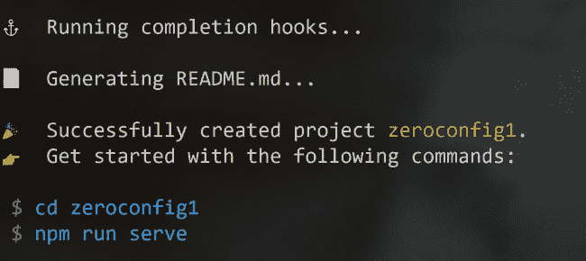

# 看看 Zeit 的零配置和无服务器平台

> 原文：<https://dev.to/raymondcamden/a-look-at-zeit-s-zero-config-and-serverless-platform-22ni>

有一段时间，我“为了好玩”而去托管静态网站的服务数量激增。虽然我在 [Netlify](https://www.netlify.com/) 上主持我的博客，并绝对认为它是静态网站的“黄金标准”,但我尽量把我在这里的使用保留给“真正的”网站，即不是我玩的东西或临时的例子。我当然听说过 [Zeit](https://zeit.co/) 以及他们很酷的命令行部署，但是除了几个 Node.js 演示之外，我真的没有想过。

在过去的几周里，我有机会深入挖掘，不得不说 Zeit 给我留下了难以置信的印象，特别是他们新的零配置和无服务器功能。我几乎已经决定，这将是我的新的默认快速特设演示的地方。让我详细说明一下，为什么我对这项服务感到兴奋。

### 什么是零配置？

零配置(至少就 Zeit 而言)仅仅意味着你可以用一种众所周知的格式上传你的代码，Zeit 知道如何处理它。想要个例子吗？假设我构建了一个新的 Vue 应用:`vue create zeroconfig1`

[](https://res.cloudinary.com/practicaldev/image/fetch/s--_SFRRbmc--/c_limit%2Cf_auto%2Cfl_progressive%2Cq_auto%2Cw_880/https://static.raymondcamden.cimg/2019/09/z1.png)

然后将`cd`输入目录并键入`now`:

[](https://res.cloudinary.com/practicaldev/image/fetch/s--3dIJmiYb--/c_limit%2Cf_auto%2Cfl_progressive%2Cq_auto%2Cw_880/https://static.raymondcamden.cimg/2019/09/z2.png)

然后…就这样。Zeit 的平台知道如何处理 Vue 应用程序，包括如何构建它以及如何提供最终结果。我什么也没做。没有配置。没有特殊的 JSON 文件。没什么。显然，这不仅仅是针对 Vue 的，据他们所说，它还支持“任何你能想到的框架或工具。”

是的，上面截图中的网址在[https://zeroconfig1.raymondcamden.now.sh/](https://zeroconfig1.raymondcamden.now.sh/)上线了。这并不令人兴奋，但它花费了更长的时间来搭建应用程序，然后部署它。**太酷了。**

### 那个无服务器的怎么样？

无服务器也是零配置。你添加一个`api`文件夹，然后放入一个 TypeScript 文件、JavaScript 文件、Go 或 Python，就这样。给定`/api/cats.js`，你可以通过网址`/api/cats`点击它。如果你需要安装 NPM 模块，平台会自动解析你的`package-lock.json`文件并安装它需要的东西。这一切工作*居然*容易。考虑为不支持 CORS 的 API 构建代理的最简单的例子。

```
const fetch = require('node-fetch');

module.exports = async (req, res) => {

    const app_id = 'xxxx';
    const app_code = 'yyyy';

    let response = await fetch(`https://weather.api.here.com//weather/1.0/report.json?app_id=${app_id}&app_code=${app_code}&product=observation&name=Lafayette,LA`)
    let data = await response.json();
    res.json(data.observations);

} 
```

我正在利用这里的[天气 API](https://developer.here.com/documentation/weather/topics/overview.html) 对路易斯安那州拉斐特的天气预报进行硬编码请求。(不需要看结果。天气很热。天气总是很热。)

为了测试，我可以使用命令行运行一个本地服务器:`now dev`。这启动了一个本地服务器，然后我可以在`http://localhost:3000/api/weather`调用我的 API。然后，我可以在本地编辑、调试等，并快速微调无服务器功能。然后我可以用`now`和……再次部署。我不干了。

你可以在这里看到这个 API:[https://zeroconfig1.raymondcamden.now.sh/api/weather](https://zeroconfig1.raymondcamden.now.sh/api/weather)我希望你能看到这对一个需要一些后端 API 来支持的 Vue(或其他前端框架)应用程序来说有多棒。

总而言之，这是相当无痛的。我在处理秘密方面确实有点困难。Zeit 确实支持并记录了与[秘密](https://zeit.co/docs/v2/serverless-functions/env-and-secrets/)的合作。您可以通过 CLI 指定机密，只需简单地调用:`now secrets add somename somevalue`。然而，这还不够，零配置在这里有点问题。

为了让您的无服务器函数能够访问机密或其他环境值，您必须创建一个类似于
的`now.json`文件

```
{
  "env": {
    "VARIABLE_NAME": "@variable-name"
  }
} 
```

在本例中，`VARIABLE_NAME`是您的代码将使用的名称，不是作为全局名称，而是例如`process.env.VARIABLE_NAME`。`@variable-name`是秘密或环境变量的名称。

现在-跟着我一点，因为这绊倒了我。我在一次测试中使用了大写的秘密值，发现我的秘密不起作用。为什么？CLI 小写机密名称。我不知道为什么，我觉得这是一个错误，但如果你把一个秘密命名为 foo，它将被称为 FOO。所以我的`now.json`文件看起来是这样的:

```
{
  "env": {
    "FOO": "@foo"
  }
} 
```

老实说，这是我唯一真正的抱怨。我无法想象为什么我要定义一个我*不想*使用的秘密，如果你能跳过`now.json`就好了，如果你对所有的秘密都可用没意见的话。但这只是个小问题，我可以忍受。

如果你还记得的话，几周前我在博客上写了一篇关于我写的推特机器人的文章，它发布了来自国家公园管理局的照片。我在 Azure Functions 上构建了这个，虽然我喜欢他们的服务，但他们没有 100%的免费层。这个月我收到了第一张账单(一美元多一点)，并以此为借口从 Azure 迁移到 Zeit。忽略我在上面案例中遇到的问题，“过程”大约是五分钟。Zeit 不支持预定任务，所以我只是使用了 [EasyCron](https://www.easycron.com/user) ，这是一个可以点击预定 URL 的免费服务。

### 价格明细

对于好奇的人，你可以查看[定价信息](https://zeit.co/account/plan)以了解在哪个层级支持什么。目前他们只有免费和无限制。对于无服务器，你一天只能用 5000 个，这对于测试、演示等来说似乎已经足够了。付费计划的起价是 0.99 美元，所以如果你真的需要花钱，你已经有了一个很好的开始。

和往常一样，如果你在用这个，请在下面给我留言。我喜欢听真实世界的用法。

*由[克里斯·巴巴利斯](https://unsplash.com/@cbarbalis?utm_source=unsplash&utm_medium=referral&utm_content=creditCopyText)在 Unsplash 上拍摄的标题照片*