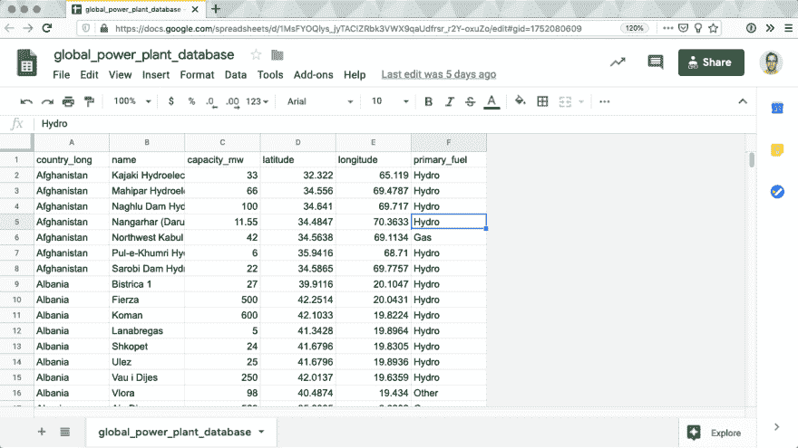
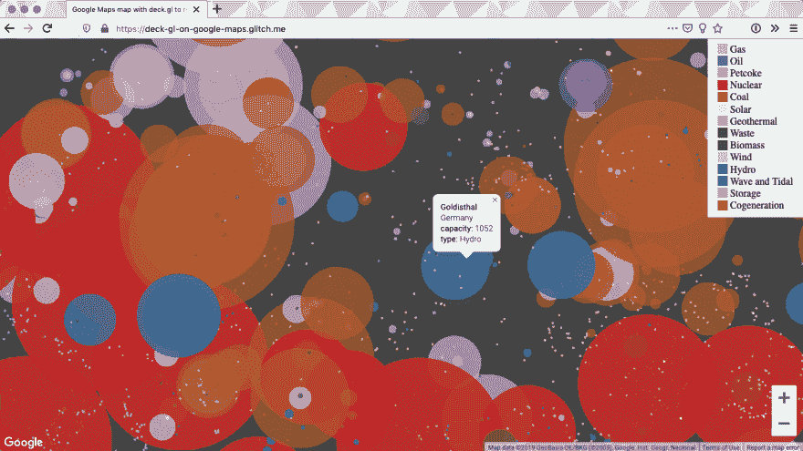

# 使用 deck.gl 在 Google 地图上可视化数据

> 原文：<https://dev.to/ubilabs/visualize-data-on-a-google-map-with-deck-gl-3ad1>

你说，在地图上可视化大型数据集并不容易？在本文中，我将用 160 行 JavaScript 演示如何在谷歌地图上使用 deck.gl，从谷歌工作表中加载数据。

我们将使用一个大型开放数据集，其中包含世界各地发电厂的信息，可视化起来应该会很有趣。当我们完成后，可视化效果将是这样的:

[https://glitch.com/embed/#!/embed/deck-gl-on-google-maps?previewSize=100&path=index.html](https://glitch.com/embed/#!/embed/deck-gl-on-google-maps?previewSize=100&path=index.html)

请继续阅读，了解我们是如何构建这张地图的。

### 获取数据

首先，从[世界资源研究所](http://datasets.wri.org/dataset/globalpowerplantdatabase)获取 CSV 数据，并将其上传到 Google 工作表。

因为我们不需要文档中的所有数据，所以可以通过删除不需要的列来精简文档。这减少了可视化必须加载的数据量。我们将重点关注您在下面看到的六列数据。您可以在此处找到样表[并重复使用。](https://docs.google.com/spreadsheets/d/1MsFYOQlys_jyTACIZRbk3VWX9qaUdfrsr_r2Y-oxuZo)

[](https://res.cloudinary.com/practicaldev/image/fetch/s--TcfdJ3QH--/c_limit%2Cf_auto%2Cfl_progressive%2Cq_auto%2Cw_880/https://thepracticaldev.s3.amazonaws.com/i/js546rzlejcbvpbk7hoy.png)

为了展示电力是如何产生的，我们将使用电厂的类型在地图上给一个点着色。圆点的大小将由发电厂的容量决定。当然，纬度和经度将用于在地图上放置点。

### 谷歌地图上没有大型数据集的原生渲染

该数据集中有近 30，000 个发电厂。在谷歌地图上可视化这么多数据并非没有问题。使用 Google Maps API 提供的[数据覆盖图](https://developers.google.com/maps/documentation/javascript/reference/data)并不能很好地处理那么多要渲染的项目。其他方法，比如使用 SVG 作为覆盖图，已经显示了几百个项目的类似性能问题。所以我们来看看 deck.gl。

### deck . GL 是什么？

[deck.gl](https://deck.gl/) 于 2016 年发布，使用我们设备中的显卡，将基于 WebGL 的渲染引入地图。这对我们来说是一个好消息，因为它承诺快速渲染性能！起初，它无法与谷歌地图兼容。随着 2019 年 4 月第 7 版的发布，增加了对谷歌地图的支持，我们将探索实现它有多容易！

当然 deck.gl 需要添加到可视化:

```
<script src="https://unpkg.com/deck.gl@7.0.9/dist.min.js"></script> 
```

<svg width="20px" height="20px" viewBox="0 0 24 24" class="highlight-action crayons-icon highlight-action--fullscreen-on"><title>Enter fullscreen mode</title></svg> <svg width="20px" height="20px" viewBox="0 0 24 24" class="highlight-action crayons-icon highlight-action--fullscreen-off"><title>Exit fullscreen mode</title></svg>

### 创建谷歌地图

作为呈现数据的基础，我们创建了一个谷歌地图。创建地图需要 Google Maps API。不要忘记[获取一个 API 密钥](https://developers.google.com/maps/documentation/javascript/get-api-key)。可以这样收录:

```
<script src="https://maps.googleapis.com/maps/api/js?key=###YOUR_KEY###&callback=initMap"></script> 
```

<svg width="20px" height="20px" viewBox="0 0 24 24" class="highlight-action crayons-icon highlight-action--fullscreen-on"><title>Enter fullscreen mode</title></svg> <svg width="20px" height="20px" viewBox="0 0 24 24" class="highlight-action crayons-icon highlight-action--fullscreen-off"><title>Exit fullscreen mode</title></svg>

在脚本标签中，定义了一个回调函数，它将在 API 加载时创建地图:

```
let map;

function initMap() {
  map = new google.maps.Map(document.getElementById('map'), {
    center: {lat: 17, lng: 0},
    minZoom: 3,
    zoom: 3,
    clickableIcons: false,
    disableDefaultUI: true,
    zoomControl: true
  });
} 
```

<svg width="20px" height="20px" viewBox="0 0 24 24" class="highlight-action crayons-icon highlight-action--fullscreen-on"><title>Enter fullscreen mode</title></svg> <svg width="20px" height="20px" viewBox="0 0 24 24" class="highlight-action crayons-icon highlight-action--fullscreen-off"><title>Exit fullscreen mode</title></svg>

### 从谷歌工作表中加载数据

由于我们的谷歌表单中有发电厂的数据，我们需要首先加载这些数据。为了能够从工作表中提取数据，需要将它发布到 web 上。在电子表格中，进入“文件”——>“发布到网上”，点击发布按钮。我们的应用程序现在可以使用该表了！

为了加载它，一个脚本标记被添加到页面中。确保在脚本标签的 URL 中插入工作表的 ID。ID 可以在您的工作表的 URL 中的`/d/`部分找到。对于我们的[示例](https://docs.google.com/spreadsheets/d/1MsFYOQlys_jyTACIZRbk3VWX9qaUdfrsr_r2Y-oxuZo/edit#gid=1752080609)，ID 是`1MsFYOQlys_jyTACIZRbk3VWX9qaUdfrsr_r2Y-oxuZo`。

在脚本标签的末尾，我们定义了一个回调函数，当数据被加载时 get 调用这个函数:

```
<script src="https://spreadsheets.google.com/feeds/list/###SHEET_ID###/1/public/values?alt=json-in-script&callback=createOverlay">
</script> 
```

<svg width="20px" height="20px" viewBox="0 0 24 24" class="highlight-action crayons-icon highlight-action--fullscreen-on"><title>Enter fullscreen mode</title></svg> <svg width="20px" height="20px" viewBox="0 0 24 24" class="highlight-action crayons-icon highlight-action--fullscreen-off"><title>Exit fullscreen mode</title></svg>

在回调中，我们可以检查加载的数据:

```
function createOverlay(spreadsheetData) {
  console.log(spreadsheetData);
} 
```

<svg width="20px" height="20px" viewBox="0 0 24 24" class="highlight-action crayons-icon highlight-action--fullscreen-on"><title>Enter fullscreen mode</title></svg> <svg width="20px" height="20px" viewBox="0 0 24 24" class="highlight-action crayons-icon highlight-action--fullscreen-off"><title>Exit fullscreen mode</title></svg>

### 创建 deck.gl GeoJSON 叠加图

Google Sheets 给了我们一个奇怪的嵌套结构的 JSON。为了在地图上将数据渲染为 GeoJSON，我们需要首先在`createOverlay`回调:
中创建一个 GeoJSON

```
const data = {
  type: 'FeatureCollection',
  features: spreadsheetData.feed.entry.map(item => {
    return {
      type: 'Feature',
      geometry: {
        type: 'Point',
        coordinates: [
          Number(item.gsx$longitude.$t),
          Number(item.gsx$latitude.$t)
        ]
      },
      properties: {
        name: item.gsx$name.$t,
        country: item.gsx$countrylong.$t,
        capacity: Number(item.gsx$capacitymw.$t) || 0,
        primaryFuel: item.gsx$primaryfuel.$t
      }
    }
  })
}; 
```

<svg width="20px" height="20px" viewBox="0 0 24 24" class="highlight-action crayons-icon highlight-action--fullscreen-on"><title>Enter fullscreen mode</title></svg> <svg width="20px" height="20px" viewBox="0 0 24 24" class="highlight-action crayons-icon highlight-action--fullscreen-off"><title>Exit fullscreen mode</title></svg>

请注意，我们将容量和主要燃料的信息添加到属性中，以便我们可以将其用于样式。

为了将 GeoJSON 添加到地图中，我们从 deck.gl:
创建了一个常规的`GeoJsonLayer`

```
const geojsonLayer = new GeoJsonLayer({
  id: 'geojsonLayer',
  data: data,
  pickable: true,
  pointRadiusMinPixels: 2,
  pointRadiusMaxPixels: 140,
  wrapLongitude: true,
  getRadius: d => d.properties.capacity * 40,
  getFillColor: d => fuelColorMapping[d.properties.primaryFuel] || [100, 100, 100, 194]
}); 
```

<svg width="20px" height="20px" viewBox="0 0 24 24" class="highlight-action crayons-icon highlight-action--fullscreen-on"><title>Enter fullscreen mode</title></svg> <svg width="20px" height="20px" viewBox="0 0 24 24" class="highlight-action crayons-icon highlight-action--fullscreen-off"><title>Exit fullscreen mode</title></svg>

我们刚刚创建的 GeoJSON 传入了 get。为了计算半径，我们使用属性中的`capacity`。圆点的颜色由`primaryFuel`定义。我们使用一个映射对象，将燃料类型作为键，颜色数组作为值。

现在这是一个图层，但它仍然不在地图上。

### 给谷歌地图添加 deck.gl 图层

地图和图层都需要连接才能在基础地图上渲染数据。deck.gl 提供了一个`GoogleMapsOverlay`来做这件事。创建一个并分配给它地图:

```
const overlay = new GoogleMapsOverlay({
  layers: [geojsonLayer]
});
overlay.setMap(map); 
```

<svg width="20px" height="20px" viewBox="0 0 24 24" class="highlight-action crayons-icon highlight-action--fullscreen-on"><title>Enter fullscreen mode</title></svg> <svg width="20px" height="20px" viewBox="0 0 24 24" class="highlight-action crayons-icon highlight-action--fullscreen-off"><title>Exit fullscreen mode</title></svg>

耶！数据现在可以在地图上看到了！

[](https://res.cloudinary.com/practicaldev/image/fetch/s--FitnvhCd--/c_limit%2Cf_auto%2Cfl_progressive%2Cq_auto%2Cw_880/https://thepracticaldev.s3.amazonaws.com/i/072tvnampv98pq8ipggy.png)

看到水力发电厂在全球的分布真的很有趣。考虑到当前的气候危机，中国和印度的燃煤发电厂数量令人担忧。

### 点击显示信息窗口

在地图上看到数据是很好的，但获得更多关于容量或电厂名称的信息将是一个很好的补充。信息窗口对此有所帮助:

```
const infowindow = new google.maps.InfoWindow({
  content: ''
});

map.addListener('click', event => {
  const picked = overlay._deck.pickObject({
    x: event.pixel.x,
    y: event.pixel.y,
    radius: 4,
    layerIds: ['geojsonLayer']
  });

  if (!picked) {
    infowindow.close();
    return;
  }

  infowindow.setContent(
    `<div>
      <div><b>${picked.object.properties.name}</b></div>
      <div>${picked.object.properties.country}</div>
      <div><b>capacity:</b> ${picked.object.properties.capacity}</div>
      <div><b>type:</b> ${picked.object.properties.primaryFuel}</div>
    </div>`
  );
  infowindow.setPosition({
    lng: picked.lngLat[0],
    lat: picked.lngLat[1]
  });
  infowindow.open(map);
}); 
```

<svg width="20px" height="20px" viewBox="0 0 24 24" class="highlight-action crayons-icon highlight-action--fullscreen-on"><title>Enter fullscreen mode</title></svg> <svg width="20px" height="20px" viewBox="0 0 24 24" class="highlight-action crayons-icon highlight-action--fullscreen-off"><title>Exit fullscreen mode</title></svg>

单击地图时，会检查覆盖图中可以在这些坐标处拾取的元素。如果找不到，请关闭任何打开的信息窗口。否则，将内容设置为单击的电厂属性中的数据，并在其位置打开它。

[](https://res.cloudinary.com/practicaldev/image/fetch/s--p3iCC96P--/c_limit%2Cf_auto%2Cfl_progressive%2Cq_auto%2Cw_880/https://thepracticaldev.s3.amazonaws.com/i/ih7m0p7wbff2ltuylzi4.png)

### 结论

只需几行代码，就可以从 Google Sheet 加载数据并创建一个顶部带有 deck.gl GeoJsonLayer 的 Google 地图。从大型数据集创建可视化变得容易多了，希望这篇文章能帮助你开始！

你打算想象什么？请通过推特 [@ubilabs](https://twitter.com/ubilabs) 或通过 info@ubilabs.net[告诉我们](//mailto:info@ubilabs.net)

请务必查看示例的完整[源代码](https://glitch.com/edit/#!/deck-gl-on-google-maps)。你可以在这里找到独立的例子:[deck-GL-on-Google-maps . glitch . me](https://deck-gl-on-google-maps.glitch.me/)。

*这篇文章首先发表在 [Ubilabs 博客](https://ubilabs.net/en/news/how-to-visualize-data-with-deck-gl-and-google-maps)上。*