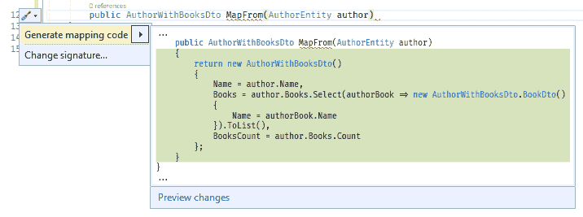

# 自动映射:在运行时将实体转换为视图

> 原文：<https://dev.to/jpeg729/automapper-converting-entities-to-views-at-runtime-4i5c>

我推迟写这篇文章已经有一段时间了，因为我没有可行的替代方案，其他人也写了他们在 AutoMapper 上遇到的问题。例如[为什么我不用自动映射器](https://cezarypiatek.github.io/post/why-i-dont-use-automapper/)。

现在我有了一个选择，所以开始吧。

## auto mapper 做什么

当您使用 ORM(对象关系映射器)从数据库加载数据时，您通常会将数据加载到对象(我称之为实体)中，这些对象包含的数据比您当时实际需要的要多得多。Automapper 允许您将这些对象转换成更小的数据传输对象(dto ),更适合您当时的需要。

例如，您可以像这样创建 Book 和 Author 类。

```
public class BookEntity
{
    public int Id { get; set; }
    public string Name { get; set; }
    public string ISBN { get; set; }

    public AuthorEntity Author { get; set; }
}

public class AuthorEntity
{
    public int Id { get; set; }
    public string Name { get; set; }
    public string PreferedGenre { get; set; }

    public List<AuthorEntity> Books { get; set; }
    // I put "List" for ease of understanding, but 
    // EntityFramework 6 actually requires an "ICollection".
} 
```

<svg width="20px" height="20px" viewBox="0 0 24 24" class="highlight-action crayons-icon highlight-action--fullscreen-on"><title>Enter fullscreen mode</title></svg> <svg width="20px" height="20px" viewBox="0 0 24 24" class="highlight-action crayons-icon highlight-action--fullscreen-off"><title>Exit fullscreen mode</title></svg>

您可能只想发送以下内容

```
public class AuthorWithBooksDto
{
    public string Name { get; set; }
    public List<BookDto> Books { get; set; }
    public int BooksCount { get; set; }

    public class BookDto
    {
        public string Name { get; set; }
    }
} 
```

<svg width="20px" height="20px" viewBox="0 0 24 24" class="highlight-action crayons-icon highlight-action--fullscreen-on"><title>Enter fullscreen mode</title></svg> <svg width="20px" height="20px" viewBox="0 0 24 24" class="highlight-action crayons-icon highlight-action--fullscreen-off"><title>Exit fullscreen mode</title></svg>

我将 BookDto 类放在 AuthorWithBooksDto 中，以避免在代码库中的其他地方重用它。

所以你使用自动映射器
来定义一个地图

```
public class AuthorProfile : Profile
{
    public AuthorProfile()
    {
        CreateMap<AuthorEntity, AuthorWithBooksDto>();
    }
} 
```

<svg width="20px" height="20px" viewBox="0 0 24 24" class="highlight-action crayons-icon highlight-action--fullscreen-on"><title>Enter fullscreen mode</title></svg> <svg width="20px" height="20px" viewBox="0 0 24 24" class="highlight-action crayons-icon highlight-action--fullscreen-off"><title>Exit fullscreen mode</title></svg>

你像这样使用它...

```
var authorDto = AutoMapper.Mapper.Map<AuthorWithBooksDto>(authorEntity); 
```

<svg width="20px" height="20px" viewBox="0 0 24 24" class="highlight-action crayons-icon highlight-action--fullscreen-on"><title>Enter fullscreen mode</title></svg> <svg width="20px" height="20px" viewBox="0 0 24 24" class="highlight-action crayons-icon highlight-action--fullscreen-off"><title>Exit fullscreen mode</title></svg>

或者更好的是，您可以使用 AutoMapper 的可查询扩展来只加载所需的属性。

```
var authorDtos = dbContext.Authors.ProjectTo<AuthorWithBooksDto>(); 
```

<svg width="20px" height="20px" viewBox="0 0 24 24" class="highlight-action crayons-icon highlight-action--fullscreen-on"><title>Enter fullscreen mode</title></svg> <svg width="20px" height="20px" viewBox="0 0 24 24" class="highlight-action crayons-icon highlight-action--fullscreen-off"><title>Exit fullscreen mode</title></svg>

为了优化数据传输，映射将被转换成 SQL。

## 升迁

*   超级好用。
*   它与 EntityFramework 和其他表单配合得很好。
*   它工作得很好。
*   它超级容易使用(我已经说过了吗？)

## 缺点

*   如果您的映射定义得不太正确，您可能会得到隐含的运行时错误，比如 OutOfMemory，或者 NullReferenceException，它不能告诉您确切的 null 值。
*   因为您定义映射时没有引用所有被映射的属性，所以您的编辑器不能准确地告诉您哪些属性被使用以及在哪里使用。

## 替代品

AutoMapper 做得很好，但它是在运行时完成的，我认为我们可以做得更好。

我不希望必须手工编写所有的映射，但是我希望我的代码编辑器能够准确地告诉我每个属性的使用位置，并且我希望有一个与 AutoMapper 的查询投影扩展相当的简单工具。

这意味着当我编写代码时，我需要一个工具来为映射生成代码。它还必须能够将映射生成为 C#表达式，因为这是 EntityFramework 用来生成其 SQL 查询的。

## mapping generator 扩展

如果你使用 Visual Studio 2017+你可以使用 [MappingGenerator](https://marketplace.visualstudio.com/items?itemName=54748ff9-45fc-43c2-8ec5-cf7912bc3b84.mappinggenerator) ，顾名思义，它会生成映射。

这是它的工作原理...

1.  键入地图函数的签名

    ```
    public AuthorWithBooksDto MapFrom(AuthorEntity author) 
    ```

2.  按 Ctrl+。在行末选择建议代码
    [](https://res.cloudinary.com/practicaldev/image/fetch/s--RPdFtO0j--/c_limit%2Cf_auto%2Cfl_progressive%2Cq_auto%2Cw_880/https://raw.githubusercontent.com/jpeg729/blog/master/MappingGenerator%2520MapFrom.png)

3.  检查生成的代码

    ```
    public AuthorWithBooksDto MapFrom(AuthorEntity author)
    {
        return new AuthorWithBooksDto()
        {
            Name = author.Name,
            Books = author.Books.Select(authorBook => new AuthorWithBooksDto.BookDto()
            {
                Name = authorBook.Name
            }).ToList(),
            BooksCount = author.Books.Count
        };
    } 
    ```

当然，你会告诉我这不是表达式映射，它不能用于 EntityFramework，你可能是对的，但是看看这个...

1.  把签名打出来，这有点复杂，我同意你的说法

    ```
    public Expression<Func<AuthorEntity, AuthorWithBooksDto>> MapAuthorWithBooks =
        entity => new AuthorWithBooksDto { }; 
    ```

2.  将文本光标放在花括号之间，按 Ctrl+。，并选择“用 lambda 参数初始化”。
    [T3】](https://res.cloudinary.com/practicaldev/image/fetch/s--YrI8A-Qp--/c_limit%2Cf_auto%2Cfl_progressive%2Cq_auto%2Cw_880/https://raw.githubusercontent.com/jpeg729/blog/master/MappingGenerator%2520Expression.png)

3.  检查生成的代码

    ```
    public Expression<Func<AuthorEntity, AuthorWithBooksDto>> MapAuthorWithBooks =
        entity => new AuthorWithBooksDto
        {
            Name = entity.Name,
            Books = entity.Books.Select(entityBook => new AuthorWithBooksDto.BookDto()
            {
                Name = entityBook.Name
            }).ToList(),
            BooksCount = entity.Books.Count
        }; 
    ```

4.  测试其用途

    ```
    var query = db.Authors.Select(MapAuthorWithBooks);
    Console.WriteLine(query.ToString()); // only the required columns are included
    var authorsWithBooks = query.ToList(); 
    ```

## 我们收获了什么？

*   Visual Studio 不再告诉我们实体的属性有零引用。
*   不再有内存溢出

## 还有什么问题？

*   如果在映射过程中发生了空引用异常，Visual Studio 2017 无法告诉您是哪一行引起的，因此您必须注释掉大部分映射，直到找到罪魁祸首。我认为可空引用类型将有助于解决这个问题。
*   如果您想要表达式映射*和*编译的映射，您要么必须为两者生成代码，要么必须在运行时编译表达式，在这种情况下，您失去了在映射代码中设置断点的能力。
*   组织你的地图变得比以前更困难了。向每个 Dto 类添加静态方法 MapFrom 可能是个好主意。

## 结论

AutoMapper 很棒，虽然我可以使用生成的映射代码复制我可以用 AutoMapper 做的许多事情，但我不确定这是否是一个巨大的优势。

映射的主要用例似乎是生成通过网络发送的模型，还有许多替代方法。gRPC 和 GraphQL 是可能各有优势的替代方案。

即使您更喜欢使用 AutoMapper，也要尝试 MappingGenerator 扩展，因为它有许多有用的功能。