# 在 Linux 上部署 CI 服务器

> 原文:[https://dev . to/indeem software/deploying-ci-server-on-Linux-3fe 6](https://dev.to/indeemasoftware/deploying-ci-server-on-linux-3fe6)

原文[在 Linux 上部署 CI 服务器](https://indeema.com/blog/deploying-ci-server-on-linux--personal-android-test-machine)

让我们看看如何为 Android 应用程序使用和部署 Jenkins CI flow。具体来说，建立自动化的**单元测试**并逐步构建项目。

深入到 Android 操作系统的开发中，你可能会听说一种叫做单元测试的东西。事实上，任何平台的开发都需要单元测试。这是有原因的。

所有的例子都在 Android Studio、Android SDK 和 Linux 上(所以如果你不喜欢这些，有些例子可能很难理解。或者不是；)我们还介绍了使用 GitLab 的 Mac OS 上的 [CI 服务器和用于 iOS 开发的浪子](https://indeema.com/blog/ci-server-on-mac-os-for-ios-using-gitlab-and-fastlane)。

## 为什么关心单元测试？

将单元测试引入到您的项目中绝对是一件好事，因为您可以确保:

*   新模块不会影响项目中已有的单元测试部分。
*   特定的代码部分按照我们的期望工作。

如果他们不这样做，失败的测试会立即告诉你问题在哪里。

单元测试是在一个虚拟的 Java 机器上执行的，当然你也可以直接在 Android Studio 中运行。然而，如果您的团队不仅仅是您一个人，那么使用一个自动启动单元测试并生成信息报告的持续集成工具是一个更好的主意。

然后，您可以将此文件导出为。例如，apk 并通过电子邮件与您的 QAs 分享。这里有一个解决方案:詹金斯 CI 服务器[https://jenkins.io/](https://jenkins.io/)

## 如何为 Jenkins 安装 CI 服务器

因此，要安装 Jenkins:

1.  在[http://mirrors.jenkins.io/war-stable/latest/jenkins.war](http://mirrors.jenkins.io/war-stable/latest/jenkins.war)下载最新稳定版本
2.  打开终端，使用命令:\ `$ cd home/anyfolder/Downloads/`进入下载文件夹(或 jenkins.var 文件所在的文件夹)
3.  运行命令:\ `$ java -jar jenkins.war --httpPort=8080`

这将启动一个脚本来创建一个隐藏的**。** **詹金斯**主文件夹中的子文件夹。所有服务器配置都将存储在该子文件夹中。只要带脚本的终端打开，服务器就会运行。

要停止服务器，要么关闭终端窗口，要么按下 **Ctrl + C.**

[T2】](https://res.cloudinary.com/practicaldev/image/fetch/s--xZDubq0Q--/c_limit%2Cf_auto%2Cfl_progressive%2Cq_auto%2Cw_880/https://indeema.cimg/articles/Deploying-Jenkins-CI-server-Personal-android-test-machine/1.png)

## 设置 Jenkins 服务器

运行脚本后，开始构建本地 Jenkins 服务器(使用 8080 端口)。

在 [http://localhost:8080/](http://localhost:8080/) 的**入门**界面，您需要输入

初始管理员密码。为此，请将提供的路径复制到您的剪贴板。

[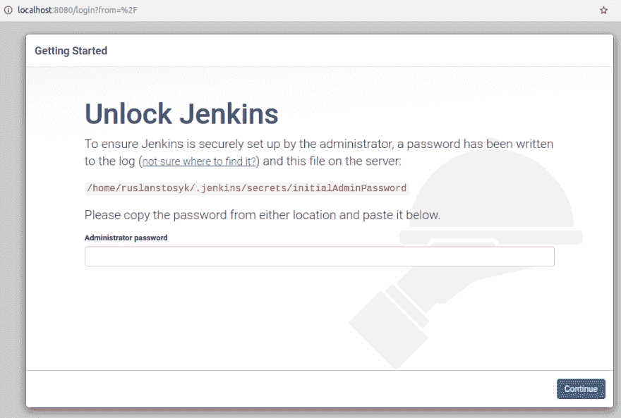T2】](https://res.cloudinary.com/practicaldev/image/fetch/s---pPk56f9--/c_limit%2Cf_auto%2Cfl_progressive%2Cq_auto%2Cw_880/https://indeema.cimg/articles/Deploying-Jenkins-CI-server-Personal-android-test-machine/2.png)

因此，要找到该密码:

1.  启动一个单独的终端实例并粘贴路径。例如:\ `$ cd /home/ruslanstosyk/.jenkins/secrets` \这将打开**秘密**文件夹。
2.  使用允许读取特定文件内容的 **cat** 命令。在这种情况下，使用**initial admin password**filename:\`$ cat initialAdminPassword`\运行 **cat** 命令，这将在控制台上显示您的密码。
3.  将密码复制粘贴到**管理员** **密码**字段，然后点击**继续**。
4.  在下一步，选择**安装建议的插件**。\ 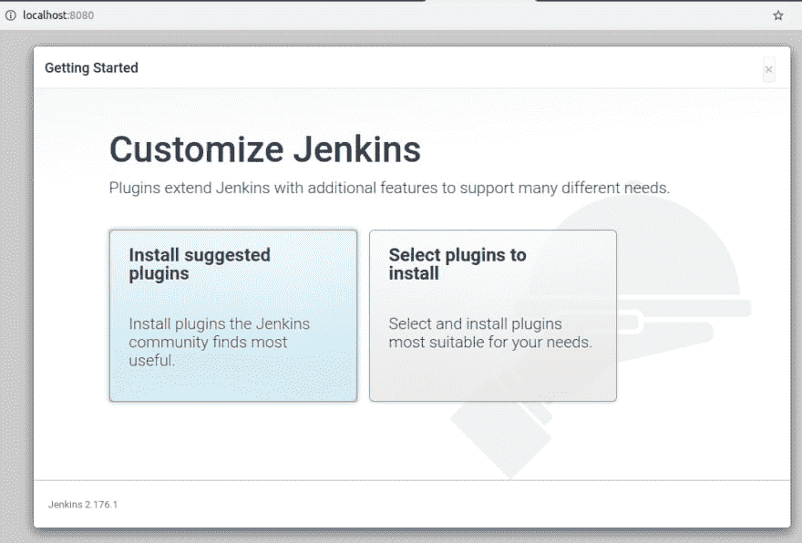 \在你熟悉 Jenkins 或者只需要一些特定的工具后，你可以使用**选择插件来安装**。然而，首先，为了基本的需要，**安装建议的插件**选项更好。
5.  安装过程中，请等待几分钟。\ 
6.  创建一个用户登录系统并配置服务器，点击**保存并继续。**
    

7.  使用您的用户名和密码登录 Jenkins。\
    [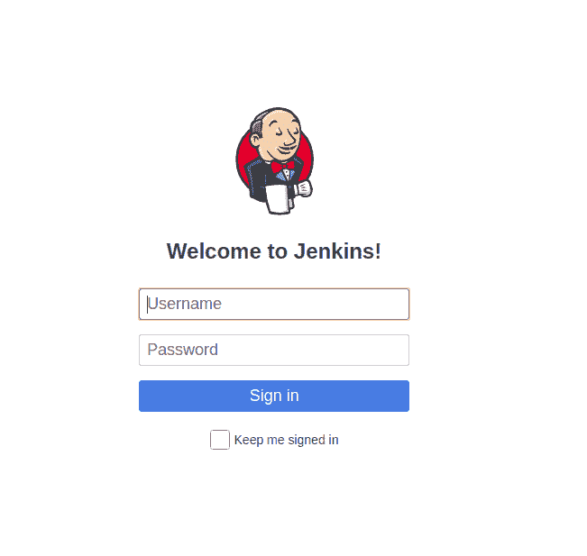T3】](https://res.cloudinary.com/practicaldev/image/fetch/s--BROWsFxi--/c_limit%2Cf_auto%2Cfl_progressive%2Cq_auto%2Cw_880/https://indeema.cimg/articles/Deploying-Jenkins-CI-server-Personal-android-test-machine/6.png)

## 根据您的需求配置 Jenkins 集成

因此，在你自己设置好服务器之后，你需要给它配备插件，为构建 Android 应用程序带来持续集成的最大好处。首先，从开始屏幕中，选择**管理 Jenkins。**

[T2】](https://res.cloudinary.com/practicaldev/image/fetch/s--iCR7Iha5--/c_limit%2Cf_auto%2Cfl_progressive%2Cq_auto%2Cw_880/https://indeema.cimg/articles/Deploying-Jenkins-CI-server-Personal-android-test-machine/7.png)

从出现的菜单中，选择**管理插件**进入插件管理页面。在这里你可以添加、更新和选择你需要的插件。我们将添加插件来定制 Jenkins 部署，并将其调整到所需的任务类型。

[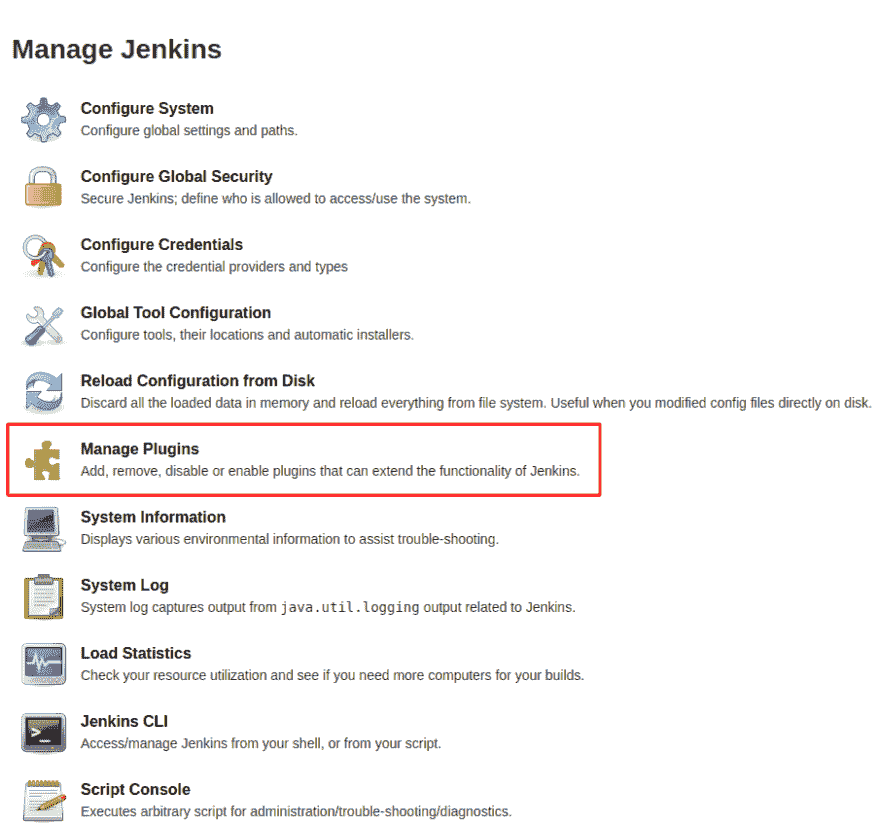T2】](https://res.cloudinary.com/practicaldev/image/fetch/s--nnWSduh6--/c_limit%2Cf_auto%2Cfl_progressive%2Cq_auto%2Cw_880/https://indeema.cimg/articles/Deploying-Jenkins-CI-server-Personal-android-test-machine/8.png)

转到可用的插图，找到并下载以下插件(或使用链接):

*   朱尼特\[https://wiki.jenkins.io/display/JENKINS/JUnit+Plugin](https://wiki.jenkins.io/display/JENKINS/JUnit+Plugin)
*   https://wiki.jenkins.io/display/JENKINS/JaCoCo+Plugin
*   https://wiki.jenkins.io/display/JENKINS/EnvInject+Plugin
*   GitLab 插件\[https://wiki.jenkins.io/display/JENKINS/GitLab+Plugin](https://wiki.jenkins.io/display/JENKINS/GitLab+Plugin)

[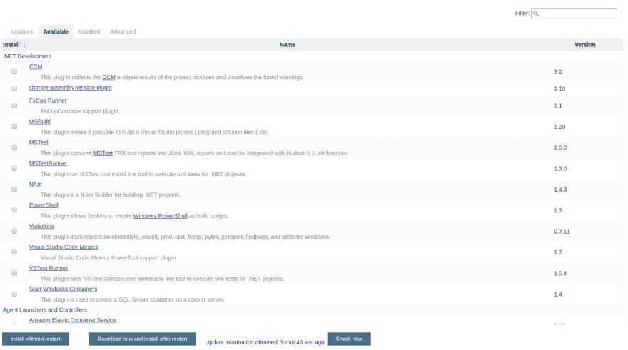T2】](https://res.cloudinary.com/practicaldev/image/fetch/s--qv8BssQ1--/c_limit%2Cf_auto%2Cfl_progressive%2Cq_auto%2Cw_880/https://indeema.cimg/articles/Deploying-Jenkins-CI-server-Personal-android-test-machine/9.png)

在你安装完所有你需要的插件并正确启动它们后，重启 Jenkins tool。

设置包含 Java 和 Android SDK 的文件夹的路径:

1.  从开始页面，到**管理詹金斯**，选择**配置系统**选项。
2.  向下滚动到**全局属性**并选择**环境变量**复选框。
3.  在**名称**字段中，粘贴 **JAVA_HOME** 并在**值**字段中指定 JAVA 文件夹的路径。
4.  点击**添加**。
5.  在出现的名称-值对中，将 **ANDROID_HOME** 粘贴为**名称**，并在**值**字段中指定您的 ANDROID 文件夹的路径。
6.  点击**保存**。

[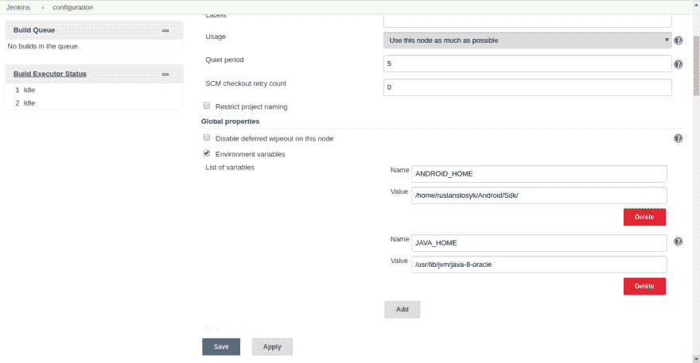T2】](https://res.cloudinary.com/practicaldev/image/fetch/s--7Aq1CBnL--/c_limit%2Cf_auto%2Cfl_progressive%2Cq_auto%2Cw_880/https://indeema.cimg/articles/Deploying-Jenkins-CI-server-Personal-android-test-machine/10.png)

## 为 Android 创建 Jenkins CI 项目

最后，我们已经准备好创建一个新项目了。

### 将 Jenkins 绑定到您在 Git 上的项目

1.  在起始页上点击**新项目**。\
    T3T5】

2.  为您的项目指定一个名称。该名称不得包含空格。\
    例如， *testproject，test-project，Test_Project。*
    [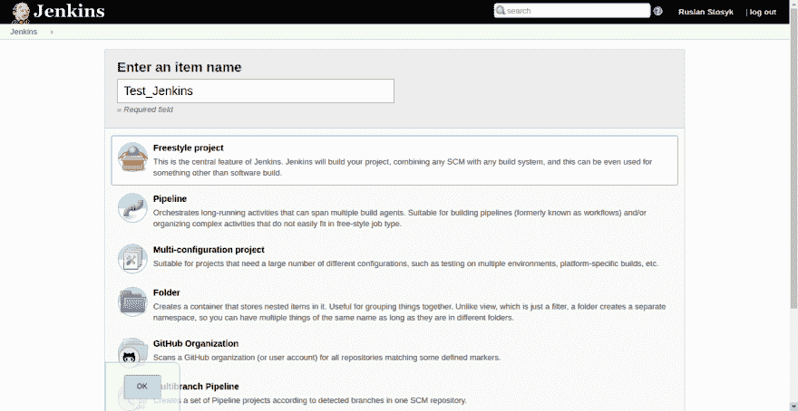](https://res.cloudinary.com/practicaldev/image/fetch/s--ZSgka4fK--/c_limit%2Cf_auto%2Cfl_progressive%2Cq_auto%2Cw_880/https://indeema.cimg/articles/Deploying-Jenkins-CI-server-Personal-android-test-machine/12.png)

3.  选择**自由式项目**选项。\
    这将启动项目配置页面。

4.  进入**源代码管理** **。**

5.  选择 Git 复选框并将完整路径粘贴到您的项目。\
    [T3】](https://res.cloudinary.com/practicaldev/image/fetch/s--E7xnwmwW--/c_limit%2Cf_auto%2Cfl_progressive%2Cq_auto%2Cw_880/https://indeema.cimg/articles/Deploying-Jenkins-CI-server-Personal-android-test-machine/13.png)

6.  输入您的凭证，让 Jenkins 克隆并启动您的项目。\
    [T3】](https://res.cloudinary.com/practicaldev/image/fetch/s--mSMFFkox--/c_limit%2Cf_auto%2Cfl_progressive%2Cq_auto%2Cw_880/https://indeema.cimg/articles/Deploying-Jenkins-CI-server-Personal-android-test-machine/14.png)

### 添加构建项目的规则

Jenkins 持续部署需要的下一个选项卡是**构建触发器**。在这里，我们可以添加启动项目构建的规则。我们可以设置各种选项来开始构建。例如，检测提交名称(如[ci start]或您设置的任何其他名称)中的特定关键短语。然而，要利用这一功能，您必须将 Jenkins CI 部署在 web 服务器上(而不是本地服务器上)，因为它是使用 web 钩子实现的。

在我们的例子中，我们使用了每 15 分钟开始构建的选项。该选项使用 cron 语法。

[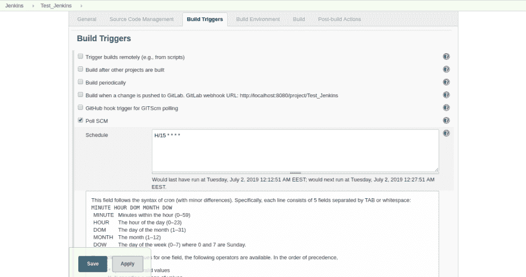T2】](https://res.cloudinary.com/practicaldev/image/fetch/s--Xku0X5u5--/c_limit%2Cf_auto%2Cfl_progressive%2Cq_auto%2Cw_880/https://indeema.cimg/articles/Deploying-Jenkins-CI-server-Personal-android-test-machine/15.png)

在**构建环境**选项卡中，选择**中止**构建，如果它卡住了复选框。当发生意外错误，需要释放队列和释放内存时，这个选项非常方便。

[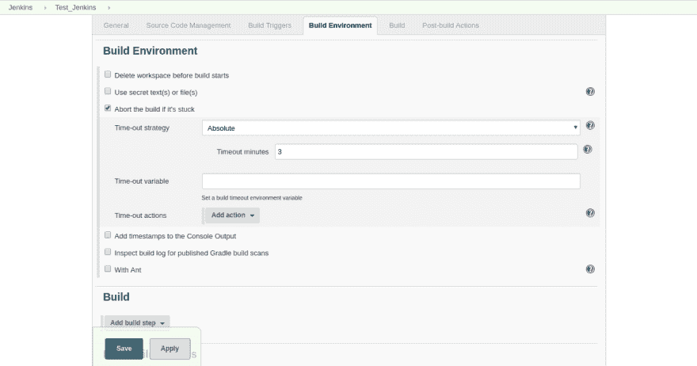T2】](https://res.cloudinary.com/practicaldev/image/fetch/s--D3Rtn-yM--/c_limit%2Cf_auto%2Cfl_progressive%2Cq_auto%2Cw_880/https://indeema.cimg/articles/Deploying-Jenkins-CI-server-Personal-android-test-machine/16.png)

因此，在**构建**选项卡中，您必须指定要运行的选项:

1.  从下拉菜单中，选择**调用 Gradle 脚本**选项。

2.  在**调用 Gradle 脚本**对话框中，选择**使用 Gradle 包装器**复选框。\
    T5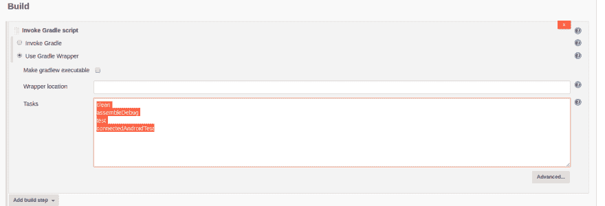T7】

3.  用定义命令运行顺序的脚本填充 Tasks 字段。\
    我们用:\
    `clean`
    `assembleDebug`
    `test\
    connectedAndroidTest`

4.  然后通过从下拉菜单中选择以下选项来配置**构建后操作**:

*   **发布 JUnit 测试结果报告**

使用这个选项，您将配置 Jenkins 来保存每个测试运行的详细报告。您还将获得报告的可视化效果。

**T4】**

*   将艺术品存档

此选项在所有测试运行后生成项目。所以你会得到一个。apk 文件可以下载并安装在设备上。\
**[T3】](https://res.cloudinary.com/practicaldev/image/fetch/s--rg6_BGTr--/c_limit%2Cf_auto%2Cfl_progressive%2Cq_auto%2Cw_880/https://indeema.cimg/articles/Deploying-Jenkins-CI-server-Personal-android-test-machine/19.png)T5】**

5.点击**保存**。

要启动这个项目，要么运行一个模拟器，要么将某个 Android 设备连接到您的计算机上，然后单击立即构建。

[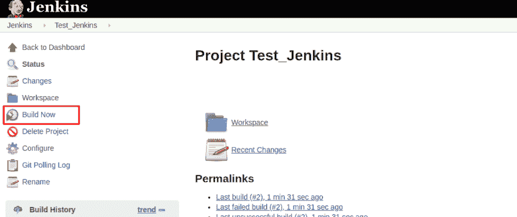T2】](https://res.cloudinary.com/practicaldev/image/fetch/s--c6bQDVQP--/c_limit%2Cf_auto%2Cfl_progressive%2Cq_auto%2Cw_880/https://indeema.cimg/articles/Deploying-Jenkins-CI-server-Personal-android-test-machine/20.png)

当从 repo 中克隆项目并且构建开始时，您可以在**控制台输出中探索构建状态和每个阶段的成功/失败信息。**

### 回顾构建

项目成功构建后，您会在**控制台输出中看到以下日志:** \
**** 

从构建的主页，您可以下载。apk 文件和构建日志，检查关于运行测试的信息(成功和失败)，等等。

[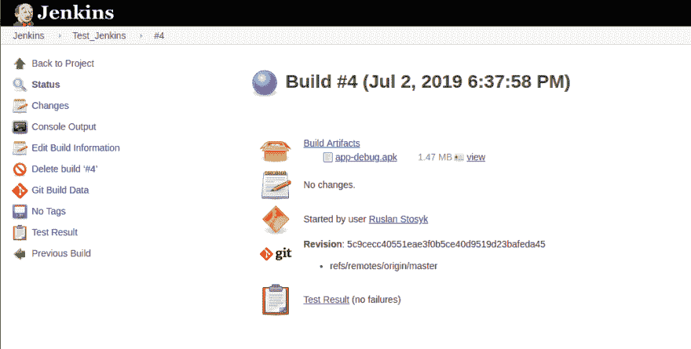T2】](https://res.cloudinary.com/practicaldev/image/fetch/s--8UfdAJd6--/c_limit%2Cf_auto%2Cfl_progressive%2Cq_auto%2Cw_880/https://indeema.cimg/articles/Deploying-Jenkins-CI-server-Personal-android-test-machine/22.png)

## 开始并向上！

所以我们做了相当多的配置。因此，在开发 Android 应用程序时，我们已经使用 Jenkins 实现了一个持续的集成，用于自动化部分构建创建和启动测试。

本文仅涵盖了您可以通过 Jenkins CI 为您的项目/需求设置和定制的内容的冰山一角。

感谢你的阅读，希望它能帮助你自动化平凡的任务；)订阅更多关于持续集成工具的俏皮话，[物联网](https://indeema.com/blog/internet-of-things-development--5-steps-to-creating-your-project)，[安卓开发](https://indeema.com/blog/kotlin-arrival--the-official-start-of-a-post-java-era)，还有[更多](https://indeema.com/blog/smart-lock--why-sloth-is-a-driver-of-the-iot-progress)！