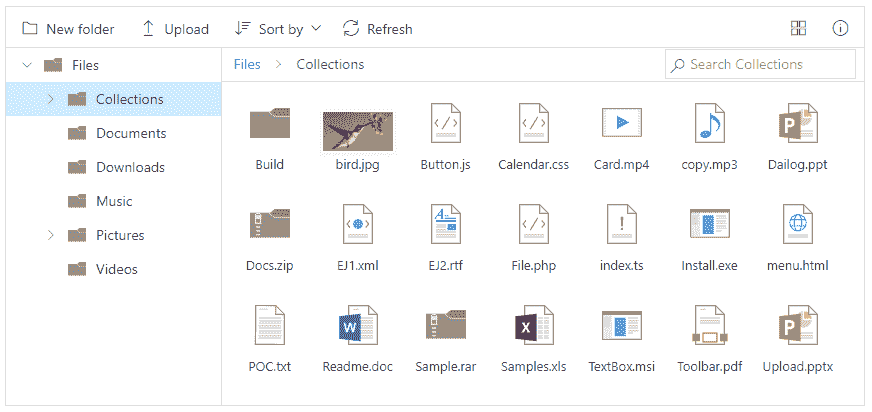
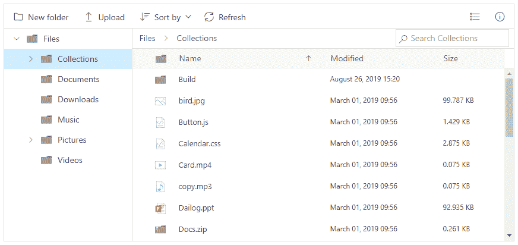
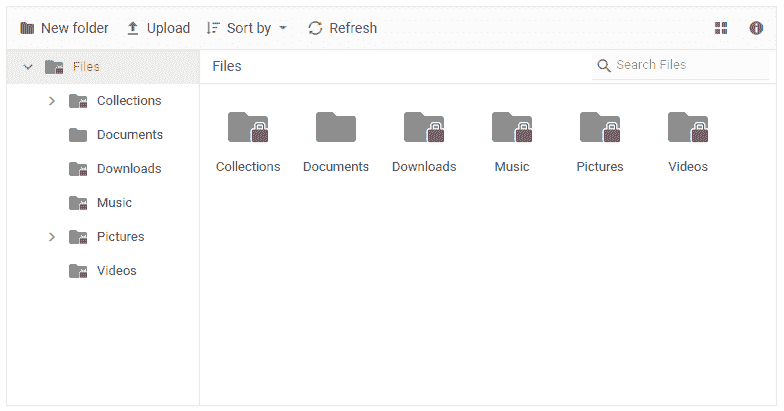
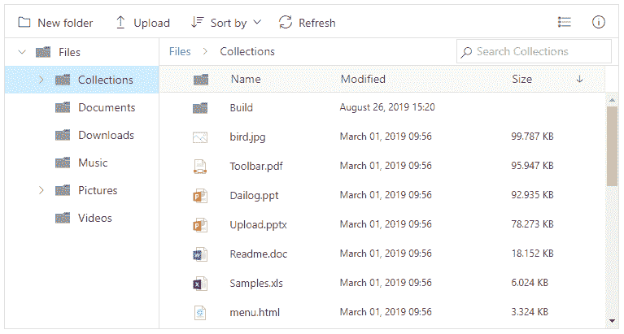
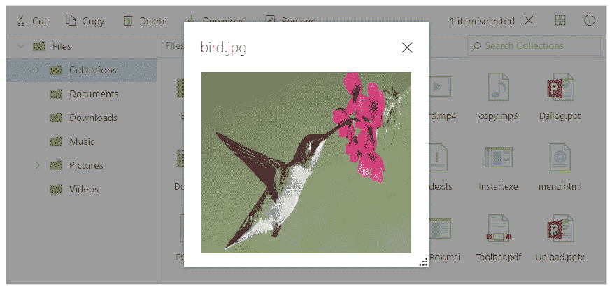
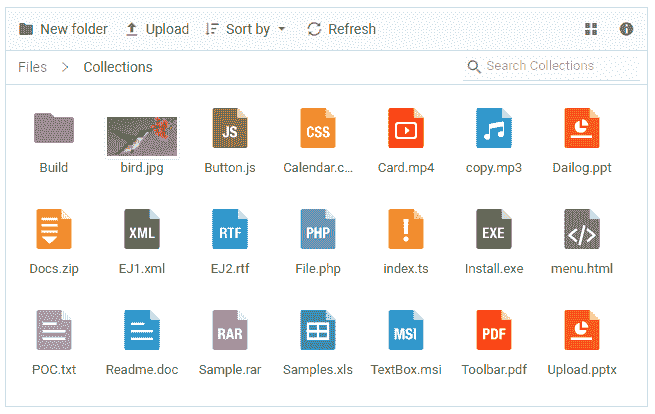

# 介绍新的 JavaScript 文件管理器控件

> 原文：<https://dev.to/syncfusion/introducing-new-javascript-file-manager-control-gea>

我们很高兴在我们基本的 JS 2 套件中引入新的[文件管理器控件](https://www.syncfusion.com/javascript-ui-controls/js-file-manager)。

文件管理器组件是一个类似 Windows 的文件浏览器，允许最终用户在 web 服务器的客户端有效地管理、浏览和上传文件。

<figure>

<figcaption>JavaScript File Manager Control</figcaption>

</figure>

Essential JS 2 套件有一个巨大的控件集，这些控件拥有通用的 web 标准和功能，如 web 可访问性、从右到左的呈现、键盘交互、模块化架构和响应能力，以及触摸友好的轻量级 ui。现在，文件管理器包含在这个套件中，具有所有常见的 JS 2 特性以及特定于控件的特性。

这篇博客将介绍新的文件管理器控件、它的 UI 设计、它的可用特性以及它支持的平台。

## 文件管理器 UI 设计

我们将文件管理器 UI 设计得非常灵活，允许用户自定义它的所有特性。这是文件管理器的设计和它的交互特性列表。

<figure>

<figcaption>File Manager UI design</figcaption>

</figure>

### 工具栏选项

顶部的工具栏拥有执行文件管理操作的所有操作按钮:创建、剪切、复制、粘贴、上传、下载、重命名和删除文件夹和文件。

### 左侧树形视图用于导航

在根文件目录中，文件以树状结构(层次结构)列出，带有类似 Windows 文件资源管理器中的展开和折叠选项。这用于快速访问嵌套级别中的文件。

### 快速访问菜单

这是右键单击文件文件数据视图时执行操作的上下文菜单选项。

### 布局

文件和文件夹以详细视图或大图标视图显示，便于快速管理。

<figure>

<figcaption>File Manager with details view</figcaption>

</figure>

<figure>

<figcaption>File Manager with large icons view</figcaption>

</figure>

### 适应性设计

文件管理器控件通过其响应性和适应性布局设计，在所有设备中都能轻松交互。在小型设备中，文件管理器通过改变用户界面来适应无障碍交互。

## 现有特征

文件管理器控件的功能是通过 80/20 规则实现的。这将涵盖在 web 浏览器中有效管理文件系统的大部分业务需求。以下是文件管理器中可用的功能:

*   文件操作
*   多重选择
*   文件系统提供商
*   文件的拖放
*   文件访问控制
*   整理
*   图像预览
*   布局定制

### 文件操作

文件管理器控件执行所有常见的文件操作:创建、删除、剪切、复制、粘贴、重命名、上传和下载文件和文件夹。

### 多选

文件管理器允许您选择多个文件来执行适用的文件操作。

<figure>

<figcaption>Multiple files selected in File Manager</figcaption>

</figure>

### 文件系统提供者

内置文件系统提供程序将帮助您轻松管理这些流行的云和数据库文件系统:

*   [物理文件系统提供商](https://github.com/SyncfusionExamples/ej2-aspmvc-file-provider)
*   [Azure 文件系统提供商](https://github.com/SyncfusionExamples/ej2-azure-aspcore-file-provider)
*   [Google drive 文件系统提供商](https://github.com/SyncfusionExamples/ej2-google-drive-aspcore-file-provider)
*   [SQL server 数据库文件系统提供者](https://github.com/SyncfusionExamples/ej2-sql-server-database-aspcore-file-provider)
*   [节点 JS 文件系统提供者](https://github.com/SyncfusionExamples/ej2-filemanager-node-filesystem)

### 拖拽文件

拖放支持允许您通过拖放将文件夹和文件从一个文件夹移动到另一个文件夹。

<figure>

<figcaption>Drag and drop files in File Manager</figcaption>

</figure>

### 文件访问控制

文件管理器提供了授予或限制特定用户和用户组访问权限的方法。您可以使用一组访问规则来定义文件夹和文件的访问权限。通过这样做，您可以授权人们读取、写入、删除和上传文件。

这些访问规则是在服务器端验证的，所以会更安全。

<figure>

<figcaption>Access rule applied in File Manager</figcaption>

</figure>

在前面的屏幕截图中，访问权限被提供给文档用户，因此只有 documents 文件夹可以被访问，其余的文件夹受到限制。

### 整理文件

只需单击列标题，您就可以按升序或降序对文件系统中的文件和文件夹进行排序。您还可以根据名称、创建日期、大小等对文件和文件夹进行排序。

<figure>

<figcaption>Sorted files in File Manager</figcaption>

</figure>

### 图像预览

您可以通过双击图像来预览图像，这将在对话框窗口中打开图像。可以通过调整对话框的大小来放大预览的图像。

<figure>

<figcaption>Image preview option in File Manager</figcaption>

</figure>

### 布局定制

文件管理器允许你自定义你喜欢的布局。

<figure>

<figcaption>Customized layout in File Manager</figcaption>

</figure>

## 即将推出的功能

在即将发布的版本中，您可以预期文件管理器控件具有以下功能:

*   虚拟滚动
*   页码

## 支持的平台

以下平台支持文件管理器控制:

*   布拉索
*   [网芯](https://www.syncfusion.com/aspnet-core-ui-controls/file-manager)
*   [净 MVC](https://www.syncfusion.com/aspnet-mvc-ui-controls/file-manager)
*   [角度](https://www.syncfusion.com/angular-ui-components/angular-file-manager)
*   [反应](https://www.syncfusion.com/react-ui-components/react-file-manager)
*   视图

## 结论

我们希望您现在对文件管理器控件及其特性有了更好的了解。如果你想试用它们，你可以下载我们的[免费试用版](https://www.syncfusion.com/downloads/essential-js2/confirm)。如果您想探索更多的应用，您可以访问 [GitHub](https://github.com/syncfusion/ej2-javascript-ui-controls/tree/master/controls/filemanager) 和[上的文件管理器源代码，查看我们的示例浏览器](https://ej2.syncfusion.com/demos/?_ga=2.246190852.1074369004.1566797570-1861619602.1562046267#/material/file-manager/overview.html)和[文档](https://ej2.syncfusion.com/documentation/file-manager/getting-started/)以获得详细的解释。

如果您对这些控制有任何疑问或需要澄清，请在下面的评论中告诉我们。您也可以通过我们的[支持论坛](https://www.syncfusion.com/forums)、[直接跟踪](https://www.syncfusion.com/support/directtrac/)或[反馈门户](https://www.syncfusion.com/feedback/xamarin-forms)联系我们。我们很乐意为您提供帮助！

介绍新的 JavaScript 文件管理器控件的帖子[首先出现在](https://www.syncfusion.com/blogs/post/introducing-new-javascript-file-manager-control.aspx)[的 Syncfusion 博客](https://www.syncfusion.com/blogs)上。