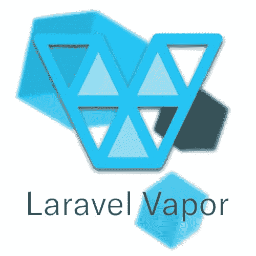

# Laravel 6 背后的代码

> 原文:[https://dev.to/anastasionico/the-code-behind-laravel-6-39hp](https://dev.to/anastasionico/the-code-behind-laravel-6-39hp)

*2019 年 9 月 4 日*

警告下面的内容包含漂亮的代码！如果你有心脏病或者喜欢程序代码。

不要侵犯这一段

我不知道这是不是只有我，但每次我使用的一些东西有重大更新或新版本时，我都会感到兴奋，就像是圣诞节节礼日一样。

有时这些是小更新，而其他时候这些更新可能是非常巨大和非常重要的。

在这种情况下，更新是巨大的。

这是为什么呢？

在本帖中，我们将回顾 Laravel 下一版本的所有新功能和最新技术。

6.0 版本的 Laravel

但是让我们从头开始。

## [](#%C2%A0)

## [](#what-is-laravel)什么是 laravel？

Laravel 是一个 PHP 框架，**它是一个将文件和组件很好地放在一起的系统**,允许使用它的 web 开发人员更快地工作，并提供更多方便的功能。
T3】

几个月前，我已经在一系列博客文章中回顾了 Laravel 和其他框架，所以我就不深究了。

这个系列有作者的描述、新闻和采访，我相信这是目前网上关于 PHP 框架最准确的系列。

但是现在，我们来谈谈拉勒维尔。

它有什么特别之处，为什么有成千上万的项目使用它？

Laravel 是有史以来最好的 PHP 开发框架之一，

毫无疑问，这是市场上最好的产品之一。

它非常易于使用，包括诸如*思想者*令人惊叹的 REPL 等功能。*口才*个人觉得我试过最好的 ORM，然后我们还有 *Nova，Forge，Mix，代客*，还有很多，真的很多。

仅仅为了说明 Laravel 的重要性，在工作论坛上有空缺职位专门要求“Laravel 开发人员”,而不再是 PHP 开发人员。

它真的改变了游戏，而且肯定是变得更好。

好吧，Laravel 很酷，但是，为什么现在要发一个帖子呢？

**原因是 Laravel 6.0 已于 9 月 3 日正式发布。**

它有几个惊人的特点，我想让你发现。

## [](#%C2%A0)

## Laravel 6.0 有什么新功能？

作为一种传统，这个 PHP 框架的版本每六个月发布一次(月份通常是二月和八月)，通常这些版本包含突破性的变化，当从旧版本更新到新版本时，您需要非常注意，尽管情况并不总是如此。

与此同时，次要版本和其他小补丁的发布时间跨度是可变的，它们可以从几天到几周不等。

因为有许多贡献者每天更新它，主版本通常更新得非常频繁。

尽管即将到来的版本是一个主要版本，但它不包含任何重大突破性的功能。

**如果你认为 Laravel 5 是在 2015 年 2 月发布的，那么这是一个不小的成就**

Taylor Otwell，所有这一切背后的想法解释说，原因是现在，这个 PHP 框架已经足够成熟，它的骨骼不需要为了提高代码的质量而极度扭曲。

Laravel 6 将是之前版本 5.5 和 5.1 的 LTS 版本。

普通版和 LTS 版的区别在于漏洞和安全补丁将分别每 2 年和 3 年提供一次。

这是迄今为止最长的支持期。

相比之下，对另一个版本的支持只有 6 个月和 12 个月。

为了明确日期，最终的错误将在 2021 年 9 月 3 日之前修复，安全问题将在 2022 年 9 月 3 日之前修复。

与其他主要版本不同，Laravel 6.0 对文件系统没有任何大的更改，事实上，它只是改进了 Laravel 5.8 中所做的工作。

不过，它包含了几个重要的改进

让我们来详细了解一下。

## [](#%C2%A0)

## [](#discover-semantic-versioning)发现语义版本化

从现在开始，为了与环境的其他部分(所有可用的包)保持同步，Laravel (laravel/framework)将遵循语义版本标准。

它是一个版本系统，试图解决软件开发人员在现有代码基础上发布新功能时遇到的问题。

这是一个标准的方法，允许跟踪新的提交和软件本身的开发过程。

它只是由 3 个数字组成，中间用一个点隔开。

格式为 1.2.3

第一个数字代表主要版本。第二个或中间的数字代表次要版本，而第三个也是最后一个数字用于显示补丁修复

这种新的发布系统不会改变周期，事实上它将保持不变。

[如果你想了解更多关于语义版本控制的内容，这里有一个总结](https://semver.org/)

## [](#laravel-vapor)拉勒韦尔蒸汽

[T2】](https://res.cloudinary.com/practicaldev/image/fetch/s--Td9o91sD--/c_limit%2Cf_auto%2Cfl_progressive%2Cq_auto%2Cw_880/http://anastasionico.uk/img/1/Laravelvapor.jpg)

让我们退一步做一点解释，

我们都知道什么是服务器。

我相信我们都知道什么是服务器端语言。

任何脚本无论是 PHP，NodeJs，Java 等都需要一个服务器才能正常运行。

过去几年的一个明显趋势是在无服务器模式下运行脚本。

当然，你仍然有一个服务器，但是现在脚本不再依赖于编程语言了。

**[AWS Lambda](https://aws.amazon.com/lambda/)**[**是允许我们使用无服务器的最著名的服务之一。**](https://aws.amazon.com/lambda/)

它已经很长时间不支持 PHP 了，你可以通过利用 SDK 来使用它，但是使用它还是有点麻烦。

奥特威尔先生和他的新作品拉勒维尔蒸汽出现了。

Vapor 是一个用于 Laravel 应用程序的无服务器平台。

目前，大多数 web 开发人员使用 Laravel Forge 来提供和部署他们的应用程序。

Forge 允许您连接您的服务器，并且 Forge 会专门为您的 Laravel 应用程序提供它。

拉勒维尔蒸汽做的不止这些。

您不必担心缩放，因为它会自动为您完成。

它允许任何登录该服务的 web 开发者按需扩展，无需任何服务器维护。

它还管理一些服务，如 CloudFront、队列、Redis、数据库和缓存。

## [](#%C2%A0)

## [](#improved-authorization-responses)改进授权响应

对于 PHP 开发人员来说，授权一直是一个重要的话题，

[能够使用会话对于任何 PHP 开发人员来说都是一个难以置信的优势，](http://anastasionico.uk/blog/php-basics#session_cookie)

这项功能的负责人是 Gary Green，他是一名伦敦的 web 开发人员，

Laravel 以前版本的一个问题是很难根据登录的不同用户来获取和显示授权信息。

在 Laravel 6.0 中，这是由于 Gate 类而带来的变化，

你下面看到的是这个类的 inspect 方法:

```
public function inspect($ability, $arguments = [])
{
    try {
        $result = $this->raw($ability, $arguments);
        if ($result instanceof Response) {
            return $result;
        }
        return $result ? Response::allow() : Response::deny();
    } catch (AuthorizationException $e) {
        return $e->toResponse();
    }
} 
```

从该方法返回的值是 Response 类的一个实例，这意味着您现在可以在代码中这样做:

$response = Gate::inspect('edit '，$ record)；

```
if ($response->allowed()) {
    // User is authorized to edit the record...
}

if ($response->denied()) {
    echo $response->message();
} 
```

当我们在控制器(或路由器)中使用 authorize()方法时，这些消息现在被返回到视图中

## [](#%C2%A0)

## [](#job-middleware)作业中间件

中间件是在请求进入应用程序之前对其进行过滤的神奇代码片段，

Laravel 在最近变得出名的原因之一是因为他们中的许多人的聪明使用。

它有授权中间件，一个 *CSRF* 的，一个*加密 cookie*的，一个修剪字符串加上增加新的可能性的。

现在，有了 Laravel 6，我们有可能为排队作业创建定制的特定于作业的中间件，这将节省我们开发人员的大量时间，并通过围绕作业的执行包装逻辑来制作更好的代码。

然后，在创建了作业之后，我们可以简单地通过调用方法 *middleware()* 来访问中间件，并返回我们想要实例化的类。

我们来看一个例子:

```
// This is the handle method in one of our job class in ThrottledJob.php
public function handle() {
    Redis::throttle('forge_api')->allow(30)->every(60)->then(function () {
        // perform 1 api call
    }, function () {
        return $this->release();
    });
}

// Code of the previous method now extracted into a specific middleware
class TrottleForgeApi {
    // Process the queued job.
  public function handle($job, $next) {
    Redis::throttle('forge_api')
      ->allow(30)->every(60)
      ->then(function () use ($job, $next) {
                 // perform 1 api call
                 $next($job);
              }, function () use ($job) {
                 $job->release();
              });
    }
}

// middleware attached to the job (it will run through the middleware before processing)
public function middleware()
{
    return [new TrottleForgeApi];
} 
```

## [](#%C2%A0)

## [](#lazy-collections)懒人收藏

在 Laracasts 网站上最受欢迎的一集里，你可以找到数百小时的 Laravel 和 PHP 教程，Jeffrey Way 将集合描述为类固醇数组，我发现这句话非常有趣。

[我也喜欢数组和它们的上百个函数](http://anastasionico.uk/blog/php-basics#arrays)。

现实情况是，这些集合已经是非常强大的工具，在这方面几乎没有改进的空间。

Laravel 的新版本利用了 PHP 中一个不太流行但却很强大的特性:

发电机。

生成器是一个惊人的特性，它允许你处理和管理大量的数据，并保持最低的内存水平，因为光标的值不是一次全部加载，而是一次加载一点。

我的意思是:

让我们来看一个官方文档的例子:

```
$users = App\User::cursor()->filter(function ($user) {
    return $user->id > 500;
});

foreach ($users as $user) {
    echo $user->id;
} 
```

你在这里看到的是一个方法链接的例子，为了正常工作， *filter()* 方法需要由 *cursor()* 方法返回的变量。

*cursor()* 返回一个类型为 *LazyCollection* 的变量(除了类*Illuminate \ Support \ lazy collection*)，

如上所述，该方法调用使用 PHP 生成器的 *LazyCollection::make()* 方法。

因此，一次加载一个元素，在这种情况下，您甚至可以过滤代码中 100000 个元素，它们将只在适当的时间被加载和执行。

## [](#eloquent-subquery-enhancements)雄辩子查询增强功能

## [](#%C2%A0)

如果您已经使用 PHP 或 PHP 框架有一段时间了，您就会知道在脚本中查询数据库是多么危险或有效。

如果查询编写得不正确，我们的应用程序的性能就会下降，并且每个新查询的效果都会增加。

当使用数据库时，解决这个问题的一种方法是当有多个请求组合时，尝试编写尽可能少的查询并使用子查询。

Jonathan Reinink 在这个版本的工作阶段提供了巨大的帮助，实现了对查询构建器的几个增强，包括 *select()* 方法、 *orderBy()* 子查询和 *from()* 子查询。

在下面的视频中，作者解释了他做了什么，以及我们如何在下一个 Laravel 6 应用程序中使用这个新特性。

[这是上次拉拉康](https://youtu.be/IBUXXErAtuk)期间重新链接的视频

## [](#%C2%A0)

## [](#laravel-ui)Laravel UI

Laravel 6 让我感到惊讶的一个选择是移除关于前端的所有东西的初始支架。

Laravel 5 将 VueJS 引入 footlights 是出了名的，Taylor Otwell 关于这个 Javascript 框架和 You's repository 的推文开始被分叉和加星，就像没有明天一样。

不过，在这个新版本中，Bootstrap 和 VueJs 都被提取出来，并由它们生成了一个独立的 Compores 包。

最有可能的原因是，如果一方面不能确定所有 Laravel 开发人员的应用程序都使用这两个前端框架，同时可以肯定的是，每个人都可以从文件和大小的减少中受益，从而提高新系统的速度。

无论如何，不要担心，如果有你选择的框架并且你也想使用命令 *make:auth* 你只需要把 *laravel/ui* 包含到你的应用程序中。

下面是方法:

```
composer require laravel/ui
php artisan ui vue --auth 
```

默认情况下，这两个软件包都将使用 NPM 安装。

一旦软件包安装完毕，你可以通过输入
来选择你想要使用的 Javascript 框架

```
php artisan ui vue
php artisan ui vue --auth

// Or 
php artisan ui react
php artisan ui react --auth 
```

## [](#upgrading-from-58-to-60)从 5.8 升级到 6.0

就连 Laravel 的这个升级指南也是用了同样的风格。

他们使用的方法是根据对您当前应用程序的影响程度对更改进行划分和排序。

在从 Laravel 5.8 升级到这个新版本的情况下，只有两个影响很大的变化会破坏您的应用程序。

### [](#%C2%A0-authorized-resources-amp-viewany)授权资源&视图任意

如果您正在使用方法*authorizer resource()*将授权策略附加到控制器，您现在必须定义一个 *vewAny()* 方法，

用户在访问 index 方法时必须调用它。

在其他情况下，调用索引方法将被视为未经授权。

### [](#%C2%A0)

### [](#string-amp-array-helpers)串&阵帮手

正如我们看到的前端搭建，这个新版本的一个目标是保持框架更精简，只专注于一件事。

出于这个原因，我们提取了几个特性，并制作了一个独立的包，如果我们愿意，我们可以使用它。

那两个帮手也不例外。

你可以调用他们的助手来使用 *Illuminate\Support\Str* 和 *Illuminate\Support\Arr* 类

否则，您可以使用下面的命令添加软件包:

## [](#%C2%A0)

## [](#conclusion)结论

在一个不断变化的技术世界中，一个 6 个月的软件被认为是古老的，如果不是危险的话，Laravel 是 PHP 开发框架之一。

其漂亮的代码、品牌和易用性使这个框架成为最受欢迎的框架之一。

说真的，你看过它的文档吗？

更不用说整个生态系统，已经包括顶级产品，如锻造，流明，代客，收银员，新星和修补匠，并仍在增加数量和质量每几个月。

最后到达家庭的无服务器平台蒸汽。

我们只能期待奥特威尔和他的团队有所作为。

我很高兴能在一些新项目中尝试它，我也想知道你对这个新产品有什么想法。

[
T3】](http://eepurl.com/dIZqjf)