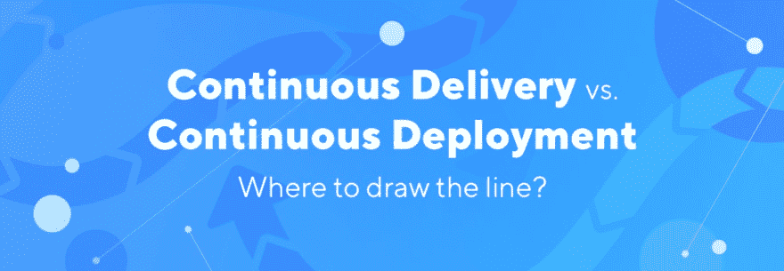
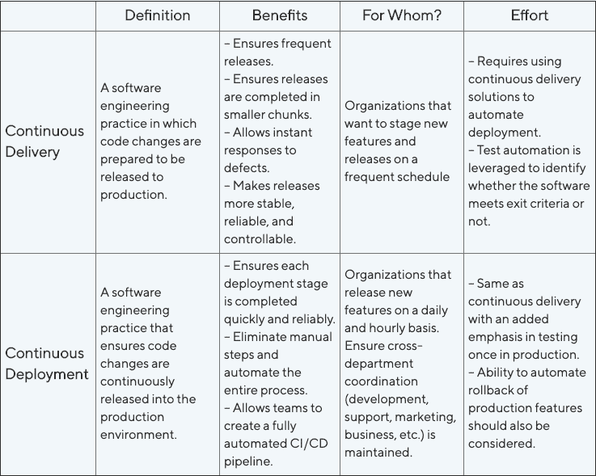
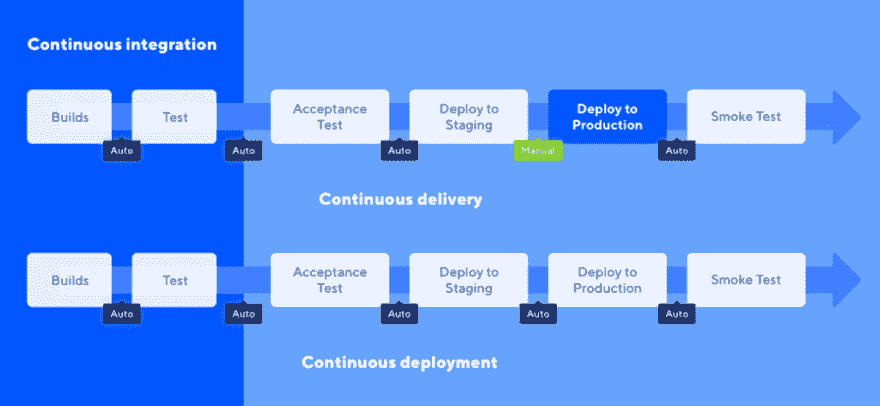

# 持续交付与持续部署:界限在哪里？

> 原文:[https://dev . to/katalon/continuous-delivery-vs . continuous-deployment-where-to-draw-the-line-18ld](https://dev.to/katalon/continuous-delivery-vs-continuous-deployment-where-to-draw-the-line-18ld)

您可能听说过 CI/CD 管道这个术语。您可能已经了解了这些实践:持续集成、持续交付以及持续部署。

但是不确定性仍然存在:持续交付和持续部署之间有什么区别？您应该将哪一项应用于您的 CI/CD 渠道？这些术语之间有什么联系？如何找出哪一个最适合你的团队？

这个博客将会消除困惑，从定义到差异，并帮助你为你的团队挑选出最合适的实践。

## **什么是连续交货？**

**连续交付**是一种软件工程实践，在这种实践中，代码变更准备发布到产品中。但是，请记住，代码在投入生产之前必须通过自动化单元测试、集成测试和系统测试。

持续集成和持续交付之间的转换通常是自动完成的，包括单元、集成和系统级别的自动化测试。

自动化测试提供了更彻底的验证。开发人员可以在公开发布之前更新和定位问题。自动化测试和自动化发布过程是建立无缝和机械化管道的完美结合。

有了阶段环境中可用的版本，持续交付允许开发人员以他们选择的任何速度发布，只需按一下按钮。这意味着启动释放的决定必须由人来作出，并且只有在这之后才会发生连续的释放。

## **什么是连续部署？**

**持续部署**比持续交付更进了一步。这是一种软件工程实践，可以确保代码变更不断地发布到生产环境中。目标是每当开发人员做出更改时发布一个新版本，并自动将这些更改提供给最终用户。

持续部署是软件开发公司的终极目标。您公司的开发和 IT 团队必须为实现持续部署做好准备。生产就绪环境和适当的实践必须到位，以确保实际环境符合标准。

在连续部署中，代码在模拟环境中运行和维护，确保最终质量得到考虑。实时监控实时环境也是跟踪任何出现的问题并快速解决它们的一个要求。

## **连续交付与连续部署的区别**

[T2】](https://res.cloudinary.com/practicaldev/image/fetch/s--ezITjOmc--/c_limit%2Cf_auto%2Cfl_progressive%2Cq_auto%2Cw_880/https://d1h3p5fzmizjvp.cloudfront.net/wp-content/uploads/2019/09/04165209/Continuous-Delivery-vs-Continuous-Deployment-Where-to-draw-the-line_750%25402x.png)

经常有人问这个问题:**CI/CD 中的 CD 是什么？**代表部署还是交付？

嗯，答案是**都是**。根据现有的工作流程和需求，您的团队将选择最适合他们和他们的产品的实践。

连续交付是公司的最佳选择，这些公司希望在新版本部署到最终用户之前进行控制并成为最后的过滤器。这种实践还允许企业以更规范的方式运作:用自动化工具自动测试最终产品，然后由质量保证(QA)团队手动修改。

连续部署可以被认为是连续交付的一个特例。在这个实践中，团队必须确保构建通过了所有的测试，并且测试套件足够好来验证构建并自动部署它们。

持续部署和持续交付都依赖于实时基础设施和应用程序监控工具来维护产品并发现任何在发布前没有发现的问题。

持续地测试和监控产品，并在测试中加入新的版本，是任何成功的产品都需要的质量控制的最终方面。

**持续交付与持续部署|表格对比**

[T2】](https://res.cloudinary.com/practicaldev/image/fetch/s--y7PIop3Q--/c_limit%2Cf_auto%2Cfl_progressive%2Cq_auto%2Cw_880/https://d1h3p5fzmizjvp.cloudfront.net/wp-content/uploads/2019/09/25170336/Screen-Shot-2019-09-25-at-4.58.51-PM.png)

## **每次练习的好处**

### **连续交货**

连续交付确保了在较小的块中定期完成发布。即使最终用户没有注意到显著的变化，一天几次小规模的发布通常比一周甚至更长时间的大规模发布更有效。

最终用户更容易接受小变化，而不是大变化。这些较小的变化也更加稳定、可靠和可控。

失败的测试用例可能出现在任何级别和环境中。因此，CI/CD 管道必须包含一个反馈通道，以便快速向开发人员报告故障。这些反馈循环必须尽可能的短，以便与稳定的发布流竞争。然后，开发人员可以将失败的测试放入 backlog 中，以便在以后的 sprint 中修复——或者，如果失败很严重，立即修复。对关键故障的快速响应是在每个开发生命周期中实现 CI/CD 管道的主要好处。

### **连续部署**

当团队依靠自动化基础设施来确保以快速可靠的方式实现部署的每个部分时，成功的连续部署就会发生。手动测试在连续部署中不是一个选项，因为它会减慢过程。此外，与自动化测试相比，它的效率不高。

持续部署允许团队致力于完全自动化的管道，包括部署到生产。通过自动将新版本推向生产，团队将不再需要担心“大版本”,并直接接收来自用户对产品的反馈。

## **持续集成、持续部署和持续交付如何相互关联**

这给我们带来了一个问题:CD 在 CI/CD 管道中意味着什么？

[T2】](https://res.cloudinary.com/practicaldev/image/fetch/s--bAXI2rAZ--/c_limit%2Cf_auto%2Cfl_progressive%2Cq_auto%2Cw_880/https://d1h3p5fzmizjvp.cloudfront.net/wp-content/uploads/2019/09/04164708/CI-CD-CD-1024x473.png)

典型的 CI/CD 管道始于持续集成过程——允许开发人员将代码变更持续集成到共享存储库中。

这确保了代码可以被持续测试，开发人员不会重复其他开发人员的工作，并且与代码库的集成会更加顺利。

在持续集成阶段之后，生产转移到持续交付。代码更改将经过多次修复和反馈，然后才会被推入类似生产的环境中。

在连续交付中，团队决定向客户部署什么以及何时部署新的更新。

连续部署使部署过程更进一步，完全不受人为干预。这两个概念没有共享相同的定义，但是它们有一个共同的目标，即自动化和简化开发过程。

有时，持续交付与持续部署相结合，以充分利用两种实践的优势。

关于什么是 CI/CD 的更深入的分析，一定要看看我们之前的博客: **[什么是 CI/CD？](https://www.katalon.com/resources-center/blog/ci-cd-introduction/)T3】**

## **想了解更多？**

无论您的团队集成到 CI/CD 管道中的是持续交付还是持续部署，这两者都是确保您的团队始终保持最新版本并让客户满意的良好实践。

从规划到编码，然后构建出代码实现，最重要的部分是持续彻底地测试管道。然后，工作流继续将代码发布到产品中，将更改部署到实际环境中，操作并监控发布，以记录任何应该修复或升级的元素。

免费下载 Katalon Studio，以帮助您的 CI/CD 实现和测试自动化需求。

[T2】](https://www.katalon.com/)

持续交付与持续部署:分界线在哪里？最早出现在[卡塔隆工作室](https://www.katalon.com)。