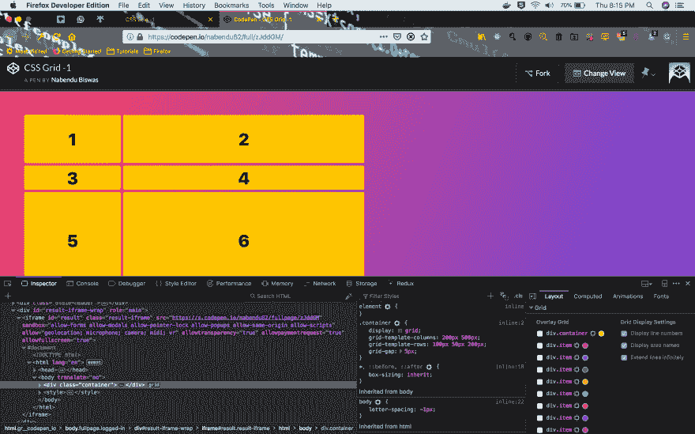
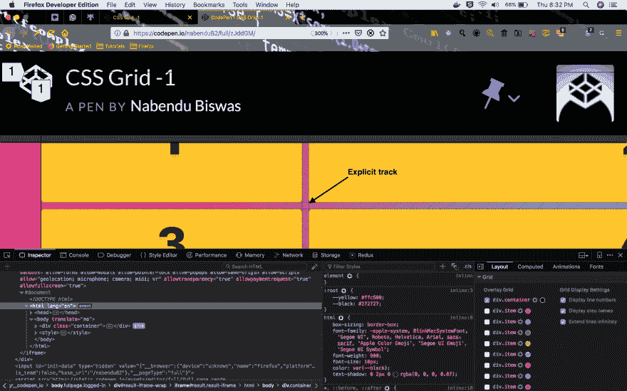
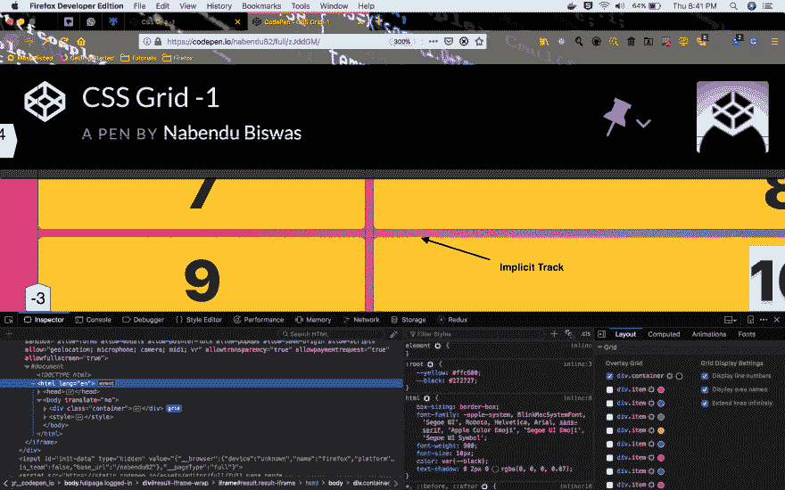

# CSS 网格基础-2

> 原文:[https://dev.to/nabendu82/basics-of-css-grid-2-109n](https://dev.to/nabendu82/basics-of-css-grid-2-109n)

欢迎来到本系列的第 2 部分。

让我从真正有益于网格开发的开发工具开始。在撰写本文时，Firefox 开发者版仍然拥有最好的自动检测网格的工具。

网格是一个非常视觉化的东西，有**隐式轨迹**和**显式轨迹**，在最新的 Firefox 开发者版中显示得非常漂亮。

让我们使用上一篇教程中的[代码笔](https://codepen.io/nabendu82/full/zJddGM/)来演示这一点。

我已经打开了 codepen，然后在 Firefox developer edition 上的**右键点击**和 **Inspect 元素**，向我展示开发者工具。这类似于 Chrome 或其他浏览器的开发工具，但在右侧有一个附加部分。注意这里有一个布局，这是在网格中工作的主要工具。

[ ](https://res.cloudinary.com/practicaldev/image/fetch/s--3CBOa9vv--/c_limit%2Cf_auto%2Cfl_progressive%2Cq_auto%2Cw_880/https://cdn-images-1.medium.com/max/5760/1%2Az-3uz7mRVvbjEbv-91Og6g.png) *火狐开发者版*

在我们的代码中有一个主网格(我们接下来会看到)，叫做**容器**。我已经选择了它。还有一个黄色的圆圈(如上面的截图)，选择它，并使其成为黑色或任何深色。另外，确保所有三个**网格显示设置**复选框都被选中。

[ ](https://res.cloudinary.com/practicaldev/image/fetch/s--JKcdPbxz--/c_limit%2Cf_auto%2Cfl_progressive%2Cq_auto%2Cw_880/https://cdn-images-1.medium.com/max/5760/1%2AIgFztOtKvatzj0H22UhJ-g.png) *网格布局*

下面是上面网格的代码。我们有两个网格列和三个网格行。

```
<div class="container">
    <div class="item">1</div>
    <div class="item">2</div>
    <div class="item">3</div>
    <div class="item">4</div>
    <div class="item">5</div>
    <div class="item">6</div>
    <div class="item">7</div>
    <div class="item">8</div>
    <div class="item">9</div>
    <div class="item">10</div>
  </div>
  <style>
    .container {
      display: grid;
      grid-template-columns: 200px 500px;
      grid-template-rows: 100px 50px 200px;
      grid-gap: 5px;
    }
  </style> 
```

现在让我们来看看**隐性轨迹**和**显性轨迹**。我在浏览器中放大，我们有 1 到 3 个项目。**显式轨迹**被标记为虚线(— — — —)并在创建时被称为**显式**，因为我们使用*网格模板列*和*网格模板行*来声明它们。

[ ](https://res.cloudinary.com/practicaldev/image/fetch/s--pinQx0Ir--/c_limit%2Cf_auto%2Cfl_progressive%2Cq_auto%2Cw_880/https://cdn-images-1.medium.com/max/5760/1%2AKUzhSb7xQNsIQOx4NbjznA.png) *显性轨迹*

**隐含轨迹**用虚线(……)标记..)并且它们被称为隐式的，因为它们是由网格系统创建的。我们只有三行，因为*网格-模板-行:100px 50px 200px*
最后两行是**隐式**，因为我们没有定义它们。

[ ](https://res.cloudinary.com/practicaldev/image/fetch/s--ct7EkVc9--/c_limit%2Cf_auto%2Cfl_progressive%2Cq_auto%2Cw_880/https://cdn-images-1.medium.com/max/5760/1%2AkGDGCTEuDy8Tjlj4Mhk6Qw.png) *隐含轨迹*

默认情况下，这些隐式轨迹采用其内部元素的高度。因为，在这种情况下，它采用数字 7、8、9 和 10 的高度。我们可以通过一个名为 **grid-auto-rows** 的属性来改变这种情况，这是所有隐式行的大小。

```
.container {
      display: grid;
      grid-template-columns: 200px 500px;
      grid-template-rows: 100px 50px 200px;
      grid-auto-rows: 150px;
      grid-gap: 5px;
    } 
```

现在这两个隐式行各为 150px。

[ ](https://res.cloudinary.com/practicaldev/image/fetch/s--owMzBwVF--/c_limit%2Cf_auto%2Cfl_progressive%2Cq_auto%2Cw_880/https://cdn-images-1.medium.com/max/5760/1%2Ak1DOxpnSr6iMdpUDZGjwUQ.png) *网格-自动-行*

自动流动-默认情况下，在下一行创建任何隐式轨迹。我们可以通过 **grid-auto-flow** 属性来改变它。

我们将使用这个[代码笔](https://codepen.io/nabendu82/full/PdJKjG/)进行网格自动流动。首先我们有了这个基本代码。它有*两列和两个项目*，所以两者都是显式的，并相应地放置。

```
<div class="container">
    <div class="item">1</div>
    <div class="item">2</div>

</div>
  <style>
    .container {
      display: grid;
      grid-template-columns: 400px 200px;
      grid-gap: 15px;
    }
  </style> 
```

[](https://res.cloudinary.com/practicaldev/image/fetch/s--EboDjGN7--/c_limit%2Cf_auto%2Cfl_progressive%2Cq_auto%2Cw_880/https://cdn-images-1.medium.com/max/5752/1%2ANZ6OOSRps3acDrLI18P-RQ.png)T3】结果

现在，如果我们在这个设置中有第三个项目，它将在项目 1 下面。这个隐式项遵循属性 *grid-auto-flow: row* ，这是默认选项，我们不必提及。

```
<div class="container">
    <div class="item">1</div>
    <div class="item">2</div>
    <div class="item">3</div>

</div>
  <style>
    .container {
      display: grid;
      grid-template-columns: 400px 200px;
      grid-gap: 15px;
    }
  </style> 
```

[](https://res.cloudinary.com/practicaldev/image/fetch/s--osdJ_3tJ--/c_limit%2Cf_auto%2Cfl_progressive%2Cq_auto%2Cw_880/https://cdn-images-1.medium.com/max/5760/1%2AO3VB8w-W3esh4x7Uj23_oQ.png)T3】结果

现在，在上面的布局中，如果我们给 *grid-auto-flow: column* ，那么隐式项目 3 将被放置在项目 2 旁边。

```
<div class="container">
    <div class="item">1</div>
    <div class="item">2</div>
    <div class="item">3</div>

</div>
  <style>
    .container {
      display: grid;
      grid-template-columns: 400px 200px;
      grid-auto-flow: column;
      grid-gap: 15px;
    }
  </style> 
```

[](https://res.cloudinary.com/practicaldev/image/fetch/s--a9_SJNjX--/c_limit%2Cf_auto%2Cfl_progressive%2Cq_auto%2Cw_880/https://cdn-images-1.medium.com/max/5748/1%2Aqxk5F1Ggjgo12gOle9YipQ.png)T3】结果

本系列的第 2 部分到此结束。