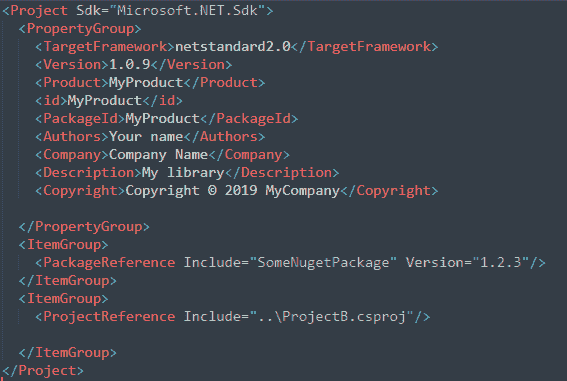

# 使用“dotnet pack”包括 Nuget 包引用*和*项目引用 DLL📦

> 原文：<https://dev.to/yerac/include-both-nuget-package-references-and-project-reference-dll-using-dotnet-pack-2d8p>

原文：<http://yer.ac/blog/2019/09/05/dotnet-pack-project-reference-and-nuget-dependency/>

最近我一直试图利用`dotnet pack`命令为我们的 dotnet 核心项目生成更多的 Nuget 包。我遇到的一个问题是，该命令要么引用所需的 nuget 包，要么引用项目 dll，而不是两者都引用。

## 当前问题。

如果您有一个项目 A，它有一个对项目 B 的项目引用，并且包含一个名为 Package A 的 nuget 包，那么您会期望生成的包包含一个到所需 nuget 包和项目 B 的 DLL 的链接，对吗？然而，这并不是 dotnet pack 命令的工作方式。

这个问题在他们的回购协议(即[https://github.com/NuGet/Home/issues/3891](https://github.com/NuGet/Home/issues/3891))上被广泛报道，不幸的是，似乎开发者和社区对什么是“正确”有一点分歧。官方的立场(据我所知)是项目引用不会被包括在内，因为它们应该是自己的包。然而，这并不总是实际的或所期望的。

## 变通办法。

围绕堆栈溢出和 Github 已经提出了大量的解决方法，包括拥有一个单独的 nuspec 文件，使用 Powershell 将东西注入到生成的 nupkg 中等等…

下面的解决方案对我有效，但是当然，YMMV。

最后，我放弃了在我的项目中使用自己的`.nuspec`文件(根据一些 SO 帖子)，而是使用了 CSPROJ(根据推荐)。在下面，您可以看到打包所需的字段(版本、命名等)，对 nuget 包的引用，以及对解决方案中另一个项目的引用。

<figure>[](https://res.cloudinary.com/practicaldev/image/fetch/s--_xK4-peq--/c_limit%2Cf_auto%2Cfl_progressive%2Cq_auto%2Cw_880/https://i1.wp.com/yer.ac/blog/wp-content/uploads/2019/09/image-1.png%3Fw%3D840) 

<figcaption>填写了基本包信息的 CSPROJ 片段。</figcaption>

</figure>

如果您现在运行 dotnet pack，它将生成一个适当命名的包，其中包含一个对`SomeNugetPackage`的 nuget 依赖。这可以通过用归档工具(7Zip，WinRar，WinZip…)打开 nupkg 并看到`lib`文件夹中唯一的 DLL 将是被打包的项目的 DLL 来确认。

修复方法如下:

*   更改项目引用，将`ReferenceOutputAssembly`标志设置为 true，将`IncludeAssets`设置为 DLL 名称

```
<ProjectReference Include="..\ProjectB.csproj">
  <ReferenceOutputAssembly>true</ReferenceOutputAssembly>
  <IncludeAssets>ProjectB.dll</IncludeAssets>
</ProjectReference> 
```

<svg width="20px" height="20px" viewBox="0 0 24 24" class="highlight-action crayons-icon highlight-action--fullscreen-on"><title>Enter fullscreen mode</title></svg> <svg width="20px" height="20px" viewBox="0 0 24 24" class="highlight-action crayons-icon highlight-action--fullscreen-off"><title>Exit fullscreen mode</title></svg>

*   将下面一行添加到`<PropertyGroup>`元素中

```
<TargetsForTfmSpecificBuildOutput>$(TargetsForTfmSpecificBuildOutput);CopyProjectReferencesToPackage</TargetsForTfmSpecificBuildOutput> 
```

<svg width="20px" height="20px" viewBox="0 0 24 24" class="highlight-action crayons-icon highlight-action--fullscreen-on"><title>Enter fullscreen mode</title></svg> <svg width="20px" height="20px" viewBox="0 0 24 24" class="highlight-action crayons-icon highlight-action--fullscreen-off"><title>Exit fullscreen mode</title></svg>

*   在`<project>`标签之间添加新目标

```
<Target DependsOnTargets="ResolveReferences" Name="CopyProjectReferencesToPackage">
    <ItemGroup>
      <BuildOutputInPackage Include="@(ReferenceCopyLocalPaths->WithMetadataValue('ReferenceSourceTarget', 'ProjectReference'))"/>
    </ItemGroup>
  </Target> 
```

<svg width="20px" height="20px" viewBox="0 0 24 24" class="highlight-action crayons-icon highlight-action--fullscreen-on"><title>Enter fullscreen mode</title></svg> <svg width="20px" height="20px" viewBox="0 0 24 24" class="highlight-action crayons-icon highlight-action--fullscreen-off"><title>Exit fullscreen mode</title></svg>

所以现在你得到了类似这样的东西

<figure>[![<Project Sdk="Microsoft.NET.Sdk"><br>
  <PropertyGroup><br>
    <TargetFramework>netstandard2.0</TargetFramework><br>
    <Version>1.0.9</Version><br>
    <Product>MyProduct</Product><br>
    <id>MyProduct</id><br>
    <PackageId>MyProduct</PackageId><br>
    <Authors>Your name</Authors><br>
    <Company>Company Name</Company><br>
    <Description>My library</Description><br>
    <Copyright>Copyright © 2019 MyCompany</Copyright><br>
    <TargetsForTfmSpecificBuildOutput>$(TargetsForTfmSpecificBuildOutput);CopyProjectReferencesToPackage</TargetsForTfmSpecificBuildOutput><br>
  </PropertyGroup><br>
  <ItemGroup><br>
    <PackageReference Include="SomeNugetPackage" Version="1.2.3"/>  <br>
  </ItemGroup><br>
  <ItemGroup><br>
    <ProjectReference Include="..\ProjectB.csproj"><br>
      <ReferenceOutputAssembly>true</ReferenceOutputAssembly><br>
      <IncludeAssets>ProjectB.dll</IncludeAssets><br>
    </ProjectReference>  <br>
  </ItemGroup><br>
  <!--Next line is to ensure that dependant DLLS are copied--><br>
  <Target DependsOnTargets="ResolveReferences" Name="CopyProjectReferencesToPackage"><br>
    <ItemGroup><br>
      <BuildOutputInPackage Include="@(ReferenceCopyLocalPaths->WithMetadataValue('ReferenceSourceTarget', 'ProjectReference'))"/><br>
    </ItemGroup><br>
  </Target><br>
</Project><br>
](img/3a304951deb0aeb8faa748d991afbbc5.png)](https://res.cloudinary.com/practicaldev/image/fetch/s--RwUPTRA1--/c_limit%2Cf_auto%2Cfl_progressive%2Cq_auto%2Cw_880/https://i1.wp.com/yer.ac/blog/wp-content/uploads/2019/09/image-2.png%3Ffit%3D700%252C298) 

<figcaption>最终结果 CSPROJ。</figcaption>

</figure>

(点击放大)

现在，如果您运行 dotnet pack，您应该会在包的`lib`文件夹下看到任何项目引用 DLL，如果您检查包内的 nuspec 文件(或将其上传到您的包 repo ),您应该会看到 nuget 依赖项。

希望这能帮助到一些人，因为周围有很多相互矛盾的信息。请让我知道这是否会引起任何问题！

帖子[包括 Nuget 包引用和使用“点网包”的项目引用 DLL📦](http://yer.ac/blog/2019/09/05/dotnet-pack-project-reference-and-nuget-dependency/)最早出现在 [yer.ac |一个开发者的冒险，等等。](http://yer.ac/blog)。