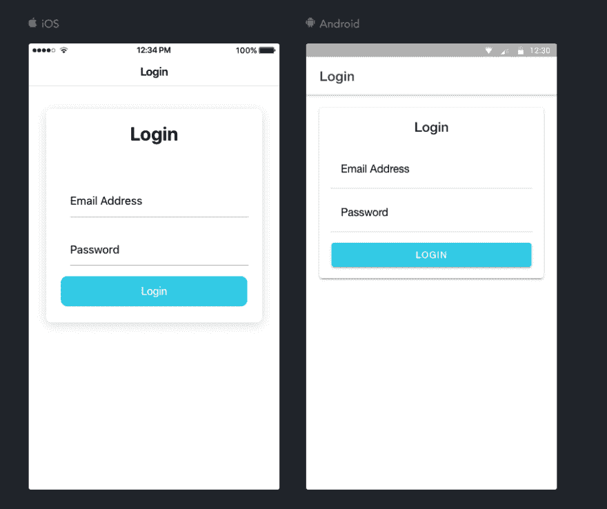

# Devlog #1:设置

> 原文:[https://dev.to/daydreamjesse/devlog-1-setting-up-11gi](https://dev.to/daydreamjesse/devlog-1-setting-up-11gi)

今天是我计划在未来几周推出的一款应用的第一天原型制作。

我大部分时间都在打基础。这是我第一次使用 Ionic，所以我花了很多时间浏览文档，以确保我想使用它。在我安装了 Ionic/Angular 之后，我为这个应用程序买了一个域名，1)它的登陆页面，2)这样我就可以有一封专门针对它的支持邮件。一旦我设置好 G Suite，我就去 Firebase 设置一个应用程序来启用身份验证和 Firestore。我以前用过所有这些技术(不包括 Ionic)，但没有一起用过。

在获得一个基本的 Ionic 登录页面并运行之后，我开始实现 Firebase。现在，如果你没有花一个多小时去尝试修复一个“bug ”,那就不是编程了，这个“bug”实际上就是你忘记了一些最基本的构建模块。

[T2】](https://res.cloudinary.com/practicaldev/image/fetch/s--o0IYM2kL--/c_limit%2Cf_auto%2Cfl_progressive%2Cq_auto%2Cw_880/https://thepracticaldev.s3.amazonaws.com/i/5mb9uwb1kg4we1zlnw6f.png)

对我来说，我不明白为什么它不能识别“环境”模块。休息了一段时间后，我回过头来意识到 *duh* ，我正试图从一个类型脚本文件导入一个变量，而没有声明我需要它的类型脚本文件。因此，”../环境'变成了'../环境/环境。”

接下来，我为我的登录页面设置了表单控制和验证，不得不到此为止。明天，我计划设置一切 Firebase:登录电子邮件/密码和谷歌，密码重置，帐户删除等。

[T2】](https://res.cloudinary.com/practicaldev/image/fetch/s--QPz0OScQ--/c_limit%2Cf_auto%2Cfl_progressive%2Cq_auto%2Cw_880/https://thepracticaldev.s3.amazonaws.com/i/j2s3pgdurrwnq67t1b1x.png)

敬请期待更多精彩！我会每天发帖子，即使我只完成了一些小事。