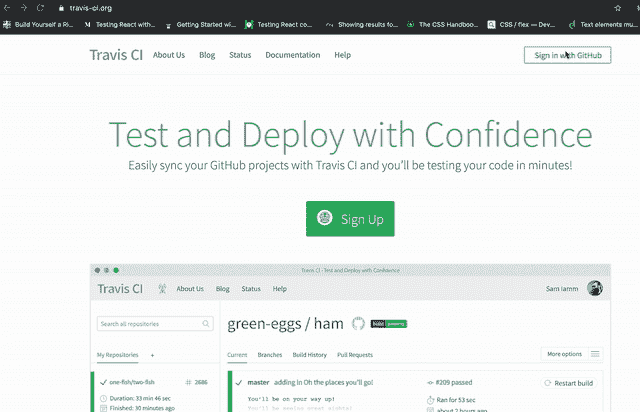
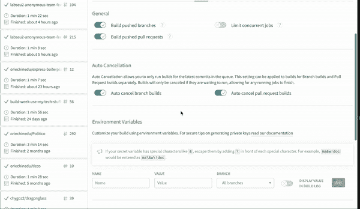
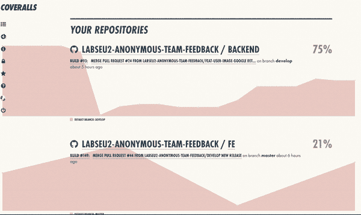
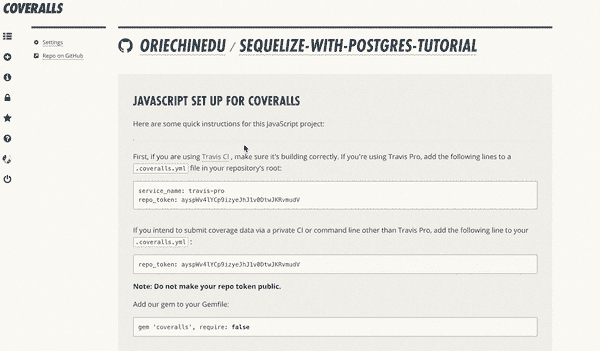

# 节点/快速 API 中带有 Travis CI 和工作服的 CI/CD

> 原文：<https://dev.to/nedsoft/ci-cd-with-travisci-and-coveralls-in-node-express-api-2i55>

*本文最初发表在我的[博客](https://www.oriechinedu.com/posts/ci-cd-with-travis-and-coveralls-in-node)T3 上*

在之前的[文章](https://www.oriechinedu.com/posts/testing-nodejs-express-api-with-jest-and-supertest/)中，我们为 API 内置[第二部分](https://www.oriechinedu.com/posts/performing-crud-with-sequelize/)编写了端到端测试。在这一部分中，我们将重点关注集成 Travis CI 和工作包，当我们将代码推送到存储库时，这将自动运行测试，从而确保代码库的新代码在集成之前满足给定的规范。

### 术语解释

*   **持续集成(CI)** -持续集成是一种软件开发实践，通过这种实践，使用 Travis CI、Circle CI 等工具将新代码变更自动集成到代码库中。它确保传入的更改不会破坏应用程序。CI 工具运行自动化测试，并在集成之前断言新代码是正确的。

*   **持续交付(CD)** -持续交付是持续集成的扩展，以确保您能够以可持续的方式快速向您的客户发布新的变更。——*。*

**   [**Travis CI**](https://docs.travis-ci.com)——一个持续集成平台，它通过自动构建和测试代码变更来支持开发过程，提供关于变更成功的即时反馈。- [*文档*](https://docs.travis-ci.com/user/for-beginners/)

    *   **——一个独立于语言和 CI 的 web 服务，帮助跟踪代码覆盖率，并确保你所有的新代码都被完全覆盖。- [*文档*](https://docs.coveralls.io/)*** 

 ***### 入门

接下来，在这里克隆前几篇文章[中使用的项目。或者，如果您已经有一个要添加配置项的项目，请在您喜欢的文本编辑器中打开它。](//git@github.com:oriechinedu/sequelize-with-postgres-tutorial.git)

## 集成特拉维斯词

第一步是将项目存储库链接到您的 [`Travis account`](https://docs.travis-ci.com) 。如果您没有 Travis 帐户，您可以使用 GitHub 帐户快速注册。按照下面的 gif 图像将您的回购与 Travis CI 联系起来:

[](https://res.cloudinary.com/practicaldev/image/fetch/s--xCdpL7Sg--/c_limit%2Cf_auto%2Cfl_progressive%2Cq_66%2Cw_880/https://thepracticaldev.s3.amazonaws.com/i/vjieg7ghd0xcnljg8wcq.gif)

[](https://res.cloudinary.com/practicaldev/image/fetch/s--odaaAO-j--/c_limit%2Cf_auto%2Cfl_progressive%2Cq_66%2Cw_880/https://thepracticaldev.s3.amazonaws.com/i/4i2kra27z8m6yg3jyp8i.gif)

上面的 gif 图像演示了将 repo 集成到 travis CI 的过程。第一个图像显示了如何在 Travis CI 上添加并激活 repo。第二张图展示了如何添加测试可能需要的环境变量。第二幅图像的最后一部分展示了如何生成`Travis build badge`。复制生成的 markdown 并添加到项目自述文件中，它应该如下所示:

[](https://travis-ci.org/oriechinedu/sequelize-with-postgres-tutorial)

接下来，我们需要创建一个名为`.travis.yml`的文件。`.travis.yml`包含 Travis CI 工作所需的命令。

在项目根目录下，运行下面的命令:

```
touch .travis.yml 
```

<svg width="20px" height="20px" viewBox="0 0 24 24" class="highlight-action crayons-icon highlight-action--fullscreen-on"><title>Enter fullscreen mode</title></svg> <svg width="20px" height="20px" viewBox="0 0 24 24" class="highlight-action crayons-icon highlight-action--fullscreen-off"><title>Exit fullscreen mode</title></svg>

将下面的代码复制到`.travis.yml` :

```
language: node_js
node_js:
  - 'stable'
install: npm install
services:
  - postgresql
before_script:
  - psql -c 'create database test_db;' -U postgres
script: npm test
after_success: npm run coverage 
```

<svg width="20px" height="20px" viewBox="0 0 24 24" class="highlight-action crayons-icon highlight-action--fullscreen-on"><title>Enter fullscreen mode</title></svg> <svg width="20px" height="20px" viewBox="0 0 24 24" class="highlight-action crayons-icon highlight-action--fullscreen-off"><title>Exit fullscreen mode</title></svg>

查看`.travis.yml`，第一行指定了编写测试的语言。第二行告诉 Travis 使用 node.js 的稳定版本，Travis CI 提供了自己的数据库，我们需要做的就是告诉 Travis 我们需要的数据库类型，这是在`services`中完成的。`before_script`告诉 Travis 创建一个数据库`test_db`。`after_success`告诉 Travis 运行覆盖测试，并在测试通过后发送覆盖报告。

## 连体工作服

为了将项目存储库集成到工作服中，我们将遵循与集成 Travis CI 相似的步骤。使用您的 Github 帐户登录[workalls . io](https://docs.coveralls.io/)。请看下面的 gif 图片，了解如何将存储库添加到工作服中。

[](https://res.cloudinary.com/practicaldev/image/fetch/s--wUXZyeAv--/c_limit%2Cf_auto%2Cfl_progressive%2Cq_66%2Cw_880/https://thepracticaldev.s3.amazonaws.com/i/uuqa1n3p1b7zof9tx6ai.gif)

[](https://res.cloudinary.com/practicaldev/image/fetch/s--iomLWurs--/c_limit%2Cf_auto%2Cfl_progressive%2Cq_66%2Cw_880/https://thepracticaldev.s3.amazonaws.com/i/a328nz6ygpm9h7cywyt7.gif)

接下来，复制覆盖徽章并添加到项目自述文件中。它看起来如下所示:
[](https://coveralls.io/github/oriechinedu/sequelize-with-postgres-tutorial?branch=master)

如果您想要在每次本地运行测试时发送覆盖率报告，那么创建一个名为`.coveralls.yml`的文件，复制在项目仪表板上的`repo_token`并添加到其中。注意`repo_token`对于公共存储库是可选的。

接下来，我们需要创建`coverage`脚本。为此，复制下面的代码并添加到 package.json.
中的`scripts`

```
 "coverage":  "npm run pretest && jest --coverage && cat ./coverage/lcov.info | coveralls" 
```

<svg width="20px" height="20px" viewBox="0 0 24 24" class="highlight-action crayons-icon highlight-action--fullscreen-on"><title>Enter fullscreen mode</title></svg> <svg width="20px" height="20px" viewBox="0 0 24 24" class="highlight-action crayons-icon highlight-action--fullscreen-off"><title>Exit fullscreen mode</title></svg>

接下来，安装工作服包。

```
npm install --save-dev coveralls 
```

<svg width="20px" height="20px" viewBox="0 0 24 24" class="highlight-action crayons-icon highlight-action--fullscreen-on"><title>Enter fullscreen mode</title></svg> <svg width="20px" height="20px" viewBox="0 0 24 24" class="highlight-action crayons-icon highlight-action--fullscreen-off"><title>Exit fullscreen mode</title></svg>

现在，运行覆盖率测试:

```
npm run coverage 
```

<svg width="20px" height="20px" viewBox="0 0 24 24" class="highlight-action crayons-icon highlight-action--fullscreen-on"><title>Enter fullscreen mode</title></svg> <svg width="20px" height="20px" viewBox="0 0 24 24" class="highlight-action crayons-icon highlight-action--fullscreen-off"><title>Exit fullscreen mode</title></svg>

如果在`.coveralls.yml`中有`repo_token`，你会注意到覆盖徽章已经更新，你可以看到上面最初写着`Coverage Unknown`。

最后，我们需要将更改推送到存储库，如果一切正常，Travis 将被立即触发，代码被推送到存储库，如果测试成功运行，构建标记将被更新到`build passing`。

瞧啊。下图显示构建通过:
[](https://res.cloudinary.com/practicaldev/image/fetch/s--zBNvBVIC--/c_limit%2Cf_auto%2Cfl_progressive%2Cq_auto%2Cw_880/https://thepracticaldev.s3.amazonaws.com/i/w1hb13yq3i67jawqoizo.png)

### 如何查看未覆盖区域

请注意，当您运行命令`npm run coverage`时，会生成一个名为`coverage`的文件夹，该文件夹包含了发送给覆盖率报告者的覆盖率信息，在本例中，是 coverage workalls。

在`coverage/lcov-report/index.html`的`coverage`里面还有一个 HTML 文件。这个文件包含测试覆盖和未覆盖的代码行的可视信息。当你想知道你需要集中在哪里来提高测试覆盖率时，这是很方便的。`coverage/lcov-report/index.html`的样本图像如下所示:

[](https://res.cloudinary.com/practicaldev/image/fetch/s--IleUJ-Ko--/c_limit%2Cf_auto%2Cfl_progressive%2Cq_auto%2Cw_880/https://thepracticaldev.s3.amazonaws.com/i/rq8h4mrpsyy5dzru91fq.png)

您可以单击每一行来展开它以了解更多详细信息。

### 结论

我们成功整合了特拉维斯. CI 和工作服。现在，假设有几个开发人员为代码库做贡献，集成检查传入的更改是安全的，不会破坏现有的代码库。

接下来，您可以将您的自动部署设置为一旦测试通过就运行，这样，您就不需要在每次代码库有新的变化时都进行手动部署。这就是 CI/CD 在发挥作用。

我可能没有触及这个话题的每一点，但请放心，我可以回答你的问题，如果有的话。请随时联系我，就此话题进行更多讨论。

#### 附加链接

*   [Travis Ci 文档](https://docs.travis-ci.com/user/database-setup/)
*   [节点工作服](https://github.com/nickmerwin/node-coveralls)
*   [持续集成、持续交付、持续部署](https://www.atlassian.com/continuous-delivery/principles/continuous-integration-vs-delivery-vs-deployment)***