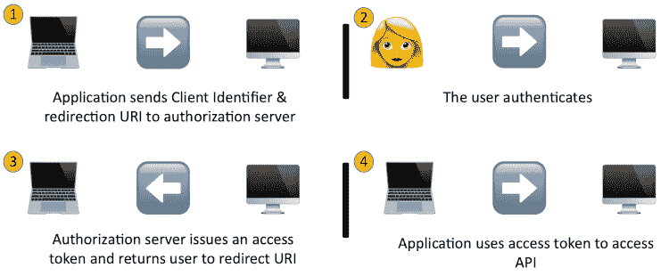

# 了解 OAuth 授权流程

> 原文：<https://dev.to/remotesynth/understanding-oauth-authorization-flows-10ok>

如果您使用过 Google Sign In、Twitter 认证或 GitHub 认证(举几个常见的例子)，或者在其他 web 应用程序中启用集成，那么您可能对 OAuth 很熟悉。

然而，即使您自己已经完全实现了这一点，如果您像我一样，您可能也没有太深入地思考过幕后发生的事情——在 OAuth 认证流程中。在这篇文章中，我将分享 web 应用程序的标准 OAuth 2.0 流程(称为隐式流程)的高级解释。然后，我们将深入研究 PKCE 扩展(如果您还不知道那是什么，请不要担心)，并解释为什么今天的最佳实践推荐建议使用那个流程。

我应该很快指出，我不是 OAuth 方面的专家，但最近我花了一些时间深入研究这个主题，并认为分享我所学到的东西会很有用。请对我如何改进这篇文章中的信息的任何建议发表评论。

## 隐流

从用户的角度来看，认证流程非常简单。假设我点击了一个写着“使用 GitHub 登录”的按钮。然后我被发送到 GitHub 进行登录，如果这是我第一次登录，就授予权限。一旦完成，我就被送回原来的网站，瞧！-我登录了。

正如你所想象的，在幕后还有更多的事情要做。基本步骤如下(没错，这是简化版):

 

*完全用表情符号表达的含蓄流动*

1.  应用程序向用户请求授权
2.  用户批准该请求
3.  授权服务器通过重定向 URI 发布访问令牌
4.  应用程序使用令牌来调用 API

隐式流程中的步骤非常简单，如果您已经在 web 应用程序中实现了 OAuth 2.0，这可能是您熟悉的流程。需要注意的一个关键方面是，访问 API 所需的令牌是通过重定向传递的。

## 安全考虑绕过隐式流

网络安全总是有所取舍——越安全通常意味着越复杂。不管上面看起来如何，隐含的流程实际上非常简单。虽然这已经并将继续适用于广泛的 web 应用程序，但安全专家曾经(并将继续)担心它会留下一些潜在的攻击媒介。

主要漏洞围绕着通过重定向返回有效访问令牌这一事实。正如布洛克·艾伦所说:

> 隐式流最被批评为难以保护的方面也是定义隐式流的基本机制，即访问令牌从令牌服务器返回到授权端点的客户端。

一些问题包括:

*   “中间人”攻击可以拦截重定向，从而获得有效的访问令牌。
*   可以将访问令牌注入到重定向 URL 中，并且没有验证机制来确保令牌不是恶意注入的。
*   自身重定向可以存储在浏览器历史中(甚至复制到云中)，从而确保有效访问令牌的副本有泄漏的可能。

这并不是说隐式流是不安全的——并且有减轻这些问题的实践。然而，在 2012 年创建该规范时，其中一些问题被认为是可接受的权衡，这主要是因为当时跨域访问中的浏览器限制限制了更安全选项的可用性。

> 在针对基于浏览器的应用的 OAuth 2.0 中讨论了隐式流程中的潜在威胁和可用的缓解策略。

## 什么是 PKCE？

PKCE(代表“代码交换的证明密钥”，发音为“pixie”)最初是为了解决使用 OAuth 2.0 的原生移动应用程序的特定问题而开发的。问题是应用程序的秘密不能安全地存在于应用程序中。在 web 应用程序中，它位于服务器上，在传递给授权服务器之前，客户端永远无法访问它。然而，移动应用程序需要将它驻留在应用程序代码中，这可能会在反编译过程中暴露出来。此外，移动应用程序中用于重定向的自定义 URL 方案可能会受到影响。

PKCE 是 OAuth 2.0 的扩展，它通过增加一些步骤来解决这个问题。

*PKCE 之流完全用表情符号表达*

1.  应用程序向用户请求授权，并使用随机的“代码验证器”创建“代码质询”
2.  代码质询被发送到授权服务器，用户进行身份验证
3.  授权服务器存储代码质询，并向应用程序返回代码
4.  应用程序通过 POST 请求将代码和代码验证器发送到授权服务器
5.  授权服务器验证代码质询/代码验证器，并通过 POST 响应发出访问令牌
6.  应用程序使用令牌来调用 API

虽然 PKCE 流程显然更加复杂，但还是有一些重要的差异需要注意。首先，没有预先配置的秘密。相反，PKCE 使用为每个请求生成的加密随机代码验证器。也没有重定向拦截。“中间人”攻击只能窃取授权码，但无法访问有效令牌，并且因为没有重定向，所以也没有可能包含有效令牌的浏览器历史。

## 有什么推荐？

如果您有一个使用隐式流的 web 应用程序，并且一切都很好，那么您不需要做任何事情。但是对于未来的开发，您可能需要注意 [OAuth 2.0 安全最佳实践](https://tools.ietf.org/html/draft-ietf-oauth-security-topics-13#section-3.1.1)文档，该文档指出:

> 尽管到目前为止，PKCE 被推荐为保护本地应用程序的一种机制，但是这个建议适用于所有类型的 OAuth 客户端，包括 web 应用程序。

基本上，这并不是说在隐式流程中发现了新的漏洞，只是 PKCE 提供了一个更安全的替代方案，如果您有选择的话，您应该使用它。你可以在 Vittorio Bertocci 的[oauth 2 Implicit Grant and SPA](https://auth0.com/blog/oauth2-implicit-grant-and-spa/)中找到这里讨论的问题和解决方案的很好的、严肃的概述。

我希望这个概述对您有所帮助。