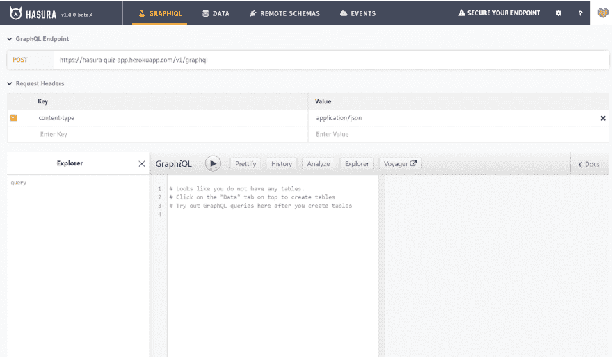
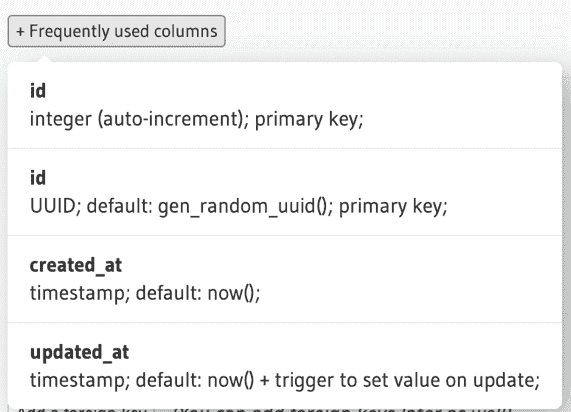
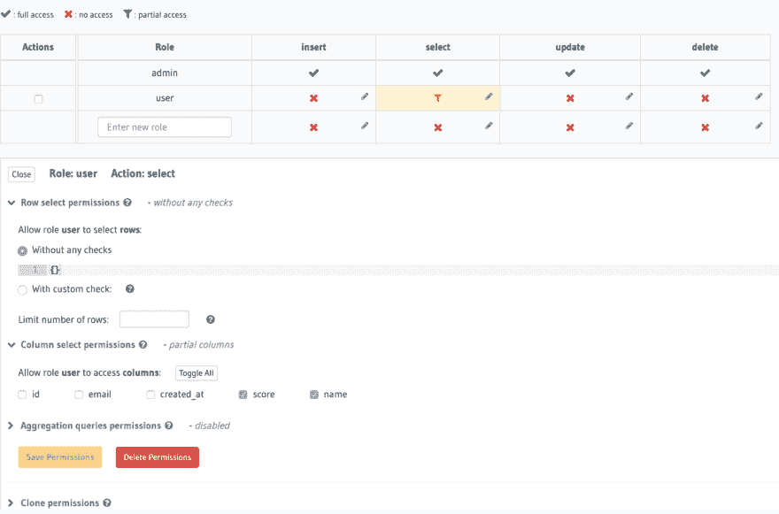
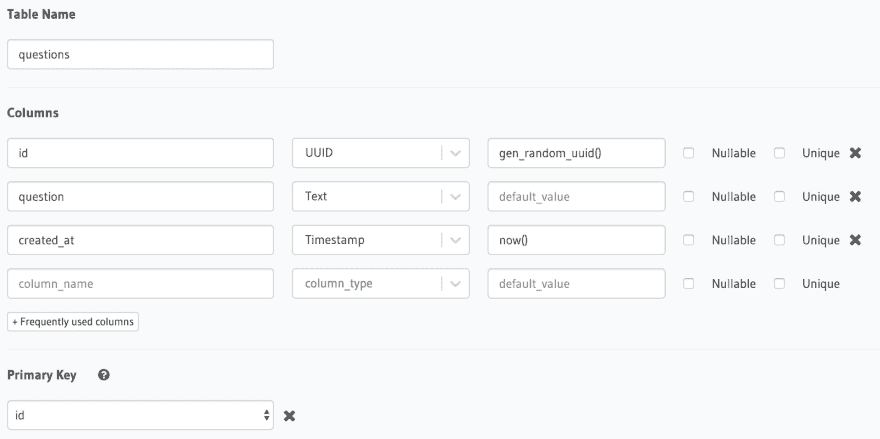
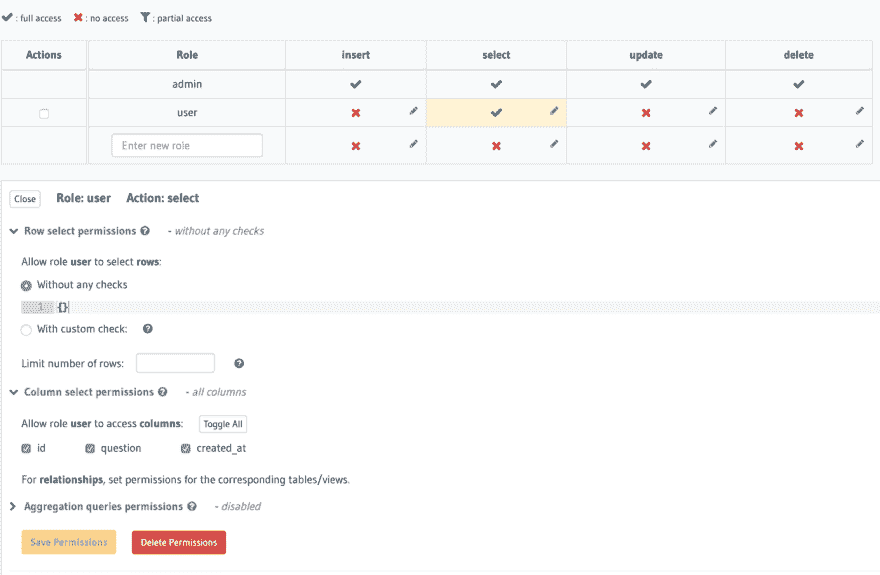
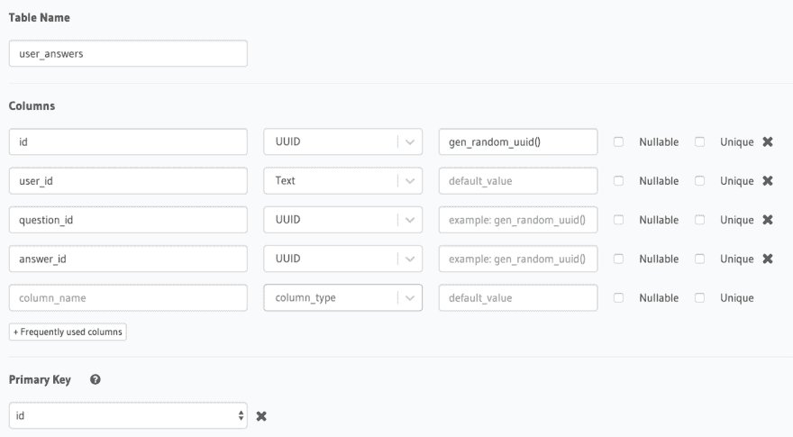
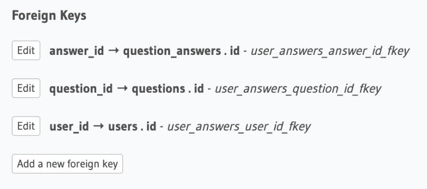
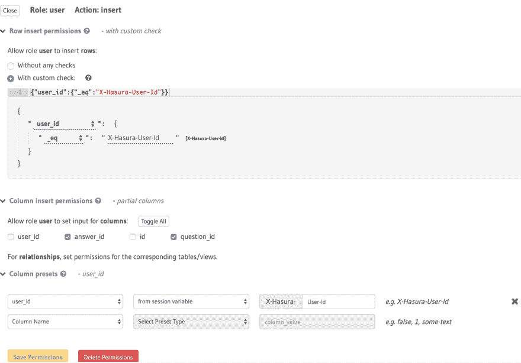
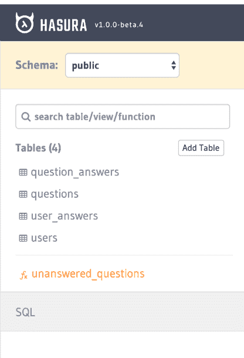

# 使用 GraphQL、Hasura 和事件驱动的无服务器构建可伸缩的 Flutter 应用程序，第 1 部分——设置 Hasura

> 原文：<https://dev.to/hasurahq/building-scalable-flutter-apps-using-graphql-hasura-and-event-driven-serverless-part-1-setting-up-hasura-467b>

[](https://res.cloudinary.com/practicaldev/image/fetch/s--lmXQ_QPc--/c_limit%2Cf_auto%2Cfl_progressive%2Cq_auto%2Cw_880/https://blog.hasura.io/conteimg/2019/09/hasura-flutter-wo-border-9.png)

*本教程由*[*Can tap NAR*](https://twitter.com/cntaspinar)*编写，并作为 [Hasura 技术作者计划](https://blog.hasura.io/the-hasura-technical-writer-program/)的一部分发布，该计划旨在支持为开源 Hasura GraphQL 引擎编写指南和教程的作者。*

## 简介

在这篇博文中，我们将使用由 Hasura 和 Firebase 支持的 Flutter 制作一个测验应用程序。我们将看到 Hasura 如何与 Firebase 服务(如身份验证和云功能)一起处理用户身份验证和业务逻辑。将这些服务组合在一起将为我们提供一个灵活且可扩展的架构。

这将是一个由 3 部分组成的系列。在第一部分中，我们将部署 Hasura，并了解如何使用权限对关系数据进行建模。

> 第二部分 将讲述如何用 Firebase 和 Hasura 设置 Auth。 **[第三部](https://blog.hasura.io/build-flutter-app-hasura-firebase-part3/)** 将会讲述如何制作旋舞前端。

## 哈苏拉部署在 Heroku

使用下面的 Heroku 按钮部署 Hasura 不到一分钟。

[](https://heroku.com/deploy?template=https://github.com/hasura/graphql-engine-heroku)

完成后，您可以通过打开 Heroku 应用程序 URL 来访问 Hasura 控制台。

[](https://res.cloudinary.com/practicaldev/image/fetch/s--oW9p2iFG--/c_limit%2Cf_auto%2Cfl_progressive%2Cq_auto%2Cw_880/https://lh4.googleusercontent.com/v-3Vr6HW_RFoWDQ28BBEwAw6p_ogVDSlmX_VYZDtLNZwBkWdKOtPaK1SNuv2zl4EHeZH3WJRY0Rg_ZF22P3K6RI65jSk6RnyyyArlinuFNl72Gvz1nAhA7LS-qAuNIRMBnHmuHmt_T6DCpjQqA)

## 建模数据

让我们先从数据建模开始。我们将定义列、关系和权限。Hasura 通过跟踪表中的外键并建议可能的关系，使创建关系变得容易。通过设置权限，您可以按角色限制用户对行和列的访问。

头来了**数据>添加表**

**提示:**您可以将“常用列”用于这些常用类型:

[](https://res.cloudinary.com/practicaldev/image/fetch/s--jE5f2f7x--/c_limit%2Cf_auto%2Cfl_progressive%2Cq_auto%2Cw_880/https://lh6.googleusercontent.com/FJf8sgAO4IR0lMcafhL30XZacWFAmtWIORxQSWaepZsuxMyuZIbk1-iOq7eLzCPoL2NskIi8ynt3gAE2EY2sXIIej4eGOKXKJk54VyDfD8m3h6KwtREqyNvt0-5KkpduCuyny7EWWyP3uYOcfA)

### 表:用户

`id`、`email`、`name`栏将由来自 Firebase 的数据填充。注意这里的`id`是`Text`的类型**。稍后我们会详细讨论那件事。`score`如果用户提交正确答案，该列将增加。当一个新用户被插入到表中时,`created_at`将被设置为 now。让我们将`id`设置为主键。**

[](https://res.cloudinary.com/practicaldev/image/fetch/s--DxO9st8o--/c_limit%2Cf_auto%2Cfl_progressive%2Cq_auto%2Cw_880/https://lh5.googleusercontent.com/FD7xc7jhD0iaN9aWqxSqh42OcI1JEMGPWzHoYJXEODcct80l4A-7XZ-jveITt2PKMpXsF3oRRTjoE_Sf5NRr4PLm3LhQt4s9itN5xoDjOfO4fbimFMzTjo9Rskmb5al8QKghP0PsPdFUoWOufw)

创建表头后，给**选项卡**权限。目前，只有一个角色是管理员，它对下面的每个操作都有完全的访问权限。输入名为“用户”的新角色。对于 users 表，我们只授予 select 权限。用户应该能够看到其他人的名字和分数。当我们调整选择权限时，我们主要要处理以下规则。

*   **行选择权限**限制对行的访问。
*   **列选择权限**限制对某些列的访问

我们不需要对**行选择权限进行自定义检查。**为**列选择权限，**只检查姓名和分数列。这样我们可以确保用户只能看到这些字段。

[](https://res.cloudinary.com/practicaldev/image/fetch/s--N1DRgUTU--/c_limit%2Cf_auto%2Cfl_progressive%2Cq_auto%2Cw_880/https://lh5.googleusercontent.com/tPoUpEBQ21lfGtGwl9lh9NCwXVSUlei26wk5Dw7jnq-u_aM58VsYTCYn0z6UuRbFupcCXag7CXpy4UQlMYN4tjGc_GQNthBMTTmYCdPCOOYQlrKl2XLo6CuQhGENqUv80p9hR-Nq4kinnpGDxw)

**表格:问题**

`id`是具有 UUID 类型和主键的字段。每当一个新对象被插入到表中时，默认函数`gen_random_uuid()`将生成一个唯一的 UUID。**问题**是问题标题，`created_at`将用于后面的问题排序。

[](https://res.cloudinary.com/practicaldev/image/fetch/s--9t_hINCg--/c_limit%2Cf_auto%2Cfl_progressive%2Cq_auto%2Cw_880/https://lh6.googleusercontent.com/QnD-yJINYpNKbZbZvLdIAW8kkGQWq_DFuBZ1jL39FowBVmdVirTRuQTeHTXl8bbyBA4OxaTtP8H_lvCYtvEA6K6IiP_baonef2OcQ26WGUnWi8TNoLgC69vEN-iTumHBnK73eZ3M4n096KkvXw)

对于权限，每个用户都可以通过查询来获取问题，因此我们对问题表拥有以下权限。

[](https://res.cloudinary.com/practicaldev/image/fetch/s--CkjMGV8K--/c_limit%2Cf_auto%2Cfl_progressive%2Cq_auto%2Cw_880/https://lh3.googleusercontent.com/sCZq4JIavAe3GkjcGrGc2Eo4lc1UjmBRzts6L6RB9P_klBuWEZtL3Zf41Ap1V83R93-AI5QpAJ4In5ttdgC5eaSgZ3lHQPSTeVGdmyCnNbjcEXgrWkUyiLeMUHTV65Fss7jELm5lyDIFT49FuA)

**表格:问题 _ 答案**

`id`再次是 UUID 的类型和表的主键。`answer`是问题答案。由于我们要给出一个问题的多个答案选项，所以我们需要知道哪个答案是正确的。为此，我们有一个类型为布尔的`is_correct`列。

[](https://res.cloudinary.com/practicaldev/image/fetch/s--ybUOttLE--/c_limit%2Cf_auto%2Cfl_progressive%2Cq_auto%2Cw_880/https://lh6.googleusercontent.com/xO1inQ80rKx0tfxt56AW6ONxAOISs42YL8m9PeLiS5L9GITgFWy5hH8CXF53diVZGUoWLKAYcaCTsalruYabqzr6kvNpyCgYk_K31V_jHE7ABl5aui6-jfgIFv99xFkomin6X9TEU4BkLriQ_Q)

`question_id`在这里指出这个答案属于哪个问题。因此，它将是一个外键。

[](https://res.cloudinary.com/practicaldev/image/fetch/s--XIM6ILq8--/c_limit%2Cf_auto%2Cfl_progressive%2Cq_auto%2Cw_880/https://lh5.googleusercontent.com/1NNa8LecWsOkHXV516uUH8CU02uKlLlZyItgkGi6XD-1sSHiPR1l2tN2PVlp8v0rt4KbCqAgPQzCM3pH-TasDmW79UyzvyW8GdXHtWOGOZKEaBbYcm-sQTs0OQor5BD3IPq1899bEbPVgkIe0A)

用户应该能够进行查询，以获得问题的可能答案。该表的权限如下。

[](https://res.cloudinary.com/practicaldev/image/fetch/s--prnsdpXQ--/c_limit%2Cf_auto%2Cfl_progressive%2Cq_auto%2Cw_880/https://lh6.googleusercontent.com/KLzZvPOcCWOuGGDpQaLtrmlUP1SApyerBDiY2NjeIo-VeNFShRE6En_f7QwJ4EPJdjsgw09s_wZm7q-aj95EKb0iARpThMNhmzCJthM63qzcjgainDF7z9P6BTm9aPOBnbFU42cytVMOTnaCww)

**表格:用户答案**

`id`是 UUID 和主键的类型。`user_id`、`question_id`和`answer_id`是指向其他表的外键。请注意，`user_id`列是文本类型，而不是 UUID。这是因为我们将`users`表中的`id`字段定义为文本。这是因为它将由来自 Firebase 身份验证的值填充，并且 Firebase 用户 id 是一个字符串。

[](https://res.cloudinary.com/practicaldev/image/fetch/s--c0qD1rSL--/c_limit%2Cf_auto%2Cfl_progressive%2Cq_auto%2Cw_880/https://lh5.googleusercontent.com/26T4TJJN3ngAQdiAXvP0HEF0wNIFQYUCdlBTbEsA1f4jBFbXdDG1HKXlHEeScp02IAgbH7-2gcupp5eu5CwNlN2hdT3dT-1l7AXX8mFvXVMi0d93aCBM_MIUkTZhLYNj5hdPf10XOXOM1xJt9w)

[](https://res.cloudinary.com/practicaldev/image/fetch/s--c2Yqo5AQ--/c_limit%2Cf_auto%2Cfl_progressive%2Cq_auto%2Cw_880/https://lh3.googleusercontent.com/xVDmaq3S29rdU2s1MPva1Wm81Y1yPX6GrW2ENvHelDAk_wpFZlbPV4ufMOOTb4_AZ6-Kgp-uFjR9-YCbZm2YyWpzYaBa4G_kmcIPA5KE4fPk0kGngDTcbSWSQQYN5VY8pY-4V0KXqUKvRpg3jA)

对于权限部分，我们将允许用户插入答案，但我们需要确保只有当请求来自同一个用户时，用户才能插入答案。换句话说，用户不能代表其他人插入新记录。这就是**会话变量**的用武之地。点击**自定义勾选**框，给出如下规则。

[](https://res.cloudinary.com/practicaldev/image/fetch/s--Or-LNGwA--/c_limit%2Cf_auto%2Cfl_progressive%2Cq_auto%2Cw_880/https://lh5.googleusercontent.com/62bwGMdzCAxGGxDpYluGb54pFt0O_AuPofuRwItj3jF5Dxw_P6ozY6PYwa2cdp5Q6DYQMudQTwggRS6ZBK7-hEwDgb6d4ZyYO2dRiY8Ua_W12QFCnePS9zYQI_aSuDcI81aPXYrQElW_wfvKKw)

来自用户的每一个对 GraphQL API 的请求都将包含一个`X-Hasura-User-Id`头。我们将在认证部分详细讨论这一点。我们需要做的最后一件事是从`X-Hasura-User-Id`头自动设置到`user_id`字段。为此，我们将使用**列预设。**在我们例子中，这允许用静态值或会话变量来填充列。

[](https://res.cloudinary.com/practicaldev/image/fetch/s--pHhI_ozy--/c_limit%2Cf_auto%2Cfl_progressive%2Cq_auto%2Cw_880/https://lh3.googleusercontent.com/hh0vLoHMI8Xg4lez0EQJd4YHyo2jAhIKSxD7vGTswg9532M1xDZCxRDYxn2hx6_pyDjAidGwdyYYxwQ52zkrFmA-S2i-zhOwxIOzxioXs9KD12wsC9zpzHXiVeMi093-iswljL-D7aXomaXc1w)

最后，user_answers 表的插入权限应该如下所示。

[](https://res.cloudinary.com/practicaldev/image/fetch/s--ADw8A_YC--/c_limit%2Cf_auto%2Cfl_progressive%2Cq_auto%2Cw_880/https://lh5.googleusercontent.com/KbtNVXx75bcIanGGwcV1ua7h1moeIH997QgB8m_RQHW04BeIC5nPreSZiauemkRE4N6QYPbeNXpNGle22uZ6KCEwvy0_eSt3l6uWlIjY9Qp9jHa_fUJTouZG12W-O66rPs4gidc-5G7SkQcMHA)

既然我们已经定义了表，那么是时候为 GraphQL API 创建关系了。前往**数据**选项卡。Hasura 告诉您未跟踪的外键关系。点击 **Track All** 通过 GraphQL API 公开这些关系。

[](https://res.cloudinary.com/practicaldev/image/fetch/s--0C9lXwBW--/c_limit%2Cf_auto%2Cfl_progressive%2Cq_auto%2Cw_880/https://lh5.googleusercontent.com/nSm2v-FI8ItmvOqCaY6N5JZf0knFzMhXHRSlpRPKGUtjdheajlJNvQrEoq7m2QBU9E_PnZ7AGCCht1QzNKxx1d3bbL5Sp-Kmfo3PyP2GabJ6yo8BDZbc4DO23FLisKc8vFUp1mgfttlqZ0fcpg)

总而言之，我们定义了表，给出了权限并跟踪了关系。此时，Hasura 已经为我们准备好了 API。您可以前往 **GRAPHIQL** 选项卡并探索 API。在我们继续之前，还有最后一件事要做。我们需要一种方法来查询用户尚未回答的问题。为此，我们可以创建一个带参数的 PostgreSQL 函数。Hasura 将再次神奇地跟踪这个函数，并通过 GraphQL API 公开它。头到**数据** > **SQL。在这里，你可以编写原始的 SQL。在我们的例子中，它可以用于创建触发器、视图或函数。编写下面的代码，不要忘记检查**跟踪这个**框。这个框将告诉 Hasura 跟踪这个函数，并通过 GraphQL API 公开它。** 

```
CREATE
OR REPLACE FUNCTION public.unanswered_questions(userid text) RETURNS SETOF questions LANGUAGE sql STABLE AS $ function $
SELECT
  *
FROM
  questions
WHERE
  id NOT IN (
    SELECT
      question_id
    FROM
      user_answers
    WHERE
      user_id = userID
  ) $ function $ 
```

Enter fullscreen mode Exit fullscreen mode

单击 Run 后，该函数将出现在侧边栏的表格下方。

[](https://res.cloudinary.com/practicaldev/image/fetch/s--NbqXTZ1o--/c_limit%2Cf_auto%2Cfl_progressive%2Cq_auto%2Cw_880/https://lh4.googleusercontent.com/1jC1t-j7CZJxrwO5-NptuYZ18l3geb4Dgz9zqgkTjRxyKaNVi476eTneG7LscDSO5W8NnjcigtnDCfaa8r5CYr86hoQykX6RHfM2c5tF550ZaUNvxTnfnV4VZkmjsiSBORIlRM2Ub5H75nG-SQ)

现在我们已经部署了 Hasura 并对数据和关系进行了建模，我们可以继续下一步了。在 **[第二部分](https://blog.hasura.io/build-flutter-app-hasura-firebase-part2/)** 中，我们将通过集成 Firebase 服务来准备授权和业务逻辑。 **[第三部](https://blog.hasura.io/build-flutter-app-hasura-firebase-part3/)** 将讲述如何使前置机颤动。

## 关于作者

Can tap NAR 是一位充满激情和热情的开发人员，他的旅程始于“如何制作视频游戏？”继续移动应用程序开发和全栈 Web 开发。喜欢使用现代和开源技术。