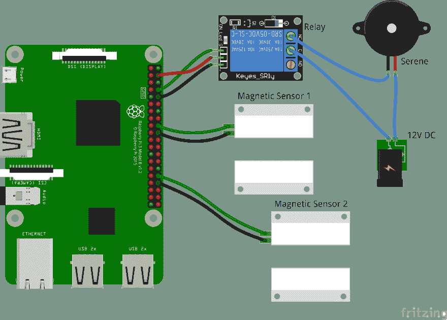

# 低成本家庭安全系统

> 原文:[https://dev . to/bk Billy/home-security-system-with-minimum-cost-5742](https://dev.to/bkbilly/home-security-system-with-minimum-cost-5742)

市场上有许多安全系统，但 DIY 系统可以将成本降低到 30 欧元左右。在这篇文章中，我将谈谈我上传到 GitHub 的自己的警报系统的实现。

至于现在，我的 app 支持 GPIO 传感器，MQTT 传感器，海康威视 LineCrossing。可以触发多个通知，如激活丝氨酸、发送邮件、通过 VoIP 呼叫。

# [](#hardware-requirements)硬件要求

*   最重要的是闹钟的大脑，在我的情况下，我使用的是 **Raspberry PI Zero** ，足以运行整个系统。
*   最容易连接的传感器是不需要电源的**磁传感器**。它们连接到一个 BCM 引脚，另一端连接到 Raspberry 的 GPIO 引脚中的一个空地。
*   **主动传感器**需要的电源通常是 12V DC。这些包括 PIR、玻璃破裂等...他们需要一根 4 线电缆，一根用于 power+，一根用于 power-，另外两根就像磁传感器一样。
*   用于丝氨酸**的继电器**也可以与一个称为继电器的额外组件连接，该组件为丝氨酸打开电源。
*   我发现将电线连接到 Raspberry GPIO 的最佳方式是使用**杜邦母引脚**，看起来像这样:

这是我上面解释的连接图:
[](https://res.cloudinary.com/practicaldev/image/fetch/s--_4t9DtiA--/c_limit%2Cf_auto%2Cfl_progressive%2Cq_auto%2Cw_880/https://thepracticaldev.s3.amazonaws.com/i/elfin0ecnp0hpsf0eyd4.png)

# [](#installation)安装

安装是一个简单的过程，从 GitHub 上的最新提交下载所需的文件。它也可用于更新到最新版本。完成后，您可以导航至网络界面添加传感器并相应地更改设置。

```
bash <(curl -s "https://raw.githubusercontent.com/bkbilly/AlarmPI/master/install.sh") 
```

<svg width="20px" height="20px" viewBox="0 0 24 24" class="highlight-action crayons-icon highlight-action--fullscreen-on"><title>Enter fullscreen mode</title></svg> <svg width="20px" height="20px" viewBox="0 0 24 24" class="highlight-action crayons-icon highlight-action--fullscreen-off"><title>Exit fullscreen mode</title></svg>

# [](#conclusion)结论

虽然杜邦在电线上的安装有点吓人，但一旦你掌握了窍门，就会很容易。如果布线不存在，我会建议叫其他人来为您完成这一步，或者购买一些 Zigbee 传感器，并使用 zigbee2mqtt 通过 AlarmPI 上的 mqtt 传感器来集成它们。

点击这里查看我的 GitHub 库，支持我的工作:

##  [贝克比利](https://github.com/bkbilly) / [阿拉姆皮](https://github.com/bkbilly/AlarmPI)

### 🚨用于 Raspberry PI 或任何其他 linux 操作系统的家庭安全入侵检测

<article class="markdown-body entry-content container-lg" itemprop="text">

# AlarmPI [ ](https://github.com/bkbilly/AlarmPI/workflows/build/badge.svg) [ ](https://github.com/bkbilly/AlarmPI/releases/latest)

AlarmPI 是一个基于树莓 PI 的家庭安防系统。它支持有线传感器(PIR、磁性等。)和通过 MQTT 或海康威视的无线。它由 Web UI、Android 应用程序或通过 HTTP & MQTT 消息来控制。当警报检测到移动时，它支持以下事件:

*   启用宁静
*   发送邮件
*   VoIP 通话
*   发送 MQTT 消息

它是用 python 编写的，支持 python 2.7 和 python 3.6。通过相应地编辑 server.json 文件，还可以选择拥有多个用户。

## 装置

在您的终端上使用这个命令，您可以使用我的最新提交来安装和更新应用程序。

```
bash <(curl -s "https://raw.githubusercontent.com/bkbilly/AlarmPI/master/install.sh")
```

<svg width="20px" height="20px" viewBox="0 0 24 24" class="highlight-action crayons-icon highlight-action--fullscreen-on"><title>Enter fullscreen mode</title></svg> <svg width="20px" height="20px" viewBox="0 0 24 24" class="highlight-action crayons-icon highlight-action--fullscreen-off"><title>Exit fullscreen mode</title></svg>

## 使用

### Web 用户界面

警报的 Web 界面具有配置和使用家庭安全所需的所有功能。它支持传感器的实时事件、日志和…

</article>

[View on GitHub](https://github.com/bkbilly/AlarmPI)