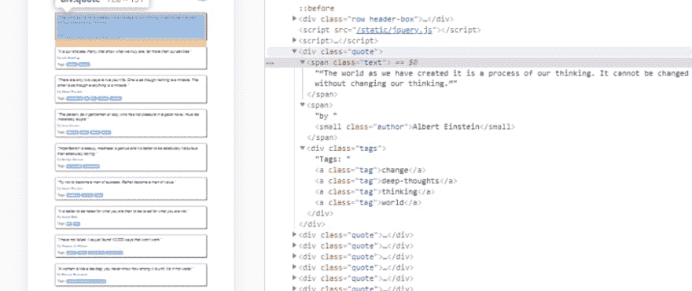

# 使用 python 的 selenium 进行 web 抓取的初学者指南

> 原文:[https://dev . to/lewiskori/beginner-s-guide-to-web-scraping-with-python-s-selenium-3fl 9](https://dev.to/lewiskori/beginner-s-guide-to-web-scraping-with-python-s-selenium-3fl9)

最初发布于[我的网站](https://lewiskori.com/blog/beginner-s-guide-to-web-scraping-with-python-s-selenium/)

在本系列的第一部分中，我们介绍了使用两个 python 库实现 web 抓取的概念。即要求和美丽的声音。结果被存储在一个 JSON 文件中。在本演练中，我们将使用 selenium python 库以稍微不同的方式处理 web 抓取。然后我们将使用 pandas 库将结果存储在一个 CSV 文件中。

本例中使用的代码在 [github](https://github.com/lewis-kori/webcrawler-tutorial/blob/master/quotes.py) 上。

## [](#why-use-selenium)为什么要用硒？

Selenium 是一个为 web 应用程序自动化测试而设计的框架。然后，您可以编写一个 python 脚本来自动控制浏览器交互，比如链接点击和表单提交。然而，除了所有这些，当我们想要从网页的 javascript 生成的内容中抓取数据时，selenium 也很方便。这是在许多 ajax 请求之后数据出现的时候。尽管如此，BeautifulSoup 和 [scrapy](https://www.accordbox.com/blog/web-scraping-framework-review-scrapy-vs-selenium/) 都完全有能力从网页中提取数据。库的选择归结于特定网页中的数据是如何呈现的。

其他问题可能会遇到，而网页抓取是你的 IP 地址被列入黑名单的可能性。我与 scraper API 合作，这是一家专门研究策略的初创公司，可以缓解你在抓取网页时 IP 地址被阻止的担忧。他们利用 IP 轮换，所以你可以避免检测。拥有超过 2000 万个 IP 地址和无限带宽。

除此之外，它们还为你提供了 CAPTCHA 处理功能，并启用了一个无头浏览器，这样你就看起来像一个真正的用户，而不会被检测为网页抓取者。更多关于它的用法，请查看我在 scrapy 上的帖子。虽然你可以把它和 BeautifulSoup 和 selenium 一起用。

[](/lewiskori) [## 网络抓取:用 scrapy 和 Scraper API 管理代理和验证码

### 刘易斯·科里 10 月 7 日 198 分钟阅读

#startup #tutorial #javascript #python](/lewiskori/web-scraping-managing-proxies-and-captcha-with-scrapy-and-the-scraper-api-2c5b)

使用这个 [scraperapi 链接](https://www.scraperapi.com?_go=korilewis)和代码
lewis10，您将在首次购买时获得 10%的折扣！

如需了解 selenium 库和最佳实践的其他资源，请点击[此处](https://towardsdatascience.com/web-scraping-a-simple-way-to-start-scrapy-and-selenium-part-i-10367164c6c0)和[此处](https://www.accordbox.com/blog/web-scraping-framework-review-scrapy-vs-selenium/)。

## [](#setting-up)设置

我们将使用两个 python 库。硒和熊猫。要安装它们只需运行

`pip install selenium pandas`

除此之外，您还需要一个浏览器驱动程序来模拟浏览器会话。由于我使用的是 chrome，我们将用它来进行演练。

#### [](#driver-downloads)驱动程序下载

1.  [铬](https://sites.google.com/a/chromium.org/chromedriver/)。
2.  [火狐壁虎驱动](https://www.guru99.com/gecko-marionette-driver-selenium.html)

## [](#getting-started)入门

对于这个例子，我们将从[报价中提取数据来抓取](http://quotes.toscrape.com/js/page/1/)，这是专门用来练习网络抓取的。
然后我们将提取所有的引文及其作者，并将它们存储在一个 CSV 文件中。

```
from selenium.webdriver import Chrome
import pandas as pd

webdriver = "path_to_installed_driver_location"

driver = Chrome(webdriver) 
```

<svg width="20px" height="20px" viewBox="0 0 24 24" class="highlight-action crayons-icon highlight-action--fullscreen-on"><title>Enter fullscreen mode</title></svg> <svg width="20px" height="20px" viewBox="0 0 24 24" class="highlight-action crayons-icon highlight-action--fullscreen-off"><title>Exit fullscreen mode</title></svg>

上面的代码是 chrome 驱动程序和 pandas 库的导入。
然后我们用

`driver = Chrome(webdriver)`
做一个 chrome 的实例

请注意，webdriver 变量将指向我们之前为我们选择的浏览器下载的驱动程序可执行文件。如果你碰巧更喜欢 firefox，就像这样导入

```
from selenium.webdriver import Firefox 
```

<svg width="20px" height="20px" viewBox="0 0 24 24" class="highlight-action crayons-icon highlight-action--fullscreen-on"><title>Enter fullscreen mode</title></svg> <svg width="20px" height="20px" viewBox="0 0 24 24" class="highlight-action crayons-icon highlight-action--fullscreen-off"><title>Exit fullscreen mode</title></svg>

#### [](#main-script)主脚本

```
pages = 10

for page in range(1,pages):

    url = "http://quotes.toscrape.com/js/page/" + str(page) + "/"

    driver.get(url)

    items = len(driver.find_elements_by_class_name("quote"))

    total = []
    for item in range(items):
        quotes = driver.find_elements_by_class_name("quote")
        for quote in quotes:
            quote_text = quote.find_element_by_class_name('text').text
            author = quote.find_element_by_class_name('author').text
            new = ((quote_text,author))
            total.append(new)
    df = pd.DataFrame(total,columns=['quote','author'])
    df.to_csv('quoted.csv')
driver.close() 
```

<svg width="20px" height="20px" viewBox="0 0 24 24" class="highlight-action crayons-icon highlight-action--fullscreen-on"><title>Enter fullscreen mode</title></svg> <svg width="20px" height="20px" viewBox="0 0 24 24" class="highlight-action crayons-icon highlight-action--fullscreen-off"><title>Exit fullscreen mode</title></svg>

仔细检查网站的 URL，我们会注意到分页 URL 是

`Http://quotes.toscrape.com/js/page/{{current_page_number}}/`

其中最后一部分是当前页码。有了这些信息，我们就可以创建一个页面变量来存储从中抓取数据的确切网页数量。在这种情况下，我们将以迭代的方式从 10 个网页中提取数据。

`driver.get(url)`

命令向我们想要的网页发出 HTTP get 请求。
从这里开始，了解要从网页中提取的项目的确切数量非常重要。
在之前的演练中，我们将 web 抓取定义为

> 这是利用网页底层代码中的模式从网页中提取信息的过程。我们可以使用网络抓取从互联网上收集非结构化数据，对其进行处理并以结构化格式存储。

[T2】](https://res.cloudinary.com/practicaldev/image/fetch/s--kQNFT3nO--/c_limit%2Cf_auto%2Cfl_progressive%2Cq_auto%2Cw_880/https://res.cloudinary.com/practicaldev/image/fetch/s--S1CHDH_v--/c_imagga_scale%2Cf_auto%2Cfl_progressive%2Ch_420%2Cq_auto%2Cw_1000/https://thepracticaldev.s3.amazonaws.com/i/fae895i7fruij64mys8k.PNG)

在检查每个 quote 元素时，我们观察到每个 quote 都包含在一个 div 中，类名为 quote。通过运行指令

`driver.get_elements_by_class("quote")`

我们得到了页面中展示这种模式的所有元素的列表。

然后，该命令用 len()函数包装，以获取该页面中引号的确切数量，并将其存储在 item 变量中，以构成我们的迭代器。

#### [](#final-step)最后一步

```
 quotes = driver.find_elements_by_class_name("quote")
        for quote in quotes:
            quote_text = quote.find_element_by_class_name('text').text[1:]
            author = quote.find_element_by_class_name('author').text
            new = ((quote_text,author))
            total.append(new) 
```

<svg width="20px" height="20px" viewBox="0 0 24 24" class="highlight-action crayons-icon highlight-action--fullscreen-on"><title>Enter fullscreen mode</title></svg> <svg width="20px" height="20px" viewBox="0 0 24 24" class="highlight-action crayons-icon highlight-action--fullscreen-off"><title>Exit fullscreen mode</title></svg>

为了开始从网页中提取信息，我们将利用网页底层代码中的上述模式。首先，我们需要上面提到的所有报价的列表。然而，在这一步，我们不会将它包含在 len()函数中，因为我们需要单独的元素。

之后，内部 for 循环将遍历每个报价并提取特定的记录。从上面的图片中，我们注意到引文被包含在类文本的范围内，而作者被包含在带有作者的类名的小标签内。

最后，我们将 quote_text 和 author names 变量存储在一个元组中，然后通过名称 total 将该元组添加到 python 列表中。

```
 df = pd.DataFrame(total,columns=['quote','author'])
    df.to_csv('quoted.csv')
driver.close() 
```

<svg width="20px" height="20px" viewBox="0 0 24 24" class="highlight-action crayons-icon highlight-action--fullscreen-on"><title>Enter fullscreen mode</title></svg> <svg width="20px" height="20px" viewBox="0 0 24 24" class="highlight-action crayons-icon highlight-action--fullscreen-off"><title>Exit fullscreen mode</title></svg>

使用 pandas 库，我们将启动一个数据框架来存储所有记录(总列表)并将列名指定为 quote 和 author。
最后，将数据帧导出到一个 CSV 文件，在本例中命名为 quoted.csv。

不要忘记使用 driver.close()关闭 chrome 驱动程序。

## [](#adittional-resources)附加资源。

#### [](#1-finding-elements)1。查找元素

您会注意到，我在本演练中使用了 find_elements_by_class 方法。这不是寻找元素的唯一方法。克劳斯的这个教程详细解释了如何使用其他选择器。

[](/endtest) [## 寻找含硒元素的实用指南

### Klaus for end test Jun 12 ' 197min read

#testing #productivity #webdev #javascript](/endtest/a-practical-guide-for-finding-elements-with-selenium-4djf)

#### [](#2-video)2。录像

如果你喜欢学习使用视频，这个由 Lucid programming 编写的系列对我非常有用。
[https://www.youtube.com/embed/zjo9yFHoUl8](https://www.youtube.com/embed/zjo9yFHoUl8)T2】

#### [](#3-best-practises-while-using-selenium)3。[使用硒的最佳实践](https://realpython.com/modern-web-automation-with-python-and-selenium/)

有了这些，希望你也能使用 selenium 制作一个简单的 web scraper😎。

如果你喜欢这篇文章，请订阅我的[时事通讯](https://mailchi.mp/c42286076bd8/lewiskori)以便在我写新文章时得到通知，或者在[推特](https://twitter.com/lewis_kihiu)上找到我聊天。

谢了。