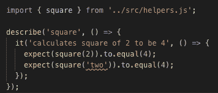

# 从 JavaScript 生成 TypeScript 定义文件

> 原文:[https://dev . to/open-WC/generating-typescript-definition-files-from-JavaScript-5bp 2](https://dev.to/open-wc/generating-typescript-definition-files-from-javascript-5bp2)

在 [open-wc](https://open-wc.org) ，我们是[免搭建](https://dev.to/open-wc/on-the-bleeding-edge-3cb8)开发设置的忠实粉丝。我们有[一帖](https://dev.to/open-wc/developing-without-a-build-1-introduction-26ao)或[两帖](https://dev.to/open-wc/developing-without-a-build-2-es-dev-server-1cf5)关于此事😄。[我们相信](https://open-wc.org/about/rationales.html)未来是回归网络平台。这意味着依赖原生浏览器特性，而不是用户空间或 JavaScript 解决方案或开发工具。这就是为什么我们的任务是为你的开发者提供[工具](https://open-wc.org/developing/)和[技术](https://open-wc.org/testing/)来使用今天的*平台*，甚至在传统浏览器最终被抛弃之前。

这种方法在 <abbr title="developer experience">DX</abbr> 、性能和可访问性方面给了我们巨大的优势，但是也有缺点。众所周知，JavaScript 是动态类型的。想要在开发时享受类型检查的开发人员通常会使用微软的 TypeScript、脸书的 Flow 或谷歌的 Clojure 编译器。所有这些都需要一个构建步骤。

我们能在“忠于”web 平台的同时享受安全类型化的开发者体验吗？让我们先深入研究一下，看看类型能给我们带来什么。

## [](#examples-in-typescript)打字稿中的例子

假设我们想要一个函数，它接受一个数字或字符串并返回平方。

```
// helpers.test.ts
import { square } from '../helpers';

expect(square(2)).to.equal(4);
expect(square('two')).to.equal(4); 
```

我们函数的 TypeScript 实现可能如下所示:

```
// helpers.ts
export function square(number: number) {
  return number * number;
} 
```

我知道你在想什么:一个字符串作为参数？在实现时，我们发现这也是一个坏主意。

感谢 TypeScript 的类型安全，以及围绕它的成熟的开发者工具生态系统，如 IDE 支持，我们甚至可以在运行测试之前就知道`square('two')`不会工作。

[T2】](https://res.cloudinary.com/practicaldev/image/fetch/s--J2WKXzsD--/c_limit%2Cf_auto%2Cfl_progressive%2Cq_auto%2Cw_880/https://raw.githubusercontent.com/daKmoR/generate-typescript-definition-files-from-javascript/mastimg/01-ts-square-two.png)

如果我们对我们的文件运行 TypeScript 编译器`tsc`，我们会看到同样的错误:

```
$ npm i -D typescript
$ npx tsc
helpers.tests.ts:8:19 - error TS2345: Argument of type '"two"' is not assignable to parameter of type 'number'.

8     expect(square('two')).to.equal(4);
                    ~~~~~

Found 1 error. 
```

类型安全帮助我们在将它推向生产之前捕捉到了这个错误。我们如何在不使用 TypeScript 作为构建步骤的情况下实现这种类型安全呢？

## 在普通 JavaScript 中实现类型安全

我们的第一步是将我们的文件从`.ts`重命名为`.js`。然后，我们将通过使用带有`.js`文件扩展名的相对 URL:
，在我们的 JavaScript 文件中使用[浏览器友好的导入语句](https://developer.mozilla.org/en-US/docs/Web/JavaScript/Reference/Statements/import)

```
// helpers.test.js
import { square } from '../helpers.js';

expect(square(2)).to.equal(4);
expect(square('two')).to.equal(4); 
```

然后，我们将通过去除显式类型检查将我们的 TypeScript 函数重构为 JavaScript:

```
// helpers.js
export function square(number) {
  return number * number;
} 
```

现在，如果我们回到我们的测试文件，当我们将错误的类型(字符串)传递给函数时，我们不再在`square('two')`看到错误😭！

[T2】](https://res.cloudinary.com/practicaldev/image/fetch/s--rrc62dl_--/c_limit%2Cf_auto%2Cfl_progressive%2Cq_auto%2Cw_880/https://raw.githubusercontent.com/daKmoR/generate-typescript-definition-files-from-javascript/mastimg/02-js-square-two.png)

如果你在想“哦，JavaScript 是动态类型的，对此无能为力”，那么看看这个:我们实际上可以使用 JSDoc 注释在普通 JavaScript 中实现类型安全。

## [](#adding-types-to-javascript-using-jsdoc)使用 JSDoc 向 JavaScript 添加类型

JSDoc 是一种由来已久的 JavaScript 内联文档格式。通常，您可以使用它为您的服务器 API 或者您的 [web 组件的属性](https://github.com/runem/web-component-analyzer)自动生成文档。今天，我们将使用它在编辑器中实现类型安全。

首先，向您的函数添加一个 JSDoc 注释。用于 VSCode 和 T2 atom 的 docblockr 插件可以帮助你快速做到这一点。

```
/**
 * The square of a number
 * @param {number} number
 * @return {number}
 */
export function square(number) {
  return number * number;
} 
```

接下来，我们将通过向项目的根目录添加一个`tsconfig.json`来配置 TypeScript 编译器检查 JavaScript 文件和 TypeScript 文件。

```
{  "compilerOptions":  {  "target":  "esnext",  "module":  "esnext",  "moduleResolution":  "node",  "lib":  ["es2017",  "dom"],  "allowJs":  true,  "checkJs":  true,  "noEmit":  true,  "strict":  false,  "noImplicitThis":  true,  "alwaysStrict":  true,  "types":  ["mocha"],  "esModuleInterop":  true  },  "include":  ["test",  "src"]  } 
```

> 嘿！我记得你说过我们不会在这里使用 TypeScript？！

你说得对，尽管我们将创作和发布浏览器标准的 JavaScript，但我们的编辑器工具将使用幕后的[类型脚本语言服务器](https://github.com/theia-ide/typescript-language-server)来为我们提供类型检查。
这样做可以让我们在 VSCode 和 Atom 中获得与 TypeScript 完全相同的行为。

[T2】](https://res.cloudinary.com/practicaldev/image/fetch/s--Z3Er5TH9--/c_limit%2Cf_auto%2Cfl_progressive%2Cq_auto%2Cw_880/https://raw.githubusercontent.com/daKmoR/generate-typescript-definition-files-from-javascript/mastimg/03-js-square-two-typed-error.png)

我们甚至在运行`tsc`时得到相同的行为。

```
$ npx tsc
test/helpers.tests.js:8:19 - error TS2345: Argument of type '"two"' is not assignable to parameter of type 'number'.

8     expect(square('two')).to.equal(4);
                    ~~~~~

Found 1 error. 
```

## [](#refactoring)重构

很好，我们已经编写了我们的`square`特性，包括类型检查，并将其推向生产。但是过了一段时间，产品团队找到我们，说一个重要的客户希望在我们使用电源之前能够增加我们为他们平方的数字。这一次，产品团队已经和 QA 谈过了，QA 通宵工作，为我们的重构特性提供了以下测试:

```
expect(square(2, 10)).to.equal(14);
expect(square(2, 'ten')).to.equal(14); 
```

然而，看起来他们可能应该花这些时间睡觉，因为我们最初的类型转换错误仍然存在。

我们如何提供这种关键的(😉)功能，同时仍然保持类型安全？

如果我们在 TypeScript 中实现了这个特性，您可能会惊讶地发现，我们不需要为第二个参数添加显式类型注释，因为我们将为它提供一个默认值。

```
export function square(number: number, offset = 0) {
  return number * number + offset;
} 
```

提供的缺省值让我们静态地分析代码来用*推断*值的类型。

我们可以使用 vanilla-js-and-jsdoc 生产实现获得相同的效果:

```
/**
 * The square of a number
 * @param {number} number
 * @return {number}
 */
export function square(number, offset = 0) {
  return number * number + offset;
} 
```

在这两种情况下，`tsc`将给出错误:

```
test/helpers.tests.js:13:22 - error TS2345: Argument of type '"ten"' is not assignable to parameter of type 'number'.

13     expect(square(2, 'ten')).to.equal(14);
                        ~~~~~ 
```

同样在这两种情况下，我们唯一需要添加的是`offset = 0`，因为它已经包含了类型信息。如果我们想要添加一个显式的类型定义，我们可以添加第二个`@param {number} offset`注释，但是对于我们的目的来说，这是不必要的。

## [](#publishing-a-library)出版一个图书馆

如果你想让人们能够使用你的代码，你需要在某个时候发布它。对于 JavaScript 和 TypeScript，这通常意味着`npm`。
你还想为你的用户提供你一直享受的编辑器级别的类型安全。
要实现这一点，您可以在您要发布的包的根目录中发布类型声明文件(`*.d.ts`)。默认情况下，只要在项目的`node_modules`文件夹中找到这些声明文件，TypeScript 和 TypeScript 语言服务器就会尊重它们。

对于 TypeScript 文件，这很简单，我们只需将这些选项添加到`tsconfig.json`...

```
"noEmit":  false,  "declaration":  true, 
```

...而 TypeScript 会为我们生成`*.js`和`*.d.ts`文件。

```
// helpers.d.ts
export declare function square(number: number, offset?: number): number;

// helpers.js
export function square(number, offset = 0) {
  return number * number + offset;
} 
```

(注意,`js`文件的输出与我们在 js 版本中编写的完全相同。)

### [](#publishing-javascript-libraries)发布 JavaScript 库

遗憾的是，目前`tsc`还不支持从 JSDoc 注释文件生成`*.d.ts`文件。
我们希望将来会这样，事实上，最初的[版本](https://github.com/microsoft/TypeScript/issues/7546)仍然有效，而且它似乎也在`3.7`的版本中。不要相信我们的话，[拉请求](https://github.com/microsoft/TypeScript/pull/32372)正在进行中。

事实上，这种方法效果非常好，我们正在将它用于[开放式厕所](https://github.com/open-wc/open-wc/blob/master/package.json#L7)的生产中。

> ！警告！这是一个不受支持的版本= >如果某个东西不工作，没有人会去修复它。因此，如果你的用例不被支持，你将需要等待正式发布的 TypeScript 来支持它。

我们冒昧地发布了一个分叉版本[typescript-temporary-fork-for-jsdoc](https://www.npmjs.com/package/typescript-temporary-fork-for-jsdoc)，它只是上述 pull 请求的副本。

## [](#generate-typescript-definition-files-for-jsdoc-annotated-javascript)为 JSDoc 注释的 JavaScript 生成 TypeScript 定义文件

现在我们有了所有的信息。让我们成功吧💪！

1.  用 JS 编写代码，并在需要的地方应用 JSDoc
2.  使用分叉的打字稿`npm i -D typescript-temporary-fork-for-jsdoc`
3.  有一个`tsconfig.json`至少包含以下内容:

    ```
    "allowJs": true,
    "checkJs": true, 
    ```

4.  通过`tsc`做“林挺式”，最好是通过[哈士奇](https://github.com/typicode/husky)做`pre-commit`钩

5.  有`tsconfig.build.json`至少有

    ```
    "noEmit": false,
    "declaration": true,
    "allowJs": true,
    "checkJs": true,
    "emitDeclarationOnly": true, 
    ```

6.  通过`tsc -p tsconfig.build.types.json`生成类型，最好是在 <abbr title="continuous integration">CI</abbr> 中

7.  发布您的`*.js*`和`.d.ts`文件

我们在[公开赛](https://github.com/open-wc/open-wc)上就有这样的设置，到目前为止它为我们提供了很好的服务。

恭喜您，现在您已经拥有了类型安全，而无需构建步骤🎉

也可以随意查看[的这个帖子](https://github.com/daKmoR/generate-typescript-definition-files-from-javascript)的仓库，执行`npm run build:types`或`npm run lint:types`来观看魔术直播。

## [](#conclusions)结论

总而言之——为什么我们是 TypeScript 的粉丝，尽管它需要一个构建步骤？

归结起来有两点:

*   类型化非常有用(类型安全、自动完成、文档化等等。)为您和/或您的用户
*   TypeScript 非常灵活，也支持“仅仅”JavaScript 的类型

## [](#further-resources)进一步资源

如果您想了解更多关于使用 JSDoc 实现类型安全的信息，我们推荐以下博客文章:

*   [使用 JSDoc 的类型安全 Web 组件](https://dev.to/dakmor/type-safe-web-components-with-jsdoc-4icf)
*   [用 JSDoc](https://medium.com/@trukrs/type-safe-javascript-with-jsdoc-7a2a63209b76) 键入安全的 JavaScript

## [](#acknowledgements)鸣谢

在[推特](https://twitter.com/openwc)上关注我们，或者在我的个人[推特](https://twitter.com/dakmor)上关注我。
请务必在[open-wc.org](https://open-wc.org)查看我们的其他工具和建议。

感谢[本尼](https://dev.to/bennypowers)、[拉斯](https://github.com/LarsDenBakker)和[帕斯卡](https://twitter.com/passle_)的反馈，并帮助我将我的涂鸦变成一个后续的故事。