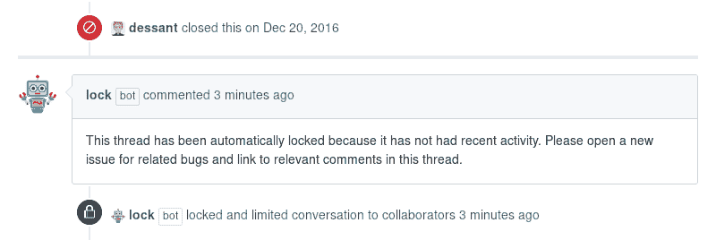

# 如何创建一个理想的评论系统？

> 原文:[https://dev . to/stereo booster/how-to-create-a-ideal-commenting-system-gng](https://dev.to/stereobooster/how-to-create-an-ideal-commenting-system-gng)

> 互联网第一法则:不要看评论。
> 
> -拉尔夫打破了互联网

首先，这不是一个技术问题，而是一个社会学问题。当人们与认识的人和不认识的人交谈时，他们在线上和线下交流时不会遵循相同的模式。

第二，问题的一部分是文本不是一个很好的交流媒介。评论是糟糕的，Twitter 是最糟糕的——它是为了升级误解和热点。

第三部分是人们联系的规模。很难控制当前的信息量。

这个问题没有解决的办法，但是有解决的方法。

## 行为准则

[T2】](https://berlincodeofconduct.org/)

这是一个社会问题——再多的技术也无法单独解决它。必要步骤(IMO)是制定 CoC。

比如: [dev.to CoC](https://dev.to/code-of-conduct) ，[极客女权博客评论政策](https://geekfeminismdotorg.wordpress.com/comment-policy/)。

## 因果报应

[T2】](https://res.cloudinary.com/practicaldev/image/fetch/s--oVbgBUE8--/c_limit%2Cf_auto%2Cfl_progressive%2Cq_auto%2Cw_880/https://thepracticaldev.s3.amazonaws.com/i/swovenfapir5xnoa3uxt.png)

业力系统可以帮助你在大范围内进行调节。因果报应系统基于对评论(和博客帖子)的积极和消极反应。这里棘手的部分是使分数不可见，否则它会游戏化，例如，人们试图增加因果报应来获得更高的排名。

例子:与[黑客新闻](https://news.ycombinator.com/leaders)和 [reddit](https://www.reddit.com/r/help/wiki/faq#wiki_how_does_karma_work.3F) 相比，dev.to 没有记分牌，也没有显示粉丝数量。

StackOverflow 使用[信誉](https://meta.stackexchange.com/questions/7237/how-does-reputation-work)来[限制哪些动作对用户](https://meta.stackexchange.com/questions/164899/the-complete-rate-limiting-guide)可用。

## 非礼勿视

[T2】](https://en.wikipedia.org/wiki/Three_wise_monkeys)

> 照片由亨特·伦纳德在 Unsplash 上拍摄

隐藏消极反应的方法。这样做是为了避免干草叉。版主可以联系有大量负面反应的人告知，这是一个不恰当的评论。或者可能是不同的情况——评论是恰当的，是由不宽容的人引起的负面反应(相反，我们可以标记所有人)。

示例:dev.to 没有公开的负面反应。

## 反应

[T2】](https://lab.coralproject.net/#%7B%22reactions%22%3Atrue%7D)

喜欢一直被批评，因为它不是一个非常大的反应范围，有时是不恰当的。

另一方面，一些通常被实现为表情符号的反应非常令人困惑，例如眨眼表情符号(😉)会让人迷惑。

例如:GitHub 评论有 8 种反应:👍 👎 😄 🎉 😕 ❤️ 🚀 👀。

## 有效期

[T2】](https://res.cloudinary.com/practicaldev/image/fetch/s--BaNu50YB--/c_limit%2Cf_auto%2Cfl_progressive%2Cq_auto%2Cw_880/https://thepracticaldev.s3.amazonaws.com/i/idgv2hrwaaepfe3qr5ja.png)

评论旧帖子的能力可能会被巨魔滥用来骚扰人们。回答所有的帖子可能会非常耗时，因此人们可以选择在一段时间后锁定评论，而不是无限期地回答帖子。

如果人们想继续对话，他们可以创建一个新的帖子。

例子: [GitHub lock bot](https://github.com/apps/lock)

## 速率限制

[T2】](https://res.cloudinary.com/practicaldev/image/fetch/s--SsxBB9Ku--/c_limit%2Cf_auto%2Cfl_progressive%2Cq_auto%2Cw_880/https://thepracticaldev.s3.amazonaws.com/i/iejs6cuo1rr4knkibmxj.png)

为了避免过热的谈话，我们可以在评论之间强迫一些停顿，以防止人们事后后悔的情绪反应。

例子: [hackernews 火焰探测器](https://github.com/minimaxir/hacker-news-undocumented/blob/master/README.md#flame-war-detector)。

## 垃圾邮件检测算法

算法可以用来检测垃圾邮件。该算法可以简单到跟踪每个帖子链接数或跟踪关键词。

示例: [Akismet](https://akismet.com/)

## 音调检测算法

现代算法(ML，AI)可以用来检测消息的语气。问题是那些算法不精确。解决方案是使用音调检测，但不要基于它来阻止，而是向评论者显示分数，这样他们就会知道。

例子: [Google 的透视 API](http://perspectiveapi.com/#/home) ，[对话 AI](https://conversationai.github.io/) ，[语气分析器](https://tone-analyzer-demo.ng.bluemix.net/)，[情感分析](https://www.infoq.com/articles/sentiment-analysis-whats-with-the-tone/)。

## 旗帜

[T2】](https://res.cloudinary.com/practicaldev/image/fetch/s--7qPS3f5o--/c_limit%2Cf_auto%2Cfl_progressive%2Cq_auto%2Cw_880/https://thepracticaldev.s3.amazonaws.com/i/64448u124v13uzfv4xl6.png)

为了帮助审核评论，系统可以提供标志，因此用户可以帮助审核过程。如果标志是细粒度的，并且定义清晰，那么它会很有帮助，例如:垃圾邮件、离题、NSFW、剧透等等。

### 逻辑谬误

[T2】](https://res.cloudinary.com/practicaldev/image/fetch/s--ODGsCQT---/c_limit%2Cf_auto%2Cfl_progressive%2Cq_auto%2Cw_880/https://thepracticaldev.s3.amazonaws.com/i/xoinxptq45ral8ixbrp0.png)

典型的标志集可以用[逻辑谬误](https://yourlogicalfallacyis.com/)来扩展。

例子:[阿格曼](https://en.arguman.org/fallacies)。

## 游戏化

[T2】](https://res.cloudinary.com/practicaldev/image/fetch/s--Hq4Ep8g---/c_limit%2Cf_auto%2Cfl_progressive%2Cq_auto%2Cw_880/https://thepracticaldev.s3.amazonaws.com/i/aojxzluqje5n0ca1a51x.png)

应该避免游戏化，因为主要目的是进行建设性的对话，而不是引发对游戏系统的机械反应。

我喜欢这里的[话语方式](https://meta.discourse.org/t/what-has-your-experience-been-with-badges-in-your-communities/69597/5):

> 嗯，实际上有三种徽章:
> 
> “学习系统”徽章很容易获得和青铜化。我不知道人们这样做是否有任何负面影响——整个目的是了解事情是如何工作的，所以我认为@name 第一次提到某人以“获得徽章”完全是@Drew_Warwick 的目的。你可以在一天内得到这些，因为它们是阅读手册的替代品，没有人想这样做，也没有人永远不会这样做。
> 
> “继续回来”徽章更难得到和银。这些需要更长的时间才能得到，我怀疑任何不感兴趣的人会打扰。
> 
> 金色的“长期贡献者”徽章。祝你玩这些游戏好运，如果你玩了这些游戏，那么你就成为了一个长期的贡献者，所以…我们都赢了？

## 布局

注释的可能布局:

*   线索注释(空间关系)，例如，dev.to
*   无线索评论(时态关系)，例如，[话语](https://www.discourse.org/)
*   行内注释(类似于带引号的注释)，例如，[概念](https://www.notion.so/Mentions-discussions-comments-3f4aa425e0ae44989247f30e08158b41)
*   例如，[辩论图](https://en.arguman.org/)或[辩论工具](https://wiki.lesswrong.com/wiki/Debate_tools)。

我们还可以选择如何对评论进行排序:

*   按时间(最早、最新)
*   按受欢迎程度(反应数量)

## 编辑

[T2】](https://res.cloudinary.com/practicaldev/image/fetch/s--B0BVrQ-2--/c_limit%2Cf_auto%2Cfl_progressive%2Cq_auto%2Cw_880/https://thepracticaldev.s3.amazonaws.com/i/ssugqpunnma5nkuwym08.png)

编辑有两种主要方法:WYSIWYG 和 markdown + preview，例如:

*   所见即所得: [Wordpress 编辑器](https://en.support.wordpress.com/wordpress-editor/)
*   markdown + preview: dev.to 评论，GitHub 问题。

### 图像

图像和 gif 可以部分改善作为媒介的文本。另一方面，他们增加了 11y 问题(alt 文本、[动画](https://a11yproject.com/posts/understanding-vestibular-disorders/))和歧义。

### 其他

还有很多其他的考虑要考虑，例如，编辑，提及，永久链接等。“[评论实验室](https://lab.coralproject.net/)”很好地展示了所有选项。

## 资源

这篇文章的主要灵感来源:

*   Evan Czaplicki 的《开源的艰难部分》
*   [珊瑚项目](https://guides.coralproject.net/helpful-links/)
*   [话语](https://blog.discourse.org/2013/03/the-universal-rules-of-civilized-discourse/)

> 亨特·伦纳德在 Unsplash 上拍摄的封面照片