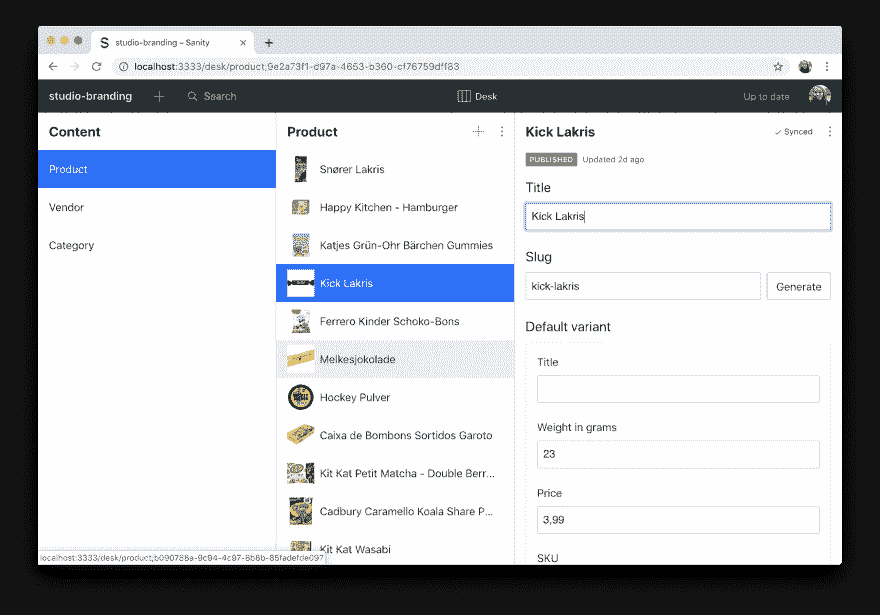
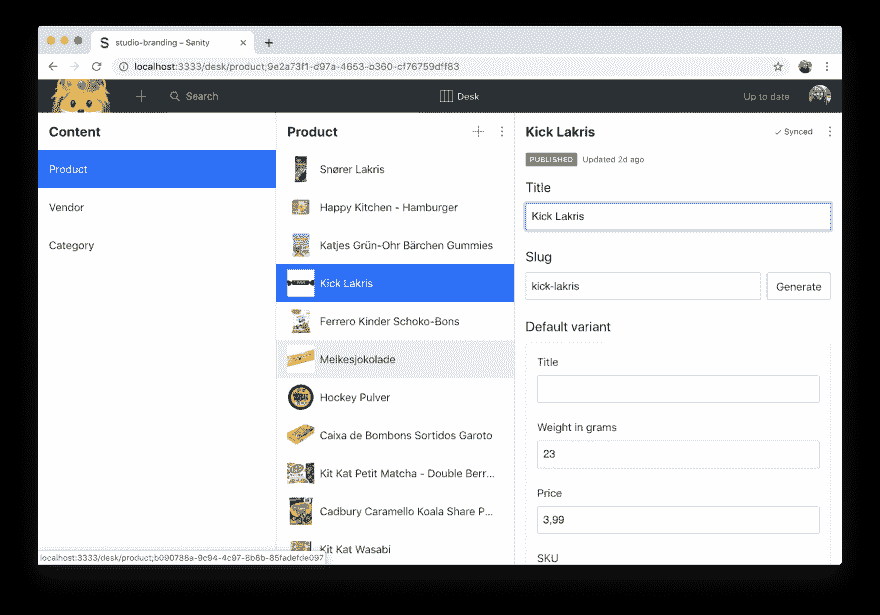
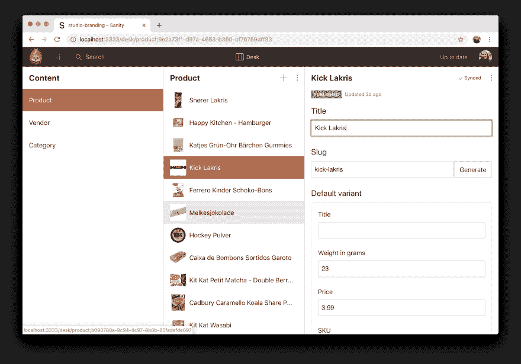
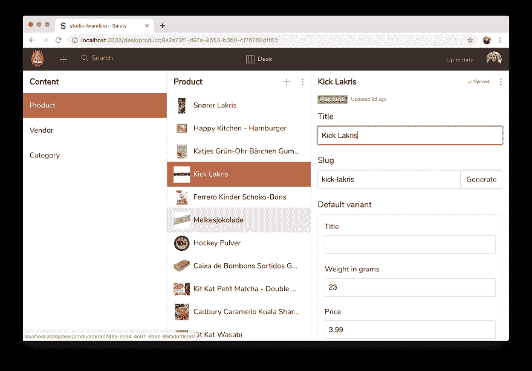
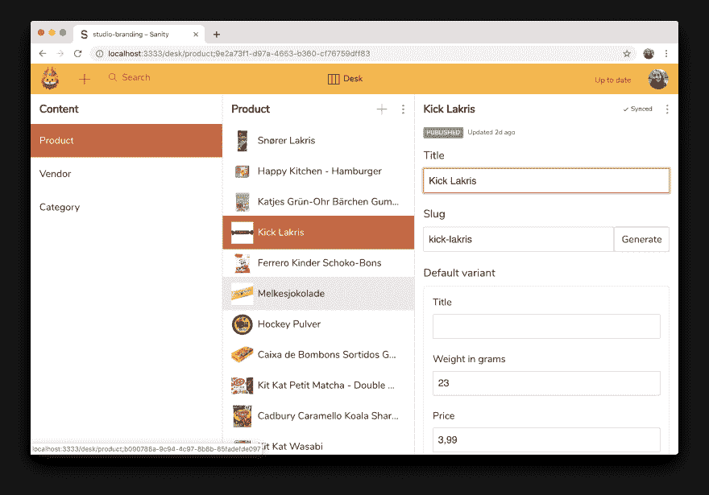
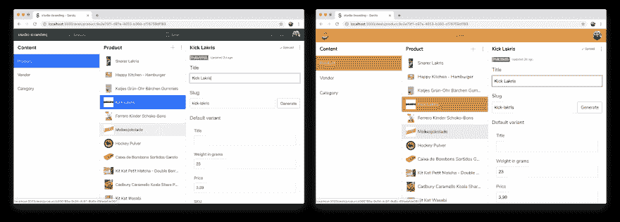

# 如何打造你的理智工作室

> 原文:[https://dev . to/sanity-io/how-to-brand-your-sanity-studio-e9h](https://dev.to/sanity-io/how-to-brand-your-sanity-studio-e9h)

在 Sanity，我们已经确保我们的编辑环境，Studio，有一个默认的外观，易于使用并且看起来很棒，但是有时你想根据自己的喜好定制它。在其他系统中，您需要提供自定义 CSS 来覆盖选择器，从而创建脆弱的依赖关系，或者更改内部 CSS，从而使未来的升级变得困难。然而，在 Sanity 中，你可以根据自己的意愿扩展和定制工作室，这要感谢 Sanity 核心的[部件系统](https://www.sanity.io/docs/parts)。这包括在导航栏中添加您自己的徽标，并通过覆盖 CSS 变量为工作室创建自定义外观。

在本教程中，您将学习如何用自定义的徽标、颜色和字体来打造您的工作室品牌，让您的 Sanity Studio 鹤立鸡群，真正体现您的品牌。

## [](#what-is-sanity)什么是理智？

[Sanity.io](http://sanity.io/) 是一个具有开源编辑环境的结构化内容平台。Sanity Studio 是一个用 React 编写的单页面应用程序，您可以在其中用简单的 JavaScript 对象配置文档类型和输入字段。工作室连接到 Sanity 托管的实时 API。您还可以用自己的输入组件、插件和工具定制 Studio。

## [](#setting-up-your-studio)建立您的工作室

在本教程中，我们通过在终端中运行`sanity init`，用 [Sanity CLI](https://www.sanity.io/docs/reference/cli) 创建了一个新的 Sanity 项目。我们决定使用[电子商务模板](https://www.sanity.io/blog/e-commerce-sample-schema)向您展示一个预先填充了样本数据的工作室，这些样本数据有助于展示定制品牌对您工作室的影响。

您可以自由选择如何继续学习本教程。你可以像我们用`sanity init`一样创建一个项目，用[sanity.io/create](https://sanity.io/create)上的 Sanity jumpstart 模板创建一个项目，或者简单地跟随你自己的 Sanity 项目。

这里是我们为这个教程创建的项目的完整配置，作为参考。

```
$ sanity init
You're setting up a new project!
We'll make sure you have an account with Sanity.io. Then we'll
install an open-source JS content editor that connects to
the real-time hosted API on Sanity.io. Hang on.
Press ctrl + C at any time to quit.

Looks like you already have a Sanity-account. Sweet!

? Select project to use: Create new project
? Informal name for your project: studio-branding
? Name of your first dataset: production
? Choose dataset visibility – this can be changed later: Public (world readable)
? Output path: /Users/vicbergquist/Desktop/studio-branding
? Select project template: E-commerce (schema + sample data)
? Upload a sampling of products to go with your e-commerce schema? Yes
✔ Bootstrapping files from template
✔ Resolving latest module versions
✔ Creating default project files

✔ Saved lockfile
✔ [100%] Fetching available datasets
✔ [100%] Reading/validating data file (70ms)
✔ [100%] Importing documents (329ms)
✔ [100%] Importing assets (files/images) (15.86s)
✔ [100%] Setting asset references to documents (325ms)
✔ [100%] Strengthening references (288ms)
Done! Imported 32 documents to dataset "production" 
```

要检查您的 Sanity Studio 背后的代码并开始学习本教程，请在您喜欢的代码编辑器中打开 Sanity 项目文件夹。在本教程中，这将是您花费大部分时间的地方。

要了解更多关于工作室及其项目结构的信息，请参见我们的[文档](https://www.sanity.io/docs/content-studio/project-structure)。

要探索默认的 Studio，在项目的根目录下从终端运行`sanity start`。这将编译所有必要的文件，并为工作室提供热模块替换(HMR):

```
$ cd path/to/your/project
$ sanity start
$ Content Studio successfully compiled! Go to http://localhost:3333 
```

你现在应该有一个工作室在本地运行。在您最喜欢的浏览器中打开它。

因为用了电商模板，我们的工作室现在是这个样子。使用桌面工具(一种导航内容的内置方式)，我们从内容中选择了一个产品，向您展示工作室的默认风格。请注意，我们目前没有在导航栏左侧的标志，工作室使用我们的项目名称代替。

[T2】](https://res.cloudinary.com/practicaldev/image/fetch/s--pXPKNigZ--/c_limit%2Cf_auto%2Cfl_progressive%2Cq_auto%2Cw_880/https://thepracticaldev.s3.amazonaws.com/i/vd5dxo1vl6rq381h8kj4.png)

## [](#adding-a-custom-logo)添加自定义标志

为了给你的工作室添加一个 logo，你需要在你的项目配置文件`sanity.json`中实现一个叫做`brand-logo`的[部件](https://www.sanity.io/docs/extending/parts)。该部件使用自定义 React 组件来呈现您的徽标。

首先，为组件创建一个`js`文件，并作为依赖项导入 React。然后编写一个 React 组件，在导航栏中返回您想要的徽标，并保存您的更改。请记住，这是一个常规的 React 组件，可以按照您想要的任何方式呈现徽标，包括作为 SVG。

下面是我们刚刚创建的徽标组件作为示例。它在一个名为`myLogo.js`的文件中，该文件位于我们项目根目录下的`logo`文件夹中。注意，我们使用相对文件路径从`static`文件夹中返回一个图像。

```
// ./logo/myLogo.js

import React from 'react'

const myLogo = () => (
  
)

export default myLogo 
```

接下来，在项目的根目录下，找到`sanity.json`文件。在这里你可以找到关于你的项目的所有信息，包括你已经安装和实现的所有部分和插件(或者你使用的模板附带的)。

这是我们的`sanity.json`。您的项目名称、ID 和数据集可能不同。

```
{  "root":  true,  "project":  {  "name":  "studio-branding"  },  "api":  {  "projectId":  "ym8ladyp",  "dataset":  "production"  },  "plugins":  [  "@sanity/base",  "@sanity/components",  "@sanity/default-layout",  "@sanity/default-login",  "@sanity/desk-tool",  "barcode-input"  ],  "parts":  [  {  "name":  "part:@sanity/base/schema",  "path":  "./schemas/schema.js"  }  ]  } 
```

要让徽标真正出现在您的工作室中，您必须将它添加到`sanity.json`中的`parts`-数组中。这是 Sanity 知道您想要使用自定义组件来呈现您的徽标，而不是在导航栏中使用您的项目名称的唯一方式。

创建一个有`implements`和`path`键的新对象。给`implements`一个`part:@sanity/base/brand-logo`的值，这是`brand-logo`部件的全名，通过给`path`一个文件相对路径的值，将`path`指向带有您的徽标组件的文件。

您可以自由决定将与项目文件夹中的部件相关联的文件放置在何处以及如何命名它们，但是您需要确保部件的路径具有正确的相对文件路径。

在我们的例子中，我们在项目的根目录下创建了一个`logo`文件夹，并在`myLogo.js`中编写了我们的 logo 组件。我们的`sanity.json`配置文件中的`parts`数组现在有了一个新的对象来反映它:

```
{  ...,  "parts":  [  ...,  {  "implements":  "part:@sanity/base/brand-logo",  "path":  "./logo/myLogo.js"  }  ]  } 
```

为了确保 Sanity 正确实现这个新部分和你的 logo 组件，你需要在你的终端(`ctrl + C`)中强制退出当前的`sanity start`命令，并再次运行`sanity start`。

现在，Sanity 正确地实现了部件，并且知道它应该使用您创建的组件在正确的位置呈现您的徽标。切换回您的浏览器并刷新页面，在您的工作室中查看它的运行情况！这是我们的标志:

[T2】](https://res.cloudinary.com/practicaldev/image/fetch/s--YAn3soKa--/c_limit%2Cf_auto%2Cfl_progressive%2Cq_auto%2Cw_880/https://thepracticaldev.s3.amazonaws.com/i/bwtycnbvr579wmriyusq.png)

既然您有了自定义徽标，您可能想知道如何将样式应用于它。我们当然知道，因为我们的徽标没有适合导航栏的大小。目前已经超大了。根据您放置徽标组件文件的位置，您可以在同一位置创建一个 CSS 文件，并针对您的徽标编写样式。

为了演示，我们在与我们的`myLogo.js`组件相同的`logo`文件夹中创建了一个`myLogo.css`文件，并调整了高度:

```
/* ./logo/myLogo.css */

.myLogo {
  height: 100%;
  max-height: 3rem;
} 
```

要实际应用您为徽标编写的样式，您需要在徽标组件中导入 CSS 文件，并使它们在一个`styles`对象上可用。现在你可以用 JSX 通过点符号来访问它们。

例如，这里我们在`myLogo.js`中导入我们的样式，并给我们的`img`标签一个`styles.myLogo`的`className`:

```
// ./logo/myLogo.js

import React from 'react'
import styles from './myLogo.css'

const myLogo = () => (
  
)

export default myLogo 
```

Sanity 使用 [PostCSS](https://github.com/postcss/postcss) 和 [css-modules](https://github.com/css-modules/css-modules) 来隔离组件的样式。您并不一定要使用 css 模块，但是我们强烈建议您使用它，我们在本教程中使用这种方法。

在浏览器中查看我们的工作室，我们现在可以在导航栏中看到大小合适的徽标！

[T2】](https://res.cloudinary.com/practicaldev/image/fetch/s--4ASCE3fC--/c_limit%2Cf_auto%2Cfl_progressive%2Cq_auto%2Cw_880/https://thepracticaldev.s3.amazonaws.com/i/4uds9f0pzh4qxl718by5.png)

## [](#styling-the-studio)造型工作室

既然你的工作室使用了自定义的标志，你可能想为你工作室的其他部分设计风格和品牌！这很容易通过实现另一个名为`override-style`的[部分](https://www.sanity.io/docs/extending/parts)来实现，它公开了大量的 CSS 变量，您可以用自己的值覆盖这些变量来改变工作室的默认外观。

在本教程中，我们将向您展示如何改变工作室的品牌颜色和排版。然而，你可以进一步定制工作室的外观。随意探索 GitHub 上可用 CSS 变量的[完整列表，并超越本教程所涵盖的内容。](https://github.com/sanity-io/sanity/tree/master/packages/%40sanity/base/src/styles/variables)

首先，你需要在你的`sanity.json`配置中实现新的`override-style`部件，就像你实现`brand-logo`部件一样。

在`parts`数组中创建一个新对象，它实现了`part:@sanity/base/theme/variables/override-style`并指向一个 CSS 文件的路径。

```
{  ...,  "parts":  [  ...,  {  "implements":  "part:@sanity/base/brand-logo",  "path":  "./logo/myLogo.js"  },  {  "implements":  "part:@sanity/base/theme/variables/override-style",  "path":  "./styles/variables.css"  }  ]  } 
```

这里你可以看到我们在项目根目录下的一个`styles`-文件夹中创建了一个`variables.css`-文件。请记住，您可以自由决定将与零件相关的文件放在哪里，以及如何命名它们。

保存您最近的更改，并在终端(`ctrl + C`)中强制退出当前的`sanity start`命令，以确保 Sanity 正确实现这个新部分。通过再次运行`sanity start`来重启工作室。

我们为本教程创建了一个主题，向您展示如何通过定制品牌颜色、版式和导航栏来改变工作室的外观。然而，你可以自由选择你自己的颜色和值，甚至使用任何其他的[变量](https://github.com/sanity-io/sanity/tree/master/packages/%40sanity/base/src/styles/variables)，同时遵循本教程。

### [](#brand-colors)品牌颜色

您现在可以开始编辑您为`override-style`部分创建的 CSS 文件，并在工作室中实时查看您的更改。

定制 Studio 外观的第一步是声明想要用`:root`伪类上的定制值覆盖的 CSS 变量。否则，您的工作室不会应用您所做的任何更改。

覆盖工作室的主要和次要颜色，`--brand-primary`和`--brand-secondary`，以及它们的反向等价物，以改变您工作室的基本品牌颜色。在 GitHub 上找到可用的[品牌颜色变量](https://github.com/sanity-io/sanity/blob/master/packages/%40sanity/base/src/styles/variables/brand-colors.css)的完整列表。以下是我们的变化:

```
/* ./styles/variables.css */

:root {
  /* Brand colors */
  --brand-primary: #cc4a1e;
  --brand-primary--inverted: #ffffff;
  --brand-secondary: #ffa800;
  --brand-secondary--inverted: #3c1609;
} 
```

保存更改后，在您的浏览器中查看它们在工作室中的实况。

你可以看到工作室不再使用默认的蓝色作为品牌颜色，而是使用你设置的颜色作为你的原色。这也适用于悬停的项目、一些按钮和焦点输入字段。您还应该注意到，您的导航栏的颜色发生了轻微的变化。

这是我们使用新品牌颜色的示例工作室:

[T2】](https://res.cloudinary.com/practicaldev/image/fetch/s--QWO-LNgu--/c_limit%2Cf_auto%2Cfl_progressive%2Cq_auto%2Cw_880/https://thepracticaldev.s3.amazonaws.com/i/ey7nuoe2y3p18uy9m9rs.png)

### [](#typography)排版

接下来，让我们改变你的工作室的排版。你可以改变多种多样的[字体变量](https://github.com/sanity-io/sanity/blob/master/packages/%40sanity/base/src/styles/variables/typography.css)，但是让我们从基础开始。

要改变你的工作室使用的字体，你必须用`--font-family-base`覆盖基本字体系列。你也可以用`--font-size-base`改变字体大小，用`--text-color`改变文本颜色。如果您想使用外部字体，您可以在文件顶部导入它。

将字体系列更改为`Nunito`，字体大小更改为`18px`，并使用二级品牌颜色的反转版本作为整个工作室的文本颜色。

```
/* ./styles/variables.css */

@import url('https://fonts.googleapis.com/css?family=Nunito&display=swap');

:root {
  /* Brand colors */
  --brand-primary: #cc4a1e;
  --brand-primary--inverted: #ffffff;
  --brand-secondary: #ffa800;
  --brand-secondary--inverted: #3c1609;
  /* Typography */
  --font-family-base: 'Nunito';
  --font-size-base: 18px;
  --text-color: var(--brand-secondary--inverted);
} 
```

Nunito 是来自谷歌字体的外部字体。为了让它在工作室中工作，我们首先需要从 Google Fonts API 中导入它。

要实时查看您的更改，请保存它们并切换回浏览器。这是我们的示例工作室，使用了我们上面声明的新字体。

[T2】](https://res.cloudinary.com/practicaldev/image/fetch/s---Apd8T2c--/c_limit%2Cf_auto%2Cfl_progressive%2Cq_auto%2Cw_880/https://thepracticaldev.s3.amazonaws.com/i/t0hcgag3zfh5ow2y7ehs.png)

### [](#the-navigation-bar)导航栏

导航栏使用[主要品牌颜色](https://github.com/sanity-io/sanity/blob/master/packages/%40sanity/base/src/styles/variables/globals.css#L10)来计算其背景颜色和文本颜色。但是，您可能希望工作室中的导航栏使用完全不同的颜色。

要覆盖导航栏的默认外观，您可以使用`--main-navigation-color`来更改背景颜色，使用`--main-navigation-color--inverted`来更改文本颜色。您可以在 [globals.css](https://github.com/sanity-io/sanity/blob/master/packages/%40sanity/base/src/styles/variables/globals.css) 文件中找到这些变量以及更多。

将导航栏的颜色改为与`--brand-secondary`相同的颜色，并将导航文本改为`--brand-secondary--inverted`。

```
/* ./styles/variables.css */

@import url('https://fonts.googleapis.com/css?family=Nunito&display=swap');

:root {
  /* Brand colors */
  --brand-primary: #D2613A;
  --brand-primary--inverted: #ffffff;
  --brand-secondary: #FFB320;
  --brand-secondary--inverted: #3c1609;
  /* Typography */
  --font-family-sans-serif: 'Nunito';
  --font-size-base: 18px;
  --text-color: var(--brand-secondary--inverted);
  /* Main Navigation */
  --main-navigation-color: var(--brand-secondary);
  --main-navigation-color--inverted: var(--brand-secondary--inverted);
} 
```

请记住保存您所做的任何更改，以便在工作室中实时观看。这是我们自定义导航颜色的示例工作室:

[T2】](https://res.cloudinary.com/practicaldev/image/fetch/s--rf4GRvak--/c_limit%2Cf_auto%2Cfl_progressive%2Cq_auto%2Cw_880/https://thepracticaldev.s3.amazonaws.com/i/d4alh60cizfa775qey5w.png)

## [](#conclusion)结论

你的工作室现在可能看起来与你开始时的工作室非常不同，我们的当然也是，根据你选择覆盖的变量，你的工作室将会完全改变。以下是我们在本教程中开始使用的工作室和我们新品牌工作室的对比:

[T2】](https://res.cloudinary.com/practicaldev/image/fetch/s--4P-YEIVK--/c_limit%2Cf_auto%2Cfl_progressive%2Cq_auto%2Cw_880/https://thepracticaldev.s3.amazonaws.com/i/3ums5hpmmwuee4bq9l1a.png)

虽然本教程只介绍了两个 Sanity [部分](https://www.sanity.io/docs/extending/parts)的实现，但它们只是您可以添加来进一步扩展和定制 Sanity Studio 功能的许多部分中的一小部分。你还可以安装部件集合，也称为[插件](https://www.sanity.io/docs/extending/plugins)，创建[定制输入组件](https://www.sanity.io/docs/extending/custom-input-widgets)，并通过使用[结构构建器](https://www.sanity.io/docs/content-studio/structure-builder)定制桌面工具来改变你浏览工作室内容的方式。理智世界现在是你的了！

要了解更多关于工作室的设计，看看我们的官方文件。您还可以在 Github 上检查我们的示例工作室品牌背后的代码，或者甚至通过在项目的根目录下从终端运行`sanity install lion-queen-theme`来安装我们作为插件应用的自定义样式。

我们希望你喜欢这个教程，并希望看到你是如何定制你的工作室的，所以请在评论中，在我们的 [Slack 社区](https://slack.sanity.io)的#i-made-this 频道，或在 [Twitter](https://twitter.com/sanity_io) 上与我们分享它！