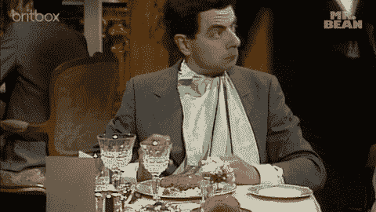

# C#中的伪特征

> 原文:[https://dev.to/htissink/pseudo-traits-in-c-lnp](https://dev.to/htissink/pseudo-traits-in-c-lnp)

# [](#c-80-interfaces-are-not-really-interfaces-anymore)C# 8.0 接口*不再是真正的接口*

[T2】](https://i.giphy.com/media/Lkle2NZinkcy3uUG8T/source.gif)

C# 8.0 附带了一个非常可怕的想法:默认实现与*接口。*

首先，我想说的是，*与默认实现*的接口是一个糟糕的想法。一个接口是一个没有实现的契约，没有任何地方有*默认实现*。这违背了接口的全部目的。*可能*更好的是允许抽象类的多重继承。但是我跑题了。

# [](#traits)特质

[T2】](https://i.giphy.com/media/AAB8uJshCNsuk/giphy.gif)

*与默认实现*的接口背后的想法都来自于一个被称为**特征**的编程概念。特征是一种编程结构，允许你将默认行为附加到对象上，只需让它们*展示*特征。

你可以拥有像`Runner`、`Swimmer`和`Flyer`这样的特征。

*   `Runner`有一个`Running() { ... }`的实现
*   `Swimmer`有一个`Swimming() { ... }`的实现
*   而`Flyer`将会带来`Flying() { ... }`的实现。

现在你可以简单地定义一个具有特征`Runner`和`Swimmer`的`Penguin`，而不必实际编写`Swimming()`或`Running()`的代码，因为通过拥有这些特征，功能已经被实现了。

C#真的不是用来做这个的，或者至少不是用来做好这个的。特征是一个更具功能性的概念。像`Swift`这样的语言，以其`Protocol-Oriented Programming`的风格，很好地迎合了`Protocol Extensions`的这个概念。

让我们来看看在 C# 7.0 中这样做的一种*创造性的*方式，我非常宽松地使用术语*创造性的*。

# [](#get-schwifty)Get Schwifty

[T2】](https://i.giphy.com/media/fpCa9e3J5YmWc/source.gif)

在`Swift`中，a `Protocol`的行为与 C#中的`Interface`非常相似，通过 a `Protocol Extension`实现*特质*的能力。在理论上，Swift*中的`Protocol Extension`应该类似于 C#中的`Interface`扩展。这启发了我去尝试找出一种在 C#中实现特征的方法。*

让我们创建形状。

*   有些形状可以滚动
*   有些形状会反弹。
*   有些形状既能滚动又能弹跳。

实现这一点的面向对象的方法是创建滚动和弹跳的接口。

任何滚动的形状都必须实现`rolling`接口，任何反弹的形状都必须实现`bouncing`接口。对于每一种形状来说，滚动和弹跳并没有太大的不同，这一点是否可以达成一致？弹跳就是弹跳，滚动就是滚动。也许我们不想去*并为我们创建的每一个形状实现反弹或滚动*。

但是等等，你可能会说，为什么不干脆创造一个`super class`让*滚*？还是一个*弹起的`super class`*？

首先，**遗传不好**。其次，你是不是要创造一个滚动的超类，一个弹跳的超类，一个滚动弹跳的超类？嗯，如果你有多重遗产就好了...

你没有对类的多重继承——但是你*可以*实现多重接口。

因此...我们现在要干嘛？我暗示了接口扩展，让我解释它是如何工作的。

*   声明:这是在**中被推荐为编写代码的好方法，严格来说这是一个思想实验。**

# [](#lets-get-cooking)我们开始做饭吧

[T2】](https://i.giphy.com/media/BVXDnwZuSJcqc/giphy.gif)

让我们把一些**特征**样板文件放在一起。

```
public abstract class Trait { }

interface ITrait<T> where T : Trait { } 
```

<svg width="20px" height="20px" viewBox="0 0 24 24" class="highlight-action crayons-icon highlight-action--fullscreen-on"><title>Enter fullscreen mode</title></svg> <svg width="20px" height="20px" viewBox="0 0 24 24" class="highlight-action crayons-icon highlight-action--fullscreen-off"><title>Exit fullscreen mode</title></svg>

我们有一个抽象类`Trait`来过滤我们的**特征**。我们从来不想直接实现`Trait`，但是我们确实想要一系列具有**特征**的东西。当我们定义接口时，将使用特征类。

使用一个接口是关键，因为我们可以实现多个接口，我们可以拥有任意多的特征。

接下来，让我们创建一些特征。

```
public CanRoll : Trait { }

public CanBounce: Trait { } 
```

<svg width="20px" height="20px" viewBox="0 0 24 24" class="highlight-action crayons-icon highlight-action--fullscreen-on"><title>Enter fullscreen mode</title></svg> <svg width="20px" height="20px" viewBox="0 0 24 24" class="highlight-action crayons-icon highlight-action--fullscreen-off"><title>Exit fullscreen mode</title></svg>

同样，这是*种*锅炉板。正是这一点点*绒毛*让我们得以实现神奇的**特质**。

最后，让我们来看看果汁。

```
public static class ShapeTraits
{
    // this only applies to objects that CanBounce
    public static void Bounce(this ITrait<CanBounce> bouncer)
    {
        Console.WriteLine("I can bounce!");
    }

    // this only applies to objects that CanRoll
    public static void Roll(this ITrait<CanRoll> roller)
    {
        Console.WriteLine("I can roll!");
    }
} 
```

<svg width="20px" height="20px" viewBox="0 0 24 24" class="highlight-action crayons-icon highlight-action--fullscreen-on"><title>Enter fullscreen mode</title></svg> <svg width="20px" height="20px" viewBox="0 0 24 24" class="highlight-action crayons-icon highlight-action--fullscreen-off"><title>Exit fullscreen mode</title></svg>

这就是我们的两个美丽的特征实现了。接下来，让我们创建一些形状。

```
// A cylinder can roll
public class Cylinder: ITrait<CanRoll>
{
    // this is empty!
}

// A cube can bounce
public class Cube: ITrait<CanBounce>
{
    // this is empty!
}

// And, implementing multiple interfaces,
// a ball can bounce and roll!
public class Ball: ITrait<CanBounce>, ITrait<CanRoll>
{
    // this is empty!
} 
```

<svg width="20px" height="20px" viewBox="0 0 24 24" class="highlight-action crayons-icon highlight-action--fullscreen-on"><title>Enter fullscreen mode</title></svg> <svg width="20px" height="20px" viewBox="0 0 24 24" class="highlight-action crayons-icon highlight-action--fullscreen-off"><title>Exit fullscreen mode</title></svg>

现在我们可以创建这些类的实例，这些类不包含任何代码，因为这些*伪特性*它们实际上可以做事情！

```
var cylinder = new Cylinder();
cylinder.Roll(); // this works!

var cube = new Cube();
cube.Bounce(); // this works!

var ball = new Ball();
// a ball that rolls and bounces
ball.Roll();
ball.Bounce(); 
```

<svg width="20px" height="20px" viewBox="0 0 24 24" class="highlight-action crayons-icon highlight-action--fullscreen-on"><title>Enter fullscreen mode</title></svg> <svg width="20px" height="20px" viewBox="0 0 24 24" class="highlight-action crayons-icon highlight-action--fullscreen-off"><title>Exit fullscreen mode</title></svg>

[T2】](https://i.giphy.com/media/xT9IgG50Fb7Mi0prBC/giphy.gif)

通过使用*接口扩展*，我们成功地模仿了**特征**的能力，创造了我称之为**的伪特征**。这是一种不同的思考对象的方式，我必须说我真的很喜欢这种方式。

您可以构建扩展方法，并手工挑选您希望属于某个特征的方法。选择你想要的对象的特征允许你一点一点地构造一个对象，只需要实现正确的接口。

这是个好主意吗？老实说，我不知道。是一个好玩的思想实验吗？我肯定这么认为:]