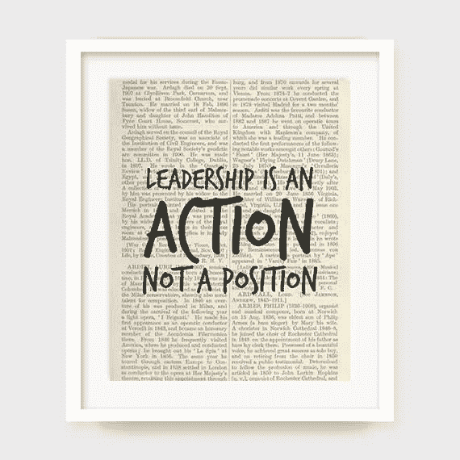

# 没有权威的领导

> 原文:[https://dev.to/dejavo/leading-with-no-authority-khl](https://dev.to/dejavo/leading-with-no-authority-khl)

<figure> 

<figcaption>照片由[哈德逊·辛慈](https://unsplash.com/@hudsonhintze?utm_source=medium&utm_medium=referral)上 [Unsplash](https://unsplash.com?utm_source=medium&utm_medium=referral)</figcaption>

</figure>

作为个人贡献者，我们偶尔会遇到各种情况，需要在没有正式授权的情况下进行领导(有时我们被要求这样做)。没有权力领导他人的正式培训很少。事实上，为这项关键任务找到合适的候选人对任何管理层来说都是一项挑战，在这种情况下没有多大帮助。根本原因取决于所需的技能，因为潜在的候选人不遵循典型的招聘程序和工作描述。

正如唐纳德·麦克甘农曾经说过的:

<figure> 

<figcaption>[领导报](https://www.flickr.com/photos/trancetrotter/17073856539/)由[扎克卡劳利](https://www.flickr.com/photos/trancetrotter/)</figcaption>

</figure>

因此，我将尝试框定五种认可领导力的实用方法，而不是成为一名经理:

#### 积极的态度影响

真正超越自己的角色帮助队友、尊重他人并努力进行公开和诚实讨论的同事是潜在的领导者。此外，他们通常通过幽默、分享成功故事和附和同事的成功来营造愉快的团队氛围。

[T2】](https://i.giphy.com/media/3orifcQtzqZDu77rEI/giphy.gif)

#### 茁壮成长，不断自我发展

跟踪最新行业变化并推动自身不断发展的个人。维护副业项目，为开源做贡献，从多种渠道阅读与工作相关的材料，这些都是跳出框框思考自我提升的例子。创造一个提高你的“筹码”的惯例不仅能促进你的职业生涯，还能为团队树立榜样。

#### 成为权威

一切都是为了知识共享，就这么简单。在会议上发言或撰写专业出版物的个人，无论是在工作场所的内部还是外部，都是在他们的领域展示权威的人。如今，社交媒体有潜力通过写博客、在线展示，甚至维护一个你可以回应自己想法的社交媒体个人资料来激励他人。无论他们选择哪种方式，它都会激励团队成员学习和贡献。

#### 见大图

如果你在乎，你的客户和利益相关者会注意到的。诚信行事和基于相互信任的沟通是领导力的基石。那些跟随的人，有一种“能做”的态度，支持公司的价值观和声誉。他们是必须先做的行动的远见者，比如志愿参加复杂的活动或参与决策。这将使他们看到全局，从而提高他们的领导技能。

[T2】](https://i.giphy.com/media/l2Je9JzGPdaLjjrws/giphy.gif)

#### 指导他人

成为导师对双方来说都是一个成长的机会(正如我之前在博客中提到的)。有经验的队友与经验较少的队友分享他的知识。这是一个提高你的演讲、写作和培训技能的机会。如果做得明智，导师的贡献会得到学员的认可，并最终被认定为特定领域的领导者。

#### 最后的话

成为领导者不应该局限于高层管理人员和那些担任人事经理角色的人。个人贡献者领导者应该得到正式认可和授权。组织必须提供充分的培训，重点是领导没有管理职能的人。珍惜任何这样做的雇主。

在我看来，投资于这种类型的技能组合将会在团队中产生更强的协作，更高的满意度，以及整个组织更长久的保留。