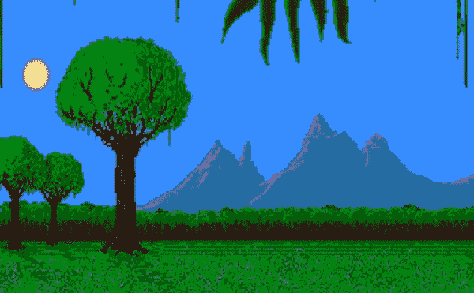
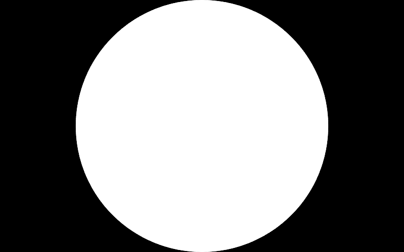

# 在 Phaser 中创建洞穴风格的关卡过渡

> 原文：<https://dev.to/jorbascrumps/creating-spelunky-style-level-transitions-in-phaser-2ajd>

我的上一篇文章变成了一个小众话题，所以我决定尝试一些更主流的东西。虽然我们仍将讨论相位器(必须垄断这个利基！)，您不需要阅读上一篇文章来了解这篇文章。

今天我们来看看如何在 Phaser 中实现受洞穴启发的电平转换。你可以在[现场演示](https://jorbascrumps.github.io/phaser-tutorial-spelunky-transitions/)中看到成品，也可以在 [Github](https://github.com/jorbascrumps/phaser-tutorial-spelunky-transitions) 上找到源代码。我们将从回顾效果开始，学习一些关于场景事件和过渡的知识，然后开始实现。

* * *

## 概念

在我们进入杂草之前，让我们回顾一下我们期望达到的效果。如果你以前没有玩过 Spelunky(你真的应该玩)，我附上了一个视频供参考:

[https://www.youtube.com/embed/fooVdqf7ZZM](https://www.youtube.com/embed/fooVdqf7ZZM)
每一关都从一个完全空白的黑屏开始，通过针孔过渡立即显示整个屏幕。过渡不是从屏幕的中心开始；取而代之的是，过渡被定位在玩家的角色上来集中你的注意力。退出过渡以相反的方式做同样的事情——用玩家周围的黑暗填满屏幕。

让我们深入研究如何复制这种效果。

*2020 年 11 月 26 日更新——这是最终结果的预览:*

[](https://res.cloudinary.com/practicaldev/image/fetch/s--b4up-wnP--/c_limit%2Cf_auto%2Cfl_progressive%2Cq_66%2Cw_880/https://dev-to-uploads.s3.amazonaws.com/i/etobesfudywux2ys1ybk.gif)

## 场景事件

Phaser 内置了许多在场景生命周期中触发的事件，这给了你很多控制。例如，如果你是一个插件作者，你可以使用`boot`事件来挂钩一个场景的引导序列；或者，当场景被破坏或进入休眠状态时，您可能需要做一些清理工作。出于我们的目的，我们将使用`create`事件来知道我们的关卡何时准备好被玩。

您可以像这样聆听场景中的事件:

```
this.events.on('create', fn); 
```

<svg width="20px" height="20px" viewBox="0 0 24 24" class="highlight-action crayons-icon highlight-action--fullscreen-on"><title>Enter fullscreen mode</title></svg> <svg width="20px" height="20px" viewBox="0 0 24 24" class="highlight-action crayons-icon highlight-action--fullscreen-off"><title>Exit fullscreen mode</title></svg>

我更喜欢使用提供的命名空间常量:

```
this.events.on(Phaser.Scenes.Events.CREATE_EVENT, fn); 
```

<svg width="20px" height="20px" viewBox="0 0 24 24" class="highlight-action crayons-icon highlight-action--fullscreen-on"><title>Enter fullscreen mode</title></svg> <svg width="20px" height="20px" viewBox="0 0 24 24" class="highlight-action crayons-icon highlight-action--fullscreen-off"><title>Exit fullscreen mode</title></svg>

> 有关现场事件的更多信息，请参考[文档](https://photonstorm.github.io/phaser3-docs/Phaser.Scenes.Events.html#toc2__anchor)。

## 场景过渡

为了这个效果，我们将使用场景转换，它允许我们从一个场景平滑地移动到另一个场景。我们可以通过指定一个配置对象来精确地控制这个转换的行为。如果你曾经和补间动画一起工作过，那么你会有宾至如归的感觉，因为它们之间有相似之处。

可以通过调用场景插件
开始过渡

```
this.scene.transition({
    // Configuration options
}); 
```

<svg width="20px" height="20px" viewBox="0 0 24 24" class="highlight-action crayons-icon highlight-action--fullscreen-on"><title>Enter fullscreen mode</title></svg> <svg width="20px" height="20px" viewBox="0 0 24 24" class="highlight-action crayons-icon highlight-action--fullscreen-off"><title>Exit fullscreen mode</title></svg>

与场景事件类似，过渡生命周期也有相应的事件。这些活动可以在现场直接订阅。我们将使用`out`事件来了解转换何时发生。

```
this.events.on(Phaser.Scenes.Events.TRANSITION_OUT, fn); 
```

<svg width="20px" height="20px" viewBox="0 0 24 24" class="highlight-action crayons-icon highlight-action--fullscreen-on"><title>Enter fullscreen mode</title></svg> <svg width="20px" height="20px" viewBox="0 0 24 24" class="highlight-action crayons-icon highlight-action--fullscreen-off"><title>Exit fullscreen mode</title></svg>

> 转换事件处理程序的参数会随着事件的不同而发生微妙的变化。详情请参考[文档](https://photonstorm.github.io/phaser3-docs/Phaser.Scenes.Events.html#toc2__anchor)。

## 把所有的东西放在一起

第一步是创建一个空基类。创建一个单独的类并不是绝对必要的，但这样做将有助于隔离代码，并使跨级别重用变得更加容易。现在，只要扩展这个裸露的场景；我们将一边进行一边充实它。

```
class SceneTransition extends Phaser.Scene {
    // TODO
}

class LevelScene extends SceneTransition {} 
```

<svg width="20px" height="20px" viewBox="0 0 24 24" class="highlight-action crayons-icon highlight-action--fullscreen-on"><title>Enter fullscreen mode</title></svg> <svg width="20px" height="20px" viewBox="0 0 24 24" class="highlight-action crayons-icon highlight-action--fullscreen-off"><title>Exit fullscreen mode</title></svg>

### 所有你的基础(类)

现在我们已经有了自己的类，我们可以开始填充它们了。首先使用图形对象创建一个圆，并将其置于场景的中心。该圆应该尽可能大，同时仍然包含在场景中，否则图形稍后将被裁剪。这也有助于在缩放过程中最大限度地减少沿边缘出现的伪像。

```
const maskShape = new Phaser.Geom.Circle(
    this.sys.game.config.width / 2,
    this.sys.game.config.height / 2,
    this.sys.game.config.height / 2
);
const maskGfx = this.add.graphics()
    .setDefaultStyles({
        fillStyle: {
            color: 0xffffff,
        }
    })
    .fillCircleShape(maskShape)
; 
```

<svg width="20px" height="20px" viewBox="0 0 24 24" class="highlight-action crayons-icon highlight-action--fullscreen-on"><title>Enter fullscreen mode</title></svg> <svg width="20px" height="20px" viewBox="0 0 24 24" class="highlight-action crayons-icon highlight-action--fullscreen-off"><title>Exit fullscreen mode</title></svg>

您应该得到以下结果:

[](https://res.cloudinary.com/practicaldev/image/fetch/s--O5KiaEXW--/c_limit%2Cf_auto%2Cfl_progressive%2Cq_auto%2Cw_880/https://thepracticaldev.s3.amazonaws.com/i/h6yfwbdz57l4u4a01lfi.png)

接下来，我们将把蒙版图形转换成纹理，并把它作为图像添加到场景中。我们不希望蒙版图形本身在最终结果中可见，所以请确保移除填充。

```
// ...

const maskGfx = this.add.graphics()
    .fillCircleShape(maskShape)
    .generateTexture('mask')
;
this.mask = this.add.image(0, 0, 'mask')
    .setPosition(
        this.sys.game.config.width / 2,
        this.sys.game.config.height / 2,
    )
; 
```

<svg width="20px" height="20px" viewBox="0 0 24 24" class="highlight-action crayons-icon highlight-action--fullscreen-on"><title>Enter fullscreen mode</title></svg> <svg width="20px" height="20px" viewBox="0 0 24 24" class="highlight-action crayons-icon highlight-action--fullscreen-off"><title>Exit fullscreen mode</title></svg>

你现在应该回到一个空白的场景。最后，我们将遮罩应用到相机上。

```
this.cameras.main.setMask(
    new Phaser.Display.Masks.BitmapMask(this, this.mask)
); 
```

<svg width="20px" height="20px" viewBox="0 0 24 24" class="highlight-action crayons-icon highlight-action--fullscreen-on"><title>Enter fullscreen mode</title></svg> <svg width="20px" height="20px" viewBox="0 0 24 24" class="highlight-action crayons-icon highlight-action--fullscreen-off"><title>Exit fullscreen mode</title></svg>

### 创建关卡

我们不会花太多时间来设置关卡本身。唯一的要求是扩展我们创建的基类并包含一个键。发挥创造力！

```
import SceneTransition from './SceneTransition';

export default class LevelOne extends SceneTransition {

    constructor () {
        super({
            key: 'ONE',
        });
    }

    preload () {
        this.load.image('background_one', 'https://labs.phaser.io/assets/demoscene/birdy-nam-nam-bg1.png');
    }

    create() {
        super.create();

        this.add.image(0, 0, 'background_one')
            .setOrigin(0, 0)
            .setDisplaySize(
                this.sys.game.config.width,
                this.sys.game.config.height
            )
        ;
    }

} 
```

<svg width="20px" height="20px" viewBox="0 0 24 24" class="highlight-action crayons-icon highlight-action--fullscreen-on"><title>Enter fullscreen mode</title></svg> <svg width="20px" height="20px" viewBox="0 0 24 24" class="highlight-action crayons-icon highlight-action--fullscreen-off"><title>Exit fullscreen mode</title></svg>

您现在应该会看到类似这样的内容:

[](https://res.cloudinary.com/practicaldev/image/fetch/s--zj-sNqMe--/c_limit%2Cf_auto%2Cfl_progressive%2Cq_auto%2Cw_880/https://thepracticaldev.s3.amazonaws.com/i/pjjpvvkxi03vycop9dla.png)

### 设置事件

回到基类，我们需要记录两个值。第一个是掩膜的最小比例；第二个是最大值。

```
const MASK_MIN_SCALE = 0;
const MASK_MAX_SCALE = 2; 
```

<svg width="20px" height="20px" viewBox="0 0 24 24" class="highlight-action crayons-icon highlight-action--fullscreen-on"><title>Enter fullscreen mode</title></svg> <svg width="20px" height="20px" viewBox="0 0 24 24" class="highlight-action crayons-icon highlight-action--fullscreen-off"><title>Exit fullscreen mode</title></svg>

最小值相当简单:为了创建无缝过渡，我们需要遮罩完全收缩。最大值有点复杂，取决于游戏的长宽比和你使用的面具形状。摆弄这个值，直到你确信它能完成工作。在我的例子中，我的遮罩需要两倍于它的初始比例来完全清除场景的外部。

接下来，我们可以(最终)利用之前的那些事件。当一个过渡开始时，我们希望将遮罩从最大比例动画到最小比例。让动作暂停以防止敌人攻击玩家也是不错的选择，所以让我们把它加入进来。

```
this.events.on(Phaser.Scenes.Events.TRANSITION_OUT, () => {
    this.scene.pause();

    const propertyConfig = {
        ease: 'Expo.easeInOut',
        from: MASK_MAX_SCALE,
        start: MASK_MAX_SCALE,
        to: MASK_MIN_SCALE,
    };

    this.tweens.add({
        duration: 2500,
        scaleX: propertyConfig,
        scaleY: propertyConfig,
        targets: this.mask,
    });
}); 
```

<svg width="20px" height="20px" viewBox="0 0 24 24" class="highlight-action crayons-icon highlight-action--fullscreen-on"><title>Enter fullscreen mode</title></svg> <svg width="20px" height="20px" viewBox="0 0 24 24" class="highlight-action crayons-icon highlight-action--fullscreen-off"><title>Exit fullscreen mode</title></svg>

一旦下一个场景准备好了，我们要反向运行动画来完成循环。这个动画和上一个动画之间有一些值得讨论的变化，主要是关于时间。第一个变化是动画的持续时间；为了让玩家更快地回到游戏中来，游戏时间被缩短了一半。您可能还注意到了添加的`delay`属性。在我的测试中，我发现如果动画反转得太快，看起来会有点不自然。因此，增加了一个小停顿，以营造一种期待感。

```
this.events.on(Phaser.Scenes.Events.CREATE, () => {
    const propertyConfig = {
        ease: 'Expo.easeInOut',
        from: MASK_MIN_SCALE,
        start: MASK_MIN_SCALE,
        to: MASK_MAX_SCALE,
    };

    this.tweens.add({
        delay: 2750,
        duration: 1500,
        scaleX: propertyConfig,
        scaleY: propertyConfig,
        targets: this.mask,
    });
}); 
```

<svg width="20px" height="20px" viewBox="0 0 24 24" class="highlight-action crayons-icon highlight-action--fullscreen-on"><title>Enter fullscreen mode</title></svg> <svg width="20px" height="20px" viewBox="0 0 24 24" class="highlight-action crayons-icon highlight-action--fullscreen-off"><title>Exit fullscreen mode</title></svg>

### 触发跃迁

到目前为止，对于我们所做的所有设置，我们几乎没有什么可以展示的。让我们添加一个触发器来开始转换。这里我们在关卡中使用了一个指针事件，但这可能是由游戏中的任何事情触发的(例如，与一个方块碰撞，计时器倒计时的结果，等等)。).

```
this.input.on('pointerdown', () => {
    this.scene.transition({
        duration: 2500,
        target: 'ONE',
    });
}); 
```

<svg width="20px" height="20px" viewBox="0 0 24 24" class="highlight-action crayons-icon highlight-action--fullscreen-on"><title>Enter fullscreen mode</title></svg> <svg width="20px" height="20px" viewBox="0 0 24 24" class="highlight-action crayons-icon highlight-action--fullscreen-off"><title>Exit fullscreen mode</title></svg>

如果您试图触发转换，您可能会注意到什么也没有发生。这是因为您不能从场景本身过渡到场景。为了这个例子，你可以复制你的关卡(确保给它一个唯一的键)，然后转换到那个。

就是这样！你现在应该有你自己的受洞穴启发的关卡过渡了。

## 结论

关卡过渡是一种很好的方式，可以给你的游戏增加沉浸感和润色感，而不需要花费太多精力。由于这种效果完全是通过在相机上应用一个遮罩来创建的，所以可以很容易地修改它，例如使用马里奥的头部来复制在*新超级马里奥兄弟*中发现的效果，或者如果你感觉更冒险(并且不太侵犯版权)，你可以创建一个完全独特的带有微妙动画效果的序列。唯一真正的限制*是*你的想象力。

* * *

谢谢你抽出时间来和我一起冒险！我在撰写这些文章的过程中获得了很多乐趣，我希望它们能对某些人有用。如果你最终在你的某个游戏中使用了这种技术，或者只是想让我知道你的想法，请在这里留下评论或者在 [Twitter](https://twitter.com/jorbascrumps) 上联系我。