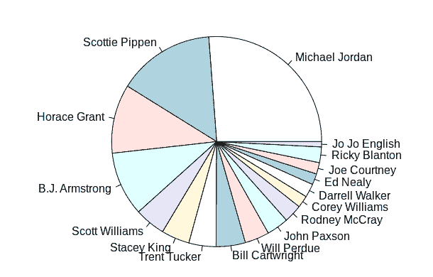

# 今天的三件事- 9/3

> 原文：<https://dev.to/goatmale/three-things-from-today-9-3-2kbd>

# 2019 年 9 月 3 日

### 劳动节快乐！

希望每个人的劳动节都很精彩。

## 1。覆盖非交互式 Docker 容器的入口点

今天摆弄 Docker 图像时，我发现我需要在一个非交互式容器上运行一些命令。

幸运的是，我能够找到我需要的确切命令来启动 shell 并完成我的工作。

```
docker run -it --entrypoint /bin/bash <image> 
```

<svg width="20px" height="20px" viewBox="0 0 24 24" class="highlight-action crayons-icon highlight-action--fullscreen-on"><title>Enter fullscreen mode</title></svg> <svg width="20px" height="20px" viewBox="0 0 24 24" class="highlight-action crayons-icon highlight-action--fullscreen-off"><title>Exit fullscreen mode</title></svg>

## 2。R 到底是什么？

因为我发现自己被毒品(拖？)进入数据科学的世界，我发现这个世界充斥着首字母缩写词、完全不同和相似的编程语言，以及各种各样的其他恶魔。

今天的恶魔是 r。

r 是一种主要用于统计计算的解释型语言(没有编译)。

我可以为 https://www.rstudio.com/安装 Deb 了——这似乎是这个平台最好的 IDE。

从那里我可以用一些演示画出一个漂亮的图表。

首先，我从这里提取了一些关于 93 年公牛队的数据

我将它保存为一个 CSV 文件，并能够通过下面的命令将它加载到 RStudio 并显示一个漂亮的饼状图:

```
#Read data from CSV
data = read.csv("bulls.csv")
#Let's see the data with just Player and points.
data.frame(x=data$Player,y=data$PTS)
#Pretty piechart!
pie(data$PTS,labels=data$Player) 
```

<svg width="20px" height="20px" viewBox="0 0 24 24" class="highlight-action crayons-icon highlight-action--fullscreen-on"><title>Enter fullscreen mode</title></svg> <svg width="20px" height="20px" viewBox="0 0 24 24" class="highlight-action crayons-icon highlight-action--fullscreen-off"><title>Exit fullscreen mode</title></svg>

[](https://res.cloudinary.com/practicaldev/image/fetch/s--s5Mskks3--/c_limit%2Cf_auto%2Cfl_progressive%2Cq_auto%2Cw_880/https://thepracticaldev.s3.amazonaws.com/i/ogcugq4e5sp69rpj6gkm.png)

最后，数据科学可以告诉我们谁是最好的公牛球员！

## 3。[库贝福德](https://github.com/txn2/kubefwd)

### “散货港口转运 Kubernetes 服务地方发展”

在这个项目中放一个大头针——这对于在 minikube 上进行本地开发来说似乎非常方便。

它的好处似乎是简单。

只需一个命令，您就可以转发与指定命名空间关联的所有服务端口。

您可以让它为您做这件事，而不是摆弄转发端口的主机条目。

明天见！