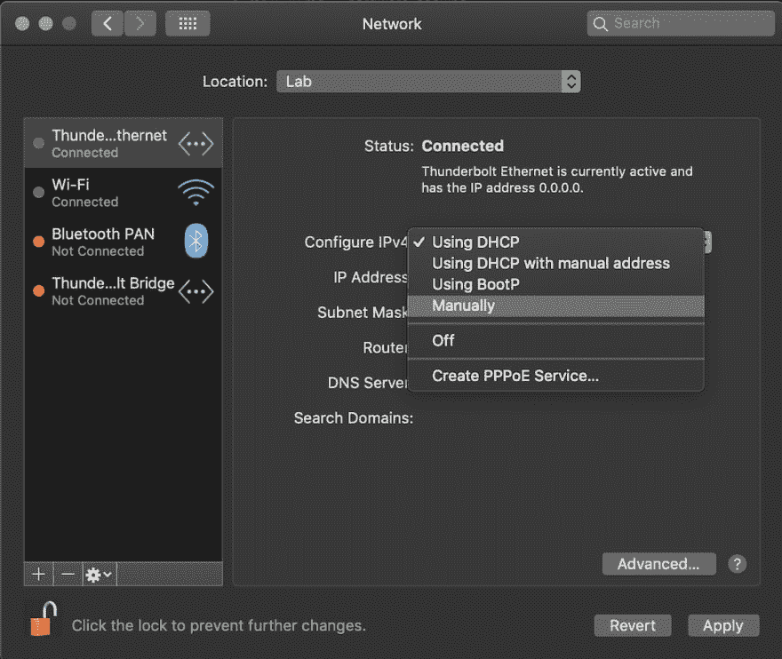
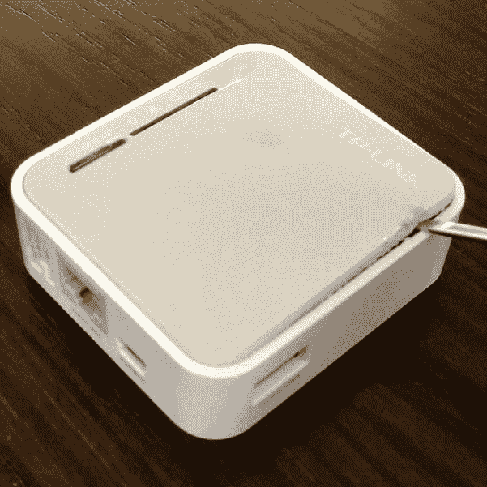
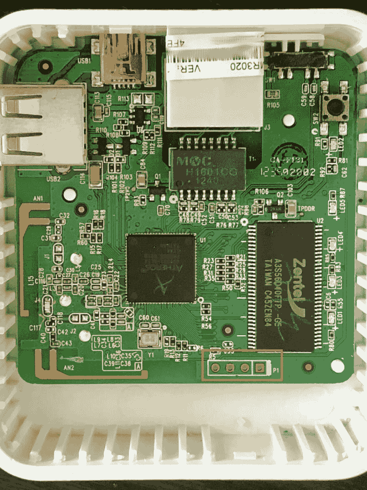
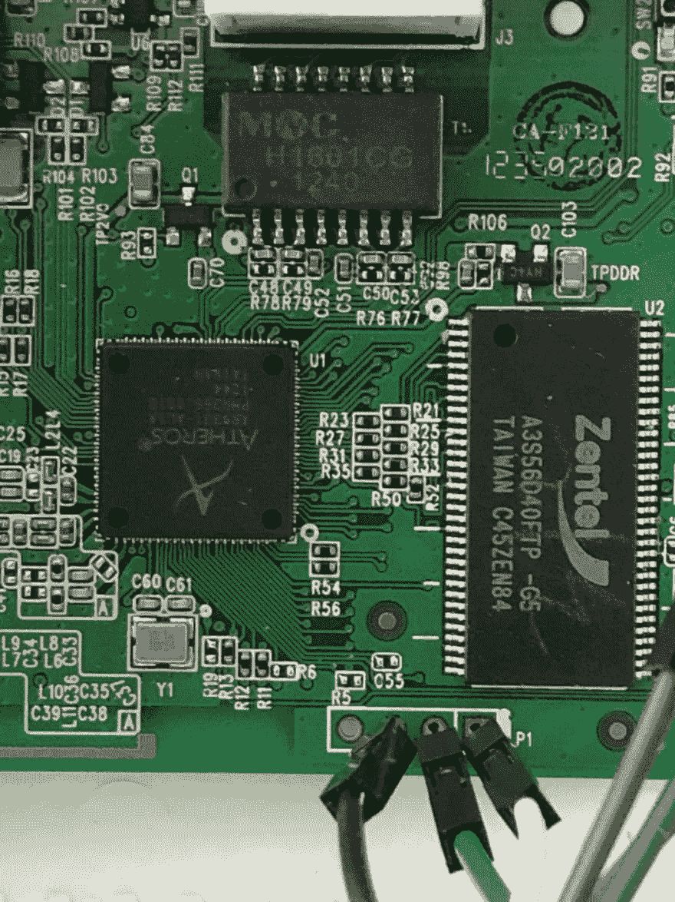

# 通过 macOS 的串行端口将 OpenWrt 安装到 TP-Link TL-MR3020 路由器上

> 原文:[https://dev . to/blakec/install-openwrt-onto-a-TP-link-TL-Mr 3020-router-via-a-serial-port-from-MAC OS-b3i](https://dev.to/blakec/install-openwrt-onto-a-tp-link-tl-mr3020-router-via-a-serial-port-from-macos-b3i)

这是一个使用 macOS 从 CLI 通过串口在 [TP-Link TL-MR3020](https://www.tp-link.com/uk/home-networking/3g-4g-router/tl-mr3020/) 路由器上安装 [OpenWrt](https://openwrt.org/) 的教程。

## [](#target-audience)目标受众

本教程面向拥有初级到中级 Linux 专业知识的个人，他们拥有一个 TL-MR3020，该 TL-Mr 3020 要么被阻塞(即固件无法加载)，要么他们没有从 web 界面登录和刷新固件所需的管理凭证。

## [](#prerequisites)先决条件

为了成功完成本教程中概述的说明，您将需要以下物品。

*   苹果电脑
*   一个 [TP-Link TL-MR3020](https://www.tp-link.com/uk/home-networking/3g-4g-router/tl-mr3020/) 路由器
*   1 个 USB UART 适配器(例如， [Adafruit Industries 954 USB 转 TTL 串行电缆](https://www.adafruit.com/product/954)
*   1 根 [USB A-Male 到 Mini-B 充电线](https://www.amazon.com/AmazonBasics-USB-2-0-Cable-Male/dp/B00NH13S44/)
*   1 根[5 类(CAT5)以太网电缆](https://www.adafruit.com/product/994)
*   公对公跳线(例如，[阿达福工业公司 1956 年优质公/公跳线- 20 x 3 英寸(75 毫米)](https://www.adafruit.com/product/1956))
*   互联网接入

## [](#step-1-prepare-the-environment)步骤 1 -准备环境

### [](#configure-a-static-ip-on-your-ethernet-interface)在以太网接口上配置一个静态 IP

为了将固件从计算机复制到路由器，您必须首先在计算机的以太网接口上配置一个 IPv4 地址，以便它可以在连接时与路由器通信。

若要在 macOS 上配置 IP，请前往“系统偏好设置”>“网络”,然后选择您的以太网接口。单击配置 IPv4 旁边的下拉菜单，并选择“手动”选项。

[T2】](https://res.cloudinary.com/practicaldev/image/fetch/s--5lIlKUGO--/c_limit%2Cf_auto%2Cfl_progressive%2Cq_auto%2Cw_880/https://thepracticaldev.s3.amazonaws.com/i/jaeq2ivo1u9h6i2fxzsm.png)

配置一个 IPv4 地址，例如 192.0.2.2，子网掩码为 255.255.255.0。

单击应用保存配置。

*注意:在您的主网络上无法访问该地址。它将仅用于与路由器的通信。*

[T2】](https://res.cloudinary.com/practicaldev/image/fetch/s--KPxIH-f---/c_limit%2Cf_auto%2Cfl_progressive%2Cq_auto%2Cw_880/https://thepracticaldev.s3.amazonaws.com/i/9qb4c06la042omxoh0hl.png)

### [](#download-the-openwrt-firmware)下载 OpenWrt 固件

前往 OpenWrt 的网站下载最新的、受支持的 [TL-MR3020](https://openwrt.org/toh/tp-link/tl-mr3020#installation) 版本固件。请务必下载标题为固件 OpenWrt 安装 URL 一栏下的链接。

在撰写本文时，当前支持的版本是 [17.01.5](http://downloads.openwrt.org/releases/17.01.5/targets/ar71xx/generic/lede-17.01.5-ar71xx-generic-tl-mr3020-v1-squashfs-factory.bin) 。

### [](#configure-the-tftp-server)配置 TFTP 服务器

为了将固件复制到设备，您需要设置一个[小型文件传输协议(TFTP)](https://en.wikipedia.org/wiki/Trivial_File_Transfer_Protocol) 服务器。路由器将使用此服务器从您的计算机下载固件。

macOS 在基本安装中附带了 TFTP 服务器。使用下面的`launchctl`命令临时启用 macOS 服务管理器下的 TFTP 服务器， [launchd](https://en.wikipedia.org/wiki/Launchd) 。

```
$  sudo launchctl load -F /System/Library/LaunchDaemons/tftp.plist 
```

<svg width="20px" height="20px" viewBox="0 0 24 24" class="highlight-action crayons-icon highlight-action--fullscreen-on"><title>Enter fullscreen mode</title></svg> <svg width="20px" height="20px" viewBox="0 0 24 24" class="highlight-action crayons-icon highlight-action--fullscreen-off"><title>Exit fullscreen mode</title></svg>

在 TCP/UDP 端口号 69(标准 TFTP 端口号)上接收到计算机 IP 的网络连接请求时，该守护程序将自动启动。

接下来，将上一步下载的固件复制到 TFTP 服务器的数据目录`/private/tftpboot/`。

```
$  sudo cp ~/Downloads/lede-17.01.5-ar71xx-generic-tl-mr3020-v1-squashfs-factory.bin /private/tftpboot/ 
```

<svg width="20px" height="20px" viewBox="0 0 24 24" class="highlight-action crayons-icon highlight-action--fullscreen-on"><title>Enter fullscreen mode</title></svg> <svg width="20px" height="20px" viewBox="0 0 24 24" class="highlight-action crayons-icon highlight-action--fullscreen-off"><title>Exit fullscreen mode</title></svg>

## [](#step-2-open-the-device)第二步-打开设备

稍微撬一下，路由器的顶部就会脱落。插入塑料工具，小心撬开塑料顶盖。

[T2】](https://res.cloudinary.com/practicaldev/image/fetch/s--2irkQz_u--/c_limit%2Cf_auto%2Cfl_progressive%2Cq_auto%2Cw_880/https://thepracticaldev.s3.amazonaws.com/i/ywgafjvh0scax1nkqmx5.jpg)

## [](#step-3-connect-the-usb-adapter-to-the-uart-pins-on-the-router)步骤 3 -将 USB 适配器连接到路由器上的 UART 引脚

将 USB 适配器插入电脑。

接下来，将 UART 适配器的发送、接收和接地线连接到路由器上的相关引脚，这些引脚在下图中 RAM 的正下方突出显示。

[T2】](https://res.cloudinary.com/practicaldev/image/fetch/s--DXo7g5c1--/c_limit%2Cf_auto%2Cfl_progressive%2Cq_auto%2Cw_880/https://thepracticaldev.s3.amazonaws.com/i/551qgtguwihf3xemvc6c.jpg)

针脚的顺序从左到右是:电源、接地(GND)、接收(RXD)和发射(TXD)。

使用跳线将 USB UART 适配器的电缆连接到路由器板上的 UART 引脚。最终的连接应该是:

| TL-MR3020 | USB-UART | 颜色 |
| --- | --- | --- |
| GND | GND | 黑色 |
| 接收数据 | TXD | 绿色的 |
| TXD | 接收数据 | 白色 |

*注意:连接到路由器时，请务必交换 TXD 和 RXD。*

[T2】](https://res.cloudinary.com/practicaldev/image/fetch/s--tMnzqdiU--/c_limit%2Cf_auto%2Cfl_progressive%2Cq_auto%2Cw_880/https://thepracticaldev.s3.amazonaws.com/i/0hrg04yhuz029w6p03h5.jpg)

## [](#step-4-connect-the-ethernet-cable-to-the-router)步骤 4 -将以太网电缆连接到路由器

在您的计算机和路由器的以太网端口之间连接以太网电缆。

## [](#step-5-initiate-a-console-connection-to-the-router)步骤 5 -启动与路由器的控制台连接

使用终端模拟器打开 macOS 上的 Unix 控制台，例如内置终端应用程序(应用程序>实用程序>终端)或 [iTerm2](https://www.iterm2.com/) 。

接下来，使用 macOS 内置的`cu`命令启动从您的计算机到路由器的控制台连接。或者，你可以使用一个基于 GUI 的串行控制台程序，比如来自 DecisiveTactics 的 [CoolTerm](https://freeware.the-meiers.org/) 或 [Serial](https://www.decisivetactics.com/products/serial/) 。

您需要提供`cu`您的 TTY 设备的名称，以及用于连接的[波特率](https://en.wikipedia.org/wiki/Baud)115200 位/秒。

```
cu --line /dev/tty.SLAB_USBtoUART --speed 115200 
```

<svg width="20px" height="20px" viewBox="0 0 24 24" class="highlight-action crayons-icon highlight-action--fullscreen-on"><title>Enter fullscreen mode</title></svg> <svg width="20px" height="20px" viewBox="0 0 24 24" class="highlight-action crayons-icon highlight-action--fullscreen-off"><title>Exit fullscreen mode</title></svg>

在下一步之前，您不会在屏幕上看到任何输出。

## [](#step-6-power-on-the-router)步骤 6 -打开路由器电源

将 USB 电缆的 USB A 端连接到 USB 墙上充电适配器或电脑上的第二个 USB 端口。

将 USB 电缆的 mini-B 端连接到路由器的 USB 端口。当路由器启动时，您应该会在终端屏幕上看到路由器启动加载程序的文本输出。

```
U-Boot 1.1.4 (Aug 17 2012 - 15:21:03)

AP121 (ar9330) U-boot

DRAM:  32 MB
led turning on for 1s...
id read 0x100000ff
flash size 4194304, sector count = 64
Flash:  4 MB
Using default environment

In:    serial
Out:   serial
Err:   serial
Net:   ag7240_enet_initialize...
No valid address in Flash. Using fixed address
No valid address in Flash. Using fixed address
: cfg1 0x5 cfg2 0x7114
eth0: 00:03:7f:09:0b:ad
ag7240_phy_setup
eth0 up
: cfg1 0xf cfg2 0x7214
eth1: 00:03:7f:09:0b:ad
athrs26_reg_init_lan
ATHRS26: resetting s26
ATHRS26: s26 reset done
ag7240_phy_setup
eth1 up
eth0, eth1
Autobooting in 1 seconds ## Booting image at 9f020000 ...
 Uncompressing Kernel Image ... OK

Starting kernel ... 
```

<svg width="20px" height="20px" viewBox="0 0 24 24" class="highlight-action crayons-icon highlight-action--fullscreen-on"><title>Enter fullscreen mode</title></svg> <svg width="20px" height="20px" viewBox="0 0 24 24" class="highlight-action crayons-icon highlight-action--fullscreen-off"><title>Exit fullscreen mode</title></svg>

在路由器引导内核之前，快速在终端输入`tpl`进入 U-Boot 控制台。

在路由器开始引导操作系统之前，有一个非常短的窗口来键入上述密钥。您可能需要重新启动路由器，并多次尝试成功输入按键。

如果成功输入，您将看到以下 U-Boot 提示。

```
hornet> 
```

<svg width="20px" height="20px" viewBox="0 0 24 24" class="highlight-action crayons-icon highlight-action--fullscreen-on"><title>Enter fullscreen mode</title></svg> <svg width="20px" height="20px" viewBox="0 0 24 24" class="highlight-action crayons-icon highlight-action--fullscreen-off"><title>Exit fullscreen mode</title></svg>

*有趣的事实:TL-MR3020 使用 ALFA Network Hornet-UB 嵌入式主板，因此在引导加载程序的提示中被命名为“Hornet”。*

## [](#step-7-download-the-firmware-onto-the-router)步骤 7 -将固件下载到路由器上

为了将固件下载到路由器上，您必须为路由器配置一个 IP 地址，并将 TFTP 服务器 IP 设置为您计算机的 IP 地址。

```
hornet>  setenv ipaddr 192.0.2.10
hornet>  setenv serverip 192.0.2.2 
```

<svg width="20px" height="20px" viewBox="0 0 24 24" class="highlight-action crayons-icon highlight-action--fullscreen-on"><title>Enter fullscreen mode</title></svg> <svg width="20px" height="20px" viewBox="0 0 24 24" class="highlight-action crayons-icon highlight-action--fullscreen-off"><title>Exit fullscreen mode</title></svg>

接下来，使用`tftpboot`命令将固件从 TFTP 服务器下载到路由器。该命令有几个参数选项。

`tftpboot [loadAddress] [bootfilename]`

执行以下命令下载并安装 OpenWrt 固件。

```
hornet>  tftpboot 0x80000000 lede-17.01.5-ar71xx-generic-tl-mr3020-v1-squashfs-factory.bin 
```

<svg width="20px" height="20px" viewBox="0 0 24 24" class="highlight-action crayons-icon highlight-action--fullscreen-on"><title>Enter fullscreen mode</title></svg> <svg width="20px" height="20px" viewBox="0 0 24 24" class="highlight-action crayons-icon highlight-action--fullscreen-off"><title>Exit fullscreen mode</title></svg>

如果路由器能够连接到路由器计算机并成功下载固件，您应该会看到类似如下的输出。

```
hornet>  tftpboot 0x80000000 lede-17.01.5-ar71xx-generic-tl-mr3020-v1-squashfs-factory.bin
Using eth1 device TFTP from server 192.0.2.2;  our IP address is 192.0.2.10
Filename 'lede-17.01.5-ar71xx-generic-tl-mr3020-v1-squashfs-factory.bin'.
Load address: 0x80000000 Loading: #################################################################
 #################################################################
 #################################################################
 #################################################################
 #################################################################
 #################################################################
 #################################################################
 #################################################################
 #################################################################
 #################################################################
 #################################################################
 ######################################################
done
Bytes transferred = 3932160 (3c0000 hex) 
```

<svg width="20px" height="20px" viewBox="0 0 24 24" class="highlight-action crayons-icon highlight-action--fullscreen-on"><title>Enter fullscreen mode</title></svg> <svg width="20px" height="20px" viewBox="0 0 24 24" class="highlight-action crayons-icon highlight-action--fullscreen-off"><title>Exit fullscreen mode</title></svg>

记下表示传输字节数的十六进制值——在本例中为`0x3c0000`。稍后将需要该值。

## [](#step-8-install-the-firmware-onto-the-routers-flash-memory)步骤 8 -将固件安装到路由器的闪存中

接下来，使用`erase`命令擦除现有的闪存。`help`命令可用于提供`erase`命令的语法。

```
hornet>  help erase
... erase start +len
    - erase FLASH from addr 'start' to the end of sect w/addr 'start'+'len'-1 ... 
```

<svg width="20px" height="20px" viewBox="0 0 24 24" class="highlight-action crayons-icon highlight-action--fullscreen-on"><title>Enter fullscreen mode</title></svg> <svg width="20px" height="20px" viewBox="0 0 24 24" class="highlight-action crayons-icon highlight-action--fullscreen-off"><title>Exit fullscreen mode</title></svg>

控制台输出“在 9f020000 启动映像...”在步骤 6 中，显示路由器的当前固件位于存储器地址 0x9f020000。

您需要从该地址开始擦除足够的空间，以适应新固件的大小。回忆步骤 8 中保存的字节传输值。该值将被用作`erase`命令中的`+len`偏移量。

执行以下命令擦除闪存固件。成功删除指定的内存范围后，您应该会看到后续输出。

```
hornet>  erase 0x9f020000 +0x3c0000
 First 0x2 last 0x3d sector size 0x10000
  61
Erased 60 sectors hornet> 
```

<svg width="20px" height="20px" viewBox="0 0 24 24" class="highlight-action crayons-icon highlight-action--fullscreen-on"><title>Enter fullscreen mode</title></svg> <svg width="20px" height="20px" viewBox="0 0 24 24" class="highlight-action crayons-icon highlight-action--fullscreen-off"><title>Exit fullscreen mode</title></svg>

然后，使用`copy.b`将下载的固件安装到路由器的闪存中。

```
hornet>  help cp.b
cp [.b, .w, .l] source target count
    - copy memory 
```

<svg width="20px" height="20px" viewBox="0 0 24 24" class="highlight-action crayons-icon highlight-action--fullscreen-on"><title>Enter fullscreen mode</title></svg> <svg width="20px" height="20px" viewBox="0 0 24 24" class="highlight-action crayons-icon highlight-action--fullscreen-off"><title>Exit fullscreen mode</title></svg>

执行以下命令。

```
hornet>  cp.b 0x80000000 0x9f020000 0x3c0000
Copy to Flash... write addr: 9f020000
done 
```

<svg width="20px" height="20px" viewBox="0 0 24 24" class="highlight-action crayons-icon highlight-action--fullscreen-on"><title>Enter fullscreen mode</title></svg> <svg width="20px" height="20px" viewBox="0 0 24 24" class="highlight-action crayons-icon highlight-action--fullscreen-off"><title>Exit fullscreen mode</title></svg>

## [](#step-9-boot-the-openwrt-os)步骤 9 -启动 OpenWrt 操作系统

最后，指示路由器引导新安装的 OpenWrt 固件。

```
hornet>  bootm 9f020000 
```

<svg width="20px" height="20px" viewBox="0 0 24 24" class="highlight-action crayons-icon highlight-action--fullscreen-on"><title>Enter fullscreen mode</title></svg> <svg width="20px" height="20px" viewBox="0 0 24 24" class="highlight-action crayons-icon highlight-action--fullscreen-off"><title>Exit fullscreen mode</title></svg>

路由器将可以在 [http://192.168.1.1](http://192.168.1.1) 访问。

*注意:您需要将计算机的 IP 重新配置到这个子网中，然后才能访问这个新地址的路由器。*

## [](#resources)资源

1.  [openwrt . org:TP-Link TL-Mr 3020 安装说明](https://openwrt.org/toh/tp-link/tl-mr3020)
2.  [OS X 的 un brick | Debrick TP-LINK 3020](https://gist.github.com/sindhus/6351f9b6b5b57ba711f43fd1d3e27469)