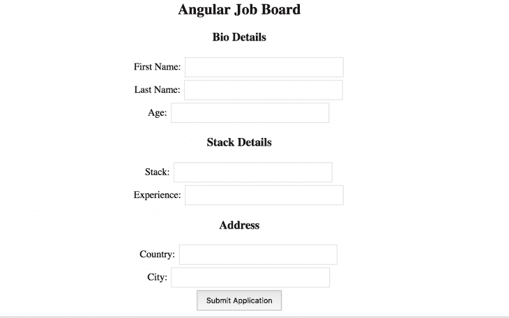

# 如何在 Angular 8 中管理带有表单组的反应式表单控件

> 原文：<https://dev.to/bnevilleoneill/how-to-manage-reactive-form-controls-with-form-groups-in-angular-8-1mn4>

**由[nwo se lotana](https://blog.logrocket.com/author/nwoselotanna/)撰写**

## 为什么反应式很重要？

使用反应式表单，你会发现构建更简洁的表单更容易。因为每个 JavaScript 框架都建议不要将模板集群化，这已经成为一个优先事项，因为表单逻辑现在位于组件类中。

它还减少了使用大量指令甚至端到端测试的需要，因为您现在可以轻松地测试您的表单。它给了开发人员所有的控制权，没有什么是隐含的了——关于输入和控制的每一个选择都必须是有意的，当然也是显式的。

在 Angular 中，表单控件是可以保存任何表单元素的数据值和验证信息的类。也就是说，你在一个反应式表单中的每一个表单输入都应该被一个表单控件绑定。

这些是组成反应形式的基本单位。在本文中，将向您展示如何通过表单组来划分表单控件，以创建集群，从而提供一个平台来轻松地以组的形式访问模板元素。

[](https://logrocket.com/signup/)

## 什么是表单组？

表单组包装表单控件的集合；就像控件使您可以访问元素的状态一样，组也提供了相同的访问权限，但访问的是包装控件的状态。初始化时，表单组中的每个表单控件都由名称标识。

一个`FormGroup`将每个子`FormControl`的值聚集到一个对象中，每个控件名作为键。它通过减少其子节点的状态值来计算其状态。

## 开始前…

为了能够完成本文的演示，您应该具备:

*   计算机上安装的节点版本 11.0
*   节点程序包管理器版本 6.7(通常随节点安装一起提供)
*   角度控制器版本 8.0
*   Angular 的最新版本(版本 8)

```
// run the command in a terminal
ng version 
```

Enter fullscreen mode Exit fullscreen mode

确认您使用的是版本 8，如果不是，请更新到 8。

*   在这里下载[占卜 Chrome 扩展](https://chrome.google.com/webstore/detail/augury/elgalmkoelokbchhkhacckoklkejnhcd?hl=en)。
*   点击这里下载本教程的起始项目[来完成演示。](https://github.com/viclotana/ng-reactive)
*   使用以下命令解压缩项目并初始化终端中的节点模块:

```
npm install 
```

Enter fullscreen mode Exit fullscreen mode

其他值得拥有的东西有:

*   初级水平的角度框架的工作知识。
*   熟悉 Angular 中的表单控件将是一个优势，但不是一个要求。

## 演示

为了说明表单组的概念，我们将介绍构建反应式表单的过程，以便您可以完全掌握如何使用表单组来设置它。从这里开始，我们假设您已经在 GitHub 上下载了[starter 项目，并在 VS 代码中打开了它。](https://github.com/viclotana/ng-reactive)

### 注册表单组

首先要做的是告诉 Angular，您希望通过将表单组导入到适当的组件中来利用它。导航到`employee.component.ts`文件并复制到下面的代码块:

```
import { Component, OnInit } from '@angular/core';
import { FormControl, FormGroup } from '@angular/forms'
@Component({
  selector: 'app-employee',
  templateUrl: './employee.component.html',
  styleUrls: ['./employee.component.css']
})
export class EmployeeComponent implements OnInit {
  bioSection = new FormGroup({
    firstName: new FormControl(''),
    lastName: new FormControl(''),
    age: new FormControl('')
  });
constructor() { }
ngOnInit() {
  }
} 
```

Enter fullscreen mode Exit fullscreen mode

在这里，表单组被导入并初始化，以便将构成表单 bio 部分的一些表单控件组合在一起。为了反映这个组，您必须将模型与带有表单组名称的视图相关联，就像这样:

```
// copy inside the employee.component.html file
<form [formGroup]="bioSection" (ngSubmit)="callingFunction()">

  <label>
    First Name:
    <input type="text" formControlName="firstName">
  </label>
<label>
    Last Name:
    <input type="text" formControlName="lastName">
  </label>
<label>
    Age:
    <input type="text" formControlName="age">
  </label>
<button type="submit">Submit Application</button>
</form> 
```

Enter fullscreen mode Exit fullscreen mode

就像表单控件一样，表单组名用来标识视图中的表单组，提交时会触发`callingFunction`。您的`app.component.html`文件应该是这样的:

```
<div style="text-align:center">
  <h2>Angular Job Board </h2>
  <app-employee></app-employee>
</div> 
```

Enter fullscreen mode Exit fullscreen mode

现在使用命令:
运行开发中的应用程序

```
ng serve 
```

Enter fullscreen mode Exit fullscreen mode

应该是这样的:

[](https://res.cloudinary.com/practicaldev/image/fetch/s--NxzSaMZ2--/c_limit%2Cf_auto%2Cfl_progressive%2Cq_auto%2Cw_880/https://i2.wp.com/blog.logrocket.com/wp-content/uploads/2019/08/angular-job-board-form.png%3Fresize%3D730%252C208%26ssl%3D1)

## 嵌套表格组

是的，反应式表单 API 使得将一个表单组嵌套在另一个表单组中成为可能。将下面的代码块复制到`employee.component.ts`文件:

```
import { Component, OnInit } from '@angular/core';
import { FormControl, FormGroup } from '@angular/forms'
@Component({
  selector: 'app-employee',
  templateUrl: './employee.component.html',
  styleUrls: ['./employee.component.css']
})
export class EmployeeComponent implements OnInit {
  bioSection = new FormGroup({
    firstName: new FormControl(''),
    lastName: new FormControl(''),
    age: new FormControl(''),
    stackDetails: new FormGroup({
      stack: new FormControl(''),
      experience: new FormControl('')
    }),
    address: new FormGroup({
        country: new FormControl(''),
        city: new FormControl('')
    })
  });
constructor() { }
ngOnInit() {
  }
  callingFunction() {
    console.log(this.bioSection.value);
   }
} 
```

Enter fullscreen mode Exit fullscreen mode

在这里，您可以看到主表单组包装器是 bio 部分，其中嵌套了堆栈细节组和地址组。需要注意的是，正如您在代码块中看到的，嵌套的窗体组不是由赋值语句定义的，而是用冒号定义的，就像窗体控件一样。在视图中反映出来会是这样:

```
// copy inside the employee.component.html file
<form [formGroup]="bioSection" (ngSubmit)="callingFunction()">
    <h3>Bio Details
</h3>

  <label>
    First Name:
    <input type="text" formControlName="firstName">
  </label> <br>
<label>
    Last Name:
    <input type="text" formControlName="lastName">
  </label> <br>
<label>
    Age:
    <input type="text" formControlName="age">
  </label>
<div formGroupName="stackDetails">
    <h3>Stack Details</h3>

    <label>
      Stack:
      <input type="text" formControlName="stack">
    </label> <br>

    <label>
      Experience:
      <input type="text" formControlName="experience">
    </label>
  </div>
<div formGroupName="address">
    <h3>Address</h3>

    <label>
      Country:
      <input type="text" formControlName="country">
    </label> <br>

    <label>
      City:
      <input type="text" formControlName="city">
    </label>
  </div>
<button type="submit">Submit Application</button>
</form> 
```

Enter fullscreen mode Exit fullscreen mode

模型和视图中的每个名称都要匹配，这一点非常重要——不要拼错表单控件名称！当您保存并运行应用程序时，如果您确实遇到了任何错误，请阅读错误消息并纠正您一定使用的拼写错误。您可以使用下面的样式说明来设置组件的样式:

```
input[type=text] {
    width: 30%;
    padding: 8px 14px;
    margin: 2px;
    box-sizing: border-box;
  }
  button {
      font-size: 12px;
      margin: 2px;
      padding: 8px 14px;
  } 
```

Enter fullscreen mode Exit fullscreen mode

如果您运行该应用程序，您应该在浏览器中看到类似这样的内容:

[](https://res.cloudinary.com/practicaldev/image/fetch/s--u2hj_Kha--/c_limit%2Cf_auto%2Cfl_progressive%2Cq_auto%2Cw_880/https://i0.wp.com/blog.logrocket.com/wp-content/uploads/2019/08/angular-job-board-form-bio-e1567003921989.png%3Fresize%3D730%252C456%26ssl%3D1) 

当您使用表单并提交时，您将在浏览器控制台中看到返回的输入结果。本教程的完整代码可以在 GitHub 上找到[。](https://github.com/viclotana/ng-group)

## 结论

除了学习表单控件之外，现在还向您介绍了对这些控件进行分组的重要概念。还向您展示了为什么对它们进行分组非常重要，因为这可以确保它们的集合实例可以被一次捕获。我们要看的下一个概念是表单生成器，请继续阅读博客！

* * *

**编者按:**看到这个帖子有问题？你可以在这里找到正确的版本。

## Plug: [LogRocket](https://logrocket.com/signup/) ，一款适用于网络应用的 DVR

[](https://res.cloudinary.com/practicaldev/image/fetch/s--6FG5kvEL--/c_limit%2Cf_auto%2Cfl_progressive%2Cq_auto%2Cw_880/https://i2.wp.com/blog.logrocket.com/wp-content/uploads/2017/03/1d0cd-1s_rmyo6nbrasp-xtvbaxfg.png%3Fresize%3D1200%252C677%26ssl%3D1)

[log rocket](https://logrocket.com/signup/)是一个前端日志工具，让你重放问题，就像它们发生在你自己的浏览器中一样。LogRocket 不需要猜测错误发生的原因，也不需要向用户询问截图和日志转储，而是让您重放会话以快速了解哪里出错了。它可以与任何应用程序完美配合，不管是什么框架，并且有插件可以记录来自 Redux、Vuex 和@ngrx/store 的额外上下文。

除了记录 Redux 动作和状态，LogRocket 还记录控制台日志、JavaScript 错误、stacktraces、带有头+体的网络请求/响应、浏览器元数据、自定义日志。它还使用 DOM 来记录页面上的 HTML 和 CSS，甚至为最复杂的单页面应用程序重新创建像素级完美视频。

[免费试用](https://logrocket.com/signup/)。

* * *

帖子[如何在 Angular 8](https://blog.logrocket.com/reactive-form-controls-form-groups-angular-8/) 中用表单组管理反应式表单控件最先出现在[日志博客](https://blog.logrocket.com)上。