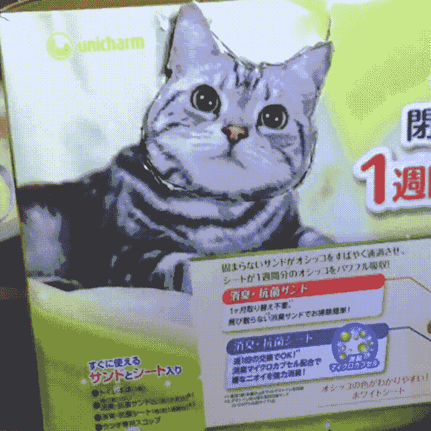
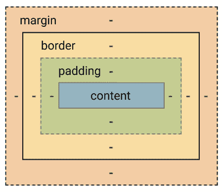
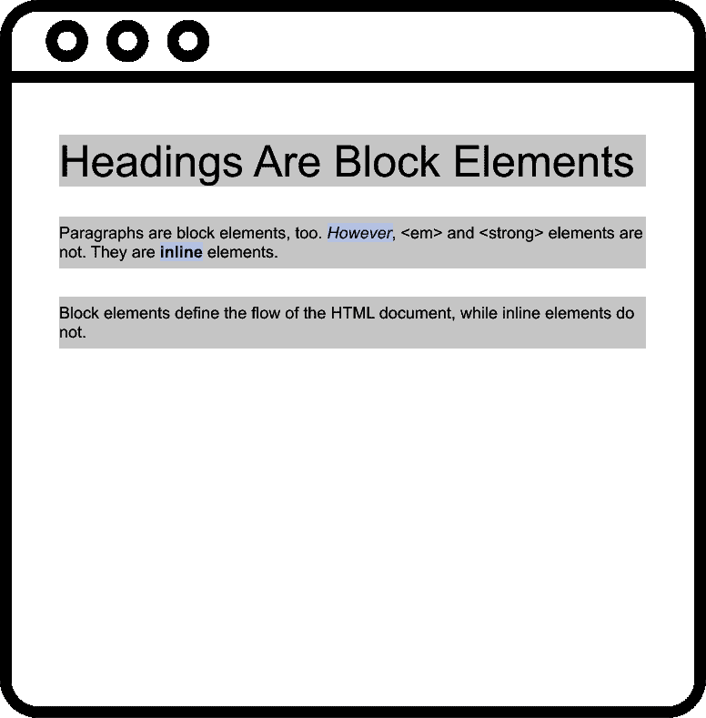
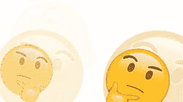
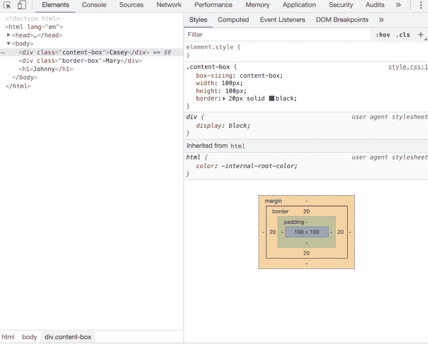
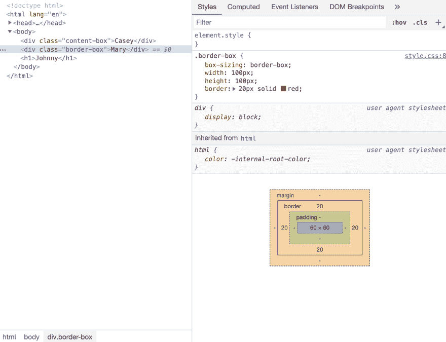

# 箱式模型指南

> 原文：<https://dev.to/jzavala/the-guide-to-the-box-model-2pi6>

TL；dr:CSS 中的一切都是一个盒子

当任何浏览器的布局引擎呈现文档时，每个呈现的元素都变成一个矩形框。如何向查看者显示这些框是由一组称为标准 CSS 基本框模型的规则决定的。级联样式表(CSS)获取每个 HTML 文档的元素，并将其视为具有特定属性的“盒子”。也就是说，HTML 本身在呈现时只是一个从根元素开始一个接一个的元素树。盒子模型是我们定制默认布局的方式。

📌勒内·笛卡尔曾经说过，“我是，因此，我是一个盒子”。这是一个`h2`元素想要存在时告诉自己的。

盒子模型≠盒子大小属性

这是一个容易让我困惑的地方。我总是将盒子模型与盒子大小属性联系起来。毕竟，我们通常会在任何 main.css 文件的顶部看到这个:

* {
框大小:border-box；
}

但是盒子模型不仅仅是它的盒子大小属性。稍后我将解释盒子大小属性具体做什么。现在，让我们把重点放在盒子模型是什么。

箱状模式

盒子模型是盒子应该如何布置的公式。该模型由内容区域(例如，文本、图像等)组成。)以及可选的填充、边框和空白区域。

内容区域几乎是元素的“真实”内容。内容可以是文本(“嗨，我爱你”)，或者图像(alt=“穿着香蕉装的猫在大嚼香蕉”)或者……你明白了。

填充区域是实际内容与其边框之间的空间。

边框区域扩展填充区域以包含元素的边框。

空白区域是元素与其相邻元素之间的空间。

房产:你想要什么口味的？

所以网页上渲染的一切都是一个盒子。我们已经知道了。你可能已经注意到了我们有两种口味或类型的盒子。

我们可以有以下几种，所以明智地选择了 grasshopper:“block”框和“inline”框。

默认情况下，我们使用的每个元素都是“内联”或“块”样式的。`<h1>`和`
`是块级元素，而``和`<strong>`是行内元素。我们可以看到这一点，当我们打开督察工具箱🧰.

甚至不需要自己设置 CSS 属性，web 浏览器(例如 Chrome、Firefox、IE 等)就可以运行。)为 HTML 文档设置自己的默认样式。例如，在 Chrome 中，`<h1>`元素的默认用户代理样式如下:

h1 {
显示:block
字号:2em
margin-block-start:0.67 em；
margin-block-end:0.67 em；
边距-内联-开始:0px
边距-内联-结束:0px
font-weight:bold；
}

让我们来看看这些格式。

两个盒子的故事

让我们想象一下两者之间的区别。

显示:块；

默认情况下，块级元素:

*   占据所有可用的空间
*   一个堆叠在另一个之上，出现在前一个元素的下面
    *   因此，定义文档的“自然”流程
*   宽度基于其父容器的宽度
*   高度取决于它包含的内容

    显示:内嵌；

内嵌块:

*   只有它们的内容一样宽一样高
    *   不继承父元素的宽度或高度
*   不影响垂直间距
    *   所以即使你设置了高度，这个高度也不会被认可，就好像你一开始就没有设置高度一样
*   不用于确定文档布局
    *   它们只允许我们在一个块元素中设置样式
*   跟随书写方向，与其他行内元素的流向对齐

    h1，p {
    背景色:灰色；
    }

    em，strong {
    背景色:蓝色；
    }

我们还缺少一个盒子。还有一个比较新的加入，`inline-block`。Inline-block 是 block 和 Inline 属性的混合，宽度和高度可以随意调整，但元素仍然位于同一行上，紧挨着其他 inline-block 和 inline 元素。`display: none`简单地把元素从存在中剔除。元素被从文档中取出，这样即使是屏幕阅读器也不知道它的存在。

但是 Grid 或者 Flexbox 呢？

网格和 Flexbox 被称为格式化上下文。他们在自己特别独特的环境中布置盒子。例如，网格格式上下文根据此处指定的网格布局规则来布局框。

所以问题是:当我们将`display: grid`应用于`div`元素时会发生什么？它仍然是一个块状元素吗？

是的。`div`仍然是一个块元素。然而，它的子元素开始表现不同。例如，只应用`display: grid`，我可以并排排列块元素，而不用指定它们的宽度。

`box-sizing`属性

最后，我们得到了`box-sizing`属性🙂。在 CSS 中，`box-sizing`属性的默认值是`content-box`。

`content-box`🥊对比`border-box`🥊

Content-box 告诉 HTML 文档，盒子的尺寸由内容本身+它的填充和边框组成。这样，如果我们有一个 10px 的框，并且我们添加了 1px 的填充，显示给查看者的框现在将是 12px 宽(10px + 1px 的左右填充)。而 fo border-box，任何添加的填充只会缩小内容框的尺寸。无论您在两边添加 1px 的填充，宽度都将保持 10px。

例子

[T6】](https://res.cloudinary.com/practicaldev/image/fetch/s--Z7uN-eL7--/c_limit%2Cf_auto%2Cfl_progressive%2Cq_auto%2Cw_880/https://paper-attachments.dropbox.com/s_6B8FB738D47CD2251DEC2F7FA83E533395856912F69F8E1B35B0C782F359ADB7_1567286687873_Screenshot%2B2019-08-31%2B17.23.09.png)

在左侧和右侧，我们有以下内容:

index.html

...

Casey
Mary

main.css

。content-box {
box-size:content-box；
宽度:100px
身高:100px
边框:10px 纯黑；
}

。边框-框{
框大小:边框-框；
宽度:100px
身高:100px
边框:10px 纯红；
}

我们有两个`div`块元素。

左侧应用了`box-sizing: content-box`。在这里，100 x 100 内容框的大小保持不变，即使我们应用了 20px 的边界。视觉上，我们在屏幕上看到的不再是一个 100 x 100 的黑盒，而是一个 140 x 140 的黑盒。

右侧应用了`box-sizing: border-box`。这里，100 x 100 内容框的大小在我们应用了 20px 边框后发生了变化。如果你看一下右边的图片，你可以看到内容框的宽度缩小了 40px(每边 20px ),以适应边框。视觉上，我们看到`div`保持同样的大小，但实际上它的内容框缩小到 60 x 60，以适应增加的边框尺寸。

简而言之，内容框意味着填充和边框一旦添加就成为内容框尺寸的一部分。Border-box 意味着无论我们添加多少填充或边框，我们在屏幕上看到的框的尺寸保持不变。

两者有什么意义？

开始时，我们只有 content-box 作为框大小的值。Casey 建议说，因为在过去，网页大多只是内容，没有任何额外的东西(填充或边框)，我们不必太担心内容框和我们在屏幕上看到的框增加的宽度和高度。人们不怎么使用填充或边框。只关注内容本身。但随着填充和边框的使用越来越多，市场上的屏幕尺寸开始变得更加多样化，盒子的增长开始变得重要起来。当我们添加填充和边框时，跟踪所表示的盒子的尺寸变得很不方便。我们只想让呈现的框在视觉上对查看者保持相同的大小，而不管添加了填充还是边框。

瞧！如此受欢迎，以至于开发者宣布 2 月 1 日为国际盒子尺寸意识日。

说真的，每天都是包装意识日。

因此，请将 CSS 技巧中的这个放在手边:

//下面是浏览器支持情况。“-”=“这个版本又下来了”。"+" = "本版本及以上"。
*，*:之前，*:之后{
/* Chrome 9-，Safari 5-，iOS 4.2-，Android 3-，黑莓 7-*/
-WebKit-box-sizing:border-box；

/* Firefox(桌面或安卓)28-*/
-moz-box-sizing:border-box；

/* Firefox 29+，IE 8+，Chrome 10+，Safari 5.1+，Opera 9.5+，iOS 5+，Opera Mini Anything，Blackberry 10+，Android 4+*/
box-sizing:border-box；
}

供应商前缀

您可能会问自己，上面代码中的前缀(`-webkit-`、`-moz-`)是什么意思。
这些被称为“厂商前缀”或“浏览器前缀”。

我们将这些字符串放在 CSS 属性名之前。每个前缀对应一个特定的浏览器引擎。下面是 MDN web docs 中显示不同前缀的表格:

| 前缀 | 浏览器 |
| --- | --- |
| `-webkit-` | Chrome，Safari，较新版本的 Opera，几乎所有的 iOS 浏览器(包括 iOS 版火狐)；基本上，任何基于 WebKit 的浏览器 |
| `-moz-` | 火狐浏览器 |
| `-o-` | WebKit 之前的旧版本 Opera |
| `-ms-` | Internet Explorer 和 Microsoft Edge |

浏览器制造商将此前缀添加到并非所有浏览器都完全支持的新的或实验性的 CSS 功能中。我们有 https://caniuse.com/的[网站是有原因的。Caniuse 的搜索功能允许我们找到任何我们想要使用的 CSS 特性，并了解该特性现在有多标准。例如，当您搜索`background-size`时，您会看到什么？我们看到这些新的`background-image`属性选项，比如`background-size`，可以在所有浏览器和几乎所有浏览器版本中使用。所以请放心使用`background-image: background-size`，它将为 99%的网络用户工作。](https://caniuse.com/)

📌作为网站开发者，我们提供服务。我们希望确保所有人都能获得这项服务。这不仅是道德上的，也有助于我们获得更多付费用户。

当你研究市场时，你会发现你的大多数客户都是 IE 11 用户。你必须格外小心，因为 IE11 很好地支持许多新的 CSS3 特性。如果你使用它们，你的网站或网络应用将会崩溃或者现在在 IE11 浏览器中工作。

在 Caniuse 中搜索`position: sticky`。你会发现一些明显的红色区域。对于 IE，你发现 6 到 11 版本不支持该功能，这其实是 IE 生态系统的全部。如果在研究了你的市场后，你发现你的大多数客户都使用 Internet Explorer，如果你想让事情正常进行，你可能要远离`position: sticky`。

为什么使用它们？

在 Ire Aderinokun 的文章中，她回顾了渐变背景刚刚引入的时候。从 Safari 到 Firefox 的每个浏览器都有自己添加渐变背景的方式。要添加简单的白色渐变效果，每个浏览器都有自己的语法:

。示例{
/* Safari 4-5，Chrome 1-9 */
背景:-webkit-gradient(线性，左上，左下，色停(0%，#000)，色停(100%，# fff))；

/* Safari 5.1，Chrome 10+ */
背景:-webkit-linear-gradient(top，#000 0%，# fff 100%)；

/* Firefox 3.6+ */
背景:-moz-linear-gradient(top，#000 0%，# fff 100%)；

/* IE 6 - 9 */
过滤器:progid:DXImageTransform。Microsoft . gradient(startColorstr = ' # 000000 '，endColorstr='#ffffff '，gradient type = 0)；

/* IE 10+ */
背景:-ms-线性-渐变(top，#000 0%，# fff 100%)；

/* Opera 11.10+ */
背景:-o-线性-渐变(top，#000 0%，# fff 100%)；

}

供应商前缀允许开发人员在新特性正式发布之前对其进行测试。上述每个属性都是它自己的属性，没有一个属性与另一个属性相等。也就是说，每个浏览器只识别带有自己前缀的属性，忽略其余的。

当 CSS 特性正式发布时，这可以防止代码冲突。现在，我们在所有浏览器上使用相同的语法，因为所有浏览器都支持该功能:

。示例{
背景:线性渐变(top，#000 0%，# fff 100%)；
}

从服务器传输到客户端的代码要少得多，反之亦然。但是，为了在新功能正式推出之前测试它们，并让我们的用户惊叹不已，我们对该功能使用了浏览器特定的语法。当它成为标准时，我们切换到标准语法。无论我们是否将旧语法更改为新语法，我们的功能仍将有效。

使用的参考:

1.  [https://absolutely.every-layout.dev/rudiments/boxes/](https://absolutely.every-layout.dev/rudiments/boxes/)
2.  [https://www . smashingmagazine . com/2019/05/display-box-generation/](https://www.smashingmagazine.com/2019/05/display-box-generation/)
3.  [https://www.w3.org/TR/CSS2/box.html#box-dimensions](https://www.w3.org/TR/CSS2/box.html#box-dimensions)
4.  [https://bitsofo . de/CSS-供应商前缀/](https://bitsofco.de/css-vendor-prefixes/)

^这些都是可以利用的好资源。