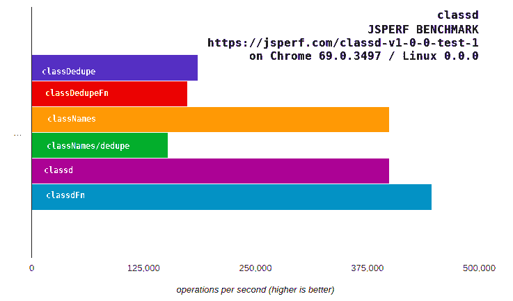

# Opensourcing classd:一种快速而现代的类名替代方案

> 原文：<https://dev.to/gnsp/opensourcing-classd-a-fast-and-modern-classnames-alternative-2gca>

如果你是一名前端开发人员，你很有可能在你的项目中使用过
[Jedwatson 的类名](https://github.com/JedWatson/classnames)包。事实上，classNames 是 classSet 的官方替代，最初是在 React.js Addons 包中提供的。这是 React 世界中使用最多的包之一。

### [T2`classNames`的一个简单用例](#a-simple-usecase-for-raw-classnames-endraw-)

例如，如果我们需要根据组件状态有条件地将 css 类应用于 React 组件中的元素，我们可以这样做:

```
class EnhancedButton extends React.Component {
    // ...

    render () {
        const btnClass = classNames({
            'btn': true,
            'btn-large': true,
            'btn-primary': true,
            'btn-pressed': this.state.isPressed,
            'btn-over': !this.state.isPressed && this.state.isHovered
        });

        return <button className={btnClass}>{this.props.label}</button>;
    }
} 
```

Enter fullscreen mode Exit fullscreen mode

上面的方法很简洁，但是考虑到许多类是无条件应用的，在配置对象中将它们设置为 true 的模式变得相当多余。为了消除这种冗余，我们可以编写如下代码:

```
const btnClass = classNames(
    'btn', 
    'btn-large',
    'btn-primary',
    {
        'btn-pressed': this.state.isPressed,
        'btn-over': !this.state.isPressed && this.state.isHovered  
    }
); 
```

Enter fullscreen mode Exit fullscreen mode

### ES6 的年龄[模板文字](https://developer.mozilla.org/en-US/docs/Web/JavaScript/Reference/Template_literals)

然而，随着 [ES6 或 ES2015 模板文字](https://developer.mozilla.org/en-US/docs/Web/JavaScript/Reference/Template_literals)成为主流浏览器支持的[，将上面的代码片段写成:
变得更加简单](https://developer.mozilla.org/en-US/docs/Web/JavaScript/Reference/Template_literals#Browser_compatibility)

```
const btnClass = `
    btn 
    btn-large 
    btn-primary ${this.state.isPressed ? 'btn-pressed' : ''}  ${(!this.state.isPressed && this.state.isHovered) ? 'btn-over' : ''} `; 
```

Enter fullscreen mode Exit fullscreen mode

尽管编写类名的模板字面方式更简单、更快，但它的**仍然是相当多余的**，而且它也存在某些缺陷。例如，在编写`${(!this.state.isPressed && this.state.isHovered) ? 'btn-over' : ''}`时，如果条件失败，确保添加一个空字符串`''`是非常多余和冗长的。模板文字**不会自己从输出中删除多余的/不必要的空白和换行符**。

比如为什么不写类似`${!this.state.isPressed && this.state.isHovered && 'btn-over'}`的东西？但是有一个陷阱；如果条件解析为`true`，则`btn-over`被添加，但是如果条件解析为`false`，则字符串`'false'`被添加到输出。如果我们编写解析为`undefined`或`null`或`NaN`或任何类似内容的表达式会怎么样？Javascript 会简单地将它们视为字符串，然后继续前进。不用说，这种方法有很多这样的“搬起石头砸自己的脚”的情况。

此外，如果我们已经有了一个有效的配置对象，并希望将其简化为一个 classnames 字符串，该怎么办呢？仅仅使用模板文字没有明显的方法可以直接做到这一点，我们可能会像`Object.keys(config).reduce(...)`那样做，或者我们可以使用 classNames 包来完成。当然，使用 classNames 包更有性能，因为这个包针对这个用例进行了很好的优化。

但是，如果有一种方法可以像下面这样编写上面的例子，而不会有任何行为陷阱，也不会损失任何性能，那会怎么样呢

```
const btnClass = secretSauce`
    btn
    btn-large
    btn-primary ${this.state.isPressed && 'btn-pressed'}  ${!this.state.isPressed && this.state.isHovered && 'btn-over'} `; 
```

Enter fullscreen mode Exit fullscreen mode

## 输入 [`classd`](https://www.npmjs.com/package/classd)

上例中您需要的 secretSauce。它是基于标记模板的快速而现代的类名选择，保留了类名的所有优点，并增加了更多。

`classd`标签根据以下规范处理模板文字中的插值。

1.  字符串和数字是有效值，会添加到输出中。
2.  它会降低`undefined`、`null`、`NaN`和`boolean`的值。
3.  如果该值是一个数组或一个 Iterable，它将该值扁平化并递归处理元素。
4.  如果该值是一个对象或贴图，它会丢弃与假值相关联的关键点，并将剩余的关键点添加到输出中。
5.  如果该值是一个函数，它调用该函数并添加它的返回值(如果有效的话)
6.  它删除所有不必要的空白。

这里有几个例子:

```
classd`foo bar`; // => 'foo bar'
classd`foo ${null && 'bar'}`; // => 'foo'
classd`foo-${true && 'bar'}`; // => 'foo-bar'
classd`${true}  ${false}`; // => ''
classd`${{ foo: true, bar: false}}`; // => 'foo'
classd`${{foo: true}} ${{bar: true}} ${{baz: false}}`; // => 'foo bar'
classd`a ${[ 'b', 'c', false && 'd' ]}`; // => 'a b c'
classd`${['a', { b: 1, c: 0 }]}`; // 'a b'
classd`    a    b  \n ${Array(10).fill('  ')} c`; // => 'a b c' 
```

Enter fullscreen mode Exit fullscreen mode

### 安装和使用

`classd`包导出了 4 个函数:

1.  `classd`(模板文字的标签，默认)
2.  `classDedupe`(模板文字的标签)
3.  `classdFn`(可变函数，为了兼容性，类似于`classNames`)
4.  `classDedupeFn`(可变函数，为了兼容性，类似于`classNames/dedupe`)

这个包可以在 [NPM 上获得](https://www.npmjs.com)可以使用像`npm`和`yarn`这样的包管理器来安装。也可以直接从 CDN 下载到你的网页上。

#### 使用软件包管理器安装

```
# via npm 
npm install --save classd

# or Yarn 
yarn add classd 
```

Enter fullscreen mode Exit fullscreen mode

#### 在 ES6 模块中使用

```
 // ES6 import (default - classd tag for template literals)
import classd from 'classd';

// example use
const width = 1080;
const classes = classd`container padding-${{
    lg: width > 1280, 
    md: width > 960 && width < 1280,
    sm: width <= 960
}} margin-0 ${width > 960 && 'blue'}  ${width < 960 && 'red'}`;
console.log(classes); // => 'container padding-md margin-0 blue'

// ES6 import any of the exported functions
import { classd, classDedupe, classdFn, classDedupeFn } from 'classd';

// example use (of classdFn)
const width = 1080;
const classes = classdFn ('container', {
    'padding-lg': width > 1280, 
    'padding-md': width > 960 && width < 1280,
    'padding-sm': width <= 960
}, (width > 960 && 'blue'), 'margin-0');
console.log(classes); // => 'container padding-md blue margin-0' 
```

Enter fullscreen mode Exit fullscreen mode

#### 在 Commonjs 模块中使用(Nodejs)

```
// commonjs require classd tag for template literals (default export)
const classd = require('classd').default

// commonjs require any of the exported functions
const { classd, classDedupe, classdFn, classDedupeFn } = require('classd');

// commonjs require classd module
const classd = require('classd'); // exports can be used as classd.classd, classd.classDedupe etc 
```

Enter fullscreen mode Exit fullscreen mode

#### 拉自 CDN

```
 <script src='https://cdn.jsdelivr.net/npm/classd@1.0/lib/index.js'></script>
<script type='text/javascript'>
    const { classd, classDedupe, classdFn, classDedupeFn } = window.classd;
    console.log(classd`container ${1 > 0 && 'blue'}`); // => 'container blue'
</script> 
```

Enter fullscreen mode Exit fullscreen mode

### 嗯，什么是`classDedupe`、`classdFn`、`classDedupeFn`？

`classdFn`遵循与`classd`标签相同的规范。这是对`classNames`的直接替代。对`classNames`有效的一切对`classdFn`也有效。此外，`classdFn`支持将映射、集合和其他可迭代对象作为参数传递。此外，在一般情况下，它比`classNames`略快。

如果您想将一个现有的项目从使用`classNames`迁移到`classd`，使用`classdFn`是最快最简单的方法。从`classNames`的迁移非常简单:

```
// before
import classNames from 'classnames';

//after
import { classdFn as classNames } from 'classd'; 
```

Enter fullscreen mode Exit fullscreen mode

`classDedupe`标签是一个增强版本，比`classd`标签慢 60%。它做了`classd`标签所做的一切。除此之外，它还检查类名中的重复名称，并确保每个有效的类名在输出字符串中只出现一次。

`classDedupeFn`是`classDedupe`标签的等效功能。它遵循与`classdFn`和`classNames`相同的签名。

它与`classNames/dedupe`的不同之处在于，如果一个配置对象稍后出现在它的参数中，那么`classNames/dedupe`就不设置一个类；而`classDedupe`一旦设置了类名就不会取消设置。

### 性能和稳定性怎么样？

由于有条件地应用类名是 web 前端中的一项常见任务，并且在一个渲染周期中应该多次调用这些函数，所以`classd`的实现必须是高性能和稳定的。因此，我们非常重视该套件的稳定性和性能。在发布更新之前，会彻底检查更新对性能的影响。我们保持一个全面的测试套件，以确保稳定性。

下面是`classd`包的一个 **[JSPerf 基准](https://jsperf.com/classd-v1-0-0-test-1)** ，对比`classNames`。正如我们所见，`classd`标签的性能和`classNames`一样好，而`classdFn`稍微快一些。

[](https://res.cloudinary.com/practicaldev/image/fetch/s--oeeygcz4--/c_limit%2Cf_auto%2Cfl_progressive%2Cq_auto%2Cw_880/https://thepracticaldev.s3.amazonaws.com/i/ffmeo7wjdrvkdllzcp9i.png)

### 源代码和投稿

您可以在 Github 上找到源代码。欢迎任何形式的请求、问题或建议。**如果你喜欢，请在 Github 上给它一颗星。**

##  [ GnsP ](https://github.com/GnsP) / [ classd](https://github.com/GnsP/classd)

### 一个快速、最小的 ES6 实用程序，用于有条件地组合类名

<article class="markdown-body entry-content container-lg" itemprop="text">

# 已分类

一个组成类名的最小 ES6 实用程序

[](https://www.npmjs.com/package/classd)[](https://www.npmjs.com/package/classd)[](https://www.npmjs.com/package/classd)

**classd** 是一个快速、最小的 JavaScript(ES6)工具，用于组合类名，它建立在类似于 [JedWatson 的 classnames](https://github.com/JedWatson/classnames) **classd 默认使用 ES6 模板文字来组合类名的思想和理念上。**它还提供类似于`classNames`和`classNames/dedupe`的兼容性功能(在`classNames/dedupe`的情况下有微小的行为差异，详见后续章节)。

它导出 4 个函数:

1.  `classd`(模板文字的标签，默认)
2.  `classDedupe`(模板文字的标签)
3.  `classdFn`(可变函数，为了兼容性，类似于`classNames`)
4.  `classDedupeFn`(可变函数，为了兼容性，类似于`classNames/dedupe`)

### 装置

用 [npm](https://www.npmjs.com/) 或[纱线](https://yarnpkg.com/)安装:

```
# via npm
npm install --save classd

# or Yarn (note that it will automatically save the package to your `dependencies` in `package.json`)
yarn add classd
```

Enter fullscreen mode Exit fullscreen mode

与 ES6 模块一起使用(进口)

```
// IMPORTING IN ES6
///////////////////
//
```

…Enter fullscreen mode Exit fullscreen mode</article>

[View on GitHub](https://github.com/GnsP/classd)

感谢你的阅读，一定要试一试！