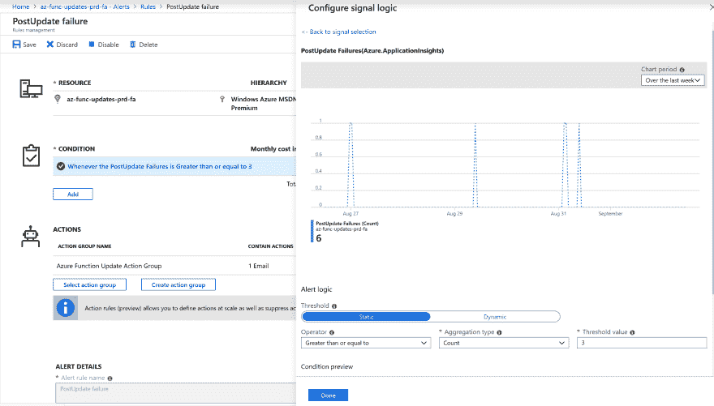
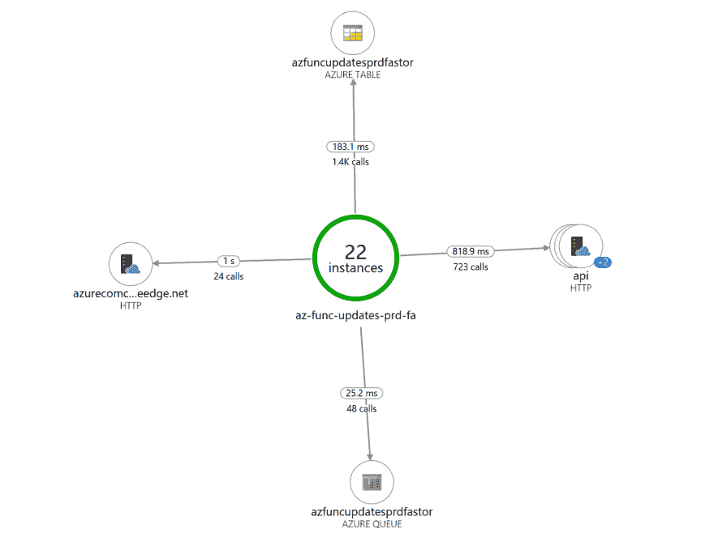
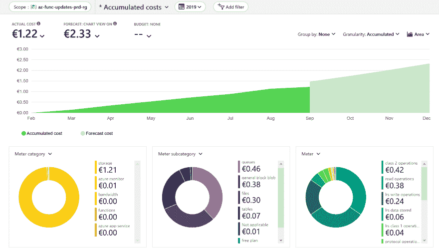

# 我运行 Azure Functions 更新 Twitterbot 半年来的收获

> 原文:[https://dev . to/xpirit/my-learning-from-running-the-azure-functions-updates-Twitter bot-for-half-a-year-49fd](https://dev.to/xpirit/my-learnings-from-running-the-azure-functions-updates-twitterbot-for-half-a-year-49fd)

本文是 [#ServerlessSeptember](https://dev.to/azure/serverless-september-content-collection-2fhb) 的一部分。在这个无服务器的内容集合中，您可以找到其他有用的文章、详细的教程和视频。9 月份，每天都有来自社区成员和云倡导者的新文章发布，没错，每天都有。

在[https://docs.microsoft.com/azure/azure-functions/](https://docs.microsoft.com/azure/azure-functions/?WT.mc_id=servsept_devto-blog-cxa)了解更多关于微软 Azure 如何实现你的无服务器功能。

## 关于推特机器人的一些简单事实

在我的[上一篇文章](https://dev.to/marcduiker/creating-the-azure-functions-updates-twitterbot-25hc)中，我写了为什么以及如何创建 Azure Functions Updates Twitter bot。这个机器人自 2019 年 2 月以来一直在发布关于 Azure Functions 相关 GitHub 仓库(和 Azure 服务公告)的更新，因此这远远超过了 6 个月。它监控 24 个存储库，包括它自己，Azure 服务更新 RSS feed，过滤 Azure 功能相关的更新。GitHub 上的[列出了完整的来源列表。运行该机器人的功能应用程序已经捕获了 128 个 GitHub 版本，8 个 Azure 服务更新帖子，并向 Twitter 发布了 154 条消息(介绍性的推文是手动发布的)。](https://github.com/marcduiker/az-func-updates/blob/master/docs/monitored-sources.md)

在这篇文章中，我想强调一下我在使用 Twitterbot 后采取的一些行动和获得的一些见解。我将介绍:故障和弹性、监控和警报、性能和成本。

## [](#1-failure-amp-resiliency)1。失败&复原力

[T2】](https://res.cloudinary.com/practicaldev/image/fetch/s--dN8sbhlY--/c_limit%2Cf_auto%2Cfl_progressive%2Cq_auto%2Cw_880/https://thepracticaldev.s3.amazonaws.com/i/qawh3swa7btlxokv7qmm.png)

查看上面的组件图，显示了三个外部依赖关系；GitHub，Twitter 和 Azure 表存储。*(注意，这是应用程序的初始设计，后来已经扩展到包括 Azure 服务更新 RSS 提要。)*

每个服务都有一些计划内或计划外的停机时间，因此功能应用程序必须应对其依赖关系的短暂服务中断。幸运的是，持久函数 API 提供了一个内置的机制来处理这个问题；它可以对活动函数执行重试。使用*CallActivityWithRetryAsync*方法从 orchestrator 函数调用活动函数。下面是一个调用*GetLatestReleaseFromGitHub*活动函数的例子:

```
// Get most recent release from GitHub
getLatestReleaseFromGitHubTasks.Add(context.CallActivityWithRetryAsync<RepositoryRelease>(
    nameof(GetLatestReleaseFromGitHub),
    GetDefaultRetryOptions(),
    repositoryConfiguration)); 
```

<svg width="20px" height="20px" viewBox="0 0 24 24" class="highlight-action crayons-icon highlight-action--fullscreen-on"><title>Enter fullscreen mode</title></svg> <svg width="20px" height="20px" viewBox="0 0 24 24" class="highlight-action crayons-icon highlight-action--fullscreen-off"><title>Exit fullscreen mode</title></svg>

该方法中的第二个参数指定了 *RetryOptions* 。这样，您可以控制 activity 函数在失败时重试的次数和频率。因为我在 orchestrator 的不同地方重用了相同的重试选项，所以我把它放在了一个单独的方法中:

```
private static RetryOptions GetDefaultRetryOptions()
{
    return new RetryOptions(TimeSpan.FromMinutes(1), 3);
} 
```

<svg width="20px" height="20px" viewBox="0 0 24 24" class="highlight-action crayons-icon highlight-action--fullscreen-on"><title>Enter fullscreen mode</title></svg> <svg width="20px" height="20px" viewBox="0 0 24 24" class="highlight-action crayons-icon highlight-action--fullscreen-off"><title>Exit fullscreen mode</title></svg>

使用上面的*重试选项*，当活动函数失败时，持久函数框架最多重试执行活动 3 次，间隔 1 分钟。您甚至可以指定一个*补偿系数*来进行指数补偿，这将减缓每次执行后的重试。

有几次 GitHub API 返回了网关超时(504)，通过使用这个重试策略，activity 函数的执行最终总是成功的。

## [](#2-monitoring-amp-alerts)2。监控&警报

如果功能应用程序出现问题，并且无法通过重试恢复，我希望收到通知，这样我就可以调查这个问题。该功能应用程序只有在向 Twitter 发布更新时才有价值。因此，我在[中配置了一个警报](https://docs.microsoft.com/en-us/azure/azure-monitor/platform/alerts-overview)，当*的 PostUpdate* 活动功能在一小时内失败 3 次(等于最大重试次数)时，它会向我发送一封电子邮件。下图显示了警报配置:

[T2】](https://res.cloudinary.com/practicaldev/image/fetch/s--GYLAGuqx--/c_limit%2Cf_auto%2Cfl_progressive%2Cq_auto%2Cw_880/https://thepracticaldev.s3.amazonaws.com/i/11c7w4ynqyezi1yme85j.png)

请注意，右上角显示了一个图表，其中包含一个时间窗口中的选定信号事件。在这种情况下，它显示一周内有 6 次*更新后*活动失败。我发现这个图表对寻找有意义的信号很有帮助。

当 [Application Insights](https://docs.microsoft.com/en-us/azure/azure-monitor/app/app-insights-overview) 为功能 app 启用时，在配置警报条件时有许多信号选择选项。如下图所示，可以选择函数的成功率、失败率和最小/最大/平均持续时间作为信号源:

[T2】](https://res.cloudinary.com/practicaldev/image/fetch/s--9zHruLR6--/c_limit%2Cf_auto%2Cfl_progressive%2Cq_auto%2Cw_880/https://thepracticaldev.s3.amazonaws.com/i/boit2uagxzvx1rxilzvz.png)

## [](#3-performance)3。表演

这个功能 app 是一个很低量的应用。它每小时触发一次，每月执行大约 51k 次函数。尽管在这种情况下，高容量或高性能并不是我所关心的，但看看函数应用程序及其依赖项如何执行还是很有趣的。下面的[应用地图](https://docs.microsoft.com/en-us/azure/azure-monitor/app/app-map)显示了从中心的功能应用到其依赖资源的连接。显示的数据是 24 小时的汇总数据:

[T2】](https://res.cloudinary.com/practicaldev/image/fetch/s--zZeyx7As--/c_limit%2Cf_auto%2Cfl_progressive%2Cq_auto%2Cw_880/https://thepracticaldev.s3.amazonaws.com/i/ohmit0yfl5csjywclwin.png)

第一次看应用地图的时候，我突然发现这个功能应用只有 22 个实例。我期望有 24 个实例，因为函数应用程序每小时运行一次。但是，似乎实例有时会被重用。在这种情况下，两个实例被重用，这解释了 24 小时内的 22 个单独实例。

对 Azure 服务更新 RSS 提要的调用花费的时间最长，平均为 1 秒。对 Azure 表存储和队列存储的调用最快，平均 148.6ms 和 109.7ms。

让我们更深入地看看 GitHub 和 Twitter HTTP APIs 的性能。下面的图表显示了八月份 HTTP 呼叫的平均持续时间:

[T2】](https://res.cloudinary.com/practicaldev/image/fetch/s--XTMPpAVs--/c_limit%2Cf_auto%2Cfl_progressive%2Cq_auto%2Cw_880/https://thepracticaldev.s3.amazonaws.com/i/ow2zrk5ke4wyv6tb4b2q.png)

我建议查看这些依赖项响应时间图表，因为它们可以揭示依赖项性能随时间变化的趋势。在这种情况下，在 8 月 11 日到 13 日左右，持续时间明显增加(GitHub 当时的响应速度较慢)，之后，平均持续时间稳定在 0.8s 左右

查看所有呼叫的持续时间分布，我们看到从 120 毫秒到 2.9 秒的大范围分布:

[T2】](https://res.cloudinary.com/practicaldev/image/fetch/s--4mVedlgB--/c_limit%2Cf_auto%2Cfl_progressive%2Cq_auto%2Cw_880/https://thepracticaldev.s3.amazonaws.com/i/gx4pc4ijiqk7jgpobtqb.png)

对于外部依赖项的性能，我无能为力，但重要的是要认识到对其他系统的调用从来都不是恒定的。网络不是 100%可靠的，延迟也从来不是 0。我推荐阅读关于分布式计算 的 [*谬论。*](http://www.rgoarchitects.com/Files/fallacies.pdf)

在我控制之下的是我自己写的函数。下面是 ReleaseUpdateOrchestration 函数的分布图:

[T2】](https://res.cloudinary.com/practicaldev/image/fetch/s--SUaZEuPh--/c_limit%2Cf_auto%2Cfl_progressive%2Cq_auto%2Cw_880/https://thepracticaldev.s3.amazonaws.com/i/nyncz16qtzgotnyjdkzs.png)

持续时间的分布也很广。造成这种差异的部分原因是函数应用程序实例之间的性能差异，但另一个因素是 orchestrator 函数被多次重放，每次都在 orchestrator 代码中继续执行，并且需要更长时间才能完成。我计划对这种影响的显著程度进行更彻底的调查。

## [](#4-costs)4。费用

我想为这个机器人找到一个便宜的解决方案。我把这个应用程序作为个人的副业来运行，没有其他人为此付费。我预先做了一个粗略的计算，并意识到成本将是最小的，因为 Azure Functions 消费计划[的前 100 万次执行是免费的](https://azure.microsoft.com/en-us/pricing/details/functions/)。此外，我还使用了存储在 Azure Table Storage 中的一小部分数据(存储库、发布和公告信息)，Azure Table Storage 使用起来[非常便宜](https://azure.microsoft.com/en-us/pricing/details/storage/tables/)。

### [](#cost-breakdown)成本明细

当我们查看资源集团自成立以来的累计成本时，很明显成本非常低，从 2019 年 2 月至 8 月仅 1.22 欧元。

[T2】](https://res.cloudinary.com/practicaldev/image/fetch/s--nLOPa09B--/c_limit%2Cf_auto%2Cfl_progressive%2Cq_auto%2Cw_880/https://thepracticaldev.s3.amazonaws.com/i/7c5gw8czhp2qq242dafc.png)

图表中亮绿色的部分是截至 9 月 1 日的实际成本。浅绿色是预测成本。我认为预测有点偏高，没有任何新的 GitHub 库需要监控(尽管我希望包括其他来源),发布的数量也不太可能有大的变化。尽管如此，这是一个很好的功能，有这个预测。

下面的三个圆环图是不同的成本明细。左边的是根据*仪表类别*的，可与不同的服务类型相比较。最昂贵的服务(1.21 欧元)是存储帐户。

中间的圆环图分解了每*米子类别*的成本；这已经很有见地了，因为它表明存储队列是成本最高的。重要的是要认识到持久函数严重依赖队列来调度 orchestrator 和 activity 函数。因此，这种成本是可以解释的，但如果不了解持久函数的内部工作方式，这种成本可能是意想不到的。

最后，在右边，每米的成本被分解。这些信息中的一些很清楚，比如存储的 *lrs 数据*(LRS =本地冗余存储)，但其他的则有点神秘，比如*类 1* 和*类 2* 操作。微软进行这种分类是为了将某些成本相等的操作组合在一起。*类 1* 与队列消息的创建、放置、更新和删除操作相关。*类 2* 与获取和查看消息操作相关。

## [](#learnings)学问

今年早些时候，我有机会参加了由 [Udi 达汗](https://twitter.com/udidahan)举办的*高级分布式系统设计课程*，这真是让我大开眼界。它确实帮助我更好地理解了分布式计算的谬误，以及如何对它们采取行动。我制作的 Twitterbot 是一个非常小的应用程序，在它不工作的情况下几乎没有影响，但它被证明是一个将一些知识付诸实践的好地方。

1.  失败是不可避免的，所以你最好准备好让系统尽可能地处理它，并准备好一个好的过程和工具来应对问题。在我的例子中，我从一开始就在 Azure DevOps 中配置了构建和发布管道，这使得自动化单元测试和将修复快速推向生产成为可能。

2.  在生产环境中运行时，您需要监控和警报设置；否则，你会对发生的一切视而不见。尝试确定一小组最重要的指标，并只对这些指标发出警报。

3.  要真正了解您的解决方案是如何执行的，您需要了解它在生产中是如何运行的。启用应用洞察，并花费大量时间在 Azure 门户的各种刀片中导航。应用程序图、故障和性能刀片易于入门，并提供了丰富的信息。

4.  Azure Functions 消费计划与表/blob 存储相结合，对于中低容量工作负载来说很便宜。努力提前计算功能的执行情况，这样你就可以有根据地猜测消费计划或应用服务计划是否最适合你的情况。注意，通过使用持久函数，由于队列和表存储的使用以及更多的函数执行，您将付出更多的代价。然而，不要让这个阻碍你。持久函数框架提供了许多现成的优秀特性，您不需要自己编写和维护这些特性。所以我很有信心收益大于成本。

## [](#open-source)开源

Twitterbot 的代码在 [GitHub](https://github.com/marcduiker/az-func-updates) 上，所以如果你想看细节，请随意复制或派生它。我计划用[更多的功能](https://github.com/marcduiker/az-func-updates/issues)来扩展这个机器人，如果你有更多的想法，随时添加这些问题或提交一个 PR:)。