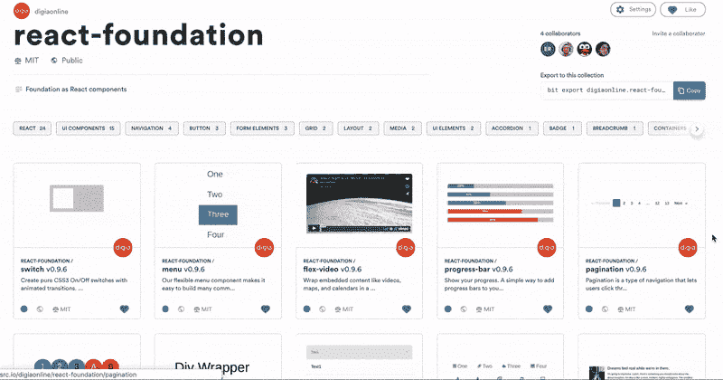
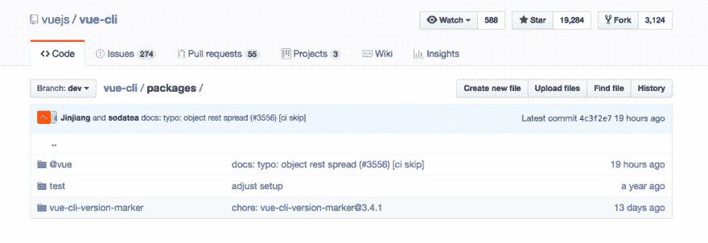
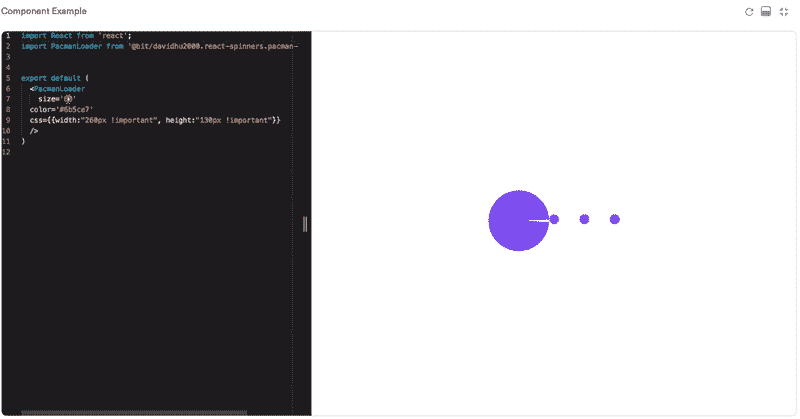

# 构建 Monorepo 的 5 个问题

> 原文:[https://dev . to/gite den/5-questions-for-building-a-mono repo-4fl 3](https://dev.to/giteden/5-questions-for-building-a-monorepo-4fl3)

### [](#before-diving-into-lerna-bit-and-other-monorepo-tools-think-what-youre-building-who-youre-building-it-for-and-why)在投入 [Lerna](https://lerna.js.org/) 、 [Bit](https://bit.dev) 和其他 monorepo 工具之前，想想你在构建什么，你在为谁构建，为什么要构建。

管理多个存储库中的多个包的开销已经导致许多团队探索 monorepo 的新旧概念。

今天，这并不意味着一个巨大的意大利面条式的代码库，而是有一个存放和发布多个包的仓库。

这个存储库可以是一个应用程序、一个共享库或任何其他包含从同一个存储库发布的多个包的结构。有些人发现这也使得管理提交、运行 CI/CD 和管理变更变得更加容易。

随着这个概念的发展，支持它的生态系统和工具也在发展。

在本文中，我将根据您希望实现的目标，尝试帮助您确定哪种设置和工具最适合您的“monorepo”。为此，我收集了 5 个影响这些选择的问题。

希望这能帮你节省时间，针对你的需求做出正确的选择。欢迎大家随意评论，补充自己的见解，有什么都可以问。享受吧。

## [](#1-what-are-you-building-library-app)1。你在建造什么？(图书馆？App？)

在继续前进之前，你应该停下来问自己"**这个项目我要做什么？**“在许多情况下，答案会是“我正在构建一个应用程序”或“我正在为构建应用程序的团队构建一个库”。

对于 monorepo 的设置，每个答案都有不同的含义。如果它是一个库，它可能包含相对大量的可以单独使用的有用组件。在这种情况下，[位](https://bit.dev)可以非常方便地以 0 开销发布组件。

如果它是一个应用程序(或者一个独立的项目)，它可以包含组件和模块以及一些更大的核心模块。如果您希望分离和发布相对较少数量的较大的包， [Lerna](https://lerna.js.org/) 可以方便地自动管理和发布 repo 中的包。

比如这里是 [React Foundation](https://github.com/digiaonline/react-foundation) 组件库。使用 [Bit](https://bit.dev) ，它的所有组件都可以单独发现和安装。这不需要任何重构，目标在很短的时间内就实现了。

[ ](https://res.cloudinary.com/practicaldev/image/fetch/s--xHFAyFd---/c_limit%2Cf_auto%2Cfl_progressive%2Cq_auto%2Cw_880/https://cdn-images-1.medium.com/max/2000/1%2AaDvdG2lomeqpdu_yEz7DRA.jpeg) *反应过来——基础构件用钻头*

这是另一个例子，这次是用 Lerna 处理几个核心包。Vue-CLI 使用 Lerna 来处理核心包，而每个包都可以单独发布到 NPM。我们将在接下来的问题中深入探讨。

[ ](https://res.cloudinary.com/practicaldev/image/fetch/s--4gucg-Xz--/c_limit%2Cf_auto%2Cfl_progressive%2Cq_auto%2Cw_880/https://cdn-images-1.medium.com/max/2160/1%2AvUrLwp6KRZEeeMsM7yRqIQ.png) * Vue-CLI 核心包带 Lerna*

## [](#2-how-many-packages)2。多少包裹？

这个问题对于理解项目的范围至关重要，并且直接影响你的选择。如果您有 30 个较小的组件或 10 个较大的封装(或两者都有)，您的成本效益可能会因您选择的设置而改变。

Bit 需要 0 个工作和 0 个重构来共享一个存储库中的组件，使它们可以作为 NPM 和 Yarn 的包使用。它为可发现性和协作提供了附加价值。

这意味着，如果您希望从存储库中共享大量的包， [Bit](https://github.com/teambit/bit) 将 1)为您节省重构开销，这种开销会随着每个包的增加而增加 2)自动管理组件的所有依赖关系以及它们之间的关系，包括更新和更改 3)提供可发现性并可视化地组织包。

[https://www.youtube.com/embed/pz0y2GTsSrU](https://www.youtube.com/embed/pz0y2GTsSrU)

如果您有几个核心包，并打算手动创建和配置它们的设置和环境，与不使用 Lerna 而自己动手相比， [Lerna](https://github.com/lerna/lerna) 将帮助您自动完成这些过程，从而节省您的时间。这是一个基本的 Lerna 结构:

```
my-lerna-repo/
  package.json
  packages/
    package-1/
      package.json
    package-2/
      package.json 
```

Lerna 自动执行 monorepo 中的软件包任务。lerna run build 将在每个子包中运行 npm run build，lerna publishwill 将向 npm 发布所有包，并将更新 git 标签等。然后，可以从 NPM 的注册表安装软件包。

也可以两者结合。使用 Bit as 0 cost (work)来共享所有组件，并为您无论如何都要钻研的核心包添加 Lerna。两者都可以与 [Yarn workspaces](https://yarnpkg.com/lang/en/docs/workspaces/) 相结合，以优化存储库中外部包的安装。

## [](#3-whos-going-to-use-these-package)3。谁会使用这些包？

这里有另一个关键问题:**谁将使用你从库**中共享的包？答案可以是你、你的团队、多个团队或者 OSS 社区。每个答案都会对你的选择产生不同的影响。

如果除了你之外还有更多人要使用这些包，你应该给人们提供一个快速找到它们并了解它们如何工作的方法。最好是，没有写和阅读长文档的网站。

Bit 通过其[组件中枢](https://bitsrc.io/components)提供开箱即用。组件集合包括您保存的示例的可视预览。组件页面包括一个热重装的现场操场。每个有测试文件的组件都将在云中进行测试，结果将会显示出来。来自代码的文档将被自动解析并在操场附近呈现。

每个组件然后可以安装纱线和 NPM 从位的注册表，使用您的本地 NPM 客户端就像任何其他 NPM 软件包。

[](https://res.cloudinary.com/practicaldev/image/fetch/s--gxVoGLZI--/c_limit%2Cf_auto%2Cfl_progressive%2Cq_66%2Cw_880/https://cdn-images-1.medium.com/max/2000/1%2AF_ozsf8lx04FUu87xzqO8w.gif)

如果使用 Lerna，软件包将直接发布到 NPM 注册中心。为其他人发布包时，建议同时建立和维护 docs 站点和 wikis，以便人们可以找到包并学习如何使用它们。有用的工具可以是 [docz](https://www.docz.site/) 、[故事书](https://storybook.js.org/)、[代码沙盒](https://codesandbox.io/)等。

## [](#4-how-will-you-manage-changes-and-prs-and-dependencies-in-the-repo)4。您将如何管理变更和 PRs？(以及回购中的依赖关系……)

当您试图**为您的库**创建采用时，这个问题与用例特别相关。它[可能比你想象的还要难](https://medium.com/walmartlabs/how-to-achieve-reusability-with-react-components-81edeb7fb0e0)。

许多公司错误地认为他们可以强迫开发者采用共享库。这可能在短期内奏效(不一定)，但随着时间的推移必然会失败。如果人们不想要图书馆，你就不能让它被收养。

所以，你要问自己:他们为什么不要？

最近听了许多 UI 架构师的发言后，我开始意识到采用的主要障碍是人们不愿意在他们的代码中放入他们依赖但不能开发的东西。

对于你的“消费者”(可以是你旁边桌子里的开发者)，要花很长时间去钻研你的 monorepo 并做出改变。即便如此，谁又能说你是否会批准它们，什么时候批准呢？所以，他们不会用。

为了让这个库的包被采用，你需要在短时间内通过短的学习曲线让它变得容易。否则，人们将需要花一整天的时间来更换一个组件，而他们原本可以花一个小时。然后，他们也将不得不等待你的确定。

那么除了到处追人，你还能做什么呢？

如果您使用 Bit，您可能会使这个过程对其他人来说更容易:

a)由于你的库的结构没有改变，直接进入 monorepo 并发布 PRs 更容易。由于 Bit 会自动更新和管理依赖关系，因此当一个组件发生变化时，依赖于它的所有组件也会自动更新。这意味着其他人可以更容易地进入代码并对组件提出修改建议。

[ ](https://res.cloudinary.com/practicaldev/image/fetch/s--bopfv5HG--/c_limit%2Cf_auto%2Cfl_progressive%2Cq_auto%2Cw_880/https://cdn-images-1.medium.com/max/2536/1%2AflvUgpjm0izD834WajNKlQ.png) *当组件的依赖关系发生变化时，位自动更新组件*

b)他们可以选择对回购本身进行 PR，或者使用 Bit 的“分布式代码共享”工作流程。也就是说，每个组件都可以直接导入到任何其他项目中，在那里进行更改，并通过版本升级或作为新组件进行更新。这意味着另一个想要使用该组件的开发人员不必等到您批准 PR。

使用 Lerna 时，PRs 将直接发送到 monorepo。当做出更改时，贡献者必须手动维护存储库中所有相关的文件和依赖项。这个过程可能比制作一个“正常”回购或库的 PR 要复杂一点，但不是不可能的，我听说过一些团队一步一步地完成这个过程。

Lerna 和 Bit 都可以添加到项目的 CI/CD 发布管理周期中，这在两种情况下都相当方便和有用。

## [](#5-are-you-working-on-an-opensource-project)5。你正在做一个开源项目吗？

这里还有最后一点要考虑:你打算把这个项目作为开源发布吗？全部还是一部分？

Lerna 在这两种情况下都工作得很好。例如，您可以建立一个开源库，并将其包发布到 NPM。对于带有私有注册中心的私有回购协议，您也可以做同样的事情。唯一的限制是，对软件包的更改必须通过回购，开源或私有，这影响了消费者公关更改的能力。Lerna 在网络上也有丰富的教程和资源，这在一定程度上有所帮助。

在任一种情况下都可以使用位。这也开启了第三种可能性，即只共享一些开源包。使用位导入工作流，人们可以从他们自己的项目中单独对这些包进行更改。所以，这是一种快速制作部分报表的方法。

## [](#conclusion)结论

今天使用“monorepo”通常意味着将一个存储库转变成一个多包存储库，从这里可以发布多个包。这个存储库是多回购架构的一部分，存在于它的生态系统中。

像 Bit(它是为多回购代码库中的代码共享而构建的)、Lerna 和 Yarn workspaces 这样的工具有助于优化这个工作流，并促进代码共享，以加快开发和简化维护。

选择正确的工具意味着理解你要构建什么，你为什么要构建它，以及你期望其他人如何使用它。回答这些问题可以帮助你从一开始就做出正确的选择，这将使你以后的生活更加轻松。

别忘了:共享代码是关于工具和技术的，也是关于人和交流的。合适的工具可以帮助你分享和交流，但不会取代团队工作和协作。

感谢您的阅读，请随时与他人分享您的见解和经验！干杯。