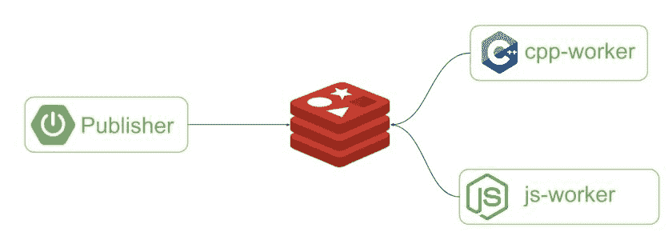

# 什么是云原生？让我们做一个可靠的编译器服务

> 原文：<https://dev.to/andreybronin/cloud-native-c-microservice-part-2-what-is-cloud-native-let-s-make-solidity-compiler-service-5ddo>

让我们让 Solidity 编译器微服务

### 主题

让我们做一些有用的事情。想象一下，我们为了可靠性而开发在线 IDE(就像 [Etherium Remix](https://remix.ethereum.org) )我们有 SPA 前端，现在我们需要后端的可扩展高性能编译器。我们有[参考 C++实现的 Solidity](https://github.com/ethereum/solidity) 和 [Javascript Emscripten 编译的 Solidity](https://www.npmjs.com/package/solc) 。

现在我们可以制作微服务的 C++和 NodeJS 版本，看看哪个会更快。理论上 C++版本应该快很多。

现在让我们定义需求和服务架构。在此之前，我们需要了解什么是微服务。

### 什么是云原生应用？

云原生描述，据 [CNCF](https://www.cncf.io) 。

> 云原生技术使组织能够在现代动态环境(如公共云、私有云和混合云)中构建和运行可扩展的应用程序。容器、服务网格、微服务、不可变基础设施和声明式 API 就是这种方法的例子。这些技术使得松散耦合的系统具有弹性、可管理性和可观察性。与强大的自动化相结合，它们允许工程师以最少的劳动频繁地、可预测地做出高影响力的改变。
> 
> 云原生应用由松散耦合的微服务开发，允许每个微服务仅在需要时运行，并根据需要进行更新/更改，而不是要求整个应用聚合运行。

[**云原生应用简介 TIBCO 博客**
*这是关于云原生应用开发演进的三部分系列文章的第一部分。下周的第二部分……* www . tibco . com](https://www.tibco.com/blog/2019/02/05/an-introduction-to-cloud-native-applications/)

[**云原生应用的 10 个关键属性——新栈**
*云原生是一个用来描述基于容器的环境的术语。云原生技术用于开发…*thenewstack.io](https://thenewstack.io/10-key-attributes-of-cloud-native-applications/)

在本文系列中，将描述和实现云原生应用的几个关键属性。

*   集装箱化

*   CI/CD 管道

*   用于交互和协作的 API

*   可观察性和分析

*   信息发送

### 功能需求

工人服务应该能够将可靠性契约编译成二进制表示。工作者应该使用发布/订阅模式与其他服务进行交互。

发布者将合同工作发布到 Redis，工人完成工作并将编辑好的合同发布回 Redis。

 * Redis Pub/Sub*

### 常见要求

*   服务应该由 orchestrator(Docker，Kubernetes)进行容器化和管理

*   容器内的服务应该可以通过命令行参数或 env 变量进行配置。

*   服务日志应该格式化和结构化

*   服务应提供健康检查

*   服务应该衡量服务的可观察性

### 目标平台

我们将使用两个最流行的 Linux 发行版作为 docker 基础映像:Ubuntu 和 Alpine。Alpine Linux 基于 [musl C 库](https://en.wikipedia.org/wiki/Musl)和 [BusyBox](https://en.wikipedia.org/wiki/BusyBox) 并提供微小图像，但在[某些情况下](https://superuser.com/questions/1219609/why-is-the-alpine-docker-image-over-50-slower-than-the-ubuntu-image)可能会慢一些。第一个原因是 glibc，第二个原因是默认优化编译选项。我在某个地方读到过，包使用编译选项`-Os`构建，这意味着“优化大小”而不是性能。

## 未来篇

*   云原生 C++微服务。第 3 部分—依赖项、包管理器、Conan.io

*   云原生 C++微服务。第 4 部分—可观察性

*   云原生 C++微服务。第 5 部分—数据库

*   云原生 C++微服务。第 6 部分—JWT 认证

*   云原生 C++微服务。第 7 部分— API，REST，GRPC

[**cncf/风景**
*🌄云端原生互动景观对数百个项目和产品进行筛选和排序，并展示详情……* github . com](https://github.com/cncf/landscape)