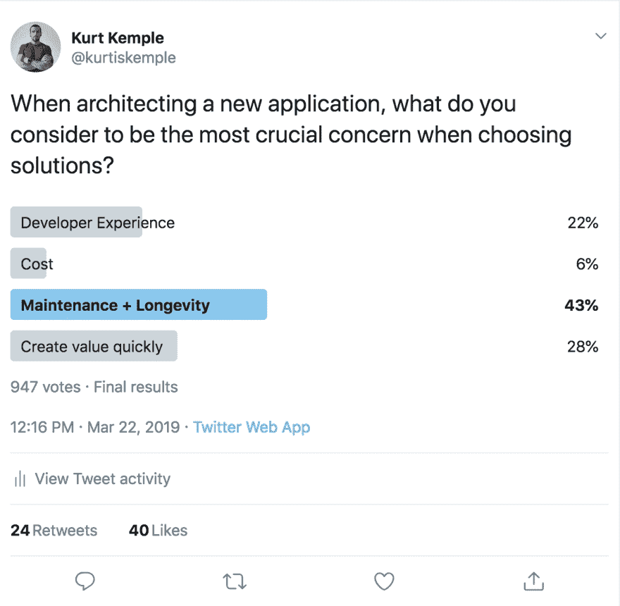

# 全堆栈无服务器

> 原文:[https://dev.to/oieduardorabelo/full-stack-serverless-6a7](https://dev.to/oieduardorabelo/full-stack-serverless-6a7)

*【不久的将来，我们将只关注我们的产品--[【图像学分】](https://unsplash.com/photos/LqKhnDzSF-8)*

# 克雷蒂托

*   [【full stack server less】](https://dev.to/kkemple/fullstack-serverless-440e)，最初由[kurtis kempel](https://twitter.com/kurtiskemple)编写

## 发展情景如何变化

近年来，后端和前端的发展发生了很大变化。随着客户变得越来越拥挤，支持他们的服务变得越来越瘦，没有状态。管理所有这些微小的服务和功能的复杂性正在被抽象化，使那些没有 devops 技能的人能够利用无服务器技术。随着客户的增长，状态管理和与任意数量的支持服务或 API 的交互也变得越来越复杂。工具和结构开始出现，从开发人员那里抽象出来，使他们能够更快地专注于产品的开发。

那我为什么要把它弄出来？因为我觉得这一切的改变正在导致一种新的应用程序创建方式。它利用了我们近年来在前端和后端看到的变化，使开发人员能够在很短的时间内创建真正有趣的服务应用程序。

# 无服务器服务

在后端，我们看到计算的力量变成了商品，引发了服务器无服务器的发展。但是，如果您已经以真正无服务器的方式构建了某个产品，那么您就知道，您所获得的可扩展性和成本节约带来了巨大的复杂性。

如果您认为管理微服务不好，请尝试仅在自己的位置划分所有功能，然后通过事件将其粘贴回来。😱

serverless 虽然肯定有它的优点，但并不是假装的心。这不是一件容易的事，通常需要一个后端开发人员团队几个月的时间才能完成。 [Ben Kehoe](https://read.acloud.guru/serverless-is-a-state-of-mind-717ef2088b42) 比我更好地处理“无服务器的原因”，以他的名义访问链接，但只需说你选择无服务器是因为你专注的价值。

在一天结束时，我们想迅速创造价值。我们希望不会牺牲开发人员的专业知识和安全，但我们希望尽可能少地编写代码来解决业务问题。也许连一条线都没有-我...。

如何在不管理这种新的复杂性的情况下实现无服务器的优势？通常，随着某项技术的发展，它会经历复杂性的变化。虽然无服务器本身由 lambda 函数(“t0”AWS lambda“”)、主题设置(“T2”AWS“”)和事件管理(“T4”事件驱动体系结构“”)组成，但在以下方面创建了一些高级抽象

这反过来又带来了利用服务器不可用的可扩展性，但将其抽象为解决特定问题域的有意义产品的‘t1’和‘T2’产品和‘T2’服务器不可用服务’。Nader Dabit 列出了我之前链接的一些很好的服务示例。他在文章中说:

> 所提供服务的例子包括**/**【Amazon cognito】**(托管认证)，**algoria**(托管搜索)，**【content infra structure】**【content infra structure】- *Nader Dabit，无服务器计算时代的全栈发展***

 **# 工具包和用户界面工具

在前端，我们还看到复杂性大增，再次借用 Nader Dabit 的话，他解释了什么改变了，使事情变得复杂得多:

> 由于 SPAs 的出现、对更复杂数据的担忧、各种设备目标以及对用户体验的期望不断提高，过去十年中客户端的开发变得更加复杂。-Nader dabit，无服务器计算时代的全栈发展

但是，随着这种复杂性，出现了一些真正令人惊讶的工具和结构。这些抽象使开发人员能够专注于创造价值，从而简化了新复杂性的管理。最重要的是，我们不需要牺牲可负担性和安全性。我们将此直接集成到解决方案中。

可以相当公平地说，这些工具提供了重点。他们让你严格处理业务问题，为你处理所有技术问题。这显示了同样的后端变化和无服务器计算的演变。

诸如 [Expo](https://expo.io/) 、 [Ionic](https://ionicframework.com/) 、 [Gatsby](https://www.gatsbyjs.org/) 和 [Meteor](https://www.meteor.com/) 等结构正在使基于其组成部分的生产和质量就绪型应用程序得以创建。

# 两个世界中最好的

我们现在看到的是跨越两个世界最好的平台。为应用程序的整个开发生命周期提供解决方案。大大简化了构建可无缝扩展的完整应用程序的过程，并且比构建您自己的无服务器基础架构和工具的成本更低。诸如 [Firebase](https://dev.to/kkemple/fullstack-serverless-440e) 、 [Netlify](https://dev.to/kkemple/fullstack-serverless-440e) 、[time](https://dev.to/kkemple/fullstack-serverless-440e)和 [AWS 放大器](https://dev.to/kkemple/fullstack-serverless-440e)等解决方案提供了完整的堆栈功能，如工具包和 API、数据存储、arz 存储我指的是像`Full-Stack Serverless`这样的平台。它们提供的功能集通常包括命令行工具、后端服务以及它们之间的所有内容。

最近，[我在 Twitter](https://twitter.com/kurtiskemple/status/1109126793938767872) 上做了一项调查，我在调查中问:“在构建新的应用程序时，您认为在选择解决方案时最关键的问题是什么？”

[T2】](https://res.cloudinary.com/practicaldev/image/fetch/s--nhhQoXzD--/c_limit%2Cf_auto%2Cfl_progressive%2Cq_auto%2Cw_880/https://res.cloudinary.com/practicaldev/image/fetch/s--yp7F94aC--/c_limit%252Cf_auto%252Cfl_progressive%252Cq_auto%252Cw_880/https://thepracticaldev.s3.amazonaws.com/i/zditbaqx5cvxye3gthbn.png)

不足为奇的是，大多数人投票赞成“维护和长寿”，其次是“迅速创造价值”。在顶部看到维护和耐用性并不奇怪，因为当您负责自己的服务器或确保应用程序安全且性能良好时，会出现大量额外的技术问题代码。解决技术问题而不是业务问题的代码。

这就是为什么我觉得未来是我们不处理服务或应用程序的维护和生命周期问题的时候，因为我们将这一责任下放给了所提供的服务。借此，我们将重点放在创造能迅速创造价值的产品上。

在调查中，开发人员的经验很快就增加了价值，这很有趣，因为我觉得，为了让解决方案在此空间中运行，开发人员的经验就是一切。很多人害怕陷入供应商的圈套(中的【供应商锁】-我...。除非他们正在使用的东西为开发者提供了如此愉快的体验，以至于他们相信你能得到他们所需要的，并且确实关心他们的成功。

当您选择供应商时，因为您觉得平台正在提高您的工作效率，所以不使用它是没有意义的。您希望快速创造价值，并专注于构建应用程序，而不是基础架构。这就是我跌倒的水桶，这就是为什么我总是热衷于盖茨比和世博等解决方案，我想立即制作产品，知道剩下的都由我来处理，现在你告诉我，我不用再为自己选择如何处理数据、身份验证、用户和内容而烦恼了。是我！来了。进去吧！

我认为，以前人们总是担心如何扩展这些解决方案，这使得购买这些完整堆栈供应商变得困难，但随着服务器无服务器的移动，我认为这种想法更经济实惠。我想我们正处于一个全新的平台时代的初期阶段，这个平台具有完整的无服务器堆栈，我非常兴奋地看到事情的发展方向。

* * ***