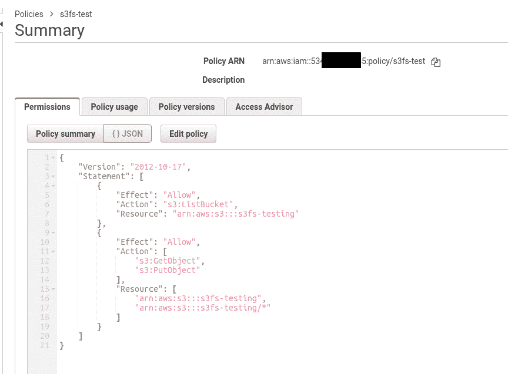
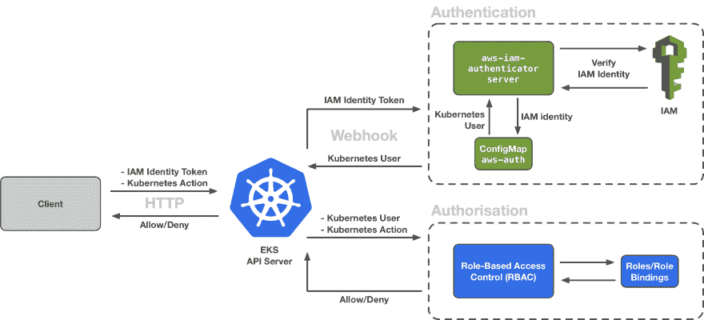

# kubernetes:第 4 部分–AWS eks 验证、aws-iam 验证器和 AWS IAM

> 原文:# t0]https://dev . to/setevy/kubrines-part-4-AWS-eks 认证-AWS-iam-authenticator-and-AWS-iam-aof

[T2】](https://res.cloudinary.com/practicaldev/image/fetch/s--1omKf2Bs--/c_limit%2Cf_auto%2Cfl_progressive%2Cq_auto%2Cw_880/https://rtfm.co.ua/wp-content/uploads/2017/06/kuber-1.png)

让我们继续我们的 AWS 弹性 Kubernetes 服务， *EKS* 。

以前的零件:

*   [Kubernetes:第 1 部分-架构和主要组件概述](https://rtfm.co.ua/en/kubernetes-part-1-architecture-and-main-components-overview/)
*   [Kubernetes:第 2 部分——利用 AWS 云提供商和 AWS 负载平衡器在 AWS 上建立集群](https://rtfm.co.ua/en/kubernetes-part-2-a-cluster-set-up-on-aws-with-aws-cloud-provider-and-aws-loadbalancer/)
*   [Kubernetes:第 3 部分-AWS EKS 概述和手动 EKS 集群设置](https://rtfm.co.ua/en/kubernetes-part-3-aws-eks-overview-and-manual-eks-cluster-set-up/)。

在之前的—[Kubernetes:第 3 部分—AWS EKS 概述和手动 EKS 集群设置](https://rtfm.co.ua/en/kubernetes-part-3-aws-eks-overview-and-manual-eks-cluster-set-up/)—部分中，我们启动了一个 EKS 集群。

`kubectl`正在工作，一切顺利。

但是当我团队的后端开发人员执行`aws eks update-kubeconfig`命令来配置 macOS 上的`kubectl`工具，并第一次尝试连接到这个集群时，他得到了下一个错误:

```
root@ip-10-0-42-255:~# kubectl get nodes
error: You must be logged in to the server (Unauthorized) 
```

两个用户——我的，因为我使用我自己的 IAM 用户创建了这个集群，我们的后端开发人员——在他们的 AWS 帐户上都有 FullAdmin 权限——这里会有什么问题呢？

好吧，让我们深入了解一下 EKS 和 AWS 的认证和授权流程。

在本主题中，我们将讨论:

*   [认证 vs 授权](https://rtfm.co.ua/en/kubernetes-part-4-aws-eks-authentification-aws-iam-authenticator-and-aws-iam/#Authentication_vs_Authorization)
*   [AWS EKS 认证和授权](https://rtfm.co.ua/en/kubernetes-part-4-aws-eks-authentification-aws-iam-authenticator-and-aws-iam/#AWS_EKS_Authentication_and_Authorization)
*   [AWS EKS IAM 认证](https://rtfm.co.ua/en/kubernetes-part-4-aws-eks-authentification-aws-iam-authenticator-and-aws-iam/#AWS_EKS_IAM_Authentication)
*   [立方鉴定](https://rtfm.co.ua/en/kubernetes-part-4-aws-eks-authentification-aws-iam-authenticator-and-aws-iam/#kubectl_authentification)
*   [AWS CLI vs AWS-iam-authenticator](https://rtfm.co.ua/en/kubernetes-part-4-aws-eks-authentification-aws-iam-authenticator-and-aws-iam/#AWS_CLI_vs_aws-iam-authenticator)
*   [AWS 配置文件](https://rtfm.co.ua/en/kubernetes-part-4-aws-eks-authentification-aws-iam-authenticator-and-aws-iam/#AWS_profiles)
*   [七位认证器-AWS vs AWS-iam-认证器](https://rtfm.co.ua/en/kubernetes-part-4-aws-eks-authentification-aws-iam-authenticator-and-aws-iam/#heptio-authenticator-aws_vs_aws-iam-authenticator)
*   [AWS EKS aws-auth 配置图](https://rtfm.co.ua/en/kubernetes-part-4-aws-eks-authentification-aws-iam-authenticator-and-aws-iam/#AWS_EKS_aws-auth_ConfigMap)
*   [向集群的配置图添加新用户](https://rtfm.co.ua/en/kubernetes-part-4-aws-eks-authentification-aws-iam-authenticator-and-aws-iam/#Adding_a_new_user_to_the_clusters_ConfigMap)
*   [“根”即集群创建者](https://rtfm.co.ua/en/kubernetes-part-4-aws-eks-authentification-aws-iam-authenticator-and-aws-iam/#root_aka_Cluster_creator)

在下一部分，我们将了解 Kubernetes 中的 RBAC 是什么，以及它是如何用于用户授权的。

# [](#authentication-vs-authorization)认证 vs 授权

首先，让我们快速检查一下用户认证和授权之间的区别。

#### [](#authentication)认证

认证是一个客户端必须向服务器证明他就是他所声称的那个人的过程。

例如，在我们创建了一个 EKS 集群之后，我们启动了 Worker Nodes 实例。他们必须调用 EKS 的 API 服务器来连接到集群。

在此期间 API 服务器必须能够检查客户端要求他充当工作节点的内容，并且它对此拥有权限。

为此，Kubernetes 提供了*认证模块*或*认证器*:当 API 服务器收到来自客户端的请求时，无论是像`kubectl`工具这样的客户端、新的工作节点，还是使用`curl`发出的 HTTP 请求，Kubernetes 都会要求其配置的认证器之一验证该客户端。

所有可用的模块都可以在[文档](https://kubernetes.io/docs/reference/access-authn-authz/authentication/)中找到，但是现在，我们感兴趣的是 AWS Elastic Kubernetes 服务中使用的一个模块——与 AWS IAM 一起使用来检查用户的`aws-iam-authenticator`。

#### [](#authorization)授权

在我们的客户端通过认证过程后——Kubernreets 必须检查该用户是否可以执行客户端调用的某个操作，例如——是否有权执行`kubectl get pods`命令。

如果回忆 AWS IAM 策略，我们可以看到授予特定 API 调用的权限，例如:

[T2】](https://rtfm.co.ua/wp-content/uploads/2019/08/Screenshot_20190831_115046.png)

在这里的*操作中，*我们正在为一些将使用该策略的用户设置权限。如果该用户试图执行“`s3:DeleteObject`”调用，AWS 将拒绝该请求，因为策略中没有为该用户指定该请求(整个 AWS 通过 API 调用工作，方式与在 Kubernetes 中相同)。

与认证过程类似——Kubernetes 有*个授权模块*或*个授权者*，例如——[基于属性的访问控制(ABAC)](https://kubernetes.io/docs/reference/access-authn-authz/abac/) 和[基于角色的访问控制(RBAC)](https://kubernetes.io/docs/reference/access-authn-authz/rbac/) 。

Kubernetes 会将已经通过*认证*模块验证的用户传递给*授权*模块，以检查其权限，然后 API 服务器将决定是否必须执行客户端请求的精确操作。

参见此处的文档—[控制对 Kubernetes API 的访问](https://kubernetes.io/docs/reference/access-authn-authz/controlling-access/)。

在下面的帖子中，我们将看到 AWS IAM 在 AWS EKS 的认证过程是如何工作的，在下一个帖子中，我们将讨论 Kubernetes 中的授权和 RBAC。

### [](#aws-eks-authentication-and-authorization)AWS EKS 认证和授权

下图详细描述了这一过程:

[T2】](https://rtfm.co.ua/wp-content/uploads/2019/08/1_QQJZp8zc27jCkbJLaIVhZQ.png)

### [](#aws-eks-iam-authentication)AWS EKS IAM 认证

对于认证，AWS EKS 使用 web 令牌-参见 [Webhook 令牌认证](https://kubernetes.io/docs/reference/access-authn-authz/authentication/#webhook-token-authentication):客户端将传递包含用户标识符的特殊格式的令牌。

在 AWS EKS 的情况下，该标识可以是 IAM 用户或 IAM 角色的 ARN ( *Amazon 资源名称*)。

Kubernetes authenticator 将依次将从该令牌中提取的标识符传递给 AWS IAM 服务，以通过使用运行在 EKS 控制平面上的 [AWS IAM Authenticator](https://github.com/kubernetes-sigs/aws-iam-authenticator) 服务来检查令牌中指定的用户是否确实是他所声称的用户。

例如，流程是:

*   客户机向 API 服务器发出 q 请求，传递带有用户标识符的访问令牌
*   API 服务器将这个令牌传递给另一个 Kubernetes 控制平面的服务—`aws-iam-authenticator`
*   `aws-iam-authenticator`请求 AWS IAM 服务并传递该标识符，以检查该用户是否有效，以及他是否有权访问 EKS 集群
    *   AWS IAM 使用与作为用户标识符的令牌中传递的 ACCESS_KEY 绑定的密钥进行内部身份验证检查
    *   AWS IAM 通过检查绑定到该用户的 IAM 策略进行内部授权检查——必须拒绝没有对`eks::*`资源进行调用的 [API 的用户](https://docs.aws.amazon.com/en_us/IAM/latest/UserGuide/list_amazonelasticcontainerserviceforkubernetes.html)
*   `aws-iam-authenticator`返回到 Kubernetes 集群，通过`aws-auth`配置图进行检查(不久将在 [AWS EKS aws-auth 配置图](https://rtfm.co.ua/kubernetes-znakomstvo-chast-4-autentifikaciya-v-aws-eks-aws-iam-authenticator-i-aws-iam/#AWS_EKS_aws-auth_ConfigMap)中看到)–该用户是否有权访问该集群
*   `aws-iam-authenticator`向 API 服务器返回批准/拒绝响应
*   API 服务器将依次执行用户请求的操作，或将返回“*您必须登录到服务器(未授权)*”消息

_ **注意**:之前使用的是 [AWS 云提供商](https://kubernetes.io/docs/concepts/cluster-administration/cloud-providers/#aws)而不是`aws-iam-authenticator`，查看[Kubernetes:part 2——一个在 AWS 上设置了 AWS 云提供商和 AWS 负载平衡器](https://rtfm.co.ua/en/kubernetes-part-2-a-cluster-set-up-on-aws-with-aws-cloud-provider-and-aws-loadbalancer/)的集群，了解详细信息。_

`aws-iam-authenticator`本身可以在两端使用——只是在服务器端它被启动为`aws-iam-authenticator server`,在客户端—`aws-iam-authenticator token -i`:

[T2】](https://rtfm.co.ua/wp-content/uploads/2019/08/1_N8rXK8rR0J3IEaYWBd_cqA.png)

但是在我目前的例子中，客户端(kubectl)通过发出`aws eks update-kubeconfig`命令进行配置，并使用 AWS CLI 而不是上图中的`aws-iam-authenticator`(更多信息请参见[AWS CLI vs AWS-iam-authenticator](https://rtfm.co.ua/en/kubernetes-part-4-aws-eks-authentification-aws-iam-authenticator-and-aws-iam/#AWS_CLI_vs_aws-iam-authenticator))。

#### [](#-raw-kubectl-endraw-authentification)`kubectl`认证

让我们使用本地工作站上的`kubectl`作为客户端来查看整个过程。

因此，`kubectl`首先将检查`~/.kube/config`文件，在那里它将获取一个 EKS 集群的 API-server URL:

```
...
server: https://715***834.sk1.us-east-2.eks.amazonaws.com
... 
```

接下来，看看配置文件的下一部分，特别是我们感兴趣的`exec`，尤其是`command`和`args` :

```
...
    exec:
      apiVersion: client.authentication.k8s.io/v1alpha1
      args:
      - --region
      - us-east-2
      - eks
      - get-token
      - --cluster-name
      - mobilebackend-dev-eks-0-cluster
      command: aws
... 
```

其中描述了使用 AWS CLI 命令—[`aws eks get-token`](https://docs.aws.amazon.com/en_us/eks/latest/userguide/managing-auth.html)获取 EKS 身份验证令牌所使用的命令。

玩玩 WS API 认证会很有趣，一些快速搜索的例子可以在 AWS S3 的[开发者指南](https://docs.aws.amazon.com/en_us/AmazonS3/latest/dev/RESTAuthentication.html)中找到，如果有时间，也许会尝试使用`curl`实用程序来完成整个工作，因为在引擎盖下 AWS CLI 只是向 AWS 核心发出 API 请求，就像我们在`kubectl`和 Kubernetes API-endpoint 中看到的一样。

现在，让我们使用在`command`部分指定的命令，并传递在`args` :
中设置的参数

```
$ aws --profile arseniy --region us-east-2 eks get-token --cluster-name mobilebackend-dev-eks-0-cluster
{"kind": "ExecCredential", "apiVersion": "client.authentication.k8s.io/v1alpha1", "spec": {}, "status": {"expirationTimestamp": "2019-08-31T10:27:24Z", "token": "k8s-aws-v1.aHR...zEy"}} 
```

*“令牌”:“k8s-AWS-v1 . ahr…zEy”*——这是我们的令牌。

您可以在[https://www.base64decode.org](https://www.base64decode.org)上查看其内容(在第一个“`_`”符号后插入令牌的内容)。

这是我们在上面的案例中得到的结果:

> action = getcalleriddentity & Version = 2011-06-15 & X-Amz-Algorithm = AWS 4-HMAC-sha 256 & X-Amz-Credential = AKI ***D4Q % 2f 2019 08 31% 2 fus-east-1% 2 fsts % 2 faws 4 _ request&X-Amz-Date = 2019 08 31t 092243 z&X-Amz-Expires = 0&X-Amz-signed headers**

*Amz-Credential=AKI***D4Q* 字段包含我们用户的 ACCESS_KEY，取自 *arseny* AWS CLI 配置文件(将在 [AWS 配置文件](https://rtfm.co.ua/en/kubernetes-part-4-aws-eks-authentification-aws-iam-authenticator-and-aws-iam/#AWS_profiles)中讲述配置文件):

```
$ cat ~/.aws/credentials | grep -B1 -A2 AKI***D4Q
[arseniy]
aws_access_key_id = AKI***D4Q
aws_secret_access_key = q0I***jvj 
```

所以:

1.  我们正在传递访问密钥
2.  通过使用 ACCESS _ KEY–可以获得用户的 ARN
3.  通过使用此 ARN，EKS 控制平面上的`aws-iam-authenticator`将检查这是否是有效用户，以及他是否可以访问我们的集群(参见 [AWS EKS aws-auth 配置图](https://rtfm.co.ua/en/kubernetes-part-4-aws-eks-authentification-aws-iam-authenticator-and-aws-iam/#AWS_EKS_aws-auth_ConfigMap)

让我们检查一下我们的访问密钥:

```
$ aws --profile arseniy  iam list-access-keys --user-name arseniy
{
"AccessKeyMetadata": [
{
"UserName": "arseniy",
"AccessKeyId": "AKI***D4Q",
... 
```

使用此密钥的 AWS 帐户:

```
$ aws --profile arseniy sts get-access-key-info --access-key-id AKI***D4Q
{
"Account": "534***385"
} 
```

以及用户在该账号的 ARN:

```
$ aws --profile arseniy iam get-user --user-name arseniy
{
"User": {
"Path": "/",
"UserName": "arseniy",
"UserId": "AID***JU6",
"Arn": "arn:aws:iam::534***385:user/arseniy",
... 
```

一切都好。

#### [](#aws-cli-vs-raw-awsiamauthenticator-endraw-)AWS CLI vs `aws-iam-authenticator`

以同样的方式代替 AWS CLI，我们可以使用`aws-iam-authenticator`来获得一个令牌，使我们的过程与上图完全相同。

你可以把它安装在 AUR 的 Arch Linux 上:

```
$ yaourt -S aws-iam-authenticator-bin 
```

并获得您的令牌:

```
$ aws-iam-authenticator token -i mobilebackend-dev-eks-0-cluster
{"kind":"ExecCredential","apiVersion":"client.authentication.k8s.io/v1alpha1","spec":{},"status":{"expirationTimestamp":"2019-08-31T10:38:41Z","token":"k8s-aws-v1.aHR***ODU"}} 
```

您也可以手动编辑您的`kubectl`的配置来设置`aws-iam-authenticator`而不是 AWS CLI。

所以，更换下一部分:

```
...
    exec:
      apiVersion: client.authentication.k8s.io/v1alpha1
      args:
      - --region
      - us-east-2
      - eks
      - get-token
      - --cluster-name
      - mobilebackend-dev-eks-0-cluster
      command: aws
... 
```

与下一位:

```
...
    exec:
      apiVersion: client.authentication.k8s.io/v1alpha1
      args:
        - token
        - -i
        - mobilebackend-dev-eks-0-cluster
      command: aws-iam-authenticator
      env:
      - name: AWS_PROFILE
        value: arseniy
... 
```

检查访问:

```
$ kubectl auth can-i get pods
yes 
```

因此，我们看到`kubectl`只是通过使用或 AWS CLI ( `/usr/bin/aws`)或使用`/usr/bin/aws-iam-authenticator`使用其`~/.kube/conf`配置中指定的`command`来获取令牌。

#### [](#aws-profiles)AWS 配置文件

让我们来看看`~/.kube/config` :
中的`env`部分

```
...
...
      command: aws
      env:
      - name: AWS_PROFILE
        value: arseniy 
```

在这里，我们正在设置一个 AWL CLI 配置文件的名称，该名称将用于获取令牌，请查看 [AWS: CLI named profiles](https://rtfm.co.ua/en/aws-cli-named-profiles/) 帖子了解详细信息。

所以:

1.  `kubectl`显示为`~/.kube/config`
    1.  获取 API 服务器 URL
    2.  用于获取令牌的命令(`command` и `args`)
    3.  要使用的 AWS CLI 用户配置文件
    4.  请求 AWS 获取令牌
2.  将此令牌发送到 EKS API 服务器并传递此令牌

让我们检查一下。

获取令牌:

```
$ export AWS_PROFILE=arseniy
$ aws-iam-authenticator token -i mobilebackend-dev-eks-0-cluster
{"kind":"ExecCredential","apiVersion":"client.authentication.k8s.io/v1alpha1","spec":{},"status":{"expirationTimestamp":"2019-08-31T11:00:15Z","token":"k8s-aws-v1.aHR***Y2E"}} 
```

检查一下——获取用户的 ARN:

```
$ aws-iam-authenticator token -verify -i mobilebackend-dev-eks-0-cluster -t $token&{ARN:arn:aws:iam::534***385:user/arseniy CanonicalARN:arn:aws:iam::534***385:user/arseniy AccountID:534***385 UserID:AID***JU6 SessionName:} 
```

为简单起见，将令牌保存到`$token` :

```
$ token="k8s-aws-v1.aHR***Y2E" 
```

并使用`curl`连接到 API 服务器:

```
$ curl -X GET https://715***834.sk1.us-east-2.eks.amazonaws.com/api --insecure --header "Authorization: Bearer $token"
{
"kind": "APIVersions",
"versions": [
"v1"
],
"serverAddressByClientCIDRs": [
{
"clientCIDR": "0.0.0.0/0",
"serverAddress": "ip-172-16-49-148.us-east-2.compute.internal:443"
}
]
} 
```

都在这里工作。

同样的，`kubectl`也会执行自己对 EKS 的请求。

顺便说一下，如果您为 EKS 集群启用了这些请求，那么您可以在 CloudWatch 日志中看到所有这些请求。

例如，令人惊讶的是，可以在*认证者-**** 日志中找到认证日志:

[T2】](https://rtfm.co.ua/wp-content/uploads/2019/08/Screenshot_20190831_144427-1.png)

#### [](#-raw-heptioauthenticatoraws-endraw-vs-raw-awsiamauthenticator-endraw-)`heptio-authenticator-aws` vs `aws-iam-authenticator`

起初，我很惊讶——如果 AWS 文档[告诉](https://docs.aws.amazon.com/en_us/eks/latest/userguide/managing-auth.html)关于`aws-iam-authenticator`的信息，为什么我会在日志中看到`heptio-authenticator-aws`服务？检查[管理集群认证](https://docs.aws.amazon.com/en_us/eks/latest/userguide/managing-auth.html)。

但答案很简单:4.0 版本`aws-iam-authenticator`之前叫`heptio-authenticator-aws`。

参见 [v0.3.0](https://github.com/kubernetes-sigs/aws-iam-authenticator/releases/tag/v0.3.0) 和[v 0 . 4 . 0-α1](https://github.com/kubernetes-sigs/aws-iam-authenticator/releases/tag/0.4.0-alpha.1)标签。

好了，我们已经检查了客户端的身份验证是如何工作的——那么 AWS EKS 呢？

### [](#aws-eks-raw-awsauth-endraw-configmap)AWS EKS `aws-auth`配置图

然后，“认证魔法”在这里发生了:现在`aws-iam-authenticator`必须:

1.  询问 AWS IAM 服务–它是否有这样的用户，以及它是否有权限，例如，必须执行身份验证
2.  此后,`aws-iam-authenticator`必须将该用户传递给 Kubernetes API-server，然后 Kubernetes 将执行用户授权——该用户是否有权访问我们的集群以及可以使用哪些命令——这里将使用`aws-auth`配置图

如果回到 [Kubernetes:第 2 部分——在 AWS 上建立一个集群，有 AWS 云提供商和 AWS 负载平衡器](https://rtfm.co.ua/en/kubernetes-part-2-a-cluster-set-up-on-aws-with-aws-cloud-provider-and-aws-loadbalancer/)帖子——我们在那里创建了一个配置图，现在看起来如下:

```
apiVersion: v1
kind: ConfigMap
metadata:
  name: aws-auth
  namespace: kube-system
data:
  mapRoles: |
    - rolearn: arn:aws:iam::534***385:role/mobilebackend-dev-eks-0-wn-stack-NodeInstanceRole-15NNFZK6WW4IG
      username: system:node:{EC2PrivateDNSName}
      groups:
        - system:bootstrappers
        - system:nodes 
```

在这里的*arn:AWS:iam::534 * * * 385:Role/mobilebackend-dev-eks-0-wn-stack-NodeInstanceRole-15 nnfzk 6 ww 4 ig*行中，我们添加了角色 arn，该角色用作 EC2 的实例角色，我们的 Worker 节点将被检查权限。

#### [](#adding-a-new-user-to-the-clusters-configmap)向集群的配置图添加新用户

最后，让我们回到这篇文章的最开始:为什么另一个 im-ser 得到“**你必须登录到服务器(未授权)**”错误？

从我们在配置图中看到的情况来看，这是显而易见的——因为没有这样的用户，因此——Kubernetes 无法检查其权限(实际上——因为这个用户有。

检查`aws-iam-authenticator`的[文档](https://github.com/kubernetes-sigs/aws-iam-authenticator#full-configuration-format) :

```
...
  # each mapUsers entry maps an IAM role to a static username and set of groups
  mapUsers:
... 
```

更新您的配置图——添加用户的 ARN、其登录名并将其组设置为`system:masters` :

```
apiVersion: v1
kind: ConfigMap
metadata:
  name: aws-auth
  namespace: kube-system
data:
  mapRoles: |
    - rolearn: arn:aws:iam::534***385:role/mobilebackend-dev-eks-0-wn-stack-NodeInstanceRole-15NNFZK6WW4IG
      username: system:node:{EC2PrivateDNSName}
      groups:
        - system:bootstrappers
        - system:nodes
  mapUsers: |
    - userarn: arn:aws:iam::534***385:user/yaroslav
      username: yaroslav
      groups:
        - system:masters 
```

应用更改:

```
$ kubectl apply -f aws-auth-cm.yaml
configmap/aws-auth configured 
```

检查集群–找到配置图:

```
$ kubectl -n kube-system get cm
NAME                                 DATA   AGE
aws-auth                             2      2d
... 
```

并检查其内容:

```
$ kubectl -n kube-system describe cm aws-auth
Name:         aws-auth
Namespace:    kube-system
Labels:       <none>
Annotations:  kubectl.kubernetes.io/last-applied-configuration:
{"apiVersion":"v1","data":{"mapRoles":"- rolearn: arn:aws:iam::534***385:role/mobilebackend-dev-eks-0-wn-stack-NodeInstanceRole-15NNFZK...
Data
====
mapRoles:
----
- rolearn: arn:aws:iam::534***385:role/mobilebackend-dev-eks-0-wn-stack-NodeInstanceRole-15NNFZK6WW4IG
username: system:node:{EC2PrivateDNSName}
groups:
- system:bootstrappers
- system:nodes
mapUsers:
----
- userarn: arn:aws:iam::534***385:user/yaroslav
username: yaroslav
groups:
- system:masters
Events:  <none> 
```

完成–我们的用户*arn:AWS:iam::534 * * * 385:user/yaroslav*现在可以在集群中执行任何操作。

#### [](#root-aka-cluster-creator)“根”又名集群创建者

我想说的最后一件事是创建者用户:IAM 条目，用于创建集群，将成为它的超级管理员。

但问题是你看不到任何地方——这就是我感到困惑的原因——为什么*arn:AWS:iam::534 * * * 385:user/arseniy*用户对集群拥有完全访问权限，而 a _ rn:AWS:iam::534 * * * 385:user/yaroslav _—却没有。

但是，您仍然可以通过调用 AWS 的 [`CreateCluster`](https://docs.aws.amazon.com/eks/latest/APIReference/API_CreateCluster.html) API 来检查 CloudTrail，从而找到创建者:

[T2】](https://rtfm.co.ua/wp-content/uploads/2019/08/Screenshot_20190831_155845.png)

支持人员对查看“根”用户的任何方式的回答如下:

> 此时，创建集群的 IAM 实体成为第一个集群管理员。该实体被传递到
> 
> 主节点，并且在`aws-auth`配置图中不可见。这类似于您的 AWS 帐户
> 
> 的根用户，因为它拥有 system:masters 权限。

### [](#useful-links)有用的链接

*   [亚马逊 EKS 上的 Kubernetes 客户端认证](https://itnext.io/how-does-client-authentication-work-on-amazon-eks-c4f2b90d943b)
*   【auth 如何在 EKS 与 IAM 用户合作
*   [管理集群的用户或 IAM 角色](https://docs.aws.amazon.com/en_us/eks/latest/userguide/add-user-role.html)
*   在亚马逊 EKS 创建集群后，我如何向其他用户和角色提供访问权限？

### [](#similar-posts)类似的帖子

*   <small>2019 年 8 月 15 日</small> [Kubernetes:第 3 部分–AWS EKS 概述和手动 EKS 集群设置](https://rtfm.co.ua/en/kubernetes-part-3-aws-eks-overview-and-manual-eks-cluster-set-up/)
*   <small>2019 年 8 月 10 日</small> [Kubernetes:第 2 部分——利用 AWS 云提供商和 AWS 负载平衡器在 AWS 上建立集群](https://rtfm.co.ua/en/kubernetes-part-2-a-cluster-set-up-on-aws-with-aws-cloud-provider-and-aws-loadbalancer/)
*   <small>07/25/2019</small>[Kubernetes:第 1 部分-架构和主要组件概述](https://rtfm.co.ua/en/kubernetes-part-1-architecture-and-main-components-overview/)