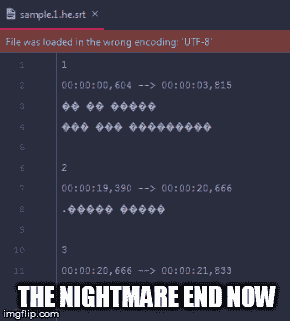

# 我如何在最意想不到的地方使用暴力

> 原文:[https://dev . to/ous ret/how-I-use-brute-force-where-I-less-expected-it-3c3l](https://dev.to/ousret/how-i-used-brute-force-where-i-least-expected-it-3c3l)

关于文本文件中的“编码检测”,有一个非常老的*问题*,已经被像 [Chardet](https://github.com/chardet/chardet) 这样的程序部分解决了。我不喜欢每个编码表有一个探测器的想法，这可能导致硬编码规范。

[T2】](https://res.cloudinary.com/practicaldev/image/fetch/s--h-dTUKQL--/c_limit%2Cf_auto%2Cfl_progressive%2Cq_66%2Cw_880/https://thepracticaldev.s3.amazonaws.com/i/abb4qex3neg66gexvj94.gif)

我想挑战现有的发现原始编码的方法。

根据当前的规范，您可以认为这个问题已经过时:

> 您应该按照标准中的描述指出所使用的字符集编码

但现实是不同的，互联网的很大一部分仍然有未知编码的内容。(例如，人们可以指出 subrip 字幕(SRT))

这就是为什么像[这样的流行包请求](https://github.com/psf/Requests)嵌入 Chardet 来猜测远程资源上的表观编码。

你应该知道:

*   你不应该关心原始的字符集编码，因为两个不同的表可以产生两个相同的文件。
*   BOM ( [字节顺序标记](https://en.wikipedia.org/wiki/Byte_order_mark))不是通用的，它只涉及少量的编码，而不仅仅是 Unicode！

我在三个前提下(按此顺序)进行蛮力分析:

*   二进制适合编码表
*   混乱
*   一致性

我打开了数百个由人类编写的文本文件，它们的编码表是错误的。我观察了一下，然后我建立了一些基本规则，当事情看起来一团糟的时候，什么是显而易见的。我知道我对什么是混乱的解释是非常主观的，请随意改进或重写它。

*Coherence :* 对于地球上存在的每一种语言(尽我们所能)，我们已经计算出字母出现次数的排名。所以我认为这些情报在这里是有价值的。所以我用这些记录对照解码的文本来检查我是否能发现智能设计。

所以我向你介绍[字符集规格化器](https://github.com/Ousret/charset_normalizer)。真正的第一个通用字符集检测器。

[T2】](https://res.cloudinary.com/practicaldev/image/fetch/s--p95hMejy--/c_limit%2Cf_auto%2Cfl_progressive%2Cq_auto%2Cw_880/https://thepracticaldev.s3.amazonaws.com/i/ooz107intsclrpzkkj9h.PNG)

尽管测试或贡献，请随意提供帮助。