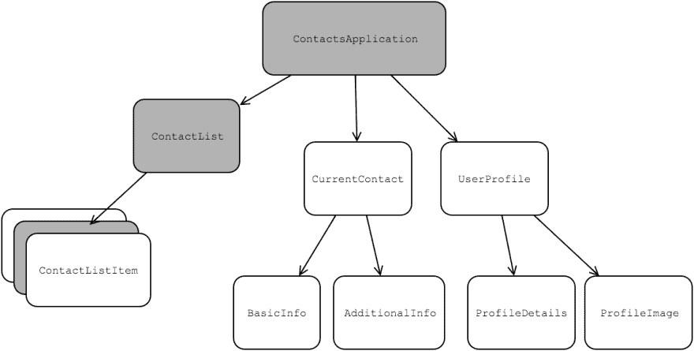

# 为什么 ClojureScript 很重要

> 原文：<https://dev.to/kendru/why-clojurescript-matters-227f>

这篇文章是安德鲁的书[第一课](https://www.learn-clojurescript.com/section-0/lesson-1-a-first-look/)，[T3】学 ClojureScriptT5】](https://gum.co/learn-cljs)

* * *

几年前，我开始写一本针对 JavaScript 程序员的关于 ClojureScript 的书。当时，学习 ClojureScript 的最佳资源是针对现有的 Clojure 程序员，他们希望利用自己的技能来构建 web 应用程序。我认为 ClojureScript 是对 JavaScript 社区不断变化的一个很好的回答，新的框架和库的发布速度比任何人都快。语言本身也在经历一些最重大的变化，我在 ClojureScript 中看到了 JavaScript 的一个稳定的、设计良好的替代品。

虽然 JavaScript 生态系统已经成熟和稳定，但我相信像 ClojureScript 这样的语言仍然有一席之地。对单一编程范例、丰富的标准库和简单性的关注与几年前一样重要。为了更好地描述 JavaScript 今天的状态，我尝试更新了这些帖子中的 JavaScript 代码片段，并重写了一些比较这两种语言的部分。我希望你喜欢阅读这些帖子，并且希望它们对新的 ClojureScript 程序员有所帮助！

## 本章内容:

*   什么是 ClojureScript？
*   是什么让 ClojureScript 独一无二？
*   ClojureScript 比 JavaScript 更容易解决什么样的问题？

在当今的技术环境中，网络为王。网络应用无处不在，而网络的通用语言是 JavaScript。无论是为简单的 web 页面添加交互性，还是创建复杂的单页面应用程序，甚至是编写服务器端应用程序，JavaScript 都是事实上的工具。尽管它年代久远，设计仓促，但 JavaScript 已经发展到驱动整整一代的 web 开发。JavaScript 社区也是有史以来最活跃和最多产的软件开发社区之一，提供了可用于任何可能用途的库和框架。

然而，JavaScript 也不是没有缺点。我们需要书来告诉我们什么是“好的部分”，什么是我们最好避免的部分。我们不得不面对不同浏览器支持程度不同的现实。我们需要像 TodoMVC 这样的项目来帮助我们决定在下一个项目中应该使用哪些可行的 UI 框架——以及当我们对选择的第一个框架感到失望时应该切换到哪个框架。虽然 JavaScript 已经成熟，可以应对大规模 web 开发的许多挑战，但有时对于新项目来说，另一种语言是更好的选择。

在本书的整个过程中，我们将学习 ClojureScript 编程语言，并了解它如何特别适合开发大型单页面应用程序。虽然可能需要一段时间来适应所有的括号，但我们会看到这种看起来很奇怪的语言在构建模块化的高性能用户界面方面表现出色。最后，我们将看到这种简单优雅的语言如何让 ClojureScript 成为一种乐趣。

## 引入 ClojureScript

在基础层面上，ClojureScript 是编译成 JavaScript 的 Clojure 编程语言的一种方言。Clojure 由 Rich Hickey 于 2008 年创建，作为一种通用编程语言，其目标是实用、安全和简单。虽然 Clojure 最初只编译成 Java 虚拟机字节码，但 ClojureScript 在 2011 年进入了这个领域，作为将 Clojure 引入客户端 web 开发的一个选项。虽然 Clojure 和 ClojureScript 之间有一些差异，但它们在很大程度上是运行在不同平台上的同一种语言。ClojureScript 继承了 Clojure 的实用、安全和简单。

ClojureScript 拥有一门晦涩难懂的学术语言的所有术语——不可变数据结构、函数式编程、Lisp 等等。-但这不应该愚弄我们，让我们认为它是为学术界设计的语言。这是一种非常实用的语言，它的诞生是为了解决我们作为 JavaScript 程序员最头疼的一些问题。ClojureScript 专门解决了我们在构建和维护大型应用程序时遇到的那些棘手问题。它为异步编程、状态管理和高级抽象提供了如此成功的解决方案，以至于出现了大量模仿 ClojureScript 某些特性的 JavaScript 库。它是一种实用的语言，特别适合客户端 web 开发。

除了是一种实用的语言，ClojureScript 也是一种非常有趣的语言。当我们已经习惯于一遍又一遍地编写相同的样板文件时，像 ClojureScript 这样的语言的简洁性就像一股清新的空气。此外，ClojureScript 附带了比 JavaScript 更广泛的标准库，因此那些需要自定义代码或第三方库的简单任务通常可以在不离开核心 ClojureScript 的情况下完成。

虽然我们会看到 ClojureScript 的许多特性使它不同于 JavaScript，但我们不应该认为它是一种完全陌生的语言。在最初的“括号休克”之后，我们会看到它的语法实际上比 JavaScript 更简单。让我们看几个从 JavaScript 翻译成 ClojureScript 的代码示例，感受一下这种语言的结构。下面是一个 JavaScript 函数调用的例子。由于 JavaScript 可以用几种不同的风格编写，我们将会看到一个面向对象的例子和一个函数的例子。

[](https://res.cloudinary.com/practicaldev/image/fetch/s--3tYYmQ4A--/c_limit%2Cf_auto%2Cfl_progressive%2Cq_auto%2Cw_880/https://kendru.github.io/img/learn-cljs/chapter1/oop-js-func.png)

*面向对象的 JavaScript 函数调用*

大多数 JavaScript 程序员都非常熟悉这种面向对象的风格，几乎不需要解释。接下来，我们将看看可能稍微不太熟悉的函数式风格。这种风格在 *lodash* 和类似的库中被广泛使用。

[](https://res.cloudinary.com/practicaldev/image/fetch/s--Lf09OfS0--/c_limit%2Cf_auto%2Cfl_progressive%2Cq_auto%2Cw_880/https://kendru.github.io/img/learn-cljs/chapter1/func-js-func.png)

*函数 JavaScript 函数调用*

接下来，让我们看一下同一示例的 ClojureScript 版本。请注意，ClojureScript 版本中的括号数量与 JavaScript 版本中的相同。事实上，与函数式 JavaScript 代码的唯一区别是左括号被移到了左边，并且参数之间没有逗号。

[](https://res.cloudinary.com/practicaldev/image/fetch/s--z1WYf9-b--/c_limit%2Cf_auto%2Cfl_progressive%2Cq_auto%2Cw_880/https://kendru.github.io/img/learn-cljs/chapter1/cljs-func.png)

*ClojureScript 函数调用*

虽然这是一个微不足道的例子，但应该足以看出 ClojureScript 不应该令人生畏——不同，是的，但不可怕。正如我们将在接下来的章节中看到的，我们需要调整我们的眼睛来阅读 ClojureScript，但是这个过程与学习一个新的库或编程技术没有太大的不同。

### 快速回顾

*   ClojureScript 或 JavaScript 有更广泛的标准库吗？
*   ClojureScript 鼓励面向对象的风格还是像*下划线. js* 和 *lodash* 这样的函数式风格？

## ClojureScript 的甜蜜点

虽然 ClojureScript 是一种通用编程语言，但它并不是每项工作的最佳工具。如果我们只是想在网页上制作一两个元素的动画，或者实现一个分析片段，ClojureScript 可能有些矫枉过正(事实上，对于这样简单的例子，即使是 jQuery 也可能有些矫枉过正)。那么，我们如何决定何时使用 ClojureScript，何时坚持使用 JavaScript 呢？为了决定是否在一个项目中使用 ClojureScript，我们应该对它擅长的项目类型有一个概念。

### 编写单页应用程序

Clojure 最初是作为 JVM 的通用应用程序编程语言出现的，所以 ClojureScript 的遗产是基于应用程序编程的。事实上，我们看到，使 ClojureScript 如此有价值的构造恰恰是应用程序类型的程序所必需的。具体来说，ClojureScript 解决了 JavaScript 的一些问题，这些问题开始只是一些小问题，随着应用程序的增长，这些问题会升级为大问题。任何维护过大型 JavaScript 应用程序的人都知道，同时解决战略架构、模块加载、跨浏览器兼容性、库选择、工具和一大堆其他问题是多么困难。

JavaScript 的问题在于，这些问题中的每一个都必须单独解决，但是您解决一个问题的选择可能会影响其他问题。例如，我们使用的模块系统与我们的构建工具是分开的，而构建工具又与我们的测试框架分开。然而，我们需要确保我们的构建工具都支持我们的测试框架，并且都支持我们的模块系统或者可以很容易地与它集成。突然，我们计划编写的令人敬畏的应用程序被这样一个事实扼杀了，那就是我们刚刚花了 3 天时间来尝试构建。我可以告诉你，像这样的场景是司空见惯的，因为我亲身经历过很多。

与此相反，ClojureScript 通过取消选择使事情变得更容易。模块系统内置于语言中。有一个内置的测试框架。大多数库都提供了一个 API，它以函数式的方式处理公共数据结构，所以很容易集成。此外，内置的 Google Closure 库将涵盖大多数常见问题，如处理日期、DOM 操作、HTML5 历史、图形和 ajax。虽然构建一个 ClojureScript 应用程序远不如构建一个 JavaScript 应用程序那么冒险，但它肯定更有成效。

### 优化 ui

我们已经提到，ClojureScript 的不可变数据结构使得一些有趣的 UI 优化成为可能，但是我们还没有详细说明它是如何工作的。React 的虚拟 DOM 概念和 ClojureScript 的不可变数据结构的结合使得这样的优化成为可能。因为我们知道 ClojureScript 的数据结构是不可变的，所以我们知道我们创建的任何结构都不能改变。如果我们有一些支持 UI 组件的数据结构，我们知道只要它由相同的数据结构支持，我们就不需要重新呈现组件。这些知识允许我们创建高度优化的 ui。

考虑一下:我们正在编写一个联系人管理应用程序，我们有一个包含`ContactListItem`组件的
`ContactList`组件。这些组件都由一个联系人列表支持，并且应该在联系人发生变化时重新呈现。如果我们使用 JavaScript 框架编写组件，我们要么必须将我们的数据放在框架提供的特殊对象中，以便它可以跟踪更改，使用脏检查机制定期查找我们需要更改的内容，要么将所有内容呈现给 DOM 的内存表示，并将任何更改呈现给实际的 DOM。ClojureScript 社区采用了最后一种方法，但实际上 ClojureScript 的效果更好，因为我们可以选择哪些组件需要呈现到虚拟 DOM 中，从而节省了额外的 CPU 周期。

[](https://res.cloudinary.com/practicaldev/image/fetch/s--nPWNzDQy--/c_limit%2Cf_auto%2Cfl_progressive%2Cq_auto%2Cw_880/https://kendru.github.io/img/learn-cljs/chapter1/ui-optimization-tree.png)

*用不可变的数据结构优化用户界面*

在这个例子中，每当一个`contact`被改变，我们完全替换该接触的地图建模。当需要渲染虚拟 DOM 时，`ContactList`将被重新渲染，因为`contacts`列表现在完全是一个新对象。在`ContactListItem`组件中，只有反映我们编辑的联系人的组件将被重新渲染。其余的`ContactListItem`可以很快看到他们的底层数据没有改变，所以没有工作要做。此外，应用程序的其他部分也不需要呈现。虽然这种优化听起来微不足道，但我们将在后面看到它会对应用程序的性能产生巨大的影响。

### 现代化异步

JavaScript 现在已经采用了`async/await`——这是一种比承诺更好的语法——作为实现异步编程的首选方式。你仍然会在一些地方找到原始的承诺、回调和生成器，但是`async/await`或多或少已经变得通用了。

另一方面，ClojureScript 采用了一种称为 CSP 的异步编程风格，即*通信顺序进程*。这与在 Go 编程语言中被证明非常有效的异步风格是一样的。使用 CSP，我们不直接处理承诺或回访。相反，我们思考价值观，并通过*频道*传递它们。目前，您可以将渠道视为能够交付多个价值的信息流或承诺。此外，我们可以编写看起来像同步代码的异步代码，极大地减少了编写异步代码的认知负荷。顺序地或并行地执行请求或获取输入都是很自然的。一些 ClojureScript 开发人员认为异步是 ClojureScript 优于 JavaScript 的最重要的优势。当我们在本书后面看到它的实际应用时，我们将不得不自己判断，但要知道它启用了一种全新的思考异步的方式。

### 模块化设计

在 JavaScript 的早期，我们可能编写了一个 JavaScript 文件，包含在网站的每个页面中，涵盖了我们在网站上需要的所有脚本。如果文件变得太大或者不同的页面有完全不同的需求，我们可能会编写几个 JavaScript 文件，并将它们包含在适用的页面上。也许最终我们听说了“模块模式”或“揭示模块模式”,并把我们的代码分成狭窄的模块，每个模块一个文件。现在我们不得不担心如何在页面上以正确的顺序加载每个文件，这样我们就不会试图引用一个尚不存在的模块。在这一点上，我们可能听说过模块加载器，它可以只异步加载我们需要的模块，并找出正确的加载顺序——它们甚至可以将我们所有的模块连接成一个文件进行部署。问题是又出现了几个模块加载的竞争标准——AMD、CommonJS 和 ES2015。即使在今天，找到合适的工具来将模块集成到我们的过程中也是很痛苦的，每个团队都需要至少一个 Webpack 专家，他知道为部署捆绑代码的陷阱。

另一方面，ClojureScript 具有编译语言的优势，可以提供自己的模块系统，而不会增加额外的复杂性。ClojureScript 使用*名称空间*来组织代码，名称空间是函数和数据的命名集合。加载顺序、防止循环依赖以及编译成单个资产用于生产都是标准编译器工具链的一部分。作为一个额外的好处，ClojureScript 编译器输出 Google 闭包模块，然后传递给 Google 闭包编译器进行额外的优化，包括消除死代码路径。在语言层面拥有一个好的模块系统极大地简化了任何新项目的设置过程。

### 快速回顾

*   以下哪个项目非常适合 ClojureScript？
    *   单页应用程序，如 CMS 的仪表板
    *   向静态页面添加动画
    *   基于网络的游戏，具有复杂的异步用户交互
    *   CPU 密集型数字处理模拟
*   ClojureScript 和 JavaScript 使用相同的模块系统吗(CommonJS，和 ES2015)？

## ClojureScript 101

既然我们已经看到了 ClojureScript 可以给前端 web 开发带来的一些优势，那么让我们后退一步，调查一下 ClojureScript 的独特特性。正如任何承诺给我们的编码方式带来重大改进的技术一样，将会有新的概念。和任何新概念一样，精通的第一步是熟悉。让我们准备好探索 ClojureScript 的工作原理。

### 一种编译成 JavaScript 的语言

在 2008 年，如果我们要做任何客户端 web 编程，唯一可行的选择就是 JavaScript。在接下来的几年里，编译成 JavaScript 的语言开始出现。这些语言要么清理了 JavaScript 的糟粕，要么添加了一些 JavaScript 本身没有的特性。其中一些语言在方法上很保守，保留了很多 JavaScript 的感觉。其他的则完全背离了 JavaScript，属于研究语言的范畴。ClojureScript 对 JavaScript 进行了重大改进，同时保持了专业语言所需的社区支持。

除了编译成 JavaScript 的其他语言之外，我们必须考虑这样一个事实，即我们中的许多人都在将新版本的 JavaScript 编译成旧版本，这样我们就可以在主流浏览器支持 JavaScript 之前利用语言特性，使 JavaScript 变得更加高效和有趣。ES2015 和更高版本的 JavaScript 已经从更近的编程语言中吸取了许多最好的想法，并将它们添加到 JavaScript 中，但是由于新功能的引入总是比浏览器能够接受它们的速度更快，我们永远至少要用一年的时间才能使用“现代 JavaScript”，并且我们必须不幸地将 JavaScript 本身视为一种编译到 js 的语言！在许多领域，这种复杂性被认为是疯狂的，但是在 web 开发中，这就是现状。与 JavaScript 的不断变化形成对比的是，ClojureScript 作为一种语言保持了显著的稳定性，大部分创新发生在库中，而不是语言本身。

与任何编译成 js 的语言一样，ClojureScript 的存在表明 JavaScript 是不够的。CoffeeScript 解决了 JavaScript 冗长且不一致的语法问题(毕竟，它是在一周多一点的时间内完成的)。TypeScript、Dart 和 PureScript 解决了它缺乏类型系统的问题，使开发人员能够更好地推理他们的代码。JavaScript 本身解决了语言时代的问题，带来了更现代的特性，同时保持了与以前版本的相似性，并提供了一种迁移旧 JavaScript 应用程序的简单方法。ClojureScript 带来了更简单的语法，一个排除了一整类错误的数据结构库，一个更好的异步编程范式，以及与最流行的 UI 框架之一(React)的出色集成。简而言之，ClojureScript 试图成为比 JavaScript 更好的通用前端语言；应用程序越大，它的好处就越明显。

### 简单的语言

JavaScript 是一种变色龙语言。不仅可以用命令式、面向对象或函数式风格编写代码；可以在同一个代码库中混合所有这些风格。即使我们认为一个任务像迭代一个数组一样简单，也有相当多的方法可以完成这个任务，所有这些方法在 JavaScript 中都相当惯用。如果我们最习惯命令式风格，我们可以使用一个`for`循环，手动访问数组的每个元素。另一方面，我们可以使用`Array.prototype.forEach()`函数(假设我们不必担心支持旧的浏览器)。最后，如果我们已经在一个项目中使用了 *lodash* ，我们可以使用它的一个助手函数。下面演示了这些方法，大多数 JavaScript 程序员应该对它们很熟悉。

#### 在 JavaScript 中迭代数组

```
var numbers = [4, 8, 15, 16, 23, 42];
 for (let num of numbers) {               // <1>
  console.log(`The number is ${num}`);
}
 numbers.forEach((num) =>                 // <2>
  console.log(`The number is ${num}`));
 function printNum(num) {                 // <3>
  console.log(`The number is ${num}`);
}
_.each(numbers, printNum); 
```

Enter fullscreen mode Exit fullscreen mode

1.  必要的
2.  面向对象
3.  功能的

也许比允许几种编程风格在同一个代码库中共存更有问题的是 JavaScript 的“坏的部分”——这些怪癖是许多技术面试问题的主题。当开发人员第一次学习 JavaScript 时，她必须学会避免许多陷阱。不知何故，我们已经学会忍受 JavaScript 给我们带来的所有额外的复杂性，因为我们没有选择更简单语言的奢侈。考虑 JavaScripts 的一些怪癖的部分列表，并思考我们是否会更好地采用一种没有这么多陷阱的语言:

*   可变提升
*   设置`this`的几种方法
*   `==`对`===`
*   `void`操作员
*   `'ba' + + 'n' + 'a' + 's'`
*   `xs.push(x)`回报什么？那`xs.concat([x])`呢？

当我们考虑 JavaScript 的所有复杂性时，我们可以看到我们必须非常谨慎地编码，否则就有被这些怪癖咬到的风险。对于一些简单的应用程序，我们也许可以接受这一点，但是随着我们代码库的增长，更简单语言的价值变得越来越明显。维护一个没有不必要复杂性的一致的代码库需要大量的技能和训练。虽然有很多精通 JavaScript 的开发人员拥有必要的技能和纪律，但这并不能改变在应用程序级别编写好的 JavaScript 很难的事实。幸运的是，ClojureScript 是一个更简单的选择——不可否认有一个学习曲线——但是通常来说，学习曲线更陡的东西最终被证明是最有价值的。

我们已经看到 JavaScript 促进了各种各样的编程风格，而 ClojureScript 是固执己见的，旨在简化函数式编程风格。事实上，我们将看到惯用的 ClojureScript 看起来非常像以函数式风格编写的 JavaScript，但是没有那么正式。下面是一个如何迭代向量的例子，类似于 JavaScript 数组。

#### 在 ClojureScript 中迭代一个向量

```
(def  numbers  [4,  8,  15,  16,  23,  42])  (doseq  [n  numbers]  (println  "The number is"  n)) 
```

Enter fullscreen mode Exit fullscreen mode

与 JavaScript 代码一样，它定义了一个数字序列，然后为每个数字向控制台记录一条语句。除了`doseq`没有附加到特定的对象原型之外，它甚至看起来非常类似于面向对象的版本。然而，这——以及一些微小的变化——是您在 ClojureScript 中需要迭代集合时可以预期的样子。一直都是。

### 一种强大的语言

编程语言的一个特点是默认情况下包含多少功能。一个极端是汇编语言，它直接翻译成 CPU 指令，没有“标准库”;另一个极端是高度专业化的语言，它包括完成问题领域中几乎任何给定任务所需的一切。当谈到前端 web 编程语言时，JavaScript 更倾向于该系列的斯巴达端，ClojureScript 倾向于“包含电池”端，默认情况下提供更高级别的工具。ClojureScript 提供了各种核心数据结构和广泛的 API 集合、允许扩展语言本身的宏以及默认可用的整个 Google Closure 库，为构建应用程序提供了更强大的工具。

[](https://res.cloudinary.com/practicaldev/image/fetch/s--0UhanMUY--/c_limit%2Cf_auto%2Cfl_progressive%2Cq_auto%2Cw_880/https://kendru.github.io/img/learn-cljs/chapter1/lang-spectrum.png)

*编程语言系列*

ClojureScript 提供的抽象比 JavaScript 提供的抽象更高级，使得大多数代码可以更简洁地编写。JavaScript 提供数字、字符串、数组、对象和简单的控制结构，而 ClojureScript 提供类似的原语以及关键字、列表、向量、集合、映射、协议、记录和多方法。如果你不知道这些东西是什么，不要担心——毕竟，这就是这本书的全部内容！虽然额外的工具意味着有更多的东西要学习，但也意味着学习新库或编写我们自己的数据结构和通用算法的机会减少了。

### 一种函数式语言

不管你喜不喜欢，ClojureScript 接受了函数式编程的概念。如果“函数式编程”听起来像一个令人生畏的学术话题，不要害怕——我们将看到大多数函数式编程概念对于我们这些经常使用 JavaScript 的人来说应该至少有些熟悉。这并不奇怪，因为 JavaScript 深受 Scheme(一种函数式 Lisp，就像 ClojureScript 一样)的影响。函数式编程是 JavaScript 支持的三种主要编程风格之一，强调在某种输入值到某种输出值的映射的数学意义上使用函数。

#### JavaScript 编程范式的比较

| 范例 | 描述 | 关键概念 |
| --- | --- | --- |
| 必要的 | 将程序描述为可以修改程序状态、接收输入或产生输出的一系列语句。 | 变量、循环、赋值、语句、子程序 |
| 面向对象 | 根据对象、它们的行为以及它们之间的交互来模拟真实世界。 | 对象、类或原型、方法、消息、对象图 |
| 功能的 | 将程序描述为使用可组合的函数将某个输入值转换为某个输出值。 | 纯函数、不可变值、高阶函数 |

虽然 JavaScript 中的函数式编程势头越来越猛，但我们可能找到的大多数代码要么是命令式的，要么是面向对象的。在这一点上，不用深入函数式编程的本质，我们可以说 ClojureScript 专注于通过将小函数组装在一起来构建程序，这些小函数获取一些数据并返回一些新数据，而不修改传入的参数或任何全局状态。以这种方式编写函数的一个关键特点是，当你用相同的参数调用一个函数时，你总是得到相同的结果。虽然这对于函数来说似乎是一个不重要的属性，但是它使得测试和调试更加容易。如果一个程序的大部分是作为纯函数编写的，那么测试可以在没有任何设置的情况下编写。与面向对象系统的典型测试方式形成对比:在每次测试之前，必须构造大量的对象并将其置于正确的状态，否则测试将无法正确运行。

### 快速回顾

*   ClojureScript 语言稳定吗？为什么或为什么不？
*   列出至少 3 个 ClojureScript 改进 JavaScript 的地方
*   *简单*和*熟悉*有什么区别？JavaScript 有哪些不简单的方面？
*   ClojureScript 还是 JavaScript 在更高的抽象层次上运行？
*   在 JavaScript 中常见的 3 种编程风格(命令式、面向对象和函数式)中，ClojureScript 鼓励哪一种？

## 总结

ClojureScript 是一种非常有用的语言，尤其是对于前端 web 开发。它分享了 JavaScript 的许多函数式编程概念，但它是一种更简单、更高效的语言。ClojureScript 的所有括号看起来都是外来的，但是在充满括号的表面下，它与 JavaScript 有许多共同之处。我们现在应该明白:

*   ClojureScript 是什么，它与 JavaScript 的区别是什么
*   什么类型的应用最适合 ClojureScript