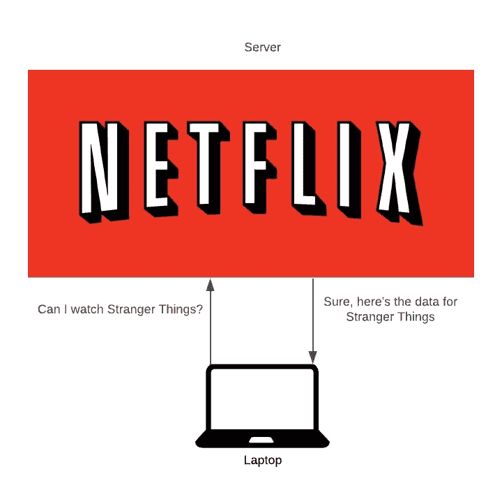
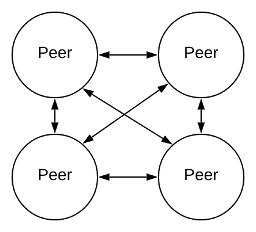
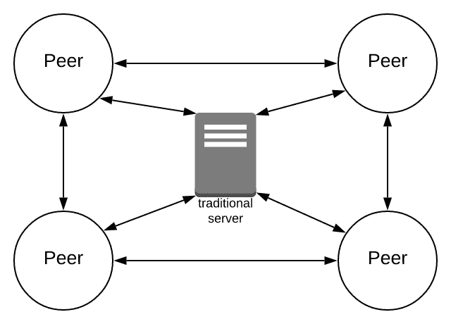
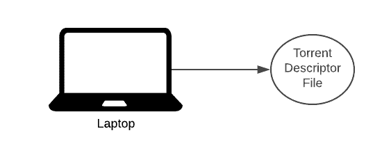
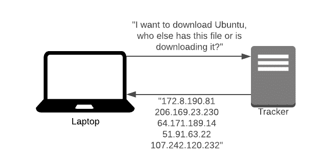
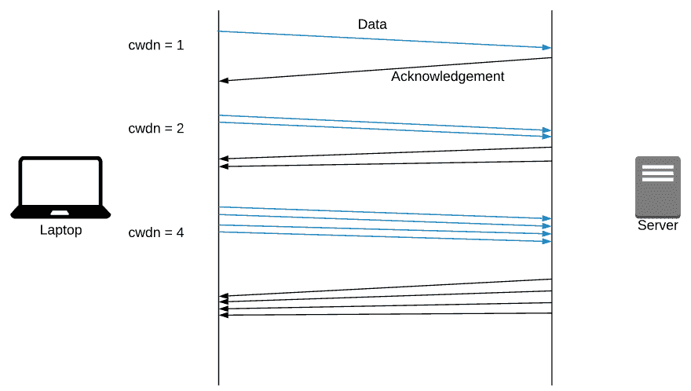
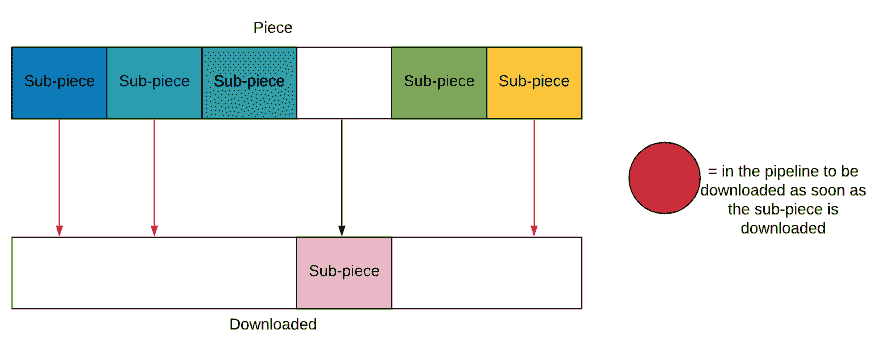
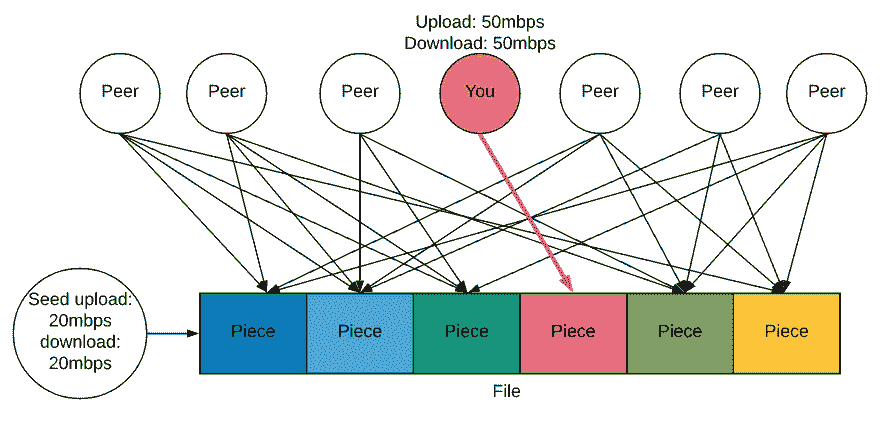
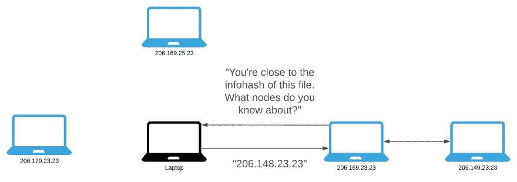
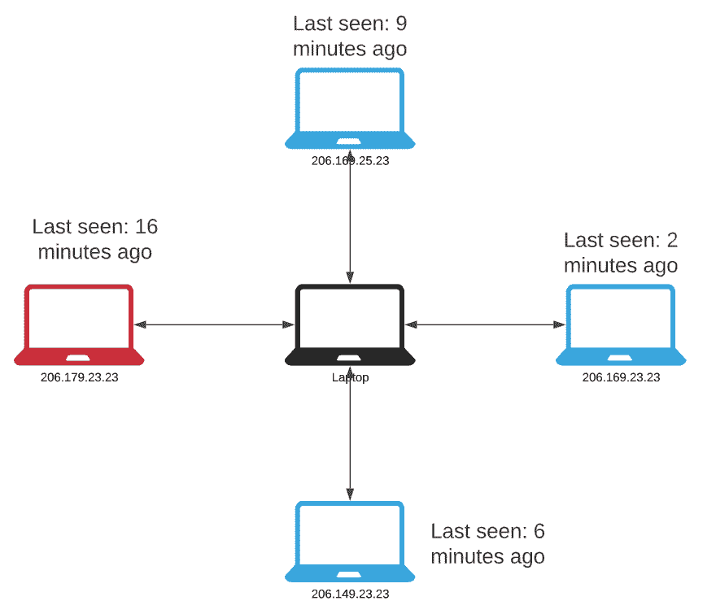

# BitTorrent 是如何工作的？简明英语指南

> 原文：<https://dev.to/brandonskerritt/how-does-bittorrent-work-a-plain-english-guide-16a2>

不要谈论在 BitTorrent 上下载东西。或者最好的客户。

只是深入探讨一下它的技术层面。

任何人都可以阅读这篇文章。阅读这篇文章不需要任何网络或 BitTorrent 知识。

BitTorrent 是传输大文件最常用的协议之一。2013 年 2 月，BitTorrent 负责全球 3.35%的带宽，超过 6%的总带宽用于文件共享。

让我们开始吧。

[](https://b.ck.page)

# 目录

1.  💭谁创造了 BitTorrent？
2.  🥊BitTorrent 与客户端服务器下载
3.  📑高级概述
4.  📁Torrent 描述符文件中有什么呢？
5.  bittorrent 的选片算法
6.  🌆什么是子棋子和棋子选择算法？
7.  🌱以牙还牙的资源分配
8.  🎐窒息算法
9.  😎乐观不乐观
10.  🤕防翘起
11.  🤔如果我们只上传呢？
12.  🐝什么是追踪器？
13.  🧲磁铁链接-无轨道激流
14.  🐍分布式哈希表
15.  📌路由选择表
16.  🤺对 BitTorrent 的攻击

# 💭谁创造了 BitTorrent？

[](https://res.cloudinary.com/practicaldev/image/fetch/s--N2WD_uzm--/c_limit%2Cf_auto%2Cfl_progressive%2Cq_auto%2Cw_880/https://skerritt.blog/conteimg/2019/08/undraw_Creation_process_ukbh.svg)

布拉姆·科恩在 2001 年发明了 BitTorrent 协议。Cohen 用 Python 编写了第一个客户端实现。

科恩在 2002 年夏天收集免费色情资料，引诱 beta 测试者使用 BitTorrent。

* * *

## 🥊BitTorrent 与客户端服务器下载

[](https://res.cloudinary.com/practicaldev/image/fetch/s--nxIp5hpq--/c_limit%2Cf_auto%2Cfl_progressive%2Cq_auto%2Cw_880/https://skerritt.blog/conteimg/2019/08/undraw_selecting_1lx3.svg)

在传统下载中，服务器上传文件，客户端下载文件。

[](https://res.cloudinary.com/practicaldev/image/fetch/s--ctz5w-rE--/c_limit%2Cf_auto%2Cfl_progressive%2Cq_auto%2Cw_880/https://skerritt.blog/conteimg/2019/08/ClientServer.png)

对于流行的文件，这不是很有效。

500 个人下载同一个文件会使服务器不堪重负。这种压力会限制上传速度，因此客户端无法快速下载文件。

第二，客户机-服务器要花很多钱。我们支付的金额随着文件的受欢迎程度而增加。

第三，它是集中的。假设系统死亡，文件不再存在-没有人能下载它。

BitTorrent 旨在解决这些问题。

[](https://res.cloudinary.com/practicaldev/image/fetch/s--RRklQxG_--/c_limit%2Cf_auto%2Cfl_progressive%2Cq_auto%2Cw_880/https://skerritt.blog/conteimg/2019/08/image-5.png)

在对等网络中，每个对等点都与网络中的其他对等点相连。

[](https://res.cloudinary.com/practicaldev/image/fetch/s--IlXaWPLI--/c_limit%2Cf_auto%2Cfl_progressive%2Cq_auto%2Cw_880/https://skerritt.blog/conteimg/2019/08/Peer-to-peer-network.svg)

*半集中式对等网络*拥有一个或多个比大多数对等体权限更高的对等体。

[](https://res.cloudinary.com/practicaldev/image/fetch/s--af4Z9H5y--/c_limit%2Cf_auto%2Cfl_progressive%2Cq_auto%2Cw_880/https://skerritt.blog/conteimg/2019/08/Peer-to-peer-network-centralised.svg)

* * *

# 📑高级概述

[](https://res.cloudinary.com/practicaldev/image/fetch/s--fMhkE2ea--/c_limit%2Cf_auto%2Cfl_progressive%2Cq_auto%2Cw_880/https://skerritt.blog/conteimg/2019/08/undraw_features_overview_jg7a.svg)

BitTorrent 是一种共享文件的方式。它通常用于大文件。BitTorrent 是共享文件的单一来源(如服务器)的替代方案。BitTorrent 可以在较低的带宽上高效工作。

BitTorrent 客户端的第一个版本没有搜索引擎和对等交换，想要上传文件的用户必须创建一个小的 *Torrent 描述符文件*，他们将上传到 torrent 索引站点。

当用户想要共享文件时，他们播种他们的文件。这个用户被称为*播种者*。他们将 torrent 描述符文件上传到一个 exchange(我们稍后将讨论这个)。任何想下载那个文件的人都会下载这个种子描述符。

[](https://res.cloudinary.com/practicaldev/image/fetch/s--wcZ3Kx7u--/c_limit%2Cf_auto%2Cfl_progressive%2Cq_auto%2Cw_880/https://skerritt.blog/conteimg/2019/08/ClientServer-1.png)

我们把下载*的人叫做同行*。他们的种子客户端将连接到一个追踪器(稍后讨论),追踪器将向他们发送群中其他种子和对等体的 IP 地址列表。*群*是所有与某个洪流相关的 PC。

torrent 描述符文件包含我们正在下载的文件的跟踪器和元数据列表。

[](https://res.cloudinary.com/practicaldev/image/fetch/s--6BXYY5Jq--/c_limit%2Cf_auto%2Cfl_progressive%2Cq_auto%2Cw_880/https://skerritt.blog/conteimg/2019/08/ClientServer--2-.png)

对等体将连接到种子并下载文件的部分内容。

[](https://res.cloudinary.com/practicaldev/image/fetch/s--gwW4ytl8--/c_limit%2Cf_auto%2Cfl_progressive%2Cq_auto%2Cw_880/https://skerritt.blog/conteimg/2019/08/peer-to-peer-bit-torrent.png)

一旦对等体完成下载，它们就可以充当种子。虽然，它可以在下载的同时充当种子(这很常见)。

一旦种子将文件共享给对等体，该对等体将充当种子。在 BitTorrent 中，多个人可以上传同一个文件，而不是只有一个服务器上传文件的客户端-服务器模型。

BitTorrent 将文件分割成称为片段的块，每个都有一定的大小。有时候是 256KB，有时候是 1MB。当每个对等点收到一块时，它们就成为其他对等点的那块的种子。

使用 BitTorrent，我们没有单一的下载来源。我们可以从你的祖国下载一些，然后从一个遥远的国家下载一些你的祖国不拥有的。

协议[对片段进行散列](https://skerritt.blog/hash-functions/)以确保没有种子篡改原始文件。然后将散列存储在跟踪器上的种子描述符中。

这就是 BitTorrent 在很高层次上的工作方式。我们现在将详细说明。我们旨在回答这些问题:

*   一个同行只下载不上传怎么办？
*   我们从谁那里下载，或者上传给谁？
*   什么是磁铁链接？
*   什么是种子描述符？
*   使用什么散列算法？
*   BitTorrent 如何选择下载哪些作品？

还有更多。

* * *

## 📁Torrent 描述符文件中有什么呢？

[](https://res.cloudinary.com/practicaldev/image/fetch/s--0-5p57Bv--/c_limit%2Cf_auto%2Cfl_progressive%2Cq_auto%2Cw_880/https://skerritt.blog/conteimg/2019/08/undraw_file_manager_j85s.svg)

这是一个字典(或散列表)文件。

该文件被描述为:

*   **宣布**

跟踪器的 URL。还记得之前我们联系 tracker 服务器来寻找使用相同文件的其他对等点吗？我们通过使用 torrent 描述符文件中的 announce 键找到了那个跟踪器。

*   **信息**

这映射到一个字典，它的键取决于是否共享一个或多个文件。关键是:

**文件(info 的子文件，是一个列表)**

文件仅在共享多个文件时存在。文件是字典的列表。每个字典对应一个文件。这些字典中的每一个都有 2 个键。

**Length -** 文件的大小，以字节为单位。

**Path**——子目录名称对应的字符串列表，最后一个是实际的文件名。

*   **长度**

文件的大小，以字节为单位(仅当共享一个文件时)

*   **名称**

建议的文件名。或者建议的目录名。

*   **件长**

每部分的字节数。

该片段的长度必须是 2 的幂，并且至少为 16KiB。

这是$ $ 2<sup>8</sup>\；KiB = 256 \；KiB = 262144 \；乙$$

*   **件**

哈希列表。

对各种数据块计算的散列列表。我们把数据分成小块。计算这些片段的哈希值，将它们存储在一个列表中。

BitTorrent 使用 SHA-1，返回 160 位的哈希。Pieces 将是一个长度为 20 字节倍数的字符串。

如果 torrent 包含多个文件，片段是通过按照文件在文件目录中出现的顺序连接文件而形成的。

洪流中的所有作品都是完整的作品长度，除了最后一个作品可能会短一些。

现在，我能猜到你在想什么。

> “SHA-1？这是什么？21 世纪初？”

我同意。BitTorrent 正在从 SHA-1 转移到 SHA256。

还在迷茫？不要担心！我设计了这个 JSON 文件，它描述了 torrent 文件的样子。注意:我连接了一些东西。这使得阅读和理解总体布局更加容易。我按照 BitTorrent 的 Torrent 描述符的规则编造了这些数字。

```
{
    "Announce": "url of tracker",
    "Info": {
        "Files": [
            {
                "Length": 16,
                "path": "/folder/to/path"
            },
            {
                "length": 193,
                "path": "/another/folder"
            }
        ]
    },
    "length": 192,
    "name":" Ubuntu.iso",
    "Pieces length": 262144,
    "Pieces": [AAF4C61DDCC5E8A2DABEDE0F3B482CD9AEA9434D, CFEA2496442C091FDDD1BA215D62A69EC34E94D0]
} 
```

* * *

# 🧀BitTorrent 的选片算法

[](https://res.cloudinary.com/practicaldev/image/fetch/s--W-Vp4fql--/c_limit%2Cf_auto%2Cfl_progressive%2Cq_auto%2Cw_880/https://skerritt.blog/conteimg/2019/08/undraw_selecting_1lx3-1.svg)

BitTorrent 中最大的问题之一是“我应该选择下载哪些作品？”

在传统的客户机-服务器模型中，我们下载整个文件。但是现在，我们可以选择下载什么。

这个想法是下载别人没有的作品——稀有的作品。通过下载稀有的作品，我们通过上传让它们变得不那么稀有。

## 🌆什么是子棋子和棋子选择算法？

BitTorrent 使用 TCP，这是一种数据包传输协议。TCP 有一种机制叫做 *[慢启动](https://www.isi.edu/nsnam/DIRECTED_RESEARCH/DR_HYUNAH/D-Research/slow-start-tcp.html)* 。

慢启动是一种平衡 TCP 网络连接速度的机制。它增加传输的数据量，直到找到网络的最大承载能力。`cwdn`代表拥塞窗口。

<figure>[](https://res.cloudinary.com/practicaldev/image/fetch/s--Y4aOuWJz--/c_limit%2Cf_auto%2Cfl_progressive%2Cq_auto%2Cw_880/https://skerritt.blog/conteimg/2019/08/tcp_slow_start-3.svg) 

<figcaption>TCP 慢启动</figcaption>

</figure>

TCP 这样做是因为如果我们一次发送 16 个连接，服务器可能不适应流量，网络会发生拥塞。

如果我们没有定期发送数据，TCP 可能会以低于正常的速度限制我们的网络连接。

BitTorrent 通过将片段分解成更多的子片段来确保总是发送数据。

每个子片段的大小约为 16KB。一块的大小是不固定的，但它是 1MB 左右。

协议总是有一定数量(五个)的子片段管线请求。当下载新的子片段时，客户端发送新的请求。这有助于加快速度。

[](https://res.cloudinary.com/practicaldev/image/fetch/s--IZXm7XQ8--/c_limit%2Cf_auto%2Cfl_progressive%2Cq_auto%2Cw_880/https://skerritt.blog/conteimg/2019/08/pipeline-bit-torrent-3.svg)

子片段可以从其他对等体下载。

两个核心策略控制着片选择算法。

### 1️⃣政策严厉

一旦 BitTorrent 客户端请求片段的子片段，该片段的任何剩余子片段将在其他片段的任何子片段之前被请求。

[](https://res.cloudinary.com/practicaldev/image/fetch/s--o-IkBXYg--/c_limit%2Cf_auto%2Cfl_progressive%2Cq_auto%2Cw_880/https://skerritt.blog/conteimg/2019/08/piece-selection-policy-1.svg)

在这个图像中，首先下载这个片段的所有子片段而不是开始下载另一个片段是有意义的。

### 2️⃣最稀有的第一名

BitTorrent 的主要政策是先挑选最稀有的。我们想下载最少别人拥有的作品。

这是为了让它变得“不稀罕”。如果只有一个对等体拥有一个文件，并且他们离线，那么没有人会得到完整的文件。

这项政策有很多好处。

**培育种子**

Rarest first 确保我们只从 seed 下载新作品。

种子将成为瓶颈。拿着文件的那个人。

下载者可以看到他们的对等体拥有哪些片段，最罕见的第一个策略将导致我们从种子中获取其他对等体尚未上传的片段。

让我们想象一下。

<figure>[](https://res.cloudinary.com/practicaldev/image/fetch/s--ulX2CCn4--/c_limit%2Cf_auto%2Cfl_progressive%2Cq_auto%2Cw_880/https://skerritt.blog/conteimg/2019/08/rarest_first--1--1.svg) 

<figcaption>每一个对等体都与每一个其他对等体相连。不展示，因为它很乱。</figcaption>

</figure>

节点(对等体)列表是相互连接的。我不能画这个，因为这个图不好。

每个箭头指向该对等体下载的子片段。我们下载了一个除了种子之外没有人拥有的子片段。这意味着这个子块是稀有的。

我们的上传率比种子高，所以所有的同行都会想从我们这里下载。此外，他们会想先下载最稀有的作品，因为我们是最稀有作品的两个持有者之一。

当每个人都从我们这里下载时，我们可以从他们那里下载得更快。这就是针锋相对的算法(后面讨论)。

**提高下载速度**

持有该文件的对等体越多，下载速度就越快。这是因为我们可以从其他对等点下载子块。

**启用上传**

稀有作品是其他同行最想要的，得到稀有作品意味着同行会有兴趣从我们这里上传。正如我们将在后面看到的，我们上传的越多，我们可以下载的就越多。

**最常见的最后一个**

明智的做法是将最常见的部分放在下载的最后。由于很多同行持有的都是普通件，所以能够下载到的概率要比稀有件大很多。

**防止最稀有的零件丢失**

当种子死亡时，文件的所有不同部分应该分布在剩余的对等体中的某个地方。

### 3️⃣随机首张

一旦我们下载了，我们就没有什么可上传的了。我们需要第一件，尽快。最罕见的第一项政策是缓慢。稀有片段下载速度较慢，因为我们只能从少数几个对等端下载它的子片段。

### 4️⃣残局模式

有时一个传输速率慢的对等体会尝试给我们一个子块。导致下载延迟。为了防止这一点，有“残局模式”。

还记得管道内衬原理吗？总是有几个子片段的请求等待处理。

<figure>[](https://res.cloudinary.com/practicaldev/image/fetch/s--whiON0x5--/c_limit%2Cf_auto%2Cfl_progressive%2Cq_auto%2Cw_880/https://skerritt.blog/conteimg/2019/08/Peer-to-peer-network--1-.svg) 

<figcaption>假设我们正在从 2 个对等体下载，并且有 1 个其他对等体没有下载。</figcaption>

</figure>

当一个对等体缺少的所有子片段都被请求时，它们向所有对等体广播该请求。这有助于我们获得文件的最后一部分。

[](https://res.cloudinary.com/practicaldev/image/fetch/s--RVYatXn_--/c_limit%2Cf_auto%2Cfl_progressive%2Cq_auto%2Cw_880/https://skerritt.blog/conteimg/2019/08/Peer-to-peer-network--4-.svg)

如果一个对等体有丢失的子块，他们将把它发送回我们的计算机。

一旦一个子片段到达，我们发送一个取消消息，告诉其他对等体忽略我们的请求。

[](https://res.cloudinary.com/practicaldev/image/fetch/s--W4YaSy4P--/c_limit%2Cf_auto%2Cfl_progressive%2Cq_auto%2Cw_880/https://skerritt.blog/conteimg/2019/08/Peer-to-peer-network--5-.svg)

* * *

# 🌱以牙还牙的资源分配

[](https://res.cloudinary.com/practicaldev/image/fetch/s--Fbd359hY--/c_limit%2Cf_auto%2Cfl_progressive%2Cq_auto%2Cw_880/https://skerritt.blog/conteimg/2019/08/undraw_Gardening_eaf3-1.svg)

BitTorrent 中不存在集中的资源分配。取而代之的是，每个对等点最大化他们的下载速率。

一个对等点将从他们能下载的任何人那里下载。为了决定上传给谁，他们将使用[“针锋相对”](https://en.wikipedia.org/wiki/Tit_for_tat)算法的变体。

针锋相对的策略来自博弈论。本质是:

> “以其人之道还治其人之身”

1.  第一步，合作
2.  在接下来的每一步中，做你的对手前一步所做的事情
3.  在实施了一次报复行为后，要准备好原谅

## 🎐窒息算法

[](https://res.cloudinary.com/practicaldev/image/fetch/s--B7M97wg6--/c_limit%2Cf_auto%2Cfl_progressive%2Cq_auto%2Cw_880/https://skerritt.blog/conteimg/2019/08/undraw_hang_out_h9ud.svg)

窒息是暂时拒绝上传到另一个对等体，但我们仍然可以从他们那里下载。

合作的对等体上传，不合作的对等体“阻塞”与对等体的连接。原则是上传给已经上传给我们的同行。

[](https://res.cloudinary.com/practicaldev/image/fetch/s--hCjhA9N6--/c_limit%2Cf_auto%2Cfl_progressive%2Cq_auto%2Cw_880/https://skerritt.blog/conteimg/2019/08/cooperate-vs-no-cooperation.svg)

我们希望同时有几个双向连接，并实现*帕累托效率*。

> 我们认为，如果没有其他的分配，其中一些人过得更好，没有人过得更差，那么这种分配就是帕累托有效的。

因此，最大的问题是，如何确定哪些同伴应该窒息，哪些不应该窒息？

一个对等体总是解除固定数量的对等体的阻塞(缺省值为 4)。

当前的下载速率决定了哪些对等体不被阻塞。我们使用 20 秒平均值来决定这一点。因为使用 TCP(慢启动)快速阻塞和不阻塞是不好的。因此，每 10 秒计算一次。

如果我们的上传率很高，更多的同行将允许我们从他们那里下载。这意味着如果我们是一个好的上传者，我们可以获得更高的下载率。这是 BitTorrent 协议最重要的特性。

该协议禁止许多只下载不上传的“免费搭车者”。

对于一个高效的对等网络，所有的对等体都需要对网络做出贡献。

* * *

# 😎乐观不乐观

[](https://res.cloudinary.com/practicaldev/image/fetch/s--T53PTicD--/c_limit%2Cf_auto%2Cfl_progressive%2Cq_auto%2Cw_880/https://skerritt.blog/conteimg/2019/08/undraw_happy_feeling_slmw.svg)

BitTorrent 还允许一个额外的非拥塞对等点，其中不使用下载速率标准。

我们称之为乐观不乐观。检查未使用的连接并不比正在使用的好。

我们每 30 秒改变一次乐观的不快乐。有足够的时间让上传达到全速。上传也一样。如果这个新的连接比一个现有的非拥塞连接更好，它将取代它。

乐观的非 choke 是随机选择的。

这也允许不上传只下载的对等体下载文件，即使他们拒绝合作。尽管如此，它们的下载速度会慢很多。

* * *

# 🤕防翘起

[](https://res.cloudinary.com/practicaldev/image/fetch/s--APHLFFPk--/c_limit%2Cf_auto%2Cfl_progressive%2Cq_auto%2Cw_880/https://skerritt.blog/conteimg/2019/08/undraw_Group_chat_unwm.svg)

如果所有上传到另一个对等体的对等体决定阻止它，会发生什么？然后，我们必须寻找新的对等点，但是乐观的非阻塞机制每 30 秒只检查一个未使用的连接。为了帮助下载率恢复更多，BitTorrent 已经冷落。

如果一个客户端在 60 秒内没有从一个特定的对等点收到任何东西，它将认为它已经被“冷落”了。

遵循一报还一报的心态，我们进行报复，拒绝上传给那个同行(除非他们成为一个乐观的非调皮鬼)。

然后，对等体将增加乐观未阻塞的数量，以便更快地找到新的连接。

* * *

## 🤔如果我们只上传呢？

[](https://res.cloudinary.com/practicaldev/image/fetch/s--JManlgRs--/c_limit%2Cf_auto%2Cfl_progressive%2Cq_auto%2Cw_880/https://skerritt.blog/conteimg/2019/08/undraw_trends_a5mf.svg)

我们看到，使用 BitTorrent 中实现的 choking 算法，我们更喜欢对我们友好的同行。如果我能从他们那里快速下载，我们允许他们从我这里快速上传。

不下载怎么办？那么使用这种阻塞算法就不可能知道哪些对等体要解除阻塞。当下载完成时，我们使用一种新的阻塞算法。

这种新的阻塞算法解除了具有最高上传速率的对等点的阻塞。这确保了片段上传得更快，复制得更快。

具有良好上传速率的对等体也没有被其他人服务。

* * *

# 🐝什么是追踪器？

[](https://res.cloudinary.com/practicaldev/image/fetch/s---eVm3R7R--/c_limit%2Cf_auto%2Cfl_progressive%2Cq_auto%2Cw_880/https://skerritt.blog/conteimg/2019/08/undraw_privacy_protection_nlwy.svg)

跟踪器是一种特殊类型的服务器，有助于对等体之间的通信。

用 BitTorrent 交流很重要。我们如何得知其他同伴的存在？

追踪者知道谁拥有文件，有多少。

一旦对等下载开始，通信可以在没有跟踪器的情况下继续。

自从为无追踪器种子创建分布式哈希表方法以来，BitTorrent 追踪器在很大程度上是多余的。

### 🗼公共追踪器

这些是任何人都可以使用的追踪器。

[海盗湾曾运营过最受欢迎的公共追踪器之一，直到 2009 年将其禁用](https://arstechnica.com/tech-policy/2009/11/pirate-bay-kills-its-own-bittorrent-tracker/)，仅选择磁铁链接(稍后讨论)。

### T2】🔐私人追踪器

私人追踪器是私人的。他们通过要求用户注册网站来限制使用。控制注册的方法通常是邀请系统。要使用这个追踪器，我们需要一个邀请。

### T2】🔢多跟踪器种子

多追踪器种子在一个种子文件中包含多个追踪器。这提供了冗余，如果一个追踪器失败，其他追踪器可以继续为洪流维持群体。

在这种配置下，一个种子可能会有多个不相连的群——这是不好的。一些用户可以连接到一个特定的跟踪器，而无法连接到另一个。这会创建一个不相交的集合，这会妨碍 torrent 传输它所描述的文件的效率。

* * *

## 🧲磁环-无轨道激流

[](https://res.cloudinary.com/practicaldev/image/fetch/s--tT4oDe05--/c_limit%2Cf_auto%2Cfl_progressive%2Cq_auto%2Cw_880/https://skerritt.blog/conteimg/2019/08/undraw_plans_y8ru.svg)

前面讲过海盗湾是如何摆脱追踪器，开始使用无追踪器的 torrents 的。

当我们下载一个种子时，我们得到一个种子的散列。要在没有跟踪器的情况下下载种子，我们需要找到其他也在下载种子的对等体。为此，我们需要使用一个*分布式哈希表*。

让我们探索分布式哈希表。

# 🐍分布式哈希表

[](https://res.cloudinary.com/practicaldev/image/fetch/s--i08mZ8k5--/c_limit%2Cf_auto%2Cfl_progressive%2Cq_auto%2Cw_880/https://skerritt.blog/conteimg/2019/08/undraw_special_event_4aj8.svg)

分布式哈希表(DHT)为我们提供了一个类似字典的界面，但是节点分布在整个网络中。DHTs 的诀窍是通过散列密钥来找到存储特定密钥的节点。

实际上，每个对等点都变成了一个迷你追踪器。

每个节点(实现 DHT 协议的客户机/服务器)都有一个唯一的标识符，称为“节点 ID”。我们从与 BitTorrent infohashes 相同的 160 位空间中随机选择节点 id。

[信息哈希](https://stackoverflow.com/questions/28348678/what-exactly-is-the-info-hash-in-a-torrent-file/28601408)是以下内容的阿沙-1 哈希:

1.  项目:长度(大小)和路径(带文件名的路径)
2.  名称:要搜索的名称
3.  单件长度:单件的长度(尺寸)
4.  碎片:SHA-1 散列这洪流的每一个碎片
5.  Private:限制访问的标志

我们使用距离度量来比较两个节点 ID 或者一个节点 ID 和一个 infohash 的“接近度”。

节点必须有一个路由表，其中包含一些其他节点的联系信息。

在分布式哈希表中，节点相互了解。他们知道许多节点的 id 与他们自己的 id 很接近，但是很少节点的 id 很远。

距离度量是 XOR，并被解释为整数。

$$distance(A，B) = |A \oplus B |$$

值越小越接近。

当一个节点想要为 torrent 寻找对等点时，它们使用距离度量来比较 torrent 的 infohash 和它的路由表中的节点 ID，或者一个节点的 ID 和另一个节点的 ID。

然后，它们联系路由表中最接近 infohash 的节点，并向它们请求下载 torrent 的对等节点的联系信息。

如果被联系的节点知道 torrent 的对等点，它们将在响应中返回对等点联系信息。否则，被联系的节点必须用其路由表中最接近 torrent 的 infohash 的节点的联系信息来响应。

[](https://res.cloudinary.com/practicaldev/image/fetch/s--GxIJ1MdD--/c_limit%2Cf_auto%2Cfl_progressive%2Cq_auto%2Cw_880/https://skerritt.blog/conteimg/2019/08/known_nodes.svg)

原始节点查询离目标 infohash 更近的节点，直到它找不到任何更近的节点。在节点搜索完之后，客户机将自己的对等联系信息插入到 id 最接近种子信息散列的响应节点上。在未来，其他节点可以很容易找到我们。

对等查询的返回值包括一个不透明的值，称为“令牌”对于宣布其控制对等体正在下载 torrent 的节点，它必须在最近的对等体查询中提供从同一被查询节点接收的令牌。

当一个节点试图“宣布”一个种子时，被查询的节点对照查询节点的 IP 地址检查令牌。这是为了防止恶意主机从其他主机注册种子。

查询节点将令牌返回到它们从其接收令牌的同一节点。我们必须在分发代币后的合理时间内接受代币。BitTorrent 实现使用 IP 地址的 SHA-1 散列连接到每五分钟改变一次的秘密上，并且接受 10 分钟以内的令牌。

* * *

# 📌路由选择表

[](https://res.cloudinary.com/practicaldev/image/fetch/s--TPDbbGTu--/c_limit%2Cf_auto%2Cfl_progressive%2Cq_auto%2Cw_880/https://skerritt.blog/conteimg/2019/08/undraw_Map_dark_k9pw.svg)

每个节点都维护一个已知良好节点的路由表。我们在 DHT 中使用路由表起始点进行查询。我们从路由表中返回节点，以响应来自其他节点的查询。

并不是所有我们知道的节点都是相等的。有的“好”，有的不好。许多使用 DHT 的节点可以发送查询和接收响应，但是不能响应来自其他节点的查询。每个节点的路由表必须只包含已知的好节点。

好节点是指在过去 15 分钟内对我们的一个查询做出响应的节点。如果一个节点曾经响应过我们的查询，并且在过去的 15 分钟内向我们发送了一个查询，那么它也是好的。15 分钟不活动后，节点会变得有问题。当节点无法响应一行中的多个查询时，它们就会变坏。我们看到的良好节点优先于状态未知的节点。

[](https://res.cloudinary.com/practicaldev/image/fetch/s--m4NDCHYj--/c_limit%2Cf_auto%2Cfl_progressive%2Cq_auto%2Cw_880/https://skerritt.blog/conteimg/2019/08/known_nodes--1-.svg)

路由表覆盖了从 0 到 2 <sup>160</sup> 的整个节点 ID 空间。我们将路由表细分为“桶”,每个桶覆盖一部分空间。

一个空表有一个桶，其 ID 空间范围为 min=0，max=2 <sup>160</sup> 。

一个空表只有一个存储桶，因此任何节点都必须放入其中。在变得“满”之前，每个存储桶只能容纳 K 个节点，目前是 8 个

当一个桶充满了已知的好节点时，我们可以不添加更多的节点，除非我们的节点 ID 落在桶的范围内。铲斗由两个铲斗代替，每个铲斗装有旧铲斗的一半。旧存储桶中的节点分布在新存储桶中。

对于只有一个桶的新表，我们总是将整个桶分成两个新的桶，覆盖范围为 0..2 个 <sup>159</sup> 和 2 个 <sup>159</sup> ..2 <sup>160</sup> 。

当桶装满好节点时，我们简单地丢弃新节点。当桶中的节点变坏时(如果它们变坏了)，我们用新节点替换它们。

当节点被认为有问题并且在过去 15 分钟内没有被发现时，会对最近最少看到的节点执行 ping 操作。节点要么响应，要么不响应。响应意味着我们移动到下一个节点。我们这样做，直到找到一个没有响应的节点。如果我们找不到，那么这个桶就被认为是好的。

当我们找到一个节点时，我们会在丢弃该节点并用新的好节点替换它们之前再尝试一次。

每个桶都应该维护一个“最后更改”属性，以显示内容有多“新鲜”。

当对存储桶中的某个节点执行 ping 操作并做出响应，或者将某个节点添加到存储桶中，或者用另一个节点替换某个节点时，会更新存储桶的 last changed 属性。

如果上次更改的属性在过去 15 分钟内没有更新，将刷新存储桶。

* * *

# 🤺对 BitTorrent 的攻击

[](https://res.cloudinary.com/practicaldev/image/fetch/s--9dTYDuZk--/c_limit%2Cf_auto%2Cfl_progressive%2Cq_auto%2Cw_880/https://skerritt.blog/conteimg/2019/08/undraw_hacker_mind_6y85.svg)

对 BitTorrent 网络的攻击很少存在。一切公开。我们的 IP 地址，我们在下载什么-所有的一切。

为什么攻击开放网络？

为什么要攻击一个完全开放的网络？

Exploit-DB 上只列出了 7 个条目，这是一个针对服务的已知漏洞数据库。而且大部分都和特定的客户有关。

对 BitTorrent 网络的主要攻击是阻止盗版。我们到这里还没有谈到盗版，但它通常是 BitTorrent 的同义词。

对 BitTorrent 的主要攻击是 *Torrent 中毒*。

### 激流中毒

这种攻击旨在获取盗版内容的对等体的 IP 地址，或者以某种方式毒害内容。

麦当娜的《美国生活》专辑发行就是一个内容中毒的例子。在发行之前，发行的曲目长度和文件大小相似。歌曲中有一段麦当娜说的话:

> “你他妈的以为你在干什么？”

接着是几分钟的沉默。

以下是一些毒化洪流的方法。

### **指数中毒**

该索引允许用户定位具有所需内容的对等体的 IP 地址。这种攻击方法使得搜索对等点变得困难。

攻击者在索引中插入大量无效信息，阻止用户找到正确的信息。

这个想法是通过让对等点尝试从一个无效的对等点下载片段来减缓下载。

### 诱饵插入

他们将文件的损坏版本插入网络。

想象一下，一个文件有 500 个副本，其中只有 2 个是真正的文件，这阻止了盗版者找到真正的文件。

大多数有种子列表的网站都有投票系统。这阻止了这种攻击，因为搜索的顶部充满了未损坏的文件

然而，大多数网站的种子列表投票

这阻止了这种攻击，因为搜索的顶部充满了未损坏的文件。

在 GameDevTycoon 中，文件在最初上传到盗版网站之前就已经发布了。盗版者不知道的是，文件已经损坏。在盗版中赢得比赛是不可能的。其他一切都很完美。

### 🧙🏼‍♂️防御黑暗 Bittorrent 攻击

大多数受欢迎的种子是由多年来建立了良好关系的个人或团体发行的。在私人追踪器上，可以指向个人。有毒的种子很快就会被贴上标签，海报也会被禁止。

或者，在公共追踪器上，下载可信团体制作的种子是更好的选择。说到底，你更喜欢下载 Ubuntu 团队的 Ubuntu，还是用户 XXX-黑客-精英-幽灵-协议-xxx？

在公共追踪器上，如果一个种子中毒了，它会被报告并移除。

防御 BitTorrent 攻击的最简单方法是使用与您无关的 IP 地址。无论是通过 VPN 还是其他服务。

# 👋🏻结论

以下是我们学到的东西:

*   什么是种子描述符文件
*   BitTorrent 如何选择对等点
*   BitTorrent 如何选择片段
*   针锋相对的算法
*   追踪者
*   对 BitTorrent 网络的攻击

以下是您可以选择做的一些事情:

*   [构建自己的 BitTorrent 客户端](https://allenkim67.github.io/programming/2016/05/04/how-to-make-your-own-bittorrent-client.html)
*   [探索 BitTorrent 的提议(BEP)以了解更多关于它如何工作，以及算法的下一步是什么](https://www.bittorrent.org/beps/bep_0000.html)
*   [阅读官方 BitTorrent 规范](https://www.bittorrent.org/beps/bep_0003.html)

[](https://b.ck.page)