# 将 JHipster 布局与定制 UI 实现分离开来

> 原文：<https://dev.to/antonioortizpola/separating-the-jhipster-layout-from-a-custom-ui-implementation-55i8>

# 一些背景

这是我的系列文章“我在 Jhipster 中并排使用 Vue 和自定义 UI 布局的方法”的第一部分，第二部分即将开始！

## 为什么是 JHipster？

我喜欢 JHipster，我已经用它做了一些玩具项目。学习一些前端技术是很有用的，因为我是一名后端开发人员，我想更新我的前端趋势 Javascript 库和框架的知识。

本文从用 JHipster 6.2 生成一个简单的 monolith 应用程序出发，如果你不知道如何安装或生成一个简单的 JHipster 应用程序，我真的建议你访问他们的文档，了解如何[安装](https://www.jhipster.tech/installation/)或如何[生成一个简单的应用程序](https://www.jhipster.tech/creating-an-app/)。

## 为什么要看？

### 做出反应的企图

我开始使用 React，集成了 [Inspinia 布局](http://webapplayers.com/inspinia_admin-v2.9.2/)，并且喜欢学习曲线创建新组件并使它们交互的简易性(我甚至做出了我的第一个非常简单的[贡献](https://github.com/jhipster/generator-jhipster/pull/8389)，但是有些东西有点难以理解，比如减速器(我知道，也许一些基础教程会有所帮助，但是我真的想学习如何做)。也许是因为我缺乏对 Javascript 的实践(有一段时间我主要是用 C#和 Java 编程)。

[](https://res.cloudinary.com/practicaldev/image/fetch/s--RET7l3zk--/c_limit%2Cf_auto%2Cfl_progressive%2Cq_auto%2Cw_880/https://thepracticaldev.s3.amazonaws.com/i/lbwnzln2ibrt3rmsciep.jpeg)

### 棱角分明的企图

然后我看了安东尼奥·冈萨尔维斯和他并排谈论的 JHipster，这正是我所需要的，我遇到了他遇到的许多相同的问题，所以我改变了布局和框架，并尝试了 Angular 和 T2 AppWorks。

我意识到我真的很喜欢 Angular、依赖注入、类，就像 Net Core 或 Spring 一样，一切都很美好(或者最美好的，我在前端和分发、用户体验等方面不太好)。

我真的很想写一篇关于我的经历的帖子，但是我有太多的工作要做(这是我的爱好项目)，然后我看了 David Steiman 的视频，他并排更详细地谈论了[和](https://www.youtube.com/watch?v=Gg5CYoBdpVo)，我很高兴地感到惊讶，因为许多技巧或做事的方式似乎与我做事情的方式非常相似，所以如果你正在尝试与 JHipster 和 Angular 并排，我真的建议观看这两个视频。

### Vue 尝试

虽然我对 angular 很满意，但我有一个问题，前端缺少一个主要的参与者，蓝图已经准备好了，所以，为什么不尝试一下呢？

我在犹豫，但是:

*   我工作中的前端开发人员都在使用 Vue，所以我可以在有疑问和问题时获得一些额外的帮助。
*   我一直看到很多关于 Vue 的好评论，来自我关注的很多人。
*   我知道你不应该只根据[一些基准](https://github.com/hipster-labs/jhipster-angular-react-vue-comparison)中几毫秒的优势来选择一个框架，但是嘿，至少它可以和 Angular 竞争，并做出反应。
*   做了这么久的程序员，我真的很担心一件事:**开发者体验**，而且，很多人都说 Vue 更有效率，更容易开发，那么，为什么不试试看它是否适合我呢？

## 为什么要使用其他布局？

如果你需要一个简单的应用程序，你可以让布局保持原样，并添加新功能，但是，就像我之前说的，我不是用户界面专家，虽然我可以看到一些东西并认为“哦，这看起来很丑”，但我没有审美能力使它变得漂亮。

当你开始添加 UI 插件时，你需要确保它们看起来统一，bootstrap 会有所帮助，但总是有一些细节，所以，因为这只是我个人的项目，我喜欢后端，但我在设计上可能会有一些问题，为什么不付钱给专家呢？

另一个原因是试图区别于其他人，虽然 JHipster 布局很好，很干净，但总有一种“助推器”的感觉(不，这是不好的，我必须接受这个项目，如果我停止玩基本布局，我会花更少的时间)。

我不得不承认，现在它集成了 [bootswatch](https://bootswatch.com/) ，也许这就更没必要了，但是，嘿，我真的想要我的左边菜单:p。

# 开始工作

**我的第一条规则**是**修改 JHipster 档案**中的最小值，这可能会导致一些重复代码，但以我的经验来看，维护起来要容易得多，特别是当有重大变化的新版本出现时。在我的情况下更是如此，使用外部布局基本上意味着对所有前端的审查(我认为，仍然比从头开始更容易)。

**第二条规则**是**根据 JHipster** 调整布局，而不是相反。第一次它更多的是两者的混合，它失败了，它真的很难维持。所以现在我尽我所能保持 JHipster 的结构，它通常是大多数良好实践的地方，更新更频繁，并且通常比商业布局的演示仪表板更精细。

因此，第一步是使用 [Vue blueprint](https://github.com/jhipster/jhipster-vuejs) 创建一个简单的 JHipster 应用程序，我喜欢在开发和生产中使用 postgresql(相同的环境，相同的行为)，但是您可以按照自己喜欢的方式创建它。

然后运行应用程序，这样你就可以确认一切正常。

[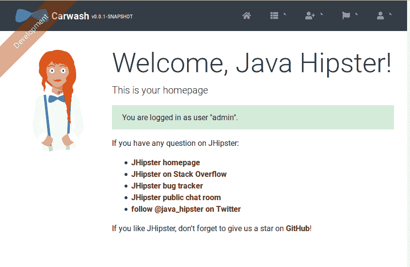](https://res.cloudinary.com/practicaldev/image/fetch/s--3ivXXZqE--/c_limit%2Cf_auto%2Cfl_progressive%2Cq_auto%2Cw_880/https://thepracticaldev.s3.amazonaws.com/i/sw7e1y8kmd6i7hr6vdli.png)

为了运行这个项目，我使用 Intellij 与 3 运行配置:

*   运行后端的默认 spring boot 配置。
*   运行前端的 NPM 配置。
*   启动 postgresql 服务器和其他服务(如 elasticsearch)的 docker 配置。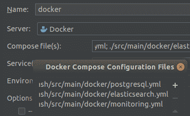

另一方面，我们有 app work demo 应用程序:

[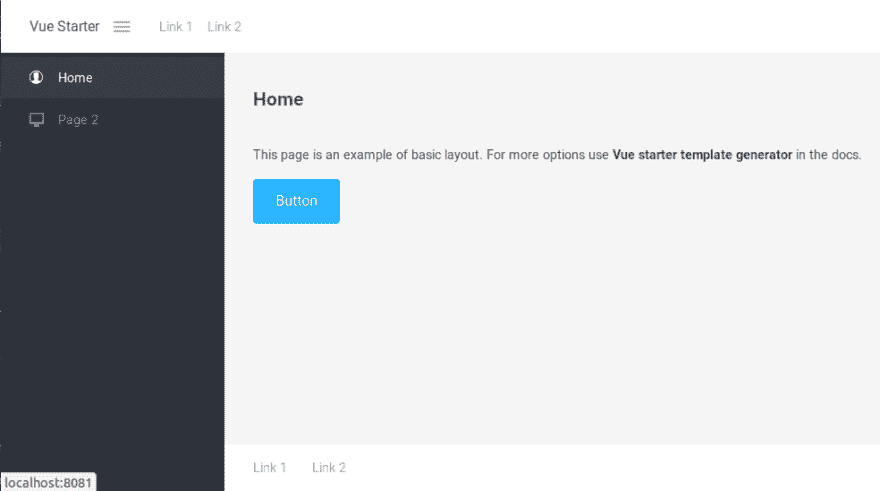](https://res.cloudinary.com/practicaldev/image/fetch/s--rgU3zaqX--/c_limit%2Cf_auto%2Cfl_progressive%2Cq_auto%2Cw_880/https://thepracticaldev.s3.amazonaws.com/i/c4fanpauolofiyo0jrox.png)

我的出发点是 index.html 的档案

[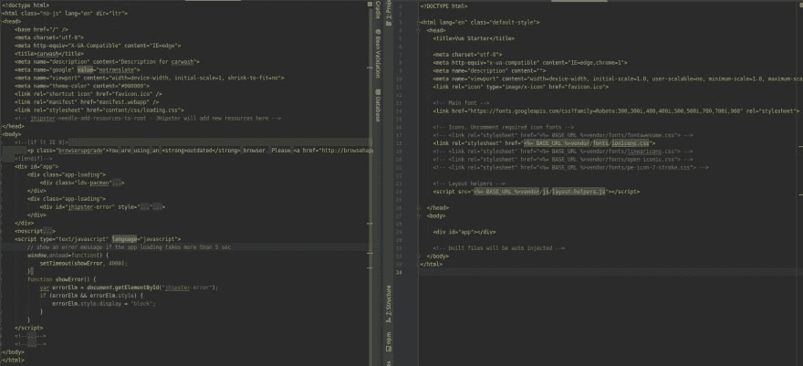](https://res.cloudinary.com/practicaldev/image/fetch/s--u2_ID9JC--/c_limit%2Cf_auto%2Cfl_progressive%2Cq_auto%2Cw_880/https://thepracticaldev.s3.amazonaws.com/i/1mjm1cchpqke89skaa69.png)

如你所见，JHipster 页面比我们的演示页面更复杂，处理的案例更多，appwork 演示页面主要加载一些样式。这里的变化很简单，我只是合并了布局的样式。

[](https://res.cloudinary.com/practicaldev/image/fetch/s--etF2CR3R--/c_limit%2Cf_auto%2Cfl_progressive%2Cq_auto%2Cw_880/https://thepracticaldev.s3.amazonaws.com/i/00mzo6ayevb1uegert5e.png)

如你所见，这里没发生什么，我只是改变了

```
<%= BASE_URL %> 
```

因为在布局中，静态资源在 base 中，但是在 JHipster 中，资源在`content`文件夹中，所以我只是将该文件夹粘贴到一个名为`bjt`(我的私有包)的新文件夹中，这样我就可以标记我的资源在哪里，JHipster 资源在哪里。

[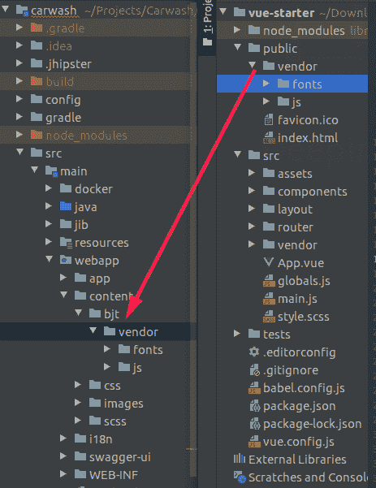](https://res.cloudinary.com/practicaldev/image/fetch/s---5XlK1Jk--/c_limit%2Cf_auto%2Cfl_progressive%2Cq_auto%2Cw_880/https://thepracticaldev.s3.amazonaws.com/i/vjwktqw9swwp5ucaly42.png)

下一个需要修改的要点在`App.vue`文件中，这是应用程序加载的地方。

[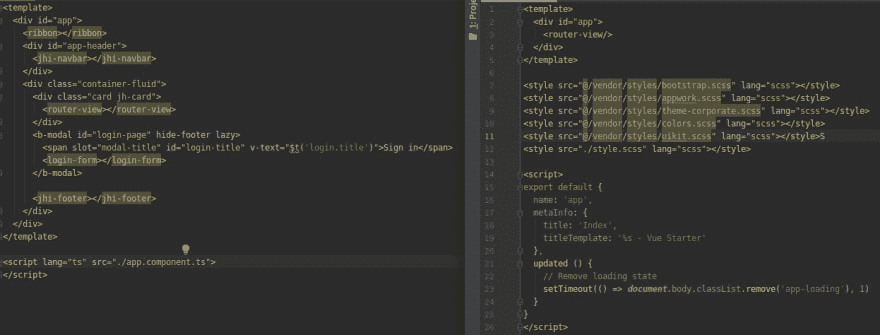](https://res.cloudinary.com/practicaldev/image/fetch/s--y6ZtLBzR--/c_limit%2Cf_auto%2Cfl_progressive%2Cq_auto%2Cw_880/https://thepracticaldev.s3.amazonaws.com/i/4i42j4zv9rn517wmps7t.png)

这里你可以注意到更多的区别，JHipster 应用程序声明了布局，而 Appworks 应用程序只加载了一个简单的组件，所以我们需要调查更多。

[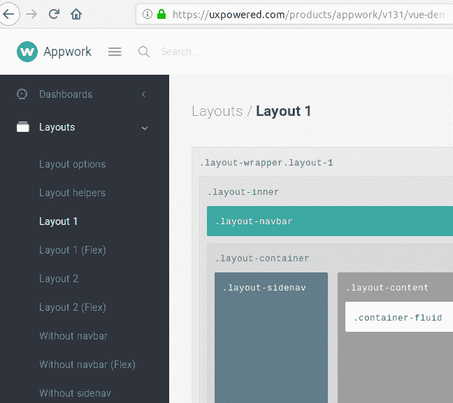](https://res.cloudinary.com/practicaldev/image/fetch/s--JlvFA35U--/c_limit%2Cf_auto%2Cfl_progressive%2Cq_auto%2Cw_880/https://thepracticaldev.s3.amazonaws.com/i/ea3wzyerbld70lggrral.png)

Appworks 包含几个要使用的布局，为了简单起见，我们只使用一个布局，默认的布局，在路由器中我们可以看到演示中显示的布局。

[](https://res.cloudinary.com/practicaldev/image/fetch/s--RiP_SVrj--/c_limit%2Cf_auto%2Cfl_progressive%2Cq_auto%2Cw_880/https://thepracticaldev.s3.amazonaws.com/i/zx40loatioi7bfb2wyko.png)

因此，真正的比较需要在 JHipster `app.vue`和 Appwork `Layout1.vue`文件之间进行，幸运的是现在的结构更加相似:

[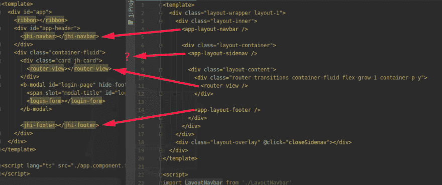](https://res.cloudinary.com/practicaldev/image/fetch/s--4jvAHoNG--/c_limit%2Cf_auto%2Cfl_progressive%2Cq_auto%2Cw_880/https://thepracticaldev.s3.amazonaws.com/i/affpa35moov7tyi9p4oi.png)

现在我们有了一个地方，可以开始用我们的部件替换 JHipster 部件了！

在继续之前，我在`app`中创建了一个名为`bjt`的新文件夹，这也是我的代码开始的地方，至少是大部分。

[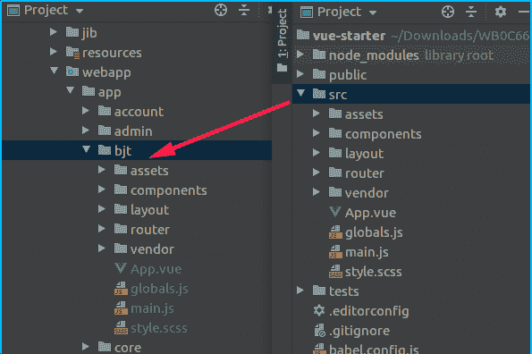](https://res.cloudinary.com/practicaldev/image/fetch/s--VRYDYh-j--/c_limit%2Cf_auto%2Cfl_progressive%2Cq_auto%2Cw_880/https://thepracticaldev.s3.amazonaws.com/i/a3s4lwstjjgo6qoiza4j.png)

然后，我需要改变加载`app.vue`的点，这样我就可以加载我的了，快速搜索文件名就会发现我们在`main.ts`中的宝贵位置:

[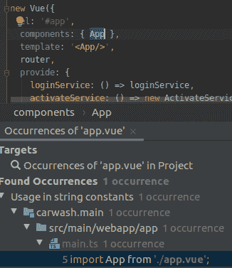](https://res.cloudinary.com/practicaldev/image/fetch/s--erCrTQx2--/c_limit%2Cf_auto%2Cfl_progressive%2Cq_auto%2Cw_880/https://thepracticaldev.s3.amazonaws.com/i/32qo2dzw20jrwnhc0vue.png)

因此，为了开始练习，我将我的`bjt/App.vue`修改为与 JHipster 中的完全相同，并将`app.component`文件复制到我的文件夹中(Appwork 将 Javascript 包含在与视图相同的文件中，但是我更喜欢 JHipster 顺序)，然后我做了一点修改，这样我就可以看到布局是否相应地改变了。

[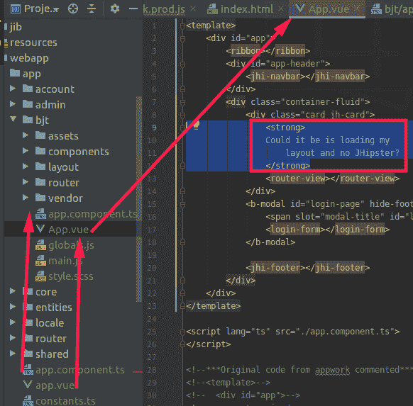](https://res.cloudinary.com/practicaldev/image/fetch/s--AT_TjamO--/c_limit%2Cf_auto%2Cfl_progressive%2Cq_auto%2Cw_880/https://thepracticaldev.s3.amazonaws.com/i/obeamna9mj809b19u1gk.png)

所以，现在真正的测试，我只是运行项目，布局应该出来正常。

[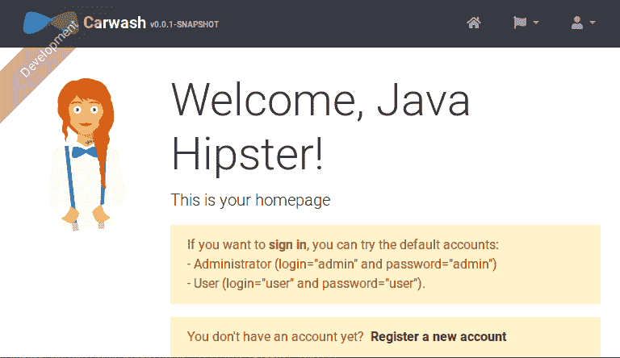](https://res.cloudinary.com/practicaldev/image/fetch/s--WE85kbfu--/c_limit%2Cf_auto%2Cfl_progressive%2Cq_auto%2Cw_880/https://thepracticaldev.s3.amazonaws.com/i/79cc8ohhuyaujkmyn698.png)

但是，如果我们在`main.ts`中修改导入:

[](https://res.cloudinary.com/practicaldev/image/fetch/s--zfoCG5Rs--/c_limit%2Cf_auto%2Cfl_progressive%2Cq_auto%2Cw_880/https://thepracticaldev.s3.amazonaws.com/i/sd2fx9o3ht1qq8ua6xv7.png)

然后就可以看到我们自定义的 App.vue 了！

[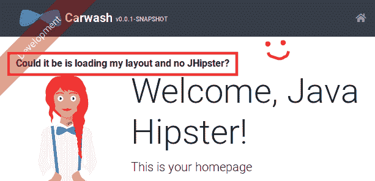](https://res.cloudinary.com/practicaldev/image/fetch/s--a4V9juqt--/c_limit%2Cf_auto%2Cfl_progressive%2Cq_auto%2Cw_880/https://thepracticaldev.s3.amazonaws.com/i/iiaydc9hy1i2ipc0senv.png)

现在我们可以开始更积极地修改代码，不用担心应用程序更新时会破坏 JHipster，您甚至可以通过简单地更改`main.ts`中的导入来返回 JHipster 布局。

在第二部分，我将开始把 Appwork 的组件集成到我的 JHipster 应用程序中，希望你会喜欢！。