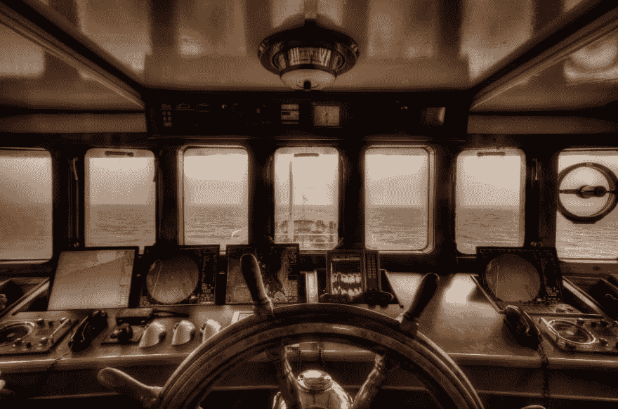

# 头盔 6 分钟简介

> 原文：<https://dev.to/prodopsio/a-6-minute-introduction-to-helm-bc3>

简化 Kubernetes 应用程序管理

[](https://res.cloudinary.com/practicaldev/image/fetch/s--iQID_VAR--/c_limit%2Cf_auto%2Cfl_progressive%2Cq_auto%2Cw_880/https://cdn-images-1.medium.com/max/10870/1%2ANcphW9pL31JRnmnS3HkYjQ.jpeg)*pexels.com 摄*

> 在完成了为期 4 个月的客户项目(包括从“原始”K8S-yaml 文件到 Helm Charts 的完整迁移)后，我发现我需要将我学到的东西写下来，让别人阅读，也让我更好地学习。
> 这篇文章是我的 [8 分钟 Kubernetes](https://dev.to/prodopsio/an-8-minute-introduction-to-kubernetes-1oi) 介绍的弟弟，如果你还不熟悉基本的 K8s 概念，请确保你先阅读它。

### TL；速度三角形定位法(dead reckoning)

您可以在您的 K8S 集群上安装依赖项和专有软件，只需使用简单的:`helm install https://dev.to/prodopsio/an-8-minute-introduction-to-kubernetes-1oi/mysql`，有数百个这样的可用安装，但您也可以使用**您自己的**产品/服务来完成！

* * *

### 什么是掌舵人？

1.  舵手是驾驶船只、帆船、潜水艇、其他类型的海船或宇宙飞船的人— [维基百科](https://en.wikipedia.org/wiki/Helmsman)

2.  “Kubernetes 的包管理器；Helm 是查找、共享和使用为 Kubernetes 构建的软件的最佳方式。”— [Helm.sh](https://helm.sh/)

### 我们为什么需要它？

这个问题我问过自己很多次，试图理解这个神奇的安装程序是如何让我的 Kubernetes 生活变得更好的。Helm 让您能够获取、部署和管理应用程序的生命周期，包括第三方产品和您自己的产品。

不再需要维护描述 pod、副本集、服务、RBAC 设置等的随机 YAML 文件组(或很长的文件)。有了 helm，软件包就有了一个结构和惯例，它定义了一个 YAML 层`templates`和另一个改变模板的层`values`。值被**注入到模板**中，从而允许配置的分离，并定义哪里允许改变。这一整套被称为“**掌舵图**”。

本质上，您创建结构化的应用程序包，其中包含在 Kubernetes 集群上运行所需的一切；包括应用程序需要的**依赖关系**。

* * *

### 舵是 CLI，舵柄是它的后端

实际上，Helm 是一个 CLI 工具，可以与其后端服务器“Tiller”进行交互。Tiller 通常通过发送命令`helm init`来安装，并位于`kube-system`名称空间中(除非另有指示)。它负责部署 Helm 请求的图表。

当一个图表被安装后，Tiller 创建一个“发布”并开始跟踪它的变化。这样，Helm 不仅参与安装，而且还是一个实际的部署工具，使用图表版本及其修订版来管理集群中应用程序的生命周期。

* * *

### 掌舵概念| **海图**

Helm 使用图表打包应用程序部署、运行和扩展所需的所有 K8s 组件。它也是定义依赖关系、更新和维护配置的地方。

按照惯例，一个图表根必须只有一个名为`Chart.yaml`的文件。
它可以选择(默认情况下，如果你使用 helm create)有更多的组件，我会很快详细说明，但首先，这是一个典型的图表结构看起来像什么:

```
 ├── Chart.yaml
    ├── templates
    │   ├── service.yaml
    │   └── replicaset.yaml
    ├── charts
    │   ├── nginx-ingress-1.1.2.tgz
    ├── requirements.lock
    ├── requirements.yaml
    └── values.yaml 
```

<svg width="20px" height="20px" viewBox="0 0 24 24" class="highlight-action crayons-icon highlight-action--fullscreen-on"><title>Enter fullscreen mode</title></svg> <svg width="20px" height="20px" viewBox="0 0 24 24" class="highlight-action crayons-icon highlight-action--fullscreen-off"><title>Exit fullscreen mode</title></svg>

在这个图表中(姑且称之为“web-UI”)，有`Service`和`ReplicaSet`的模板，它们在 helm 安装时将使用列表底部的`values.yaml`文件创建。另外，web-UI 图表需要运行 Nginx，因此 Nginx 在`charts`目录下显示为`subchart`。`requirements.yaml`是描述实际需求的文件，里面列出了 Nginx。锁定文件也是包的一部分，它是在 helm 安装需求时创建的。

一个`Chart.yaml`是包的描述，实际上是包中唯一需要的文件，只有三个需要的条目:`apiVersion`、`name`和`version`。下面是它看起来的一个例子:
(你可以在这里找到图表[中选项和条目的完整列表](https://github.com/helm/helm/blob/master/docs/charts.md)。)

```
 apiVersion: v1
    name: drone
    version: 1.0.0 
```

<svg width="20px" height="20px" viewBox="0 0 24 24" class="highlight-action crayons-icon highlight-action--fullscreen-on"><title>Enter fullscreen mode</title></svg> <svg width="20px" height="20px" viewBox="0 0 24 24" class="highlight-action crayons-icon highlight-action--fullscreen-off"><title>Exit fullscreen mode</title></svg>

#### 模板

模板是图表中的可选子目录。
它们组合 K8s 组件，例如服务、副本集、部署等，转换成 [Go-Template](https://golang.org/pkg/text/template/) 格式，稍后将匹配这些值。
让我们来看一个部分模板的例子:

```
 apiVersion: apps/v1
    kind: DaemonSet
    metadata:
      name: {{ .Values.name }}
      labels:
        app: {{ .Values.name }}
        somelabel: {{ .Values.labels.somelabelkey }} 
```

<svg width="20px" height="20px" viewBox="0 0 24 24" class="highlight-action crayons-icon highlight-action--fullscreen-on"><title>Enter fullscreen mode</title></svg> <svg width="20px" height="20px" viewBox="0 0 24 24" class="highlight-action crayons-icon highlight-action--fullscreen-off"><title>Exit fullscreen mode</title></svg>

#### 值

值在 values.yaml 文件中描述，该文件必须是一个 yaml 结构，用于保存与模板匹配的值。考虑到上面的模板，匹配值文件应该是:

```
 name: web-ui
    labels:
      somelabelkey: somelabelvalue 
```

<svg width="20px" height="20px" viewBox="0 0 24 24" class="highlight-action crayons-icon highlight-action--fullscreen-on"><title>Enter fullscreen mode</title></svg> <svg width="20px" height="20px" viewBox="0 0 24 24" class="highlight-action crayons-icon highlight-action--fullscreen-off"><title>Exit fullscreen mode</title></svg>

#### 子图表

子图表也称为从属关系，是当前图表的必需图表。你可以把它看作是打包应用程序的另一种方式，如果我的后端需要 Redis 缓存来运行，这是设置它的另一种方式。
使用子图表的另一种方式是将其视为一种继承机制，允许获取带有模板的标准图表，并将其用作多个父图表中的子图表，以提供值。

* * *

### 掌舵概念| **知识库**

存储库是保存和维护舵图的地方。本质上，这些是作为代码存储的一组模板和配置值(有时打包成一个`.tar.gz`文件)。
当你掌舵安装 stable/redis 的时候默认掌舵伸手到 GitHub 上的[掌舵/海图回购，在马厩树下搜索。](https://github.com/helm/charts)

访问这个 repo，您还会找到孵化器子目录，在那里您可以获取并安装尚未标记为生产就绪(稳定)的孵化图表。这并不意味着你不能使用它们；尝试在开发集群中引入并使用它们。Helm 社区管理着严格的版本控制指南，即使是最小的变化也会产生新的图表版本。你可以相信，如果远程图表的特定版本以一种方式工作，它永远不会突然中断。

使用不同回购的一个很好的例子是 Elastic 的 ElasticSearch 图表，该图表过去由公司在 Helm/Charts 回购中维护。

Elastic 已经决定将他们的产品转移到他们的 Helm repo，并且要获得最新的官方图表您现在就可以`add`他们的回购到 Helm by:
`helm repo add elastic`【https://helm.elastic.co】
接着是:
`helm install --name elasticsearch elastic/elasticsearch`

* * *

### 掌舵概念| **发布**

可以把发布看作是一种机制，用来跟踪 K8S 集群上安装的应用程序；Helm 安装应用程序时，会创建一个版本。您可以创建一个产品的不同安装，例如 Redis，并在集群中创建和跟踪两个不同的版本。

可以用 helm ls 跟踪版本，每个版本都有一个“修订版”,这是 helm 版本控制术语；如果更新了特定的版本，例如，向 Redis 版本添加更多的内存，则修订将递增。Helm 允许回滚到特定的版本，使其成为部署和生产状态处理程序的实际管理者。

* * *

### TLS

舵柄和舵需要一种沟通的方式。默认情况下，这种连接并不十分安全，这意味着如果其中一个端点受到威胁或可被受威胁的组件访问，流量就可能被读取和分析。除了讨论不保护系统间通信的实际攻击面之外，我们可以使用自动生成的证书轻松创建一个安全的 TLS 连接。为了做到这一点,[这里有一个脚本，它会带你完成整个过程,](https://github.com/prodopsio/gists/blob/master/setup-helm.sh),并且可以在任何地方实现。

* * *

### 贡献

你可能会发现自己(像我一样)在`github.com/helm/charts`下的官方图表中遇到了一个新的能力或特征要求，这很可能是一个 bug(孵化器图表不太可能)。由于 Helm 及其图表都是开源项目，有数百名贡献者，因此它们非常活跃。对所需的图表进行更改，并打开一个包含贡献的 PR，如果所有要求都已制定并得到处理，团队将在几天内批准更改。

虽然这个过程要求很高(我们应该庆幸这一点)，但变化正在被迅速地审核、批准或否决。[阅读有关为项目贡献](https://github.com/helm/charts/blob/master/CONTRIBUTING.md)的更多信息；请注意，如果您只做了小的更改，那么文档的大部分内容都是不相关的，因为它概述了对新图表的要求。

* * *

## 就是这样。

我希望现在你已经理解了 Helm，以及为什么它是一个如此强大的系统。因为这只是一个介绍，去学习和“感受”它，没有围绕着它的紧张工作；部署第三方产品并构建图表。

我叫 Omer，是一名工程师，在 [ProdOps](http://prodops.io) 工作，这是一家全球咨询公司，采用 Devops 文化，以可靠、安全和简单的方式提供软件。请在下面的评论中告诉我你的想法，或者直接在 Twitter [**@** omergsr](https://twitter.com/omergsr) 上与我联系。如果你喜欢拍手，它帮助我集中我未来的写作。