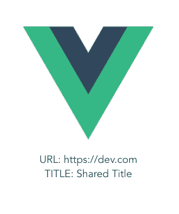
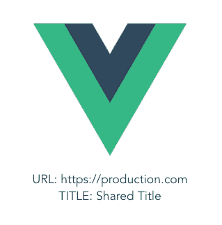

# 如何在 Vue.js 中使用环境变量

> 原文：<https://dev.to/ratracegrad/how-to-use-environment-variables-in-vue-js-4ko7>

大多数应用程序将从 API 访问数据。要访问该 API，您需要一个 API 密钥和访问该 API 的 URL。你不应该把你的 API 密匙推给你的 repo，因为那会让每个人都可以使用它们。解决方案是将 API 键存储在环境变量中。那么，如何在 Vue.js 应用程序中访问环境变量呢？让我告诉你怎么做。

最好的开始方式是使用 Vue-CLI 创建一个项目。如果您使用了这个，那么它会自动设置您的项目，在构建过程中使用 webpack，使您更容易使用环境变量。

## 添加。环境文件

您的环境变量将存储在。环境文件。该文件必须存在于应用程序的根目录中。使用以下命令创建一个`.env`文件:

```
touch .env 
```

<svg width="20px" height="20px" viewBox="0 0 24 24" class="highlight-action crayons-icon highlight-action--fullscreen-on"><title>Enter fullscreen mode</title></svg> <svg width="20px" height="20px" viewBox="0 0 24 24" class="highlight-action crayons-icon highlight-action--fullscreen-off"><title>Exit fullscreen mode</title></svg>

`.env`文件将包含您的环境变量。大多数应用程序都有特定于开发、QA 和生产环境的变量。为此，您可以创建特定于环境的文件。如果您想为开发和生产创建文件，它们的名称应该是:

```
.env.development.local 
.env.production.local 
```

<svg width="20px" height="20px" viewBox="0 0 24 24" class="highlight-action crayons-icon highlight-action--fullscreen-on"><title>Enter fullscreen mode</title></svg> <svg width="20px" height="20px" viewBox="0 0 24 24" class="highlight-action crayons-icon highlight-action--fullscreen-off"><title>Exit fullscreen mode</title></svg>

`.env`文件的内容将在所有环境中可用。`.env.development.local`文件将只在开发中可用。`.env.production.local`文件仅在生产环境中可用。

您可以将在所有环境中都相同的环境变量放在`.env`文件中。然后将特定于环境的变量放在适当的文件中。

**注意:**你不应该包括任何的。repo 中的 env 文件。将您的所有`.env`文件添加到您的`.gitignore`文件中，这样它们就不会被提交到您的 repo 中。

## 向环境文件添加内容

环境变量在 vue 应用程序中可用。我在我的`.env`文件中添加了下面一行。该变量在所有环境中都可用:

```
VUE_APP_TITLE=Shared Title 
```

<svg width="20px" height="20px" viewBox="0 0 24 24" class="highlight-action crayons-icon highlight-action--fullscreen-on"><title>Enter fullscreen mode</title></svg> <svg width="20px" height="20px" viewBox="0 0 24 24" class="highlight-action crayons-icon highlight-action--fullscreen-off"><title>Exit fullscreen mode</title></svg>

在我的`.env.development.local`文件中，我添加了下面一行:

```
VUE_APP_URL=https://dev.com 
```

<svg width="20px" height="20px" viewBox="0 0 24 24" class="highlight-action crayons-icon highlight-action--fullscreen-on"><title>Enter fullscreen mode</title></svg> <svg width="20px" height="20px" viewBox="0 0 24 24" class="highlight-action crayons-icon highlight-action--fullscreen-off"><title>Exit fullscreen mode</title></svg>

在我的`.env.production.local`文件中，我添加了下面一行:

```
VUE_APP_URL=https://production.com 
```

<svg width="20px" height="20px" viewBox="0 0 24 24" class="highlight-action crayons-icon highlight-action--fullscreen-on"><title>Enter fullscreen mode</title></svg> <svg width="20px" height="20px" viewBox="0 0 24 24" class="highlight-action crayons-icon highlight-action--fullscreen-off"><title>Exit fullscreen mode</title></svg>

## 访问环境变量

通过全局`process.env`对象，可以在 Vue 应用程序的任何地方访问环境变量。这里，我在包含标题和 url 的数据对象上添加了两个变量。

```
data() { 
    return { 
        url: process.env.VUE_APP_URL, 
        title: process.env.VUE_APP_TITLE 
    }
} 
```

<svg width="20px" height="20px" viewBox="0 0 24 24" class="highlight-action crayons-icon highlight-action--fullscreen-on"><title>Enter fullscreen mode</title></svg> <svg width="20px" height="20px" viewBox="0 0 24 24" class="highlight-action crayons-icon highlight-action--fullscreen-off"><title>Exit fullscreen mode</title></svg>

在我的应用程序中，我有下面的条目来访问环境变量:

```
URL: {{ url }} 
TITLE: {{ title }} 
```

<svg width="20px" height="20px" viewBox="0 0 24 24" class="highlight-action crayons-icon highlight-action--fullscreen-on"><title>Enter fullscreen mode</title></svg> <svg width="20px" height="20px" viewBox="0 0 24 24" class="highlight-action crayons-icon highlight-action--fullscreen-off"><title>Exit fullscreen mode</title></svg>

如果我运行`npm run serve`来查看我正在开发的应用程序，它会显示以下内容:

[](https://res.cloudinary.com/practicaldev/image/fetch/s--DJv-0RaK--/c_limit%2Cf_auto%2Cfl_progressive%2Cq_auto%2Cw_880/https://res.cloudinary.com/ratracegrad/image/upload/v1567438681/Screen_Shot_2019-09-02_at_10.36.20_AM_asfq5v.png)

如果我运行`npm run build`，然后在生产环境中查看我的应用程序，它会显示以下内容:

[](https://res.cloudinary.com/practicaldev/image/fetch/s--n0kRJhvL--/c_limit%2Cf_auto%2Cfl_progressive%2Cq_auto%2Cw_880/https://res.cloudinary.com/ratracegrad/image/upload/v1567438681/Screen_Shot_2019-09-02_at_10.36.27_AM_hakcv6.png)

## 培训课程

我在我的网站 CodePrep 上创建培训课程。我有关于 Vue、Webpack、Flexbox、函数式编程等等的培训课程。点击这里查看。