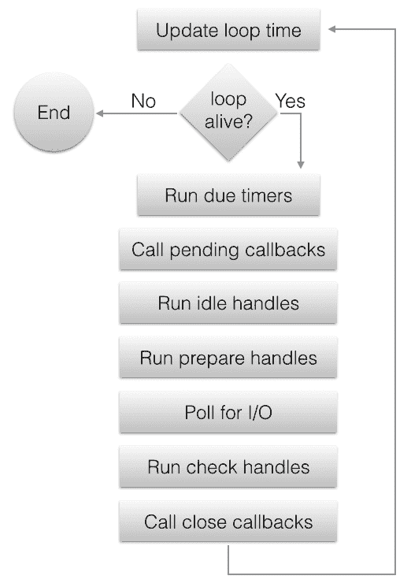

# nodejs event loop

> 原文：<https://dev.to/x1957/nodejs-event-loop-4opm>

Recently, I encountered a problem. I called the http.get request in for loop. The test found that it would take a few ms before the request would be sent out. The code is as follows:

```
 async function run() {
    for (let i = 0; i < 100; i++) {
        for (let j = 0; j < 40; j++) {
            let local_ts = Date.now();
            let cid = 'cid_' + i * 1000 + j;
            let url = `http://127.0.0.1:8890/ts?id=${cid}&ts=${local_ts}`;
            http.get(url).then(ret => {
                let server_ts = ret.split('  ')[1];
                let finish_ts = Date.now();
                console.log(cid, ret, 'elapsed', finish_ts - local_ts, 'server_diff', server_ts - local_ts, 'finish_diff', finish_ts - server_ts);
            });
            console.log(cid, 'fired', local_ts, Date.now());
        }
        await Sleep(3000);
    }
}

run(); 
```

What is called is an http service. Send the local timestamp to him, and he returns the timestamp of the server, which is convenient for us to calculate the latency of the network.

At this time, I am very confused. Why does it take 6-10ms for the server to receive the requests sent by us? This intermediate network is certainly not so slow.

I suspect that it's the pot of event loop. First, I looked at the implementation of http, and at the end, I will call a process.nextTick

[](https://res.cloudinary.com/practicaldev/image/fetch/s--gP9ed453--/c_limit%2Cf_auto%2Cfl_progressive%2Cq_auto%2Cw_880/http://docs.libuv.org/en/v1.x/_images/loop_iteration.png)

There are many loops in the event loop, and the code can refer to
.

```
r = uv__loop_alive(loop);
  if (!r)
    uv__update_time(loop);

while (r != 0 && loop->stop_flag == 0) {
    uv__update_time(loop);
    uv__run_timers(loop);
    ran_pending = uv__run_pending(loop);
    uv__run_idle(loop);
    uv__run_prepare(loop);

    timeout = 0;
    if ((mode == UV_RUN_ONCE && !ran_pending) || mode == UV_RUN_DEFAULT)
      timeout = uv_backend_timeout(loop);

    uv__io_poll(loop, timeout);
    uv__run_check(loop);
    uv__run_closing_handles(loop);

    if (mode == UV_RUN_ONCE) {
      uv__update_time(loop);
      uv__run_timers(loop);
    }

    r = uv__loop_alive(loop);
    if (mode == UV_RUN_ONCE || mode == UV_RUN_NOWAIT)
      break;
} 
```

And process.nextTick is executed after any loop in this loop is finished, so our requests are actually piled up in the sleep. Because http get is all in the for loop, here if we want to execute http get immediately, we need to cut out our loop and return to the event loop. Add an await Sleep(0) 【T0)
in the loop immediately.

```
 async function run() {
    for (let i = 0; i < 100; i++) {
        for (let j = 0; j < 40; j++) {
            let local_ts = Date.now();
            let cid = 'cid_' + i * 1000 + j;
            let url = `http://127.0.0.1:8890/ts?id=${cid}&ts=${local_ts}`;
            http.get(url).then(ret => {
                let server_ts = ret.split('  ')[1];
                let finish_ts = Date.now();
                console.log(cid, ret, 'elapsed', finish_ts - local_ts, 'server_diff', server_ts - local_ts, 'finish_diff', finish_ts - server_ts);
            });
            console.log(cid, 'fired', local_ts, Date.now());
            await Sleep(0);
        }
        await Sleep(3000);
    }
}

run(); 
```

At this time, the problem of request after accumulation is solved, but there are still problems. It takes about one millisecond to make one request, which feels too slow.

PS。睡眠代码

```
const Promise = require('bluebird');
module.exports = function(duration) {
    return new Promise(resolve => {
        setTimeout(() => {
            resolve(null);
        }, duration);
    });
} 
```