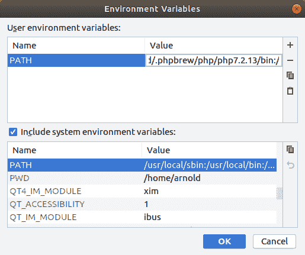
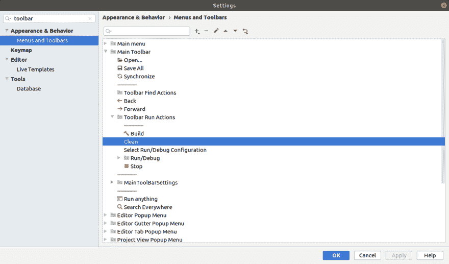

# 在 CLion 中开发 PHP 扩展

> 原文：<https://dev.to/jasny/developing-a-php-extension-in-clion-3oo1>

与编写 PHP 代码相比，用 C 开发 PHP 扩展更具挑战性。您需要注意输入并确保变量已初始化。涉及到很多宏和函数。还有可怕的赛格福特。

使用简单的文本编辑器可能会令人沮丧。IDE 会告诉你打字时哪里出错了。调试器可以帮助找到 segfaults 和其他问题的原因。

如果您熟悉 PHPStorm，显然可以使用它作为扩展开发的 IDE。不幸的是，CLion 是围绕 CMake 构建工具构建的，而 PHP 使用的是 automake。

将 PHP 转换成 CMake 项目绝非易事。幸运的是，我们可以用 automake 让 CLion 表现得相对较好；

*   代码完成和分析
*   构建和清理(正常)
*   使用自动(重新)构建运行测试
*   排除故障

## 斯凯尔顿扩展

改进的 PHP 库[框架扩展](https://github.com/improved-php-library/skeleton-php-ext)包含在 CLion 中编辑以及在*nix 和 Windows 上构建所需的逻辑。

### CMakeList.txt

我们不想使用 CMake 构建项目，但是我们仍然需要一个`add_library`命令让 CLion 确认源文件。使用`___`作为名称表明它应该被忽略(你也可以使用`_ignore_`)。

相反，我们添加了一个定制的目标名`configure`，它将为我们的扩展运行`phpize`和`./configure`。

需要包含 PHP 源文件。通过执行`php-config`，我们可以得到包含头文件的`PHP_SOURCE`目录。

做`#include "php.h"`而不做`#include "main/php.h"`是常有的事。因此我们也包括了`main`子目录。同样适用于`Zend`和`TSRM`。

```
cmake_minimum_required(VERSION 3.8)
project(skeleton C)

add_compile_definitions(HAVE_SKELETON)

set(SOURCE_FILES php_skeleton skeleton.c)

execute_process (
        COMMAND php-config --include-dir
        OUTPUT_VARIABLE PHP_SOURCE
)
string(REGEX REPLACE "\n$" "" PHP_SOURCE "${PHP_SOURCE}")

message("Using source directory: ${PHP_SOURCE}")

include_directories(${PHP_SOURCE})
include_directories(${PHP_SOURCE}/main)
include_directories(${PHP_SOURCE}/Zend)
include_directories(${PHP_SOURCE}/TSRM)
include_directories(${PROJECT_SOURCE_DIR})

add_custom_target(configure
        COMMAND phpize && ./configure
        DEPENDS ${SOURCE_FILES}
        WORKING_DIRECTORY ${PROJECT_SOURCE_DIR})

add_library(___ EXCLUDE_FROM_ALL ${SOURCE_FILES}) 
```

<svg width="20px" height="20px" viewBox="0 0 24 24" class="highlight-action crayons-icon highlight-action--fullscreen-on"><title>Enter fullscreen mode</title></svg> <svg width="20px" height="20px" viewBox="0 0 24 24" class="highlight-action crayons-icon highlight-action--fullscreen-off"><title>Exit fullscreen mode</title></svg>

## PHP 版本

当构建一个扩展时，建议针对多个 PHP 版本进行构建和测试。要在您的系统上安装和使用多个 PHP 版本，您可以使用类似于 [phpbrew](http://phpbrew.github.io/phpbrew/) 的工具。

### CMake 配置文件

在 CLion 的项目设置中，我们创建了多个 CMake 概要文件；每个 PHP 版本一个。

创建新的配置文件并编辑环境设置。我们将修改`$PATH`，以便使用正确的`php`、`phpize`和`php-config`可执行文件。

[](https://res.cloudinary.com/practicaldev/image/fetch/s--JF8D98A6--/c_limit%2Cf_auto%2Cfl_progressive%2Cq_auto%2Cw_880/https://thepracticaldev.s3.amazonaws.com/i/9nuou63c836igjtncgxn.png)

复制现有的`PATH`条目，并将其粘贴为自定义环境变量。在值前面加上您想要使用的 PHP 版本的`bin`目录的路径。

### PHP CLI 符号链接

CLion 将只使用选定的 PHP 版本运行 configure。为了运行测试和调试，我们需要指定 php cli 可执行文件的路径。我们可以让 autoconf 在这个项目的`build`子目录中创建一个符号链接，而不是每次都修改它。

```
AC_CONFIG_COMMANDS_POST([
  ln -s "$PHP_EXECUTABLE" build/php
]) 
```

<svg width="20px" height="20px" viewBox="0 0 24 24" class="highlight-action crayons-icon highlight-action--fullscreen-on"><title>Enter fullscreen mode</title></svg> <svg width="20px" height="20px" viewBox="0 0 24 24" class="highlight-action crayons-icon highlight-action--fullscreen-off"><title>Exit fullscreen mode</title></svg>

### 构建配置

在构建配置中选择一个 PHP 版本的“配置”并构建`Ctrl+F9`。

## 使

CLion 有一个自动制作插件。我们不会用这个来构建项目。该插件以命令的形式运行`make`,它不支持 CLion 的构建功能。

### 自定义构建目标

在项目设置中，转到“自定义构建目标”选项卡，并添加一个“生成”构建目标。

对于`Build`,点击“...”为可执行文件`make`创建一个外部命令。确保工作目录设置为项目目录。

复制`Clean`的外部命令，添加`clean`作为参数。

## 定制构建配置

### 使

编辑构建配置以添加新的构建配置，选择“自定义构建配置”。将配置命名为“make”并选择`make`作为`Target`。

作为可执行文件，选择位于项目的`build`目录中的`php`(在运行 configure 之后)。设置程序参数以包含您的扩展名。建议使用`-n`不要忽略默认的 php.ini，这样就不会加载任何其他的扩展。

```
-n -d "extension=modules/skeleton.so" "tests/smoke.php" 
```

<svg width="20px" height="20px" viewBox="0 0 24 24" class="highlight-action crayons-icon highlight-action--fullscreen-on"><title>Enter fullscreen mode</title></svg> <svg width="20px" height="20px" viewBox="0 0 24 24" class="highlight-action crayons-icon highlight-action--fullscreen-off"><title>Exit fullscreen mode</title></svg>

我们需要更改手动运行哪个文件来进行调试。

在“启动前”部分添加`Build`，这样当有改变的源文件时`make`在运行`php`之前被调用。

[](https://res.cloudinary.com/practicaldev/image/fetch/s--4OEV-Loo--/c_limit%2Cf_auto%2Cfl_progressive%2Cq_auto%2Cw_880/https://thepracticaldev.s3.amazonaws.com/i/lgvjv6fg8xqc75mma405.png)

### 做测试

PHP 扩展测试被写成 [phpt 文件](https://qa.php.net/write-test.php)，用`make test`运行。强烈建议并要求提交扩展到 PECL 的测试。

复制`make`构建配置，并将其命名为“make test”。将可执行文件更改为`make`(而不是`php`)，并将程序参数设置为`test`。

工作目录需要设置为项目目录。

将`NO_INTERACTION=1`添加到环境变量中，以防止出现“您想要提交测试结果吗？”运行测试后的问题。

### 清理工具栏按钮

在工具栏中添加`Clean` ( `Ctrl-Shift-F9`)可能会有所帮助。

[](https://res.cloudinary.com/practicaldev/image/fetch/s--qtcALZYm--/c_limit%2Cf_auto%2Cfl_progressive%2Cq_auto%2Cw_880/https://thepracticaldev.s3.amazonaws.com/i/h48ak2yol4nzuwugi2oc.png)

## 可选 Makefile 目标

以下是可选的，但在开发过程中会有所帮助。

### 制作信息

添加一个名为“make info”的“Makefile”构建配置。选择项目的`Makefile`，选择`info`作为目标。

### 进行清洁测试

当测试失败时，会创建`.log`、`.diff`等文件来帮助解决问题。当测试通过时，这些文件会自动保存。

为了显式地删除这些文件，我们需要通过创建一个`Makefile.frag`文件并添加
来向 makefile 添加一个定制目标

```
clean-tests:
    rm -f tests/*.diff tests/*.exp tests/*.log tests/*.out tests/*.php tests/*.sh 
```

<svg width="20px" height="20px" viewBox="0 0 24 24" class="highlight-action crayons-icon highlight-action--fullscreen-on"><title>Enter fullscreen mode</title></svg> <svg width="20px" height="20px" viewBox="0 0 24 24" class="highlight-action crayons-icon highlight-action--fullscreen-off"><title>Exit fullscreen mode</title></svg>

之后，添加一个名为“make clean-tests”的“Makefile”构建配置。选择项目的`Makefile`，选择`clean-tests`作为目标。

### 制作 mrproper

移除构建文件，但仍然保留所有 automake 工件。要删除所有生成的文件，通过`Makefile.frag`向 makefile 添加一个`mrproper`目标；

```
mrproper: clean
    rm -rf autom4te.cache build modules vendor
    rm -f acinclude.m4 aclocal.m4 config.guess config.h config.h.in config.log config.nice config.status config.sub \
        configure configure.ac install-sh libtool ltmain.sh Makefile Makefile.fragments Makefile.global \
        Makefile.objects missing mkinstalldirs run-tests.php 
```

<svg width="20px" height="20px" viewBox="0 0 24 24" class="highlight-action crayons-icon highlight-action--fullscreen-on"><title>Enter fullscreen mode</title></svg> <svg width="20px" height="20px" viewBox="0 0 24 24" class="highlight-action crayons-icon highlight-action--fullscreen-off"><title>Exit fullscreen mode</title></svg>